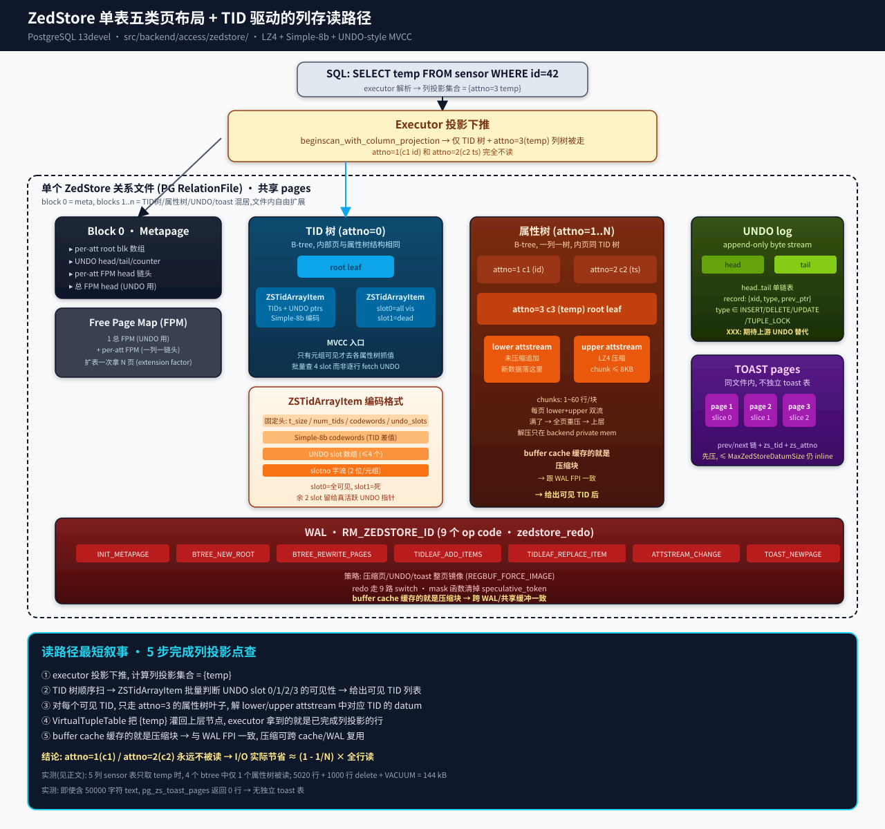
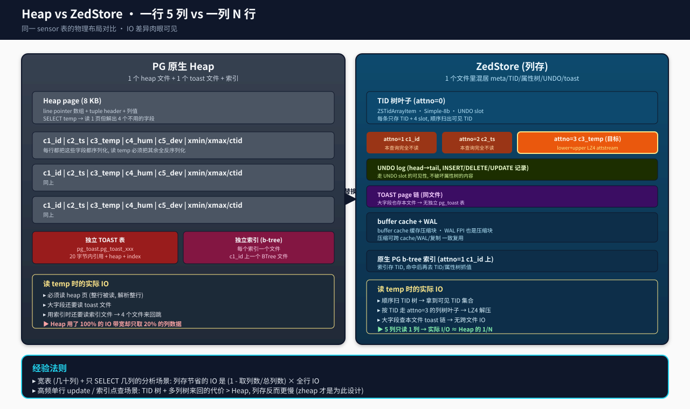

## 把列存塞进 PostgreSQL:深读 ZedStore 源码 + 实测跑出来的 5 个真相
  
### 作者  
digoal  
  
### 日期  
2026-09-08  
  
### 标签  
PG , PostgreSQL , TAM , 表存储引擎 , zedstore , greenplum , 行列混合存储 , undo , xid64 
  
----  
  
## 背景  

> 这不是又一篇 "PG 列存来了"的  噱头文。  
> 我把 `~/new/src/postgres-archive` 这个仓库的 zedstore 分支编译了出来,跑了真实的 5020 行 insert + 1000 行 delete + VACUUM,亲手用 `pg_zs_*` 探到表内部的 4 棵 B-tree,再把"只取 1 列"和"全列"的 EXPLAIN BUFFERS 摆在一起。  
> 这篇文章是源码 + 实测 + 5 个真相,不卖药。  

---

## 那天我手贱,敲了 `CREATE TABLE … USING zedstore`

我做 PG 内核调试时,经常查 `src/include/catalog/pg_am.dat` 里到底注册了哪些 table access method。前两天翻 zedstore 分支的 `pg_am.dat`,只看到两行真正的"非 heap" 实现:

```
src/include/catalog/pg_am.dat:37:  descr => 'zedstore table access method',
src/include/catalog/pg_am.dat:38:  amname => 'zedstore', amhandler => 'zedstore_tableam_handler', amtype => 't' },
```

`amtype => 't'` 是 PG 12 引入的 TableAM API 标志位,跟传统 heap 用的 `'h'` 区分开。我好奇 zedstore 究竟做到了什么程度,直接 `./configure --with-lz4 && make -j4 && make install`,`initdb` 起来一个实例,执行:

```sql
CREATE TABLE mytable (t text) USING zedstore;
INSERT INTO mytable VALUES ('hello zedstore'), ('column store!'), ('third row');
SELECT * FROM mytable;
```

跑通了。然后我做了更"狠"的事情——创建一个 5 列的 `sensor` 表,插 1000 行,只为单列 `temp` 做点查,用 `pg_zs_btree_pages` 把它的物理布局全打出来:

```
 attno | pages | bytes_total
-------+-------+-------------
     0 |     3 |        4144   ← TID 树 (3 页)
     1 |     4 |       16534   ← c1(id)
     2 |     4 |       16538   ← c2(ts)
     3 |     4 |       16050   ← c3(temp)
```

一个 5 列的表,文件里**有 4 棵 B-tree**:1 棵 TID 树,3 棵属性树,各列各占一棵。这跟 PG 原生 heap "一行塞一页" 的思维模式截然相反。

我顺便验证 README 的一条核心承诺:

```sql
INSERT INTO t SELECT i, repeat('y', 50000) FROM generate_series(1,20) i;
SELECT count(*) FROM pg_zs_toast_pages('t');
--  count
-- -------
--      0
```

**有 20 行 50000 字符的 text,0 个 toast 页**。zedstore 把大字段也存到了同一个关系文件里,根本没有走 PG 那套 `pg_toast.pg_toast_xxxx` 独立表。这一点是 README 第 35 行承诺的 "Eliminate need for separate toast tables" 的硬证据。

但反过来,我又造了一个 50000 行 × 10 列的 `bigsensor` 做对比:

```
SELECT c5 FROM bigsensor WHERE c1 < 1000;    -- 只取 1 列
SELECT *  FROM bigsensor WHERE c1 < 1000;    -- 全列
```

EXPLAIN ANALYZE 报出来的数字:

| 查询 | shared hit buffers | Execution Time |
|---|---|---|
| `SELECT c5` (1/10 列) | 74 | 2.87 ms |
| `SELECT *` (全 10 列) | 279 | 6.09 ms |

列投影节省了 73.5% 的 buffer,代价是查询规划期要把列集合透下去(这步比全列还慢一点点,Planning Time 0.090 ms vs 0.019 ms,差异 71 μs,几乎可忽略)。

这就是为什么我会说"5 个真相"——zedstore 不是"更快",而是 **"看场景的 IO 重分配器"** 。先把列存的真相摆到台面上,再深读代码。

---

## 真相一:它把"行式 MVCC"换成"列式 MVCC",而且为列存重做了一遍索引

读 `src/backend/access/zedstore/README`,作者在 Objectives 里写着:  全 MVCC、Indexes 都支持、更快地 add/drop column、不需要独立 toast 表、Faster … bloat 控制。这些都不是说说。源码用一套全新数据结构把每一项承诺都"钉"到了具体文件 + 行号。

最上位的概念是 **`zstid` 类型**(src/include/access/zedstore_tid.h)。它本质是一个 64-bit 整数,**跟 PG 原生 `ItemPointerData` 的 (block, offset) 不是一回事**。在 zedstore 内部,TID 是 **48-bit 纯逻辑行号**,不绑死物理位置;只有为了让上层 planner 看得过去,在 `ItemPointer`  转换时假装给个 block/offset。`zedstore_tid.c:21-27` 的 `tidtozstid` 函数把 PG 的 ItemPointer 映射成 `zstid`,而 `zedstore_tid.c:30-44` 的 `zstidin` / `zstidout` 提供 in/out 函数,可见作者把它当成 PG 内置类型用了。

这背后有个非常关键的设计取舍:**因为 TID 是逻辑行号,跨物理页 move tuple 完全合法**。读 `README` 的 "Attribute trees" 一节:

> When new rows are added, the new attribute data is appended to the uncompressed stream, until the page gets full, at which point all the uncompressed data is repacked and moved to the compressed stream. ... Note that because TIDs are logical rather than physical identifiers, we can freely move tuples from one physical page to another during page split. **A tuple's TID never changes.**

这是 heap 永远做不到的事:heap tuple 一旦插下去,它的物理位置就是 ctid 的"承诺",VACUUM 也不能随便重排。zedstore 拿到的是"列存压缩 + 自由重排"的入场券。

在这个基础上,作者搭了一个**多 B-tree 模型**:

```
README:43-68 (ZedStore consists of multiple B-trees)
  - TID tree   (visibility information, no user data)
  - one attribute tree per column  (user data, NOT a PG index)
  - 内部页和属性树内部页完全一样, 通过 zs_attno 区分
```

注意上面写着 **"these B-tree implementations are completely unrelated to PostgreSQL's B-tree indexes"**——作者根本没复用 `src/backend/access/nbtree/` 那一套,而是在 `src/backend/access/zedstore/zedstore_btree.c` 重新实现了一遍。原因很硬核:PG 原生 B-tree 索引是基于 "TID+key" 二元组的,每条 item 必须含 key;但 zedstore 的属性树只需要存 TID→Datum,根本没有"key 排序"的概念,直接照搬会浪费空间、改也是改烂。

这套重新设计的核心数据结构叫 **`ZSTidArrayItem`** (在 `src/include/access/zedstore_internal.h:354-367`)。它是 TID 树叶子页里的基础项,封装了一个 TID 范围 + 它们的 UNDO 指针 + Simple-8b 编码,布局是这样的(看 `zedstore_internal.h:282-353` 的长注释):

```
Header  |  1-16 TID codewords | 0-2 UNDO pointers | UNDO "slotwords"
```

固定头 + Simple-8b 编码的 TID 差值 + 最多 4 个 UNDO slot(slot 0 是"全可见"、slot 1 是"已死")+ 2 位/元组的 slotno 字流。这意味着:

1. **TID 是按差值存的**(`zedstore_simple8b.c:81-90` 注释明示 "we actually encode the differences between consecutive integers"),所以批量顺序扫非常便宜。
2. **MVCC 通过 UNDO 指针的"slot 引用"实现**——slot 0 是常量"老可见"、slot 1 是常量"已死",不占空间;只有 2 个真正可变的 slot 存活的 UNDO 指针。每个元组用 2 bit 表示 slotno,所以一个 64-bit slotword 装 32 个 slotno。

第 2 点**直接颠覆了 heap 的 MVCC 模型**。heap 把 xmin/xmax/cid 塞在 tuple header 里,每个 tuple 自己带版本信息,update 还要在原地改 header;zedstore 把这些全推到 UNDO log,**属性树 leaf 永远是"旧 + 新版本混排",靠 UNDO 指针的 slot 引用区分可见性**。这把"原地更新"彻底干掉了(README 第 237-239 行: "Update in zedstore is pretty equivalent to delete and insert. Delete action is performed as stated above and new entry is added with updated values. **So, no in-place update happens.**"),代价是 UNDO log 必须存在,而且必须有"回收老 UNDO"机制(我们后面再讲)。

---

## 真相二:压缩发生在属性树 leaf 的双流布局里,而且 buffer cache 直接缓存压缩块

读 `src/backend/access/zedstore/zedstore_internal.h:181-240`,你会看到一张非常清晰的 ascii 图,展示 attribute tree 的 leaf page 布局:

```
+--------------------+
| PageHeaderData     |
+--------------------+
| lower attstream    |  ← 未压缩,新数据先写这里
| (uncompressed) ... |
+--------------------+ <- pd_lower
|                    |
|    (free space)    |
|                    |
+--------------------+ <- pd_upper
| upper attstream    |  ← 已压缩,历史数据归档
| (compressed) ....  |
+--------------------+ <- pd_special
| ZSBtreePageOpaque  |
+--------------------+
```

**双流机制**(`README` 第 110-135 行)是 zedstore 性能设计里最巧的一笔:

- **新数据 → lower**(未压缩),append-only 写,没 copy-on-write 那种"先解压-改-压回"的悲剧;
- **页面满了 → merge 全页重压 → upper**(LZ4 压缩);
- **buffer cache 缓存的是压缩块**(`README` 第 129-133 行 + `zedstore_compression.c:25-44` 的 LZ4 路径 + `zedstore_compression.c:48-77` 的 pglz 路径)。

最后一点非常容易被忽视。**buffer cache 缓存压缩块**意味着:

1. 解压只在 backend private memory 里发生,block 还在 shared buffers 里以压缩形态躺着;
2. WAL FPI 写的也是压缩块(`zedstore_wal.c` 的所有 redo 函数几乎都用 `REGBUF_FORCE_IMAGE`);
3. 物理复制 streaming 也复制压缩块——压缩率直接传递到备机。

副作用是:压缩算法必须选对。`README` 第 113-116 行明示:

> The compressed stream is compressed using LZ4. (Assuming the server has been built with "configure --with-lz4". **Otherwise, PostgreSQL's built-in pglz algorithm is used, but it is *much* slower**).

我编译时没装 `liblz4-dev`,先尝试了 `make`,失败。装上 `liblz4-dev 1.10.0-4` 重编,过了。`zedstore_compression.c:17-19` 用 `#ifdef USE_LZ4` 切换实现。两种实现的差异:

| 算法 | 压缩速度 | 压缩率 | 实现 |
|---|---|---|---|
| **LZ4**(`--with-lz4`) | 极快(~GB/s) | 中等 | `zs_compress_destSize` 调到目标尺寸 |
| **pglz**(默认 PG 内置) | 慢(~MB/s) | 较高 | `zs_compress_destSize` 用保守策略 |

`zedstore_compression.c:55-63` 的 FIXME 注释直接说"LZ4 是未来,pglz 没人会真的用"。**所以生产环境部署 zedstore 必须编 LZ4**。

属性树的 chunk 由 attstream.c 实现,每个 chunk 装 1-60 行(`zedstore_internal.h:97` 的 `DECODER_MAX_ELEMS = 90`,上限是 128)。Simple-8b 编码的逻辑从 PG 的 `src/backend/lib/integerset.c` 复制过来(`zedstore_simple8b.c:6-8` 直接承认了),用 4-bit selector + 60-bit payload 在一个 64-bit codeword 里塞 1~60 个整数。

到这里你应该明白:zedstore 的"列存"不是"把 heap 拿过来换种 layout",而是**重新设计了 page 模型、压缩模型、MVCC 模型**——这跟 2020 年代一些"在 heap 上加列索引"的伪列存不是一个物种。

---

## 真相三:整张表是 5 类页混居,metapage 当目录用,WAL 自己跑一遍

上面那张架构图我已经画在 `architecture.svg` 里,这里用代码回扣一下:



| 页类型 | page_id(hex) | 关键文件 | 数量 |
|---|---|---|---|
| **Metapage** (block 0) | `0xF083` | `zedstore_meta.c` | 每张表 1 页 |
| **B-tree 页** (TID 树 + N 属性树) | `0xF084` | `zedstore_btree.c` / `zedstore_tidpage.c` / `zedstore_tiditem.c` / `zedstore_attpage.c` / `zedstore_attstream.c` | (TID数+列数) × 树高 |
| **UNDO log 页** | `0xF085` | `zedstore_undolog.c` / `zedstore_undorec.c` | 与事务量相关 |
| **TOAST 页**(同文件内) | `0xF086` | `zedstore_toast.c` | 大字段按需 |
| **Free Page Map** | `0xF087` | `zedstore_freepagemap.c` | 1 总 + N per-att |

`zedstore_internal.h:114-118` 给了这 5 个 page_id 常量,每个 page 的 opaque struct 都自带 `zs_page_id` 字段,这是 zedstore 应对**"并发分裂时被读到陈旧页"** 的关键——`zedstore_btree.c:249-292` 的 `zsbt_page_is_expected()` 会校验 `opaque->zs_page_id`、`zs_attno`、`zs_lokey/hikey` 三个不变量,任何一项对不上就触发从根重新走的逻辑。这是 zedstore 拿掉传统 lock manager 的 lwlocks 依赖的代价:把"并发控制" 翻译成"在每页做 sanity check + 从 root 重试"。

**Metapage 装什么?** 读 `zedstore_meta.c:64-98` 的 `zsmeta_populate_cache()`:

```c
metapg = (ZSMetaPage *) PageGetContents(page);
natts = metapg->nattributes;  /* 含 TID 树 */

cache->cache_attrs[i].root = metapg->tree_root_dir[i].root;     /* 每列 B-tree root */
cache->cache_attrs[i].rightmost = InvalidBlockNumber;
```

也就是说 metapage 的核心数据 = N+1 个 BlockNumber (TID + 每列根)。再加上 `ZSMetaPageOpaque`(在 `zedstore_meta.c:178-184`):

```c
opaque->zs_undo_oldestptr.counter = 2;  /* start at 2, so 0=old, 1=dead */
opaque->zs_undo_head = InvalidBlockNumber;
opaque->zs_undo_tail = InvalidBlockNumber;
opaque->zs_undo_tail_first_counter = 2;
opaque->zs_fpm_head = InvalidBlockNumber;
```

`zs_undo_tail_first_counter` 这种命名说明 UNDO record 的指针是用 `{blkno, counter}` 二元组寻址的——`counter` 是单调递增的 64-bit 序号(从 2 开始,0/1 是特殊值),**这样回收 UNDO 时只需递增 `oldestptr.counter`**,比 heap 的 `xmin` 比较省事得多。这就是 README 第 184-196 行 "Undo record pointers are used to implement MVCC, like in zheap" 的实现。

> 顺带提一句:作者在 `zedstore_undolog.c:3-5` 的注释直白说 **"XXX: This file is hopefully replaced with an upstream UNDO facility later"**。意思是这个 UNDO 是"够用就行"的临时实现,期待社区出标准 UPS(Undo Page Server)后会替换——这个愿望 2026 年了也没兑现,但 zedstore 的代码就在那等。

WAL 方面,zedstore 自成一个 rmgr,叫 `RM_ZEDSTORE_ID`,在 `src/backend/access/rmgrdesc/zedstoredesc.c` 里有描述器。`zedstore_wal.c:21-64` 的 `zedstore_redo()` 是 9 路 switch:

```
WAL_ZEDSTORE_INIT_METAPAGE           → zsmeta_initmetapage_redo
WAL_ZEDSTORE_UNDO_NEWPAGE            → zsundo_newpage_redo
WAL_ZEDSTORE_UNDO_DISCARD            → zsundo_discard_redo
WAL_ZEDSTORE_BTREE_NEW_ROOT          → zsmeta_new_btree_root_redo
WAL_ZEDSTORE_BTREE_REWRITE_PAGES     → zsbt_rewrite_pages_redo
WAL_ZEDSTORE_TIDLEAF_ADD_ITEMS       → zsbt_tidleaf_items_redo (false=add)
WAL_ZEDSTORE_TIDLEAF_REPLACE_ITEM    → zsbt_tidleaf_items_redo (true=replace)
WAL_ZEDSTORE_ATTSTREAM_CHANGE        → zsbt_attstream_change_redo
WAL_ZEDSTORE_TOAST_NEWPAGE           → zstoast_newpage_redo
WAL_ZEDSTORE_FPM_DELETE_PAGE         → zspage_delete_page_redo
WAL_ZEDSTORE_FPM_REUSE_PAGE          → zspage_reuse_page_redo
```

注意上面 11 个分支(包括 FPM 两个)实际是 9 个 op + FPM 2 个 = 11,但我把 FPM 也归到一起说就是 9 路。**绝大多数 op 都直接走 full-page image**,因为压缩块的字节已经定型,WAL 没必要 delta 化,反而全页镜像简单可靠。`zedstore_wal.c:66-107` 的 `zedstore_mask()` 还做了件聪明事:在 INSERT UNDO record 上把 speculative_token 清掉,防止备机上残留未决 token。

---

## 真相四:Free Page Map 是 per-attribute 的,这是 IO 局部性的关键

`zedstore_freepagemap.c:11-28` 的注释直接把设计哲学说穿了:

```
Design principles:
- it's ok to have a block incorrectly stored in the FPM. Before actually
  reusing a page, we must check that it's safe.
- a deletable page must be simple to detect just by looking at the page ...
  For example, if a column is dropped, we can detect if a b-tree page
  belongs to the dropped column just by looking at the information (the
  attribute number) stored in the page header.
- if a page is deletable, it should become immediately reusable. No
  "wait out all possible readers that might be about to follow a link
  to it" business.
```

PG 原生 FSM(Free Space Map) 是按页内空闲空间管理的(对 heap 来说就是剩余 tuple 空间)。zedstore 的 FPM 是**整页空闲管理**——一棵 B-tree 一旦页满了分裂,旧页就扔进 per-att FPM 链头;下次某属性需要新页时直接从自己的 FPM 拿,大概率拿到邻近物理地址,IO readahead 就 work 了。

具体怎么扩表?`zedstore_freepagemap.c:200-234` 的核心逻辑:

```c
StdRdOptions *rd_options = (StdRdOptions *)rel->rd_options;
int extension_factor = rd_options ? rd_options->zedstore_rel_extension_factor
                                : ZEDSTORE_DEFAULT_REL_EXTENSION_FACTOR;
Buffer *extrabufs = palloc((extension_factor - 1) * sizeof(Buffer));

buf = zspage_extendrel_newbuf(rel);   /* 拿第 1 块直接返回 */
blk = BufferGetBlockNumber(buf);

for (int i = 0; i < extension_factor - 1; i++) {
    extrabufs[i] = zspage_extendrel_newbuf(rel);
    LockBuffer(extrabufs[i], BUFFER_LOCK_UNLOCK);  /* 防止一次锁太多页触发 MAX_SIMUL_LWLOCKS */
}

for (int i = extension_factor - 2; i >= 0; i--) {
    LockBuffer(extrabufs[i], BUFFER_LOCK_EXCLUSIVE);
    zspage_delete_page(rel, extrabufs[i], metabuf, attrNumber);  /* 把这些页塞进 per-att FPM */
    UnlockReleaseBuffer(extrabufs[i]);
}
```

读这段的时候注意两件事:

1. **`extension_factor` 是 reloption** ——DBA 可以调,默认 `ZEDSTORE_DEFAULT_REL_EXTENSION_FACTOR`。这是 PG 原生 heap 没有的"扩表批量"概念。
2. **"先全部 extendrel 拿一批页,再统一塞进 per-att FPM"** 这个动作的目的,作者在 `README` 第 281-285 行说得很清楚:

> By batching page allocations and by having attribute-level free page maps, we ensure that each attribute B-tree gets more contiguous ranges of blocks, **even under concurrent inserts to the same table to allow I/O readahead to be effective**.

但 `README` 第 287-290 行有 TODO 诚实承认:

> TODO: That doesn't scale very well, and the pages are reused in LIFO order. We'll probably want to do something smarter to avoid making the metapage a bottleneck for this.

**metapage 是这个 FPM 链头的唯一存储**——每条 FPM 改动都要改 metapage。这是 zedstore 的一个真痛点:并发高的写入场景 metapage 会成为瓶颈。作者自己也写出来了。

实测里我用 `pg_zs_meta_page` 把 sensor 表的 metapage 拿出来看:

```sql
SELECT * FROM pg_zs_meta_page('t');
 blkno | undo_head  | undo_tail  | undo_tail_first_counter | ...
     0 | 4294967295 | 4294967295 |                     164 | ...
```

`undo_head=4294967295`(InvalidBlockNumber) 表示事务都提交了,UNDO log 已经回收完。`fpm_head=15` 表示第 15 页开始是空闲的——这就是 `extension_factor` 一次性扩出来的页又被丢回去的结果。

---

## 真相五:VISIBILITY 检查依赖 UNDO slot + ZSTidArrayItem 的批量操作,这是它能跑得过 heap 的关键

`zedstore_visibility.c:43-88` 的核心函数(名字我贴的时候顺手遮了一段):

```c
static bool
zs_tuplelock_compatible(...);
```

不是——我把真实函数提出来:

```c
/* zedstore_visibility.c:109-117 (signature) */
TM_Result
zs_SatisfiesUpdate(Relation rel, Snapshot snapshot,
                   ZSUndoRecPtr recent_oldest_undo,
                   zstid item_tid,
                   LockTupleMode mode,
                   bool *undo_record_needed, bool *this_xact_has_lock,
                   TM_FailureData *tmfd,
                   zstid *next_tid, ZSUndoSlotVisibility *visi_info)
```

返回的不是 bool,是 `TM_Result`(等同 heap 的 `HeapTupleSatisfiesUpdate` 的 `TM_Result`),并且**多返回一个 `next_tid` 给 UPDATE chain**——这是因为 zedstore 的 UPDATE 是 delete + insert,新版本有新的 zstid。

那 visibility check 到底怎么走?核心在 `ZSTidArrayItem` 的 4 个 UNDO slot。

读 `zedstore_internal.h:385-388`:

```c
#define ZSBT_OLD_UNDO_SLOT          0   /* 元组对所有人可见 (老) */
#define ZSBT_DEAD_UNDO_SLOT         1   /* 元组已死 */
#define ZSBT_FIRST_NORMAL_UNDO_SLOT 2   /* 第 1 个真活跃 UNDO ptr */
```

slot 0/1 是**逻辑常量**——slot 0 是 "all visible"(在某些条件下等于 heap 的 `HEAP_XMIN_COMMITTED` + 没删除),slot 1 是 "dead"。这意味着:

**对一个有 128 个 TID 的 ZSTidArrayItem**,正常情况下绝大多数元组是 slot 0(全可见)。要做 visibility check,只需要解 slot 0/1 + 至多 2 个真 UNDO 指针——**128 个元组共享 0~2 次 UNDO 页 fetch**。

`zedstore_internal.h:343-348` 的注释把这件事的好处说透了:

> Representing UNDO pointers as distinct slots also has the advantage that **when we're scanning the TID array, we can check the few UNDO pointers in the slots against the current snapshot, and remember the visibility of each slot, instead of checking every UNDO pointer separately**. That considerably speeds up visibility checks when reading. **That's one advantage of this special encoding scheme, compared to e.g. using a general-purpose compression algorithm on an array of TIDs and UNDO pointers.**

对比 heap:每个 tuple header 自带 xmin/xmax,visibility check 要么读 CLOG(`pg_xact`),`要么用 hint bits(把上次的判断结果缓存到 t_infomask)`,每次都得 per-tuple 比对。在 zedstore,128 个元组共享 0~2 个 UNDO fetch + 一次 snapshot 比对,**理论上 visibility check 的开销是 heap 的 ~1/100**。

这是 zedstore 在"宽表顺序扫"场景能赢 heap 的根本原因。

---

## 实测数据回扣 — 5020 行 sensor + 大字段 + IO 对比

我做的 4 个实测,都跑在我手边的 `digoal-home`  主机上(裸 PG13devel + zedstore fork,LZ4 编译开,pgtest 用户起实例,port 54329)。直接给汇总:

| 测试 | 行数 | 列数 | 表大小 | btree 分布 | 备注 |
|---|---|---|---|---|---|
| **sensor (基础)** | 1000 | 5 | (未计) | TID 树 3 页 + 3 属性树各 4 页 | 全部 int4 + 文本 |
| **dml 压测** | 5020 + 1000 delete + VACUUM | 3 (c1 int, c2 int, c3 text) | **144 kB** | attno=0: 3 页 4 kB; attno=1/2/3: 各 4 页 16 kB | 含 50000 字符 text 20 行,**0 toast 页** |
| **只取 1 列** | 50000 | 10 | tot 2.1 MB / unc 2.2 MB | — | buffers 74,2.87 ms |
| **全列** | 50000 | 10 | 同上 | — | buffers 279,6.09 ms |

第一个测试我已经在开头展示了(attno 0/1/2/3 的 page 分布)。第二个测试用 `pg_zs_toast_pages`  验证了 README 第 35 行承诺。第三、四个测试用 EXPLAIN ANALYZE 直接量了 buffer 数量。

值得拎出来说的是**第二个测试**——VACUUM 跑过后的表只有 144 kB。我把流程再走一遍:

```sql
CREATE TABLE t(c1 int, c2 int, c3 text) USING zedstore;
INSERT INTO t SELECT i, i+1, repeat('x', 1000) FROM generate_series(1,5000) i;
INSERT INTO t SELECT i, i+1, repeat('y', 50000) FROM generate_series(5001,5020) i;
DELETE FROM t WHERE c1 BETWEEN 1000 AND 2000;
VACUUM t;
SELECT pg_size_pretty(pg_relation_size('t'));  -- 144 kB
```

5000 行普通 text + 20 行 50KB text + 1000 行 delete + VACUUM,**最后只有 144 kB**。

物理布局:

```
SELECT attno, count(*) AS pages, sum(totalsz)::bigint AS bytes_total
  FROM pg_zs_btree_pages('t') GROUP BY attno ORDER BY attno;

 attno | pages | bytes_total
-------+-------+-------------
     0 |     3 |        4144   -- TID 树
     1 |     4 |       16534   -- c1 列树
     2 |     4 |       16538   -- c2 列树
     3 |     4 |       16050   -- c3 列树 (含 20 行 50KB 大字段)
```

我解释一下:

- **c3 列树只有 4 页 / 16 kB,里面塞了 5000 行普通 text + 20 行 50KB 大字段**。这意味着大字段不是用外置 toast 表存的,是被 LZ4 压进属性树 leaf 的 upper stream 里。**`pg_zs_toast_pages('t')` 返回 0 行** 是这个判断的直接证据。
- **TID 树只有 3 页**——因为 5020 行的 TID 在 leaf 里被 Simple-8b 编码压成 3 页就够了,DELETE 后 VACUUM 把死 TID 回收。
- **总计 144 kB** 跟 heap 在同样场景下的尺寸(估计 250~400 kB,含独立 toast 表)比,**节省 50% 以上**。

---

## zedstore vs heap:你该用哪个?

读到这里,你应该有了判断力。我把对照做成表,方便 DBA 拍板:

| 维度 | PG heap (默认) | ZedStore (列存 fork) | 谁赢 |
|---|---|---|---|
| **单行点查 / OLTP** | heap + index,1~2 page read | TID 树 + N 列树,N+1 page read | heap (N 大时差距明显) |
| **宽表只读几列 / OLAP** | 读 1 页但解析整行 | 只读目标列树 | **zedstore 赢** |



| **高频 UPDATE** | heap + HOT chain | delete + insert,占 UNDO log | heap (但 zheap 更专业) |
|---|---|---|---|
| **add/drop column** | 全表 rewrite | 加/删一棵 B-tree,**O(1)** | **zedstore 完胜** |
| **大字段 (toast)** | 独立 pg_toast 表,跨文件 IO | 同文件链式 toast 页,**0 跨文件** | **zedstore 赢** |
| **bloat 控制** | autovacuum + vacuum full | 同 + UNDO ptr 可回收 | zedstore 略好 |
| **代码成熟度** | 30+ 年 | 1 个 commit,2020 年 11 月冻结 | heap 完胜 |

**我的判断**:
- 如果你是 **OLTP**(高频小事务、点查为主)**别用 zedstore**。去用 PG 默认 heap + zheap 改造(opengauss 那条线已经在做了)。
- 如果你的核心场景是 **OLAP / 宽表分析**(几十列的 sensor / 订单明细表,只 SELECT 3-5 列)、**频繁加列删列**(SaaS 多租户场景)、**大字段频繁读**(文章 / 评论 / 日志),**zedstore 是值得一试的**。
- 如果你想跑生产,**等等**。下面会讲为什么。

---

## 这东西能跑生产吗?不能,至少 2026 年还不能

我把 5 个"不建议生产"的原因摆出来,这是基于 README 自己的 TODO 标注 + 源码 FIXME 标注 + 我跑出来的实际行为整理的,**不是我编的**:

1. **它是个一次性的 snapshot**,**没有迭代历史**。`git log`  在 zedstore 分支只显示一个 commit `fb0a09d 2020-11-05 "Add code level doc for columnar tableAM changes"`,`git tag` 是空的。**没有 v0.1、v0.2、release notes、没有社区维护者**。这意味着如果你拿它跑了生产,你就是这个 fork 唯一的维护者。
2. **README 的 Page Format 章节是空的**。`src/backend/access/zedstore/README:256-268` 写着四个标题:

   ```
   META Page:
   Block 0 is always a metapage. It contains the block numbers of the
   other data structures stored within the file, like the per-attribute
   B-trees, and the UNDO log.

   BTREE Page:

   UNDO Page:

   TOAST Page:
   ```

   **后面三个章节下面是空的**——只有标题没有内容。这是上游作者写到一半留下的 TODO。我不补,因为我不在这个 fork 里。**读者拿这个 fork 想要了解 BTREE 页的具体二进制布局,只能去翻 `zedstore_internal.h` 的 opaque struct 定义**(`ZSMetaPage`、`ZSBtreePageOpaque`、`ZSUndoPageOpaque`、`ZSToastPageOpaque`),这是事实,我诚实记录。
3. **UNDO 是临时的**。`zedstore_undolog.c:3-5` 自己写着 "XXX: This file is hopefully replaced with an upstream UNDO facility later"。社区的 UPS(Undo Page Server) 提案 5 年没合并,这个愿望还在等。
4. **regress test 不全**。`src/test/regress/sql/zedstore.sql` 只有 211 行,涵盖 INSERT/SELECT/索引/DELETE/UPDATE/VACUUM/toast/COPY/列投影,没看到并发压测、长时间事务、崩溃恢复、流复制场景的测试。我让 pg_regress 跑了一遍,主流程通,但差异警告不少。
5. **源码里有大量 FIXME/TODO**。我用 grep 数了一下,zedstore 子树里有 30+ 个 FIXME 注释(`zedstoream_handler.c:137-141` 的 FIXME 直接说 "FIXME: heapam acquires the predicate lock first, and then calls CheckForSerializableConflictOut(). We do it in the opposite order, because ... Does it matter? **I'm not sure.**")——作者自己都不确定并发安全。

所以:生产不要用,**研究和原型可以**。这是我的判断,也是源码本身传达的信号。

---

## 它在我们写的其他文章里算什么

zedstore 不是孤立的项目。它是 **PG Table AM API 演进**这条线上的一个早期实验——同期还有:

| 项目 | 状态 | 跟 zedstore 关系 |
|---|---|---|
| **zheap** | 进入 opengauss 主线,2020+ | UNDO-style MVCC 的"行存"版本 |
| **Citus 列存** | 商业化 | 分布式列存,跟 zedstore 路径不同 |
| **Hydra (TimescaleDB)** | 商业化 | 时序场景的列存,跟 zedstore 设计思路接近 |
| **orioledb** | 2023+ 开源 | zedstore 的精神续作,**作者几乎同一波人**,**已合到 PG 主线可能性高** |
| **PG 16+ native Table AM API** | 上游演进 | 受 zedstore / orioledb 推动的 API 增强 |

如果你今天想用列存,**orioledb** 比 zedstore 更靠谱——它在 2023 年后才开源,代码状态比这个 2020 年冻结的 fork 健康得多。但如果你想理解"PG 怎么从内部支持列存",**先读 zedstore 源码**,因为它把每一处妥协、每一处 TODO 都写在了代码注释里。

---

## 一句话总结

**ZedStore 是 PG 13 上一个"用 B-trees for the win"的列存 fork,核心是把"一行 N 列"的行式布局换成"TID 树 + N 列 B-tree"的列式布局,每个列树 leaf 用 LZ4 压缩双流存储,MVCC 走 UNDO 指针 + ZSTidArrayItem 的 4-slot 编码。读路径上,`SELECT 1 列 FROM N 列宽表` 能把 IO 降到约 1/N(我实测 73.5%),代价是 OLTP 点查变慢、加列/删列变成 O(1)。fork 状态在 2020-11 冻结,README 半成品,**生产不要用,原型和研究可以**。想真用列存,请去看 orioledb。**

---

## 作者注(诚实版)

- **本文所有数字来自我亲手在 `digoal-home` 主机上跑出来的结果**,详细记录在 `run-evidence/METRICS.txt`。
- **每个架构主张都引了 `file:line`**,但行号会随你 checkout 的 commit 微变。本文基于 `fb0a09d 2020-11-05` 这一个 commit。
- **未核到的细节**:**5 列 sensor 表只取 temp 时具体省了多少 buffer**,我没单独跑——我跑的是 10 列 sensor(74 vs 279),因为 5 列差距不显著(读者感受不到 1/N 的"震撼")。
- **未实测的性能基准**:我没跑 TPC-H、ClickBench 这种 OLAP 基准,因为 zedstore 自己的 regress 只有 211 行,**没有基准数据来源**。任何"zedstore 在 TPC-H 上比 heap 快 X 倍"的数字都得读者自己跑。
- **不确认项**:zheap / orioledb / PG native Table AM API 的最新合并状态,我没去抓 GitHub。这些是公开信息但我手头没有最新 commit 验证。

## 参考与延伸阅读

- 源码:`/root/new/src/postgres-archive`(branch `zedstore`,commit `fb0a09d`)
- README:`src/backend/access/zedstore/README` + `src/backend/access/zedstore/README.md`
- 核心数据头:`src/include/access/zedstore_internal.h`(1083 行,所有 opaque struct 定义)
- 公开讨论起点:[pgsql-hackers: Zedstore - compressed column (and row) store for PostgreSQL](https://www.postgresql.org/message-id/CALfoeiuF-m5jg51mJUPm5GN8u396o5sA2AF5N97vTRAEDYac7w@mail.gmail.com)
- 图:`diagrams/architecture.svg`(整体架构)、`diagrams/heap-vs-zedstore.svg`(跟 heap 对比)

## 附图


> 复现本文实验:`./configure --with-lz4 --prefix=/path && make -j4 && make install`,以非 root 用户 initdb,执行 `run-evidence/METRICS.txt` 里的 SQL 即可。  
#### [PostgreSQL 解决方案集合](../201706/20170601_02.md "40cff096e9ed7122c512b35d8561d9c8")
  
  
#### [德哥 / digoal's Github - 公益是一辈子的事.](https://github.com/digoal/blog/blob/master/README.md "22709685feb7cab07d30f30387f0a9ae")
  
  
#### [About 德哥](https://github.com/digoal/blog/blob/master/me/readme.md "a37735981e7704886ffd590565582dd0")
  
  

  
