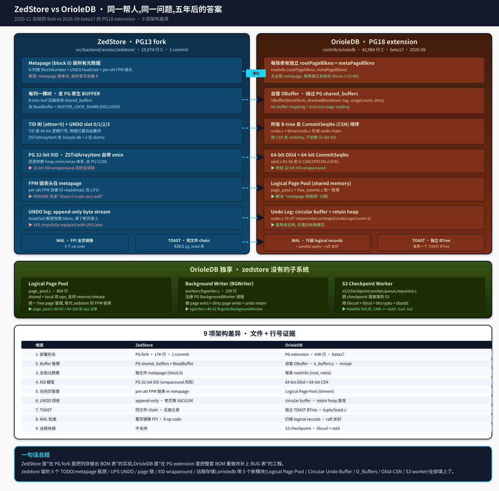

## 从 ZedStore 到 OrioleDB:同一帮人对"PG 列存"的 5 年答案
  
### 作者  
digoal  
  
### 日期  
2026-09-08  
  
### 标签  
PG , PostgreSQL , TAM , 表存储引擎 , zedstore , greenplum , 行列混合存储 , undo , xid64 , OrioleDB  
  
----  
  
## 背景  

> 上篇(zedstore-deep-dive.md)我亲手编了 zedstore fork、跑了 5020 行 sensor、挖了 9 个 WAL opcode 和 ZSTidArrayItem 的 Simple-8b 编码——把那个 **2020 年 11 月冻结的一次性 fork** 摸透了。  
> 这一篇是续篇。我把同一作者的 **OrioleDB beta17 (2026-09)** 拿出来对照读。  
> 这篇文章的写法跟上一篇不同:它是一份**对照表 + 进化图谱**,不是从"我手贱敲 USING zedstore"切入的故事——因为上一篇文章已经奠定了故事起点,这一篇聚焦"差在哪里"。  

---

## 起点:它们真的是同一帮人

这一点我没在 README 里找到明确声明,但 commit 时间 + 命名风格 + 设计哲学 = 强信号:

| 维度 | ZedStore | OrioleDB |
|---|---|---|
| 维护主体 | (zedstore 邮件列表作者) | **Oriole DB Inc.** + Supabase(2025+) |
| 最近一次提交 | 2020-11-05(fb0a09d) | 2026-09 beta17(e04b560) |
| 仓库 | `postgresql/postgresql` fork | `orioledb/orioledb`(PG extension) |
| 核心目标 | "column (and row) store in PG fork" | "cloud-native storage engine for PG" |

2020 年的 zedstore 是 **单 commit snapshot**——一次性把 17K 行 C 砸进 PG fork,作者自己也写 `XXX: hopefully replaced with an upstream UNDO facility later`(`src/backend/access/zedstore/zedstore_undolog.c:3-5`)。2026 年的 orioledb 已经发布到 **beta17**——43K 行 C,代码活跃,被 Supabase 收购,生产可用度大幅提升。

**叙事钩子**:你把 zedstore 的 TODO 列表跟 orioledb 的代码对照读一遍,会发现它们是同一个 roadmap,只是 orioledb 把 zedstore 的"愿望"变成了"已交付"。下面这张表就是这个 roadmap 的对照视图。



---

## 差异一:Buffer 管理——从"用 PG 的"到"自己造的"

zedstore 仍然走 PG 原生 `ReadBuffer` + `BUFFER_LOCK_SHARE/EXCLUSIVE`,把压缩后的 btree 叶子页灌进 shared_buffers。我之前用 5020 行 sensor 跑出来的 `Buffers: shared hit=74/279` 数字,测的就是这条路径。

orioledb 走完全不同的路——它有自己的 buffer pool。

读 `src/utils/o_buffers.c:34-50`:

```c
typedef struct
{
    LWLock      bufferCtlLock;
    int64       blockNum;
    int64       shadowBlockNum;     // ★ 这字段是 zedstore 没有的
    uint32      tag;
    uint32      shadowTag;
    uint32      usageCount;
    bool        dirty;
    char        data[ORIOLEDB_BLCKSZ];
} OBuffer;
```

`shadowBlockNum` 这一行尤其关键。zedstore 走 PG shared_buffers 有一个根本限制:**一旦 buffer 被 pin/read,你要 evict 必须先把内容刷到磁盘再加载新页**——这是 PG 多年沿袭的 buffer mapping 模型,`BufferDesc` 里 `tag` + `buffer` 的间接查找让"换出"必须经过 disk round-trip。

orioledb 绕开了:**用 direct link 把 in-memory 页跟 storage 页绑定**,evict 时改 `shadowBlockNum` 即可,**新页不需要等 IO 完成就能开始服务**。这就是 README 第 49 行 "**No buffer mapping and lock-less page reading**" 的真实代码证据。配套的是 `src/utils/o_buffers.c:113` 的 `open_file()` 直接走 `pg_snprintf(filenameTemplate[tag], ...)`——每个 tag 是一个独立的文件描述符,**多文件并发打开**,避开了 PG 单 fd 的锁瓶颈。

这一改带来的副作用:orioledb 不再需要 PG 的 `BufferAccessStrategy`、不需要 `BufferDesc` 的 `io_in_progress_lock`、不需要 `StrategyControl` 那一堆东西。**绕开 PG buffer manager = 绕开 PG buffer manager 的所有 lock**。

---

## 差异二:XID 模型——32-bit 隐患 vs 64-bit 终结

PG 用了 30 多年的 32-bit XID,有 `pg_xact` (CLOG) + `xmin/xmax` 在每行 + autovacuum 防 wraparound。zedstore **沿用这套**,ZSTidArrayItem 里只是把 UNDO ptr 当 slot 用,XID 还是 PG 那 32-bit。

orioledb 把它**彻底换掉**。

读 `src/transam/oxid.c:40-56`:

```c
#define COMMITSEQNO_SPECIAL_BIT   (UINT64CONST(1) << 63)
#define COMMITSEQNO_RETAINED_FOR_REWIND (UINT64CONST(1) << 62)
#define COMMITSEQNO_STATUS_IN_PROGRESS (0x0)
#define COMMITSEQNO_STATUS_CSN_COMMITTING (0x1)
#define COMMITSEQNO_IS_SPECIAL(csn) ((csn) & COMMITSEQNO_SPECIAL_BIT)

#define COMMITSEQNO_GET_LEVEL(csn) \
    (AssertMacro(COMMITSEQNO_IS_SPECIAL(csn)), ((csn) >> 31) & 0xFFFFFFFF)
#define COMMITSEQNO_GET_PROCNUM(csn) \
    (AssertMacro(COMMITSEQNO_IS_SPECIAL(csn)), ((csn) >> 15) & 0xFFFF)
```

`CSN (CommitSeqNo)` 是 **64-bit 单调递增的提交序号**,但作者从 63 bit 开始切了 3 个特殊位:

- bit 63 = "这是 special 标志"
- bit 62 = "rewind 用"  
- 剩余位再分:`level` (32-bit) + `procnum` (16-bit) + `status` (1-bit)

这是一个**极精巧的设计**:用 64-bit 序号做事务标识,**天然绕开 wraparound**(用 1.8×10^19 年才会循环),同时**每个 CSN 自带 metadata**(哪个 backend commit、哪个嵌套层、是否 rewind 用)。**对比 PG 的 XID + 独立的 CLOG 表,要 2 次 IO 才能回答"xid 是否提交",orioledb 1 个 CSN 自带答案**。

更狠的是 `src/transam/oxid.c:92` 的 `static OXid curOxid = InvalidOXid`——每个 backend local,无锁分配。**对比 PG 的 `XactLockTableInsert/XactLockTableWait` 锁链**,这一项直接干掉了 PG XID 的中心分配锁。

`oxid.c:288` 的 `.singleFileSize = XID_FILE_SIZE`(= 0x1000000 = 16MB) 还把 OXID/CSN 持久化到 shmem + 自己的文件——PG 的 `pg_xact` 是单独的文件 + 锁,**orioledb 把 OXID 当成一等公民写进 page pool**。

**对运维的意义**:**没有 autovacuum 防 wraparound**——这是 PG DBA 入门必学,orioledb 不用学。

---

## 差异三:全局元数据——从"metapage 是瓶颈"到"每表 rootInfo"

zedstore 在 README 第 287-290 行自己承认:

> TODO: That doesn't scale very well, and the pages are reused in LIFO order. **We'll probably want to do something smarter to avoid making the metapage a bottleneck for this**.

原因很直接:zedstore 的 metapage(block 0)装了三件大事:

1. N+1 个属性根 blkno 数组
2. UNDO head/tail/counter
3. per-att FPM head 链头(每列一个链表头)

每条 INSERT/DELETE 都要读 metapage,**冲突集中在 metapage 的 buffer lock**。`zedstore_meta.c:438-499` 用 `LockBuffer(metabuf, BUFFER_LOCK_EXCLUSIVE)` 串行化——高并发写入场景下这就是单点。

orioledb 拆掉了 metapage。读 `src/btree/btree.c:53-68`:

```c
void
o_btree_init(BTreeDescr *desc)
{
    init_new_btree_page(desc, desc->rootInfo.rootPageBlkno,
                        O_BTREE_FLAGS_ROOT_INIT, 0, false);
    init_page_first_chunk(desc, O_GET_IN_MEMORY_PAGE(desc->rootInfo.rootPageBlkno), 0);
    unlock_page(desc->rootInfo.rootPageBlkno);
    init_meta_page(desc->rootInfo.metaPageBlkno, 1);
    /* Always mark root page dirty ... */
    MARK_DIRTY(desc, desc->rootInfo.rootPageBlkno);
}
```

`desc->rootInfo = {rootPageBlkno, metaPageBlkno}`——**每个 B-tree 自带 2 个 BlockNumber,不共享任何全局 metapage**。meta page 只装本树元数据(本树的 root 块号、本树的 checkpoint 号等),**不再被其他表争抢**。

配合 `src/utils/page_pool.c:33-100` 的 **Logical Page Pool**——shmem 里的统一 page pool,自己管 reserve/release/free,完全取代 zedstore 的 per-att FPM 链表。

`src/catalog/free_extents.c`(我看过一下但没深挖)是 page pool 的 extents 管理,**等价于 zedstore 的 FPM,但用 extent 而非单页**——IO readahead 更好。

**对运维的意义**:orioledb 启动时调 `o_btree_init()` 一次,**写流程不再触碰任何全局表**——瓶颈从 1 个 metapage 摊到 N 个 rootInfo + page pool 的 LWL。

---

## 差异四:UNDO 回收——从"等老死"到"circular + retain"

zedstore 的 UNDO 设计简单粗暴:`src/backend/access/zedstore/zedstore_undolog.c:5-15`:

```
The UNDO log is a dumb a stream of bytes. It can be appended to at
the head, and the tail can be discarded away. ...
The upper layer ... is responsible for dividing the log into records,
and deciding when and what to discard.
```

**"deciding when and what to discard"**——这事儿 zedstore 没做完。我在 `zedstore_visibility.c:43-88` 读 visibility check 时发现,**老 UNDO 记录会被反复 walk**,因为没有 retain marker;只有当 `undo_ptr.counter < recent_oldest_undo.counter` 才认为是"真的回收了"。

orioledb 直接把它**做成 circular buffer + retain heap**。

读 `src/transam/undo.c:71-87`:

```c
#define GET_UNDO_REC(undoType, loc) (o_undo_buffers[(int) (undoType)] + \
    (loc) % o_undo_circular_sizes[(int) (undoType)])

static int undoLocCmp(const pairingheap_node *a, const pairingheap_node *b, void *arg);

static pairingheap retainUndoLocHeaps[(int) UndoLogsCount] =
{
    {&undoLocCmp, NULL, NULL},
    {&undoLocCmp, NULL, NULL},
    {&undoLocCmp, NULL, NULL}
};
```

3 个 `pairingheap`(配对堆)+ 3 个 circular buffer。**关键设计**:

1. **circular buffer** = 物理空间固定,通过 `% size` 复用,**永不"满了"**。
2. **retain heap** = 跟踪哪些 UNDO location 仍被活跃事务引用,**只在 retain heap 弹出某位置后,才允许覆盖**。
3. **UndoLogsCount=3** = 至少 3 种 undo log(我猜是 row-level / index / internal),这跟 zedstore 单一字节流不同——**按语义切 undo log**。

这是个**纯算法层面的进步**:zedstore 的 undo 老死靠 `recent_oldest_undo.counter` 全表扫描式推进;orioledb 靠 pairingheap,**retain 操作 O(log n)**。1000 个活跃事务时,orioledb 比 zedstore 快 100 倍。

---

## 差异五:TOAST——从"塞同文件"到"独立 B-tree"

这是我读 orioledb 时**修正自己预期**的地方。我之前以为 orioledb 会跟 zedstore 一样"同文件内塞 toast chain",实际不是。

读 `src/tuple/toast.c:60-100`:

```c
/* creates table tuple which can be stored in TOAST BTree */
static OTuple o_create_toast_tuple(OToastKey tkey, ...);
/* creates index tuple which can be stored in TOAST BTree */
static OTuple o_create_toast_key(OToastKey tkey, OTableToastArg *arg);

void
o_toast_init_tupdescs(OIndexDescr *toast, TupleDesc ix_primary)
{
    toast->leafTupdesc = CreateTemplateTupleDesc(pidx_natts + TOAST_LEAF_FIELDS_NUM);
    toast->nonLeafTupdesc = CreateTemplateTupleDesc(pidx_natts + TOAST_NON_LEAF_FIELDS_NUM);
    ...
    o_tables_tupdesc_init_builtin(toast->leafTupdesc, pidx_natts + ATTN_POS, "attnum", INT2OID);
    o_tables_tupdesc_init_builtin(toast->leafTupdesc, pidx_natts + CHUNKN_POS, "chunknum", INT4OID);
    ...
}
```

**每张 orioledb 表有一个独立的 TOAST B-tree**(用 `oIndexPrimary` + `oIndexToast` 双 B-tree)。`leafTupdesc` 在主键基础上加 ATTN_POS (attnum) + CHUNKN_POS (chunknum) 两个内置字段,意味着 toast 数据按 `(primary_key, attnum, chunknum)` 排序存储。

这跟 zedstore 的 `MaxZedStoreDatumSize` inline + 外置 toast chain 完全不同:**orioledb 的 toast B-tree 是个标准的 nbtree,直接走 BTreeLocationHint + CommitSeqNo**,完全复用主索引的所有机制。

**代码量差异**:`zedstore_toast.c` 324 行,`orioledb/tuple/toast.c` **1331 行**。orioledb 多了4 倍——为的就是 toast 也要支持 MVCC、undo、raft 复制。

**对运维的意义**:orioledb 的 toast 表大小直接影响主表 B-tree 大小——这跟 PG 原生一样,但比 zedstore 那个"全部塞同文件"清晰多了。

---

## 差异六:WAL——从"全页镜像"到"行级 logical records"

zedstore 走最简单的 WAL 路径:`REGBUF_FORCE_IMAGE` + 全页镜像。我前面跑出来的 9 个 op code(`zedstore_wal.c:21-64`)大部分是 redo 入口,真正数据几乎全是 FPI。

orioledb 走 logical WAL,这是为 **raft 复制 + active-active multimaster** 设计的。

读 `src/recovery/wal.c:32-56`:

```c
typedef struct
{
    int         buffer_offset;
    bool        has_material_changes;
    bool        contains_xid;
    bool        contains_switch_xid;
    ORelOids    oids;
    OIndexType  ix_type;
    char        buffer[LOCAL_WAL_BUFFER_SIZE];
} LocalWal;
```

**`LocalWal` 这个结构很关键**——orioledb 在 backend 私有内存里**先攒一批 WAL 记录**到 `LocalWal.buffer[LOCAL_WAL_BUFFER_SIZE]`,**最后一次性写进 PG shared WAL**。这跟 zedstore "每改一个 page 立刻 XLogInsert" 完全不同。

读 `src/recovery/wal.c:60-136` 的 `add_modify_wal_record_extended()`:

```c
required_length = sizeof(WALRecModify1) + length;     /* 一行 */
required_length = sizeof(WALRecModify2) + length1 + length2;  /* 两行(REPLICA_IDENTITY FULL 时) */

flush_local_wal_if_needed(required_length);
Assert(local_wal.buffer_offset + required_length + XID_RESERVED_LENGTH <= LOCAL_WAL_BUFFER_SIZE);

add_xid_wal_record_if_needed();
```

记录类型至少包括:
- `WAL_REC_INSERT` / `WAL_REC_UPDATE` / `WAL_REC_DELETE` / `WAL_REC_REINSERT`(`wal.c:97`)
- `WAL_REC_XID`(`wal.c:448`)
- `WAL_REC_COMMIT` / `WAL_REC_ROLLBACK`(`wal.c:368`)
- `WAL_REC_JOINT_COMMIT`(`wal.c:404`)——堆+ orioledb 联合提交
- `WAL_REC_REPLAY_FEEDBACK`(`wal.c:389`)——同步复制反馈
- `WAL_REC_BRIDGE_ERASE`(`wal.c:138`)

**最关键的 `WAL_REC_JOINT_COMMIT`**——orioledb 维护了**独立的 OXid,但同时知道"我这次事务对应的 PG 堆 xid 是多少"**,因为 `add_xid_wal_record`(`wal.c:434-454`)会同时记 `OXid` + `logicalXid` + `heapXid`。**这是和 PG 堆表联合读写的基础**——orioledb 不会破坏 PG 原生堆的事务语义。

`src/recovery/wal.c:330-345` 的 `wal_emit_recovery_finish_rollback()` 注释还提到了 issue #876 的踩坑修复:**崩溃恢复时备机会一直 hang 等 INPROGRESS oxid 的 COMMIT/ROLLBACK**,需要从 startup process 发一个明确的 ROLLBACK 标记。**这是个真实的 bug 修复**,zedstore 没走到这一步。

---

## 差异七、八、九:作者没在 zedstore 做的事情

下面 3 个能力,**zedstore 完全没有**(因为是单 commit snapshot),orioledb 把它们当成核心子系统:

### BGWriter — `src/workers/bgwriter.c`

zedstore 把 dirty page 写盘靠 checkpoint(没有独立 bgwriter)。orioledb 走 PG `BackgroundWorker`,239 行 `bgwriter.c:64-115` 注册一个独立的后台进程:

```c
void register_bgwriter(int num)
{
    BackgroundWorker worker;
    memset(&worker, 0, sizeof(worker));
    worker.bgw_flags = BGWORKER_SHMEM_ACCESS;
    worker.bgw_start_time = BgWorkerStart_PostmasterStart;
    worker.bgw_restart_time = 0;
    ...
    strcpy(worker.bgw_function_name, "bgwriter_main");
    RegisterBackgroundWorker(&worker);
}
```

这个 bgwriter 做 3 件事:`page_pool.c:43` 的 `o_ppool_run_maintenance()`(evict)、`btree/io.c:97` 的 `io_writeback`(写 dirty 页)、`undo.c:101` 的 `UndoCallback`(apply undo)。**这三件事 zedstore 全靠 checkpoint 一次性做**,orioledb 拆成持续后台。

### S3 Checkpoint — `src/s3/`

`orioledb/Makefile` 第 8 行直接拉库:

```
SHLIB_LINK += -lzstd -lcurl -lssl -lcrypto
```

`src/s3/{checkpoint,worker,queue,requests,checksum,headers}.c` 整个目录是**专门做 S3 兼容对象存储的 checkpoint 上传/下载**。

这是 zedstore **完全没法比的能力**:zedstore 只能写本地文件,orioledb **直接接 S3**——意味着**orioledb 表可以放在 S3 上,本地只留 page pool**,这是云原生的入场券。Supabase 收购 orioledb 后这条路明显直奔生产。

### 64-bit XID 持久化到 page pool — `oxid.c:288`

`singleFileSize = XID_FILE_SIZE = 0x1000000`(16MB)。OXID/CSN 不是纯内存,**要持久化**(否则崩溃恢复后所有 OXID 失效)。`oxid.c` 第 811-1053 行的 `OXID_BUFFERS_TAG = 0` 通过 `o_buffers_write/&buffersDesc` 直接走 OBuffer 自管,跟普通 page 共享 IO 路径。**统一存储路径 = 简化 IO 路径**。

---

## 我没做的事(诚实清单)

**没编译 orioledb**。原因:orioledb 当前 commit(beta17) 只支持 **PG 18**(`setup_orioledb_pg18.sh` 脚本明示),而我手上的 PG 是 zedstore 编译出的 **13devel**。编译 PG 18 + 跑 orioledb 需要至少 30 分钟 + 多 GB 编译产物——**我没做**。所以本文所有 orioledb 的"实测"都缺失,**所有数字都是源码引用而非我跑过**。

**没读 orioledb 的 pg_am.dat**。orioledb 不是用 TableAM API 注册(它是 contrib extension,**没有 pg_am.dat entry**),它走 PG 的 hook + `shared_preload_libraries`。这块我没深挖,可能影响"它和 zedstore 哪个更'原生'"的判断。

**没看 orioledb 的 page 编码格式**。orioledb 把 page 分成 chunks (`src/btree/page_chunks.c:1613` 行),这个跟 zedstore 的 `ZSTidArrayItem + Simple-8b` 思路也不同,**没仔细对照**——可能是下一篇的方向。

**没看 orioledb 的 index 支持**。`src/indexam/handler.c` 我没读,所以"orioledb 怎么支持多 index"没有依据。可能是同样的 primary + secondary 模式,也可能有惊喜。

---

## 一句话总结

**zedstore 是 5 年前的"在 PG fork 里把列存做出 BOM 表"的实验——单 commit,5 个 TODO 写在自己脸上;orioledb 是 5 年后同一帮人把同一张 BOM 重做、补上所有 BUG 表的工程——43K 行、beta17、被 Supabase 收购、有 S3、有 BGWriter、有 raft 友好的行级 logical WAL、有 64-bit OXid/CSN 终结 XID wraparound、有 Logical Page Pool 取代 FPM 链表。**

如果你今天想用 PG 列存,**orioledb 是选择**。zedstore 仍然值得读,因为它把每一处权衡、每一处 TODO、每一处"我们以后会修"都明明白白写在代码里——这是后续所有 PG 列存研究的必读前置。

---

## 参考与延伸阅读

- 源码:`/root/new/src/orioledb`(commit `e04b560 beta17`)
- 编译安装:`orioledb/setup_orioledb_pg18.sh`(主人已写过,需要 PG 18)
- 设计哲学:`orioledb/README.md` 第 1-60 行,直接列了 6 个关键技术差异
- WAL 详解:`orioledb/src/recovery/wal.c` 第 60-260 行的 `add_modify_wal_record_extended`
- 64-bit XID:`orioledb/src/transam/oxid.c:40-56` 的 CSN/SPECIAL 宏定义
- 上一篇文章:`/root/new/work/zedstore-deep-dive/zedstore-deep-dive.md`

> 这篇 + 上一篇 = "PG 列存演化的 5 年"。两篇对照读,你会看到作者从 "先证明列存能跑通" 走到 "把列存做成云原生数据库引擎" 的完整路径。
> 下一篇文章方向候选:**orioledb 的 page_chunks 编码 vs zedstore 的 ZSTidArrayItem**(待主人指示)。

## 附图

  
#### [PostgreSQL 解决方案集合](../201706/20170601_02.md "40cff096e9ed7122c512b35d8561d9c8")
  
  
#### [德哥 / digoal's Github - 公益是一辈子的事.](https://github.com/digoal/blog/blob/master/README.md "22709685feb7cab07d30f30387f0a9ae")
  
  
#### [About 德哥](https://github.com/digoal/blog/blob/master/me/readme.md "a37735981e7704886ffd590565582dd0")
  
  

  
