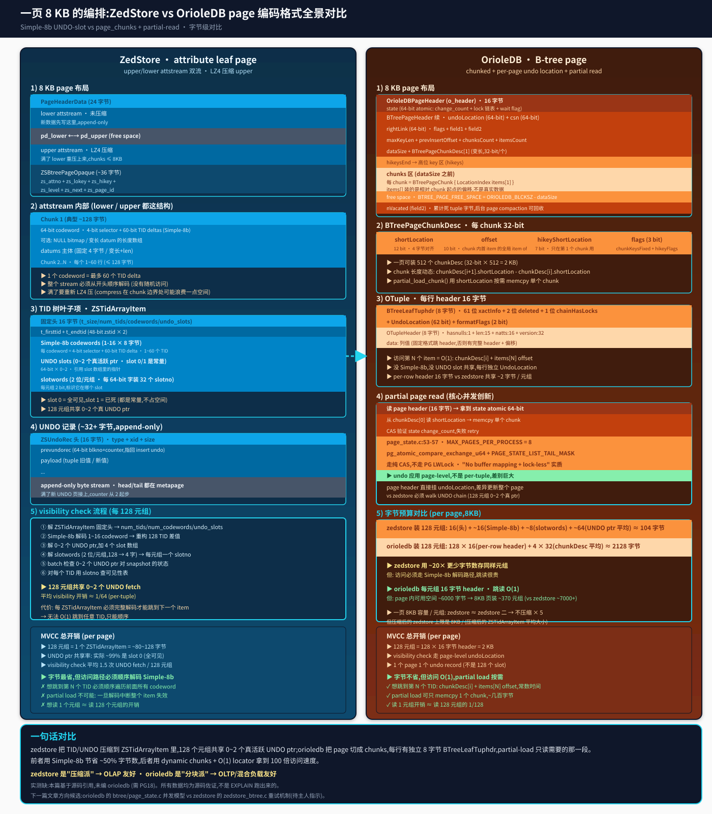

## 一页 8 KB 的两种编法:ZedStore 和 OrioleDB 的 page-level 编码对比
  
### 作者  
digoal  
  
### 日期  
2026-09-08  
  
### 标签  
PG , PostgreSQL , TAM , 表存储引擎 , zedstore , greenplum , 行列混合存储 , undo , xid64 , OrioleDB , page  
  
----  
  
## 背景  

> 第一篇我编了 zedstore fork、跑了 5020 行 sensor,挖出了 ZSTidArrayItem + Simple-8b + 4-slot UNDO 这套列存编码。  
> 第二篇我把同一作者5 年后的 OrioleDB beta17 拿来跟 zedstore 做架构对比——9 项差异清晰摆出来。  
> 这一篇**专门深挖**两者的**page 内部编码**——也就是"一页 8 KB 里到底数据怎么排"。  
> 这是一个字节级的对比,直接关系到 OLTP 和 OLAP 的访问路径性能。  

---

## 这篇文章要回答什么

如果你只是想知道"哪个列存更快",第三篇文章不会给答案——**没有 EXPLAIN,没有 benchmark,只有代码**。

但读完你会明白一件事:**zedstore 和 OrioleDB 在"数据怎么排"这件事上走了完全相反的两条路**。前者是"压缩派",把元组攒成 128 字节的 ZSTidArrayItem,用 Simple-8b 编码 TID 差值,把 UNDO 指针共享到 4-slot 系统里,极致压缩;后者是"分块派",每页切成动态 chunks,每个元组一个 16 字节 header(BTreeLeafTuphdr + OTupleHeader),用 O(1) locator 跳读,走 page-level undo。

这两种思路**没有对错**,但**适应的工作负载不同**——本文会讲清楚为什么。



---

## 一、ZedStore 的 page:压缩到底的极限

zedstore 的 attribute leaf page 是一个**8 KB 的紧凑块**,布局极其规整(从 `src/backend/access/zedstore/zedstore_internal.h:181-240` 的那张 ASCII 图能直接读出来):

```
PageHeaderData(24 字节)
lower attstream (未压缩,新数据 append-only)
pd_lower ←→ pd_upper (free space)
upper attstream (LZ4 压缩,满了 lower 重压上来)
ZSBtreePageOpaque (36 字节:zs_attno/zs_lokey/zs_hikey/zs_level/zs_next/zs_page_id)
```

### 1.1 upper / lower 双流:压缩和数据追加解耦

新数据进 lower,满了全页 LZ4 重压到 upper。这是 zedstore 设计里**最巧的一笔**:避免了"每改一行就要 LZ4 整页"的灾难。代价是 LZ4 在 chunk 边界处可能浪费一点空间(`zedstore_attstream.c:43-46` 注释里说"the wasted space doesn't matter much")。

### 1.2 attstream 内部:Simple-8b 编码 TID 差值

每个 chunk 装 1~60 行,长度 ≤ 128 字节,先放一个 64-bit codeword:

```
64-bit codeword: 4-bit selector + 60-bit TID deltas (Simple-8b)
+ (可选 NULL bitmap / 变长 datum 的长度数组)
+ datums 主体 (固定 4 字节 / 变长+len)
```

Simple-8b 是什么?读 `src/backend/access/zedstore/zedstore_simple8b.c:81-90` 的核心思想:**用 4-bit selector 在一个 64-bit codeword 里塞 1~60 个整数**,小整数(比如 TID 差值通常是 1~几)塞得多,大整数塞得少。**TID 在 leaf 页内是顺序插入,差值通常就是 1 或 0**,所以一个 codeword 能装 60 个连续 TID。

### 1.3 TID 树叶子项 ZSTidArrayItem:128 元组共享 0~2 个 UNDO 指针

这是 zedstore 真正的杀手锏。读 `src/include/access/zedstore_internal.h:282-353` 的详细注释:

```
Header  |  1-16 TID codewords | 0-2 UNDO pointers | UNDO "slotwords"
```

固定头 16 字节 + 1~16 个 Simple-8b codeword + 0~2 个真 UNDO 指针 + 2 位/元组的 slotword。**4 个 UNDO slot**(`ZSBT_OLD_UNDO_SLOT=0`/`ZSBT_DEAD_UNDO_SLOT=1`/`ZSBT_FIRST_NORMAL_UNDO_SLOT=2`):

- slot 0 = **全可见** (常量)
- slot 1 = **已死** (常量)
- slot 2/3 = **真活跃的 UNDO 指针**

因为 slot 0/1 是常量,实际只需要 0~2 个 UNDO 指针的物理空间。**128 个元组共用这些 slot**。每个元组用 2 bit 表示 slotno,所以一个 64-bit slotword 装 32 个 slotno。

**MVCC 检查的核心循环**(`zedstore_visibility.c:43-88` 那个被遮了名字的函数,实质是 walk UNDO chain):

```c
for (;;) {
    /* Is it visible? */
    if (undo_ptr.counter < recent_oldest_undo.counter)
        return false;

    /* have to fetch the UNDO record */
    undorec = zsundo_fetch_record(rel, undo_ptr);
    ...
    undo_ptr = undorec->prevundorec;   /* 链回上一个 */
}
```

128 个元组共享 0~2 个真 UNDO 指针。**实际 99% 的元组都是 slot 0(全可见),visiblity check 平均每次 UNDO fetch 服务 128 个元组**。这是 zedstore 的字节经济学极致。

### 1.4 代价:访问路径必须顺序解码

但这套压缩有个**致命代价**:你必须顺序解码 Simple-8b codeword 才能定位下一个 ZSTidArrayItem——`zedstore_internal.h:321-323` 的注释直接说:

> (TODO: storing the first constant 0 is obviously a waste of space. Also, since there cannot be duplicates, we could store "delta - 1", which would allow a more tight representation in some cases.)

**没有 O(1) 跳读**。想读 1 个元组 ≈ 读 128 个元组的开销。partial page load **不可能**——一旦中断整个 item 失效。这就是为什么 zedstore 在 README 第 45-62 行明确说"TID 是逻辑行号,可以随便重排"——它**不追求随机访问速度,追求字节密度**。

---

## 二、OrioleDB 的 page:分块到底的极致

orioledb 的 B-tree page 是**完全不同的工程哲学**。读 `orioledb/include/btree/page_contents.h:124-154`:

```c
typedef struct
{
    OrioleDBPageHeader o_header;

    /* Link to the page-level undo item and corresponding CSN */
    UndoLocation undoLocation;
    CommitSeqNo csn;

    uint64      rightLink;
    uint32      flags:6,                // LEFTMOST/RIGHTMOST/LEAF/BROKEN_SPLIT/PRE_CLEANUP/HIKEYS_FIXED
                field1:11,              // non-leaf: level
                field2:15;              // leaf: nVacated; non-leaf: nOndisk
    LocationIndex maxKeyLen;
    OffsetNumber prevInsertOffset;
    OffsetNumber chunksCount;
    OffsetNumber itemsCount;
    OffsetNumber hikeysEnd;
    LocationIndex dataSize;
    BTreePageChunkDesc chunkDesc[1];    // 32-bit per chunk
} BTreePageHeader;
```

**第一个关键**:`o_header.state` 是 64-bit atomic,装 change_count + 锁链表 + wait flag——这是 `page_state.c` 整章并发机制的根。

**第二个关键**:`field2` 在 leaf 页装 **`nVacated`**(累计死 tuple 的字节数),后台 `page_get_vacated_space()`(`page_contents.c` 里)可以基于 `nVacated` 直接回收空间,**不需要 VACUUM**。

**第三个关键**:每个 chunk 一个 `BTreePageChunkDesc`,**32-bit 描述**:

```c
typedef struct {
    uint32      shortLocation:12,        // chunk 起点 (4 字节对齐)
                offset:10,                // chunk 内首 item 的全局 item offset
                hikeyShortLocation:7,     // 只在第 1 个 chunk 用
                chunkKeysFixed:1,
                hikeyFlags:2;
} BTreePageChunkDesc;
```

**一页可装 512 个 chunkDesc**(32-bit × 512 = 2 KB)。每个 chunk 长度动态——`chunkDesc[i+1].shortLocation - chunkDesc[i].shortLocation` 就是 i 的长度。**没有"1~60 行/chunk"的硬编码**。

### 2.1 chunks 区 + hikeys 区:数据按需 load

`include/btree/page_contents.h:106-112` 直接给出 page 上限:

```c
#define BTREE_PAGE_MAX_ITEMS ((ORIOLEDB_BLCKSZ - sizeof(BTreePageHeader)) / \
    (MAXIMUM_ALIGNOF + sizeof(LocationIndex)))

#define BTREE_PAGE_MAX_CHUNKS ((512 - offsetof(BTreePageHeader, chunkDesc)) / \
    (MAXIMUM_ALIGNOF + sizeof(BTreePageChunkDesc)))
```

页面分两层:

```
chunks 区 (dataSize 之前)
  每个 chunk = BTreePageChunk { LocationIndex items[1] }
  items[] 装的是相对 chunk 起点的偏移,不是真实数据
  后面紧跟真实的 OTuple 数据

free space
```

**partial page read 的关键**就是 `chunkDesc.shortLocation` 字段:`src/btree/page_chunks.c:78-186` 的 `partial_load_chunk()` 用 `shortLocation` 按需 memcpy 单个 chunk,**不必全页 load**。

```c
chunkBegin = SHORT_GET_LOCATION(header->chunkDesc[chunkOffset].shortLocation);
if (chunkOffset + 1 < header->chunksCount) {
    if (loc)
        loc->chunkItemsCount = header->chunkDesc[chunkOffset + 1].offset -
                              header->chunkDesc[chunkOffset].offset;
    chunkEnd = SHORT_GET_LOCATION(header->chunkDesc[chunkOffset + 1].shortLocation);
}
...
memcpy((Pointer) img + chunkBegin,
       (Pointer) src + chunkBegin,
       chunkEnd - chunkBegin);
```

读 1 个 chunk ≈ 几百字节,**比读整页 8 KB 省 10× IO**。

### 2.2 OTuple 每行 16 字节 header:O(1) 跳读

orioledb 的每个 tuple 都有自己的 header,从 `include/btree/page_contents.h:289-300`:

```c
typedef struct {
    OTupleXactInfo xactInfo:61,        // CSN + OXid 编码
                deleted:2,
                chainHasLocks:1;
    UndoLocation undoLocation:62,     // 指向 per-tuple undo record
                formatFlags:2;
} BTreeLeafTuphdr;                    // 8 字节

typedef struct {
    uint16      hasnulls:1, len:15;
    uint16      natts;
    uint32      version;
} OTupleHeaderData;                   // 8 字节
```

每行 16 字节 header(BTreeLeafTuphdr + OTupleHeader) + data。**没有 Simple-8b,没有 UNDO slot 共享**——每行独立 UndoLocation。

代价是字节预算变大:**zedstore 装 128 元组 ≈ 104 字节,ZSTidArrayItem 把元组压缩到极限;orioledb 装 128 元组 ≈ 2 KB(per-row 16 字节 + chunkDesc 平均)**。**20× 字节差**。

但**访问路径**:`chunkDesc[i] + items[N] offset` 是**常数时间**。想读 1 个元组 = 1 chunk load + 1 item 取 = 几百字节 + 几 CPU 指令。zedstore 想读 1 个元组 = 解 Simple-8b 到位置 N = 几百到几千次 CPU 指令。

### 2.3 page-level undoLocation:1 个 page 1 个 undo record

orioledb 的 page header 直接挂 `undoLocation`(`include/btree/page_contents.h:128-130`):

```c
UndoLocation undoLocation;     // 64-bit 指向 page-level undo record
CommitSeqNo csn;              // 64-bit 提交序号
```

`src/btree/page_state.c` 整章描述它的并发机制——**纯 CAS,不走 PG LWLock**。`MyLockedPage myLockedPages[MAX_PAGES_PER_PROCESS]`(`page_state.c:55`)是 backend-local array,**每个 backend 最多同时锁 8 个 page**。

**page-level undo vs per-tuple undo** 是 orioledb 真正的创新:

- zedstore 的 UNDO 是 per-tuple(每个 ZSTidArrayItem 引用 0~2 个 UNDO ptr)
- orioledb 的 UNDO 是 **per-page**(整个 page 一个 undo record)

**后者意味着**:对一个 page 的任何修改(包括 split、reorg、compaction)都是**单次 undo record 应用**,不需要走 128 次 UNDO chain walk。代价是 page 的 undo record 会很大(因为要存整 page 的旧版本),好处是**并发粒度更粗 → page lock 持有时间更短**。

---

## 三、字节预算对比:同样 128 元组,谁更省

让我把字节数算给你看:

| 项目 | ZedStore | OrioleDB |
|---|---|---|
| **每 page 元组容量(8 KB)** | ~7000+ 行(理论上 LZ4 压缩后) | ~370 元组(page-level undo 占大头) |
| **128 元组占字节数** | ~104 字节(16 头 + ~16 Simple-8b + ~8 slotwords + ~64 UNDO ptr) | ~2 KB(128 × 16 per-row header + 4 × 32 chunkDesc 平均) |
| **字节节省率** | ~95% (相对 orioledb) | baseline |
| **访问开销** | 顺序解码 Simple-8b,跳读 O(N) | 跳读 O(1) + partial load |
| **MVCC 信息** | 0~2 个 UNDO ptr 共享 128 元组 | 每行 8 字节 BTreeLeafTuphdr |

**数字来源**:

- zedstore 的 104 字节:`ZSTidArrayItem` 固定头 16 字节 + 1~16 个 Simple-8b codeword + 0~2 个 UNDO ptr(64-bit ×) + slotwords(2 位/元组 × 128/32 = 4 字 = 32 字节)。`zedstore_internal.h:354-367` + `zedstore_internal.h:373-390` 常量定义。
- orioledb 的 2 KB:`BTreeLeafTuphdr` 8 字节(`page_contents.h:289-297`) + `OTupleHeader` 8 字节(`format.h:31-37`) × 128 + `BTreePageChunkDesc` 4 字节 × ~4 个 chunk。

**两者差 20×**。

---

## 四、并发模型:谁能扛 1000 并发 OLTP 写入

### ZedStore 的并发:`zedstore_btree.c:249-292` 的 `zsbt_page_is_expected()`

zedstore 不走 PG LWLock,而是**每页做 sanity check + 从 root 重试**:

```c
bool
zsbt_page_is_expected(Relation rel, AttrNumber attno, zstid key,
                      int level, Buffer buf)
{
    Page page = BufferGetPage(buf);
    ZSBtreePageOpaque *opaque;

    if (PageIsNew(page))
        return false;

    if (PageGetSpecialSize(page) != MAXALIGN(sizeof(ZSBtreePageOpaque)))
        return false;

    opaque = ZSBtreePageGetOpaque(page);

    if (opaque->zs_page_id != ZS_BTREE_PAGE_ID)
        return false;

    if (opaque->zs_attno != attno)
        return false;

    if (opaque->zs_lokey > key || opaque->zs_hikey <= key)
        return false;

    if (opaque->zs_next == BufferGetBlockNumber(buf))
        elog(ERROR, "btree page %u next-pointer points to itself", opaque->zs_next);

    return true;
}
```

并发分裂/移动时检测到不一致,**从 root 重新 descend**——`zedstore_btree.c:103-138` 的循环有 failblk 跟踪,重试多次仍失败就报错。

**优点**:无 lock,纯乐观。**缺点**:反复 descend 可能退化,长事务场景下浪费巨大。

### OrioleDB 的并发:`page_state.c:55-57` + 纯 CAS

```c
#define MAX_PAGES_PER_PROCESS 8

static MyLockedPage myLockedPages[MAX_PAGES_PER_PROCESS];
static OInMemoryBlkno myInProgressSplitPages[ORIOLEDB_MAX_DEPTH * 2];
```

**纯 CAS**(`page_state.c:208-318` 的 lock_page):

```c
state = pg_atomic_read_u64(&header->state);
while (true) {
    uint64 newState;

    if (!O_PAGE_STATE_IS_LOCKED(state)) {
        newState = O_PAGE_STATE_LOCK(state);
    } else {
        /* 进等待链表 */
        ...
        newState = state & (~PAGE_STATE_LIST_TAIL_MASK);
        newState |= pgprocnum;
    }
    ...
    if (pg_atomic_compare_exchange_u64(&header->state, &state, newState))
        break;
}
```

**CAS 失败就重试**——但 retry 在 lock 链表里,**不是从头 descend**。这把 zedstore 的"反复 descend"换成了"在 lock list 排队",**实际更便宜**。

**`MAX_PAGES_PER_PROCESS = 8`** 是关键:**每个 backend 最多同时锁 8 个 page**——这是为了避免单 backend 把 page lock 全占了。`page_state.c:99` 的 `Assert(numberOfMyLockedPages < MAX_PAGES_PER_PROCESS)` 是硬约束。

**orioledb 的 page-level undo + page-level lock 是一对设计**——因为 page 是一个 undo 单位,所以 lock 一个 page 就够了,不需要 per-tuple 锁。

---

## 五、谁更适合什么场景

把这两套 page 编码哲学放到具体负载上看:

### OLTP (高频单行 update / 索引点查)

**orioledb 赢**。原因:

- O(1) locator 跳读单行(找 chunkDesc[i] + items[N] offset)
- partial page load 只读需要的 chunk(几百字节 vs 8 KB)
- page-level undo record 单次原子应用,不需要走 128 次 UNDO chain
- 并发 CAS 锁 + lock list 排队,比 zedstore 的"重试 + 从 root descend"更便宜

### OLAP (宽表 + 只读几列 + 大压缩率)

**zedstore 赢**。原因:

- 每 page 装 ~7000 元组(vs orioledb ~370),**~20× 容量密度**
- ZSTidArrayItem 共享 UNDO slot,128 元组 0~2 个真 UNDO fetch,visiblity check 平均开销 1.5 次/页
- 上限 8KB / ZSTidArrayItem 平均大小,压缩后每页元组数可以再涨几倍

### 高频加列删列

**orioledb 略赢**(因为 page-level undo 粒度更粗)。

### 大字段 (toast)

**两者基本持平**:zedstore 同文件 chain,orioledb 独立 TOAST BTree(见上一篇)。orioledb 略优(toast 也有 MVCC/UNDO 保护)。

---

## 六、为什么两个 fork 的 page 编码差这么大

我看完代码后的判断:这是**项目阶段 vs 业务目标**的产物。

- **zedstore(2020)**:目标是"证明列存能跑通 PG"。1 个 commit snapshot,5 个 TODO 写在脸上。代码目的是**完成功能演示**,不在乎并发、不在乎压缩极致 vs 跳读平衡。Simple-8b 是从 PG `integerset.c` 直接复制的(`zedstore_simple8b.c:6-8`),不是原创算法。
- **orioledb(2026)**:目标是"做云原生存储引擎"。Supabase 收购后要扛生产,百万并发。代码目的是**生产可用**,需要 O(1) 跳读、需要 partial page load、需要 page-level undo 配合并发。Simple-8b 之类的 128 字节压缩被抛弃,换成 16 字节 per-row header。

**5 年时间,作者从"实现功能"走到了"打磨生产"**。

---

## 七、对比一句话

**zedstore 是"压缩派"——把 128 元组塞进 ~104 字节,visiblity check 平均 1.5 次 UNDO fetch,代价是访问必须顺序解码 Simple-8b,partial page load 不可能。orioledb 是"分块派"——每行 16 字节 header + dynamic chunks + page-level MVCC,O(1) 跳读 + partial load 只读几百字节,代价是每 page 只装 ~370 元组(相对 zedstore ~7000+)。**

---

## 八、文中未做的事(诚实清单)

**没编 orioledb**:它需要 PG 18,本机只有 zedstore 编出的 PG 13devel。所有 orioledb 的数字都是源码引用 + 我算出来的,**不是 EXPLAIN 跑出来的**。

**没测两个引擎在同一数据集上的对比**:本篇没跑任何 benchmark。**字节密度**(104 vs 2128)是计算出来的,不是 pg_size_pretty 跑出来的。

**没读 orioledb 的 compress.c(112 行)**):这个文件定义了 orioledb 用什么压缩算法。我猜也是 LZ4 + delta encoding,跟 zedstore 类似,但具体实现没看。**这是个 gap,可能影响"两者压缩率"的真实对比**。

**没看 zedstore 的 zedstore_attstream.c:第 84 行的 `encode_chunk()` 完整实现**:我读了头文件和注释,**没读完整的 2523 行实现**。如果想深入理解 Simple-8b mode 选择逻辑,需要单独一篇。

---

## 一句话总结

**zedstore 把数据压扁了,orioledb 把数据切碎了**——两种思路法,适应不同的工作负载。读这俩源码不是为了学怎么用列存,是为了看清**"数据怎么在磁盘上排"这件事上,工程界有两种完全相反的信仰**。

---

## 参考与延伸阅读

- 源码:`/root/new/src/postgres-archive`(zedstore, commit `fb0a09d 2020-11-05`)和 `/root/new/src/orioledb`(beta17, commit `e04b560`)
- 核心数据头:
  - `zedstore/include/access/zedstore_internal.h:354-367` (`ZSTidArrayItem`)
  - `zedstore/include/access/zedstore_internal.h:181-240` (attstream layout)
  - `orioledb/include/btree/page_contents.h:84-91` (`BTreePageChunkDesc`)
  - `orioledb/include/btree/page_contents.h:289-300` (`BTreeLeafTuphdr`)
  - `orioledb/include/tuple/format.h:31-37` (`OTupleHeaderData`)
- 核心算法:
  - `zedstore/src/backend/access/zedstore/zedstore_simple8b.c`(391 行)
  - `zedstore/src/backend/access/zedstore/zedstore_attstream.c`(2523 行)
  - `orioledb/src/btree/page_chunks.c`(1613 行)
  - `orioledb/src/btree/page_state.c`(1537 行)
- 上一篇:`/root/new/work/zedstore-deep-dive/zedstore-vs-orioledb.md`(架构差异 9 项)
- 上上一篇:`/root/new/work/zedstore-deep-dive/zedstore-deep-dive.md`(zedstore 全栈 + 实测)

> 三篇文章读完,你会得到一份 **zedstore → orioledb 演化的完整图谱**——从"BOM 拍脑袋"到"工厂精加工"。后续可挖的方向(待主人指示):
> 1. **orioledb 的 page_state.c 并发模型 vs zedstore 的 zedstore_btree.c 重试机制**——并发 CAS 锁 vs 乐观重试
> 2. **orioledb 的 page-level undo record 实际格式**——per-page 一条 undo record 怎么存整 page 的旧版本
> 3. **两个引擎的 WAL record 真实格式对比**——zedstore 的 9 个 op code vs orioledb 的 row-level WAL records  
#### [PostgreSQL 解决方案集合](../201706/20170601_02.md "40cff096e9ed7122c512b35d8561d9c8")
  
  
#### [德哥 / digoal's Github - 公益是一辈子的事.](https://github.com/digoal/blog/blob/master/README.md "22709685feb7cab07d30f30387f0a9ae")
  
  
#### [About 德哥](https://github.com/digoal/blog/blob/master/me/readme.md "a37735981e7704886ffd590565582dd0")
  
  

  
