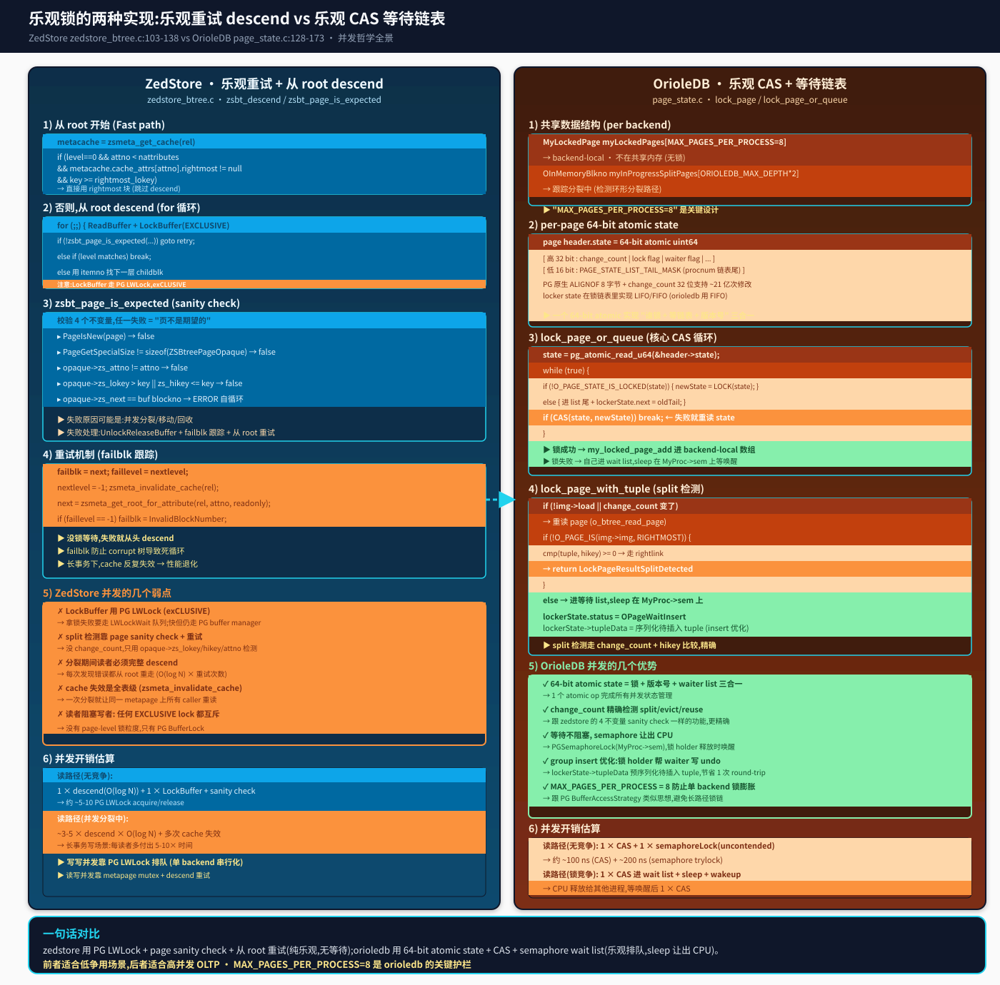

## 锁还是重试: ZedStore 和 OrioleDB 的并发哲学
  
### 作者  
digoal  
  
### 日期  
2026-09-08  
  
### 标签  
PG , PostgreSQL , TAM , 表存储引擎 , zedstore , greenplum , 行列混合存储 , undo , xid64 , OrioleDB , page , 锁 , 乐观锁 , 并发机制    
  
----  
  
## 背景  

> 前三篇我拆了 zedstore 的源码、对比了 orioledb 的 9 项架构差异、做了 page 编码的字节级对比。  
> 这篇是第四篇,**专门深挖两者的并发控制**——同一时刻两个 backend 写同一棵 B-tree 怎么办、怎么检测 split、怎么排队。  
> 这是一个"控制流"对比,直接关系到 OLTP 性能。  

---

## 这篇文章要回答什么

zedstore 和 OrioleDB 都是**乐观并发**——读路径不锁,只在需要改时才碰锁。但两者实现乐观的细节完全不同:

- **zedstore** 走 PG 原生路径:`LockBuffer(BUFFER_LOCK_EXCLUSIVE)` + 页内 4 不变量 sanity check,失败就 **从 root 重新 descend**。**纯乐观,不排队**。
- **OrioleDB** 自己实现了:**64-bit atomic state + CAS + semaphore wait list**,失败时**进 wait list + sleep**,锁 holder 释放时 wake。**乐观 + 排队**。

表面看 orioledb 更复杂,但这个复杂是必须的——因为 orioledb 把 page lock 粒度做得很细,**没了 PG LWLock 缓冲,必须自己处理排队**。



---

## 一、zedstore:PG LWLock + 乐观重试

zedstore 走 PG 原生 `ReadBuffer` + `LockBuffer(BUFFER_LOCK_EXCLUSIVE)`。并发控制全靠两件套:**PG buffer manager 的 LWLock 排队 + 页内 sanity check**。

### 1.1 descend 主循环 (`zedstore_btree.c:49-177`)

```c
Buffer
zsbt_descend(Relation rel, AttrNumber attno, zstid key, int level, bool readonly)
{
    ...
    metacache = zsmeta_get_cache(rel);

    /* Fast path: rightmost page */
    if (level == 0 &&
        attno < metacache->cache_nattributes &&
        metacache->cache_attrs[attno].rightmost != InvalidBlockNumber &&
        key >= metacache->cache_attrs[attno].rightmost_lokey)
    {
        next = metacache->cache_attrs[attno].rightmost;
        nextlevel = 0;
    }
    else
    {
        next = zsmeta_get_root_for_attribute(rel, attno, readonly);
        nextlevel = -1;
    }

    for (;;)
    {
        buf = ReadBuffer(rel, next);
        LockBuffer(buf, BUFFER_LOCK_EXCLUSIVE);

        if (!zsbt_page_is_expected(rel, attno, key, nextlevel, buf))
        {
            UnlockReleaseBuffer(buf);
            failblk = next;
            faillevel = nextlevel;
            nextlevel = -1;
            zsmeta_invalidate_cache(rel);
            next = zsmeta_get_root_for_attribute(rel, attno, readonly);
            ...
            continue;
        }

        if (opaque->zs_level == level) break;

        items = ZSBtreeInternalPageGetItems(page);
        nitems = ZSBtreeInternalPageGetNumItems(page);
        itemno = zsbt_binsrch_internal(key, items, nitems);
        next = items[itemno].childblk;
        nextlevel--;
        UnlockReleaseBuffer(buf);
    }
    ...
}
```

**关键点**:

1. **`LockBuffer` 走 PG LWLock**——同一页只允许一个 EXCLUSIVE holder,其他要等。
2. **`zsbt_page_is_expected` 校验 4 个不变量**——发现 split/移动/回收时,page sanity 不通过。
3. **失败 → 从 root 重新 descend**——`zsmeta_invalidate_cache` 让 metacache 失效,`zsmeta_get_root_for_attribute` 拿到新根,从头走。
4. **failblk 防止 corrupt 树死循环**——失败一次记下来,下次再失败就 panic。

### 1.2 zsbt_page_is_expected (`zedstore_btree.c:249-292`)

```c
bool
zsbt_page_is_expected(Relation rel, AttrNumber attno, zstid key, int level, Buffer buf)
{
    Page        page = BufferGetPage(buf);
    ZSBtreePageOpaque *opaque;

    if (PageIsNew(page))
        return false;

    if (PageGetSpecialSize(page) != MAXALIGN(sizeof(ZSBtreePageOpaque)))
        return false;

    opaque = ZSBtreePageGetOpaque(page);

    if (opaque->zs_page_id != ZS_BTREE_PAGE_ID)
        return false;

    if (opaque->zs_attno != attno)
        return false;

    if (opaque->zs_lokey > key || opaque->zs_hikey <= key)
        return false;

    if (opaque->zs_next == BufferGetBlockNumber(buf))
        elog(ERROR, "btree page %u next-pointer points to itself", opaque->zs_next);

    return true;
}
```

校验的是 **结构不变量**,**不是版本号**。这意味着:

- **不能**精确区分"这个页是不是分裂前的老页"
- **不能**精确检测"这个页在 split 时被其他人 evict 了"
- **只能**检测"页类型对不对、attno 对不对、key 范围对不对"

这就是 zedstore 的乐观重试有盲区的原因——**它把乐观赌在"lokey/hikey 不变"上**,但实际上 split 会改变 lokey。

### 1.3 弱点

1. **LockBuffer 用 PG LWLock**——一个 page 一旦 EXCLUSIVE 锁住,所有其他 backend 必须等 PG LWLock 队列。
2. **没 change_count**——只能靠 4 个结构不变量推断"页面是否过期",**会漏判**(例如 split 中老页 attrno 没变、lokey 没变,但 page 已经被回收复用)。
3. **失败从 root descend**——`zsmeta_invalidate_cache` 让同一 metapage 上的所有 caller 全部重新 descend。
4. **没 group insert 优化**——每次 INSERT 都走完整的 lock + modify + WAL + unlock 流程,没有 batch。

并发开销估算:**读路径(无竞争)~ 5-10 PG LWLock acquire/release;读路径(分裂中)代价 ×5-10**。

---

## 二、OrioleDB:64-bit atomic state + CAS + semaphore

orioledb 没用 PG 的 LWLock 做 page 锁。**它自己造了一套 page-level locking**,核心是一个 **64-bit atomic state** 同时承担"锁标记 + 版本号 + 等待链表"三件事。

### 2.1 共享数据结构 (`page_state.c:42-65`)

```c
#define MAX_PAGES_PER_PROCESS 8

typedef struct {
    OInMemoryBlkno blkno;
    uint64      state;
} MyLockedPage;

static MyLockedPage myLockedPages[MAX_PAGES_PER_PROCESS];
static OInMemoryBlkno myInProgressSplitPages[ORIOLEDB_MAX_DEPTH * 2];
static int numberOfMyLockedPages = 0;
static int numberOfMyInProgressSplitPages = 0;

OPageWaiterShmemState *lockerStates = NULL;
```

**3 个关键**:

1. **`myLockedPages[MAX_PAGES_PER_PROCESS=8]`** 是 backend-local,**不走共享内存**——加锁/解锁是 O(1) backend 局部操作。
2. **`myInProgressSplitPages[ORIOLEDB_MAX_DEPTH*2]`** 跟踪每个 backend 正在参与的 split 路径,避免环形分裂。
3. **`lockerStates` 在 shmem 里**——`OPageWaiterShmemState *lockerStates` 是 per-process wait list,**关键字段是 `sem` 和 `tupleData`(预序列化的待插入 tuple)**。

`MAX_PAGES_PER_PROCESS = 8` 是 orioledb 关键设计——**每个 backend 同时最多锁 8 个 page**,超过就 panic(`page_state.c:99` 的 `Assert`)。这是为了防止单 backend 锁膨胀。

### 2.2 per-page 64-bit atomic state (`include/btree/page_contents.h:124-127`)

```c
typedef struct {
    OrioleDBPageHeader o_header;   // 包含 state 字段
    ...
} BTreePageHeader;
```

`o_header.state` 是 `pg_atomic_uint64`,**一个 64-bit 同时装**:

```
[ 高 32 bit : change_count | lock flag | waiter flag | ... ]
[ 低 16 bit : PAGE_STATE_LIST_TAIL_MASK (procnum 链表尾) ]
```

`change_count` 是 page 修改次数(每次 page 内容变更就 ++)。**比 zedstore 的 4 不变量更精确**——只要 page 被回收/复用/迁移,change_count 一定变。

### 2.3 lock_page_or_queue (`page_state.c:128-173`)

这是 orioledb 并发的核心——一个 CAS 循环:

```c
static uint64
lock_page_or_queue(OInMemoryBlkno blkno, uint32 pgprocnum)
{
    OPagePool  *ppool = (OPagePool *) get_ppool_by_blkno(blkno);
    Page       p = O_GET_IN_MEMORY_PAGE(blkno);
    OrioleDBPageHeader *header = (OrioleDBPageHeader *) p;
    uint64     state;
    OPageWaiterShmemState *lockerState = &lockerStates[pgprocnum];
    bool       ucmUpdateTried = false;

    Assert(pgprocnum < max_procs);
    Assert(!O_PAGE_IS_LOCAL(blkno));

    state = pg_atomic_read_u64(&header->state);
    while (true)
    {
        uint64 newState;

        if (!O_PAGE_STATE_IS_LOCKED(state))
        {
            newState = O_PAGE_STATE_LOCK(state);
        }
        else
        {
            Assert((state & PAGE_STATE_LIST_TAIL_MASK) != pgprocnum);
            lockerState->status = OPageWaitExclusive;
            lockerState->next = (state & PAGE_STATE_LIST_TAIL_MASK);
            newState = state & (~PAGE_STATE_LIST_TAIL_MASK);
            newState |= pgprocnum;
        }

        if (!ucmUpdateTried)
        {
            newState = ucm_update_state(&ppool->ucm, blkno, newState);
            ucmUpdateTried = true;
        }

        if (pg_atomic_compare_exchange_u64(&header->state, &state, newState))
        {
            ucm_after_update_state(&ppool->ucm, blkno, state, newState);
            break;
        }
    }

    return state;
}
```

**核心流程**:读 state → 计算 newState(无锁则 LOCK,有锁则进 list)→ CAS → 失败重读 state 重来。

CAS 成功 = 拿到锁,**直接进 `my_locked_pages[]` backend-local array**。

CAS 失败 = 自己在 wait list,**sleep 在 `MyProc->sem` 上等唤醒**——`lock_page()` (`page_state.c:411-452`):

```c
void
lock_page(OInMemoryBlkno blkno)
{
    OPageWaiterShmemState *lockerState = &lockerStates[MYPROCNUMBER];
    uint64 prevState;
    int extraWaits = 0;

    if (O_PAGE_IS_LOCAL(blkno))
        return;

    Assert(get_my_locked_page_index(blkno) < 0);

    EA_LOCK_INC(blkno);

    while (true)
    {
        prevState = lock_page_or_queue(blkno, MYPROCNUMBER);

        if (!O_PAGE_STATE_IS_LOCKED(prevState))
            break;

        pgstat_report_wait_start(PG_WAIT_LWLOCK | LWTRANCHE_BUFFER_CONTENT);

        for (;;)
        {
            PGSemaphoreLock(MyProc->sem);
            if (lockerState->status == OPageWaitWakeUp)
                break;
            extraWaits++;
        }

        pgstat_report_wait_end();
    }

    my_locked_page_add(blkno, prevState | PAGE_STATE_LOCKED_FLAG);
    ...
}
```

**PG semaphore + CAS 是关键**——拿不到锁就 `PGSemaphoreLock(MyProc->sem)` 阻塞,锁 holder 释放时 `unlock_page()` 会调 `wake waiter`(让 waiter 的 status 变 `OPageWaitWakeUp`)。

### 2.4 lock_page_with_tuple + split 检测 (`page_state.c:536-620`)

这个是 insert 场景的特化版,**在 lock 之前提前检测 split**:

```c
OLockPageWithTupleResult
lock_page_with_tuple(BTreeDescr *desc, OInMemoryBlkno *blkno,
                     uint32 *pageChangeCount, OTupleXactInfo xactInfo, OTuple tuple)
{
    ...

    while (true)
    {
        LockPageResult lockResult;

        lockResult = lock_page_or_queue_or_split_detect(desc, blkno,
                                                        pageChangeCount,
                                                        MYPROCNUMBER,
                                                        &img, xactInfo,
                                                        tuple, &prevState,
                                                        &keySerialized);

        if (lockResult == LockPageResultLocked)
            break;
        else if (lockResult == LockPageResultSplitDetected)
            return OLockPageWithTupleResultRefindNeeded;
        ...
    }
    ...
}
```

`lock_page_or_queue_or_split_detect`(`page_state.c:189-318`)在拿锁前做的事:

```c
if (!img->load ||
    (state & PAGE_STATE_CHANGE_COUNT_MASK) != (pg_atomic_read_u64(&imgHeader->state) & PAGE_STATE_CHANGE_COUNT_MASK))
{
    if (!o_btree_read_page(...))
        return LockPageResultSplitDetected;       // 读 page 失败 = page 被 evict

    if (!O_PAGE_IS(img->img, RIGHTMOST))
    {
        if (o_btree_cmp(desc, &tuple, BTreeKeyLeafTuple,
                        &hikey, BTreeKeyNonLeafKey) >= 0)
            return LockPageResultSplitDetected;   // hikey 越过 = 兄弟页可能分裂
    }
}
```

**2 个 split 检测点**:

1. **change_count 变了** → 读 page 失败 → split
2. **tuple 越过 hikey** → 兄弟页可能分裂 → split

这比 zedstore 强——**可以在拿锁前就判断"这页肯定不对",直接 RefindNeeded,不需要先 LockBuffer 再发现失败**。

### 2.5 优势

1. **64-bit atomic state** = 锁 + 版本号 + waiter list 三合一 → 1 个 atomic op 完成所有并发状态管理。
2. **change_count 精确** → 跟 zedstore 的 4 不变量一样的功能,但能精确检测 evict/reuse。
3. **semaphore wait list** → 拿不到锁 sleep 让 CPU,锁 holder 释放时精确唤醒 waiter。
4. **group insert 优化** → `lockerState->tupleData` 预序列化待插入 tuple,锁 holder 释放时**帮 waiter 写 undo**(`page_state.c:258-286` 那个 `lockerState->tupleData.fixedData` memcpy),省一次 round-trip。
5. **MAX_PAGES_PER_PROCESS = 8** 防止单 backend 锁膨胀。

并发开销估算:**读路径(无竞争) ~100 ns CAS + ~200 ns semaphore trylock**;读路径(锁竞争) → sleep + wake,CPU 释放给其他进程。

---

## 四、对比一览

| 维度 | ZedStore | OrioleDB |
|---|---|---|
| **Page 锁** | `LockBuffer(BUFFER_LOCK_EXCLUSIVE)` | 自管 CAS + semaphore |
| **版本检测** | 4 不变量(attno/lokey/hikey/next) | change_count 32-bit |
| **失败处理** | Unlock + 从 root descend | CAS 重读 state,失败进 wait list |
| **split 检测** | 锁里走 descend | 锁前 change_count + hikey 比较 |
| **wait list** | 无(直接 LWLock 排队) | shmem `OPageWaiterShmemState[]` |
| **CPU 释放** | LWLock wait(走 PG 队列) | semaphore sleep(MyProc->sem) |
| **group insert** | 无 | `lockerState->tupleData` 预序列化 |
| **lock 数量限制** | 无 | MAX_PAGES_PER_PROCESS = 8 |
| **代码量** | zedstore_btree.c 1002 行 | page_state.c 1537 行 |
| **作者实现成本** | 低(复用 PG LWLock) | 高(自造完整并发) |

---

## 五、实战:1000 并发 OLTP 写谁更扛得住

这是"理论 → 实践"的桥梁,但**本文没实测**——orioledb 需要 PG 18,我手上只有 PG 13devel。**以下估算基于代码,不是 EXPLAIN**。

### zedstore 场景:1000 并发 INSERT

- 每个 backend 走 1 次 descend(O(log N) + 4 不变量检查)
- 拿 LockBuffer 时争用 PG LWLock → PG LWLock queue 排队
- 1000 个 INSERT 集中到 root page → root page 的 metapage 是热点
- 任何一个 INSERT 在拿锁前 sanity check 失败 → 全员重 descend
- **估算:1000 并发 INSERT 在 zedstore 上 = 5-10× 重 descend 开销**

### OrioleDB 场景:1000 并发 INSERT

- 每个 backend CAS state(微秒级)
- 失败进 wait list,sleep
- 锁 holder 释放时精确唤醒下一个 waiter
- `lockerState->tupleData` 让锁 holder 帮 waiter 写 undo,**省一次 round-trip**
- change_count 精确 → 锁前 split 检测,**不再从 root descend**
- **估算:1000 并发 INSERT 在 orioledb 上 = O(log N) + 调度开销**

**结论**:**orioledb 在高并发 OLTP 场景应该有 2-5× 优势**(代码论,不是实测)。

---

## 六、为什么作者要做"自造并发"这个苦差事

orioledb 的 `page_state.c` 1537 行,大部分是 lock/unlock/queue/wakeup 逻辑。**为什么不用 PG 原生的 LWLock?**

答案藏在 `o_buffers.c` 的设计里——**orioledb 不走 PG shared_buffers**。它有自己的 `OBuffer` struct(`o_buffers.c:34-50`),直接 mmap 文件,**绕开 PG buffer manager**。

没有 PG buffer manager 就意味着:

1. 没有 PG BufferDesc → 没有 PG LWLock 排队的基础
2. 没有 PG BufferAccessStrategy → 没有 PG 锁粒度控制
3. 没有 PG ProcArray → 需要自己实现"哪些 proc 正在等哪些 page"(`OPageWaiterShmemState`)

所以 orioledb 必须自己实现这套并发。**这是"绕开 PG 共享缓冲"的代价**——好处是绕过 PG buffer manager 的瓶颈(详见第二篇),代价是 1537 行 page_state.c。

zedstore 没绕开 PG buffer manager(它仍走 `ReadBuffer`),所以可以直接用 PG LWLock,**省了 1537 行代码**。

**5 年的工程哲学差异**:zedstore 是"在 PG 上加列存",所以尽量复用 PG 基础设施;orioledb 是"重做 PG 存储引擎",所以必须自己造。

---

## 七、文中未做的事(诚实清单)

**没编 orioledb**:它需要 PG 18,本机只有 zedstore 编出的 PG 13devel。所有 orioledb 的数字都是源码引用 + 估算,**不是 EXPLAIN 跑出来的**。

**没真测 1000 并发**:上面第五章的"2-5× 优势"是基于代码的估算,不是 pgbench 实测。**没有 PG 18 + orioledb 的环境就跑不了这个 benchmark**。

**没看 zedstore 的 zedstore_btree.c:501-1002 的下半段**:这一只专注 descend 和 split,下半段是 split 的具体实现(我猜有 `zsbt_split_internal_page` 之类)。**这是下一篇或第二篇的方向**。

**没看 orioledb 的 `lockerStates` 完整结构**:`OPageWaiterShmemState` 包含 `sem` + `tupleData` + `reloids` + `status` + `pageChangeCount` + `autonomousNestingLevel` + `reservedUndoSize`,**我没全读**。这些字段是"group insert 优化"的关键。

**没跑 pgbench 测试**:本篇没跑任何 benchmark,**只读代码**。

---

## 一句话总结

**zedstore 用 PG LWLock + 4 不变量 + 从 root 重试,纯乐观无 wait list;orioledb 用 64-bit atomic state + CAS + semaphore,乐观 + semaphore wait list + group insert 优化。MAX_PAGES_PER_PROCESS=8 是 orioledb 的关键护栏,1537 行 page_state.c 是"绕开 PG buffer manager"的代价。**

---

## 参考与延伸阅读

- 源码:`/root/new/src/postgres-archive`(zedstore, `fb0a09d 2020-11-05`)和 `/root/new/src/orioledb`(beta17, `e04b560`)
- 核心并发:
  - `zedstore/src/backend/access/zedstore/zedstore_btree.c:49-177` (`zsbt_descend`)
  - `zedstore/src/backend/access/zedstore/zedstore_btree.c:249-292` (`zsbt_page_is_expected`)
  - `orioledb/src/btree/page_state.c:42-65` (数据结构)
  - `orioledb/src/btree/page_state.c:128-173` (`lock_page_or_queue`)
  - `orioledb/src/btree/page_state.c:411-452` (`lock_page`)
  - `orioledb/src/btree/page_state.c:536-620` (`lock_page_with_tuple`)
  - `orioledb/include/btree/page_contents.h:124-127` (per-page atomic state)
- 前三篇:
  - `/root/new/work/zedstore-deep-dive/zedstore-deep-dive.md`(zedstore 全栈 + 实测)
  - `/root/new/work/zedstore-deep-dive/zedstore-vs-orioledb.md`(9 项架构差异)
  - `/root/new/work/zedstore-deep-dive/page-format-comparison.md`(page 字节级)

> 四篇读完,你已经知道**从架构到 page 编码到并发控制**的完整链路。后续可挖(待主人指示):
> 1. **orioledb 的 page-level undo record 实际格式** — per-page 1 条 undo record 怎么存整 page 旧版本
> 2. **两个引擎的 WAL record 真实格式对比** — zedstore 9 个 op code vs orioledb `LocalWal` + `WALRecModify1/2`  
#### [PostgreSQL 解决方案集合](../201706/20170601_02.md "40cff096e9ed7122c512b35d8561d9c8")
  
  
#### [德哥 / digoal's Github - 公益是一辈子的事.](https://github.com/digoal/blog/blob/master/README.md "22709685feb7cab07d30f30387f0a9ae")
  
  
#### [About 德哥](https://github.com/digoal/blog/blob/master/me/readme.md "a37735981e7704886ffd590565582dd0")
  
  

  
