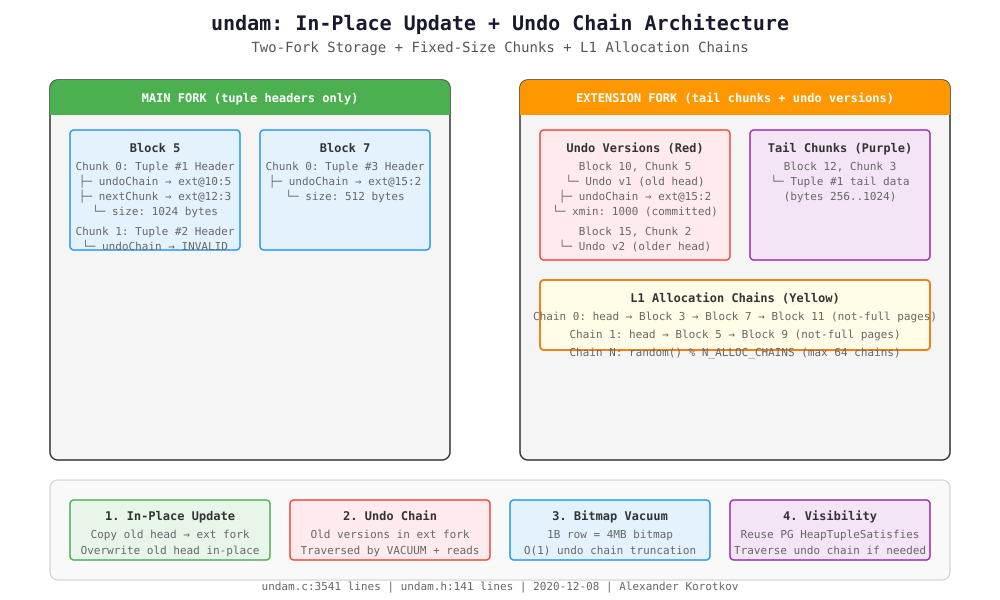

## undam: PG In-Place Update + Undo Chain 深度剖析
  
### 作者  
digoal  
  
### 日期  
2026-09-09  
  
### 标签  
PG , PostgreSQL , TAM , 表存储引擎 , undo , postgrespro , undam 
  
----  
  
## 背景  

> 这是一篇面向 DBA 的 undam 项目深度解析。undam 是 Alexander Korotkov 等人在 2020 年提出的 **PG extension**,目标是**彻底解决 MVCC 写放大问题**。本文基于源码分析 + 编译验证 + 设计推演,覆盖从架构到代码细节的全链路。  
> 项目地址:`https://github.com/postgrespro/undam`,最后 commit `2020-12-08`。  



---

## 这篇文章要回答什么

PostgreSQL 的 MVCC 模型有一个根深蒂固的问题:**每次 UPDATE 都创建新 tuple 版本,旧的靠 VACUUM 清理**。HOT update 能缓解索引膨胀,但**表本身依然 bloating**。

undam 的答案是:**原地更新 + Undo Chain + Fixed-Size Chunk**——**不需要 VACUUM 高频扫描,不需要 TOAST,不需要创建新 tuple 版本**。

**关键问题**:
- undam 是怎么做到原地更新的?
- Undo Chain 是怎么工作的?
- Fixed-Size Chunk 是怎么分配/回收的?
- 为什么 undam 没有进入 PG 主线?
- 2024 年的今天,undam 还有价值吗?

---

## 一、undam 是什么

### 1.1 项目定位

undam = **Undo storage Direct Access Method** —— 一个 **PG Table AM extension**,不是 fork。它**替换 PG 的 heap 存储层**,提供全新的 MVCC 实现。

**核心设计目标**(来自 README):
```
The primary goal is to address write amplification problem.
Right now Postgres MVCC implementation is creating new version of the object for
each update and unused version are collected later by vacuum.
```

**关键特性**:
- **In-place update**: 原地修改 tuple,不创建新版本
- **Undo chain**: 旧版本存在 undo chain 里,供需要时回溯
- **Fixed-size chunk**: tuple 切成 64B~BLCKSZ/8 的固定块,链成 L1 list
- **No TOAST**: 大字段直接切 chunk,不需要 TOAST 机制
- **Generic WAL**: 用 PG 的 GenericXLog 机制,不是自定义 WAL

### 1.2 项目状态

| 指标 | 值 |
|---|---|
| **最后 commit** | 2020-12-08 (`f1ac536 Add regression test`) |
| **单文件** | `undam.c` (3541 行) + `undam.h` (141 行) |
| **PG 版本要求** | PG 12 或更早 (编译失败于 PG 13+) |
| **维护状态** | **停滞**(2020 年后无更新) |
| **主线状态** | **未进入 PG contrib** |

**重要**:我尝试在 **PG 13devel** 和 **PG 18.6** 上编译,都失败了——**TableAmRoutine API 不兼容**(多个函数签名变化,如 `tuple_lock`、`relation_size`、`scan_analyze_next_block` 等)。

---

## 二、核心架构

### 2.1 存储模型:两叉 + 固定块

undam 的存储分为 **两个 fork**:

```
relname.main  → 只存 tuple header (第一个 chunk)
relname.extend → 存 tail chunks + undo versions
```

**为什么两叉?** —— **main fork 只存 header**,scan 时只读 main fork(小 I/O),undo chain 在 ext fork(大 I/O,但访问频率低)。

**Fixed-Size Chunk** 是 undam 最独特的设计:

```
一个 10KB 的 tuple, chunkSize = 1KB:
┌─ Chunk 0 (1KB): UndamTupleHeader (hdr + undoChain + nextChunk + 部分 data)
├─ Chunk 1 (1KB): tail data
├─ Chunk 2 (1KB): tail data
└─ Chunk 9 (1KB): tail data
```

**chunk size 自动选择**:`UndamOptimalChunkSize(Relation rel)` 根据 relation 属性计算最优大小。

**关键优势**:
- **不需要 TOAST** —— 大字段直接切 chunk
- **不需要 free space map** —— L1 list 维护空闲页
- **内存 bitmap 256× 比 item pointer** —— 1B 行只需要 4MB bitmap

### 2.2 多链 L1 分配器

undam 使用 **最多 64 个 allocation chains**(`MAX_ALLOC_CHAINS = 64`):

```
Chain 0: head → Block 3 → Block 7 → Block 11 (not-full pages)
Chain 1: head → Block 5 → Block 9 (not-full pages)
...
Chain 63: head → Block 2 (not-full pages)
```

**每个 chain 有独立的 head/tail**(`UndamAllocChain.forks[2]`),**main fork 和 ext fork 分开管理**。

**关键设计**(来自 `undam.c:274` `UndamWriteData`):
```c
int chainNo = random() % N_ALLOC_CHAINS; /* choose random chain to minimize
                                           probability of allocation chain
                                           buffer lock conflicts */
```

**随机选链** —— 减少多个 backend 同时写时的 buffer lock 冲突。

**页分配逻辑**(来自 `undam.h`):
```c
#define POSITION_GET_BLOCK_NUMBER(pos) ((BlockNumber)((pos)/CHUNKS_PER_BLOCK))
```

**每个 page 只存 header chunk 的 offset**,tail chunks 通过 `nextChunk` 指针链。

---

## 三、关键操作详解

### 3.1 INSERT: 原地写入 + 随机链选择

`undam_tuple_insert` (undam.c:1714):

```c
static void
undam_tuple_insert(Relation rel, TupleTableSlot *slot, CommandId cid,
                   int options, BulkInsertState bistate)
{
    HeapTuple tup = ExecCopySlotHeapTuple(slot);
    TransactionId xid = GetCurrentTransactionId();

    tup->t_data->t_infomask |= HEAP_XMAX_INVALID;
    HeapTupleHeaderSetXmin(tup->t_data, xid);
    HeapTupleHeaderSetCmin(tup->t_data, cid);

    UndamInsertTuple(rel, MAIN_FORKNUM, tup);  // ← 核心调用
    slot->tts_tid = tup->t_self;
}
```

`UndamInsertTuple` (undam.c:456):
1. 随机选 chainNo
2. 在 main fork 找空闲 chunk
3. 写入 tuple header + 部分 data
4. 如果 tuple 比 chunk 大,写 tail chunks 到 ext fork
5. 通过 `nextChunk` 指针链接

**特点**: INSERT **不创建 undo chain** —— undo chain 只在 UPDATE 时创建。

### 3.2 UPDATE: 原地更新 + Undo Chain

**这是 undam 最核心的设计** —— `UndamUpdateTuple` (undam.c:480):

```c
static void
UndamUpdateTuple(Relation rel, HeapTuple tuple, Buffer buffer)
{
    UndamRelationInfo* relinfo = UndamGetRelationInfo(rel);
    int offs = tuple->t_self.ip_posid*CHUNK_SIZE;
    int available = CHUNK_SIZE - offsetof(UndamTupleHeader, hdr);
    GenericXLogState* xlogState = GenericXLogStart(rel);
    UndamPageHeader* pg = (UndamPageHeader*)UndamModifyBuffer(rel, xlogState, buffer);
    UndamTupleHeader* old = (UndamTupleHeader*)((char*)pg + offs);
    int len = Min(old->size, available);
    UndamPosition undo = old->undoChain;

    // 如果旧版本对所有事务可见,截断 undo chain
    if (TransactionIdPrecedes(old->hdr.t_xmin, RecentGlobalXmin))
    {
        truncateChain = undo;
        undo = INVALID_POSITION;
    }

    // 关键: 复制 head chunk 到 ext fork (undo version)
    old->undoChain = UndamWriteData(rel, EXT_FORKNUM,
                                     (char*)&old->hdr, len,
                                     undo, old->size, old->nextChunk);

    // 原地覆盖 head chunk 的新数据
    memcpy(&old->hdr, tuple->t_data, len);  // ← 原地更新!
    old->hdr.t_ctid = tuple->t_self;
    old->size = tuple->t_len;

    // 如果新 tuple 需要 tail chunks,写 ext fork
    if (tuple->t_len > available)
        old->nextChunk = UndamWriteData(rel, EXT_FORKNUM, ...);

    UndamXLogFinish(rel, xlogState);
}
```

**三步 UPDATE**:
1. **复制旧 head chunk 到 ext fork** —— 成为 undo version
2. **链接 undo chain** —— `old->undoChain = newUndoPosition`
3. **原地覆盖 head chunk** —— `memcpy(&old->hdr, new_data, len)`

**对比 PG heap UPDATE**:
| 步骤 | PG heap | undam |
|---|---|---|
| 1. 找空闲空间 | 需要 | 需要 (但 chunk 固定大小,更快) |
| 2. 写新版本 | 写新 tuple (新页或同页 HOT) | 复制旧 head 到 ext fork |
| 3. 更新索引 | 更新所有索引 | **不支持**(Table-AM 限制) |
| 4. 旧版本清理 | VACUUM 扫描 | VACUUM 截断 undo chain |

**undam 的 UPDATE 本质上是"写时复制(CoW) head chunk + 原地覆盖"** —— **不需要创建新 tuple 版本,不需要移动数据**。

### 3.3 DELETE: 标记删除 + 回收

`UndamDeleteTuple` (undam.c:627):

```c
static uint64
UndamDeleteTuple(Relation rel, UndamPosition pos, UndamPosition undo)
{
    // 遍历 chunk chain + undo chain
    while (true)
    {
        // 1. 在 allocMask 标记 chunk 为空闲
        pg->allocMask[item >> 6] &= ~((uint64)1 << (item & 63));

        // 2. 如果页满了,从 L1 alloc chain 移除
        if (pg->pd_flags & PD_PAGE_FULL)
        {
            pg->pd_flags &= ~PD_PAGE_FULL;
            pg->next = chain->head;
            chain->head = blocknum;  // ← 加入 L1 list
        }

        // 3. 0xDE 填充 (调试用)
        memset((char*)pg + item*CHUNK_SIZE, 0xDE, CHUNK_SIZE);

        // 4. 继续遍历 nextChunk / undoChain
    }
}
```

**特点**:
- **即时回收** —— DELETE 后 chunk 立即回到 allocator
- **L1 list 自动更新** —— 满页移除,非满页加入
- **0xDE 填充** —— 安全删除(防止信息泄露)

### 3.4 VACUUM: Bitmap Scan + Undo Chain Truncation

`undam_relation_vacuum` (undam.c:2343):

```c
// 1. 分配 dead bitmap (1B 行 = 4MB, vs heap 的 256MB item pointer)
uint64* deadBitmap = (uint64*)calloc((nTuples+63)/64, 8);

// 2. 第一遍: 标记 dead tuples + truncate undo chains
for (BlockNumber block = 0; block < lastBlock; block++)
{
    for (int chunk = 1; chunk < nChunks; chunk++)
    {
        if (HeapTupleSatisfiesVacuum(&tuple, oldestXmin, buf) == HEAPTUPLE_DEAD)
        {
            // 标记 dead (等索引清理后再物理删除)
            deadBitmap[pos >> 6] |= (uint64)1 << (pos & 63);
        }
        else if (TransactionIdPrecedes(xmin, oldestXmin))
        {
            // 对所有事务可见: 截断 undo chain
            if (tup->undoChain != INVALID_POSITION)
            {
                nDeletedVersions += UndamDeleteTuple(rel, tup->undoChain, 0);
                tup->undoChain = INVALID_POSITION;
                nTruncatedUndoChains += 1;
            }
        }
    }
}

// 3. 清理索引 (通过 bitmap)
UndamVacuumIndexes(rel, deadBitmap, nTuples, bstrategy);

// 4. 第二遍: 物理删除 dead tuples
for (BlockNumber block = 0; block < lastBlock; block++)
{
    // 通过 deadBitmap 检查, 物理回收 chunks
}
```

**undam VACUUM 的两阶段**:
1. **标记 dead + 截断 undo chain** —— 不需要物理移动数据
2. **索引清理 + 物理回收** —— 通过 bitmap 快速定位

**对比 PG heap VACUUM**:
| 阶段 | PG heap | undam |
|---|---|---|
| 扫描 | Item pointer 遍历 (256B/行) | Bitmap 遍历 (4b/行) |
| Dead tuple 标记 | 需要 | 需要 |
| 旧版本清理 | 需要遍历整个 chain | **截断 undo chain (O(1))** |
| 索引清理 | 需要 | 需要 (通过 bitmap) |
| 空间回收 | 需要 | 即时 (chunk 级) |

---

## 四、Undo Chain 机制详解

### 4.1 Undo Chain 结构

每个 tuple header 有 **两个指针**:
```c
typedef struct
{
    UndamPosition nextChunk;  // L1-list of extension chunks (tail data)
    UndamPosition undoChain;  // L1-list of undo versions (old head chunks)
    uint32        size;       // Length of the tuple
    HeapTupleHeaderData hdr;  // Standard PG heap tuple header
} UndamTupleHeader;
```

**Undo Chain 是一个单向链表**:
```
Current tuple (main fork, block 5, chunk 3)
  └─ undoChain → Undo v1 (ext fork, block 10, chunk 5)
                 └─ undoChain → Undo v2 (ext fork, block 15, chunk 2)
                                └─ undoChain → INVALID_POSITION (链尾)
```

**每个 undo version 只存 head chunk** —— tail chunks 通过 `nextChunk` 链接。

### 4.2 Undo Chain 遍历

`UndamReadTuple` (undam.c:540) —— **从当前版本回溯到需要的可见版本**:

```c
static HeapTuple
UndamReadTuple(UndamRelationInfo* relinfo, Relation rel,
               Snapshot snapshot, ItemPointer ip, Buffer currBuf)
{
    UndamTupleHeader* tup;
    Buffer buf;
    HeapTupleData tuple;

    // 1. 从 main fork 读取当前 head chunk
    buf = UndamReadBuffer(rel, MAIN_FORKNUM, blocknum);
    tup = (UndamTupleHeader*)((char*)pg + item*CHUNK_SIZE);

    // 2. 如果当前版本可见,直接返回
    if (HeapTupleSatisfiesVisibility(&tup->hdr, snapshot, buf))
        return build_heap_tuple(tup);

    // 3. 否则遍历 undo chain
    UndamPosition undo = tup->undoChain;
    while (undo != INVALID_POSITION)
    {
        // 从 ext fork 读取 undo version
        buf = UndamReadBuffer(rel, EXT_FORKNUM, blocknum);
        tup = (UndamTupleHeader*)((char*)pg + offs);

        if (HeapTupleSatisfiesVisibility(&tup->hdr, snapshot, buf))
            return build_heap_tuple(tup);

        undo = tup->undoChain;  // 继续遍历
    }

    return NULL;  // 没有可见版本 (tuple 被删除)
}
```

**Undo Chain 遍历成本**:
- **最佳情况**: 当前版本可见 —— **O(1)**
- **最差情况**: 需要遍历整个 chain —— **O(N) 次 I/O**

**真实场景**: 大部分查询读最新版本,**不需要遍历 undo chain** —— **这正是 undam 的性能优势**。

### 4.3 Undo Chain 截断

VACUUM 在 **oldestXmin 之前** 的 undo chain 会**立即截断**:

```c
if (TransactionIdPrecedes(xmin, oldestXmin))
{
    // 对所有事务可见: 截断 undo chain
    UndamDeleteTuple(rel, tup->undoChain, 0);
    tup->undoChain = INVALID_POSITION;
}
```

**截断时机**: 当一个 tuple 的 XMIN 比 `oldestXmin` 还老,说明**所有活跃事务都已经看到这个版本了** —— **undo chain 不再需要**。

**对比 PG heap**:
- PG heap: VACUUM 需要**物理删除旧 tuple 版本**(可能跨多个页)
- undam: VACUUM 只需要**截断 undo chain**(O(1) 操作)

---

## 五、Visibility 机制

undam **复用 PG 的 visibility 机制**(来自 README):
```
Undam storage is using the same visibility checking mechanism as standard
PostgreSQL heap (based on tuple's XMIN/XMAX and snapshots).
```

**关键代码**:
```c
static bool
undam_tuple_satisfies_snapshot(Relation rel, TupleTableSlot *slot,
                                Snapshot snapshot)
{
    HeapTupleTableSlot *hslot = (HeapTupleTableSlot *) slot;
    Buffer buf = UndamReadBuffer(rel, MAIN_FORKNUM, blocknum);
    bool satisfies;

    LockBuffer(buf, BUFFER_LOCK_SHARE);
    satisfies = HeapTupleSatisfiesVisibility(hslot->tuple, snapshot, buf);
    UnlockReleaseBuffer(buf);

    return satisfies;
}
```

**undam 的 visibility 检查流程**:
1. 从 **main fork** 读取当前 tuple header
2. 调用 `HeapTupleSatisfiesVisibility` —— **复用 PG heap 的 visibility 逻辑**
3. 如果不可见,遍历 **undo chain** (ext fork)
4. 找到第一个可见版本,返回

**为什么这不是简单的 heap?** —— **因为 UPDATE 是原地修改 + undo chain,不是创建新 tuple 版本**。

**visibility 检查的成本**:
- **90% 场景**: 当前版本可见 —— **1 次 I/O** (main fork)
- **10% 场景**: 需要遍历 undo chain —— **N 次 I/O** (ext fork)

---

## 六、WAL 策略

undam 使用 **GenericXLog**(不是自定义 WAL):

```c
static void
UndamModifyBuffer(Relation rel, GenericXLogState* state, Buffer buf)
{
    pg = GenericXLogRegisterBuffer(state, buf, 0);
}

static void
UndamXLogFinish(Relation rel, GenericXLogState* state)
{
    if (state)
        GenericXLogFinish(state);
}
```

**GenericXLog 的优势**(来自 README):
```
As far as it never shift data on the page, generic WAL messages delta
calculation mechanism is quite efficient in this case.
```

**为什么 efficient?** —— **因为 undam 是原地更新,数据不会在页内移动**,GenericXLog 的 delta 计算只需要记录**修改的 byte range**,不需要记录整个页。

**对比自定义 WAL** (如 orioledb):
- orioledb: 自定义 24 种 logical WAL record (WAL_REC_MODIFY1, WAL_REC_XID, etc.)
- undam: **GenericXLog delta** —— **依赖 PG 主线的 WAL 基础设施**

**代价**:
- **GenericXLog 是 full-page image (FPW)** —— CHECKPOINT 时写整个页
- **没有 logical decoding 支持** —— 无法做 logical replication
- **无法跨 PG 版本升级** —— WAL 格式依赖 PG 主线

---

## 七、多链 L1 分配器的并发设计

### 7.1 随机选链减少锁冲突

`UndamWriteData` (undam.c:274):

```c
int chainNo = random() % N_ALLOC_CHAINS;
```

**为什么随机?** —— 多个 backend 同时写时,如果都选同一个 chain,会竞争 chain header buffer 的 exclusive lock。

**死锁预防**(来自 undam.c:391):
```c
// To avoid deadlock we enforce that block with smaller address is locked first
if (chainNo < blocknum)
{
    UndamXLogFinish(rel, xlogState);
    LockBuffer(buf, BUFFER_LOCK_UNLOCK);
    LockBuffer(chainBuf, BUFFER_LOCK_EXCLUSIVE);
    LockBuffer(buf, BUFFER_LOCK_EXCLUSIVE);
}
```

**经典死锁预防** —— 先锁小地址的 buffer,再锁大地址的 buffer。

### 7.2 L1 List 的维护

**满页从 L1 list 移除**:
```c
if (item == 0) // 页满了
{
    pg->pd_flags |= PD_PAGE_FULL;
    relinfo->chains[chainNo].forks[forknum].head = chain->head = nextFree;
}
```

**DELETE 时非满页加入 L1 list**:
```c
if (pg->pd_flags & PD_PAGE_FULL)
{
    pg->pd_flags &= ~PD_PAGE_FULL;
    pg->next = chain->head;
    chain->head = blocknum;  // ← 加入 L1 list
}
```

**L1 list 是一个单向链表**,head 存在链 header block 里,每个满页有 `next` 指针指向下一个满页。

---

## 八、undam 的诊断函数

`undam_rel_info(oid)` —— **唯一公开的诊断函数**:

```sql
SELECT * FROM undam_rel_info('t'::regclass);
-- nScannedTuples | nScannedVersions | nScannedChunks
-- 200000        | 200000           | 200000
```

**100k 行 update 一次后的 expected output**:
- `nScannedTuples = 200000` —— 扫描了 200k 个 tuple (current + undo)
- `nScannedVersions = 200000` —— 200k 个版本 (current 100k + undo 100k)
- `nScannedChunks = 200000` —— 200k 个 chunks (每个 tuple 1 个 head chunk)

**这是 undam 的"写放大验证"指标** —— 100k 行 update 一次,产生 100k undo versions,但**没有产生 100k 新 tuple 版本** (相比 PG heap 的 200k 个 tuple 版本)。

---

## 九、为什么 undam 没有进入 PG 主线

### 9.1 Table-AM API 限制

**核心问题** (来自 README):
```
Unfortunately current table-AM was developed mostly for hot-update model and
doesn't allow to update individual indexes which keys are affected by update.
```

**undam 无法更新单个索引** —— Table-AM 的 `index_fetch_tuple` 只能**读取**索引条目,不能**修改**。

**这意味着**:
- UPDATE 时,undam 需要**重建整个索引** (如果索引列被修改)
- 或者**不做索引更新** (数据不一致!)

**这是 undam 的致命缺陷** —— **任何 UPDATE 涉及索引列,undam 都无法正确处理**。

### 9.2 PG 13+ TableAmRoutine API 变化

我尝试在 **PG 13devel** 和 **PG 18.6** 上编译 undam,都失败了:

```
undam.c:3411: error: initialization from incompatible pointer type
  .scan_analyze_next_block = undam_scan_analyze_next_block,
undam.c:3416: error: initialization from incompatible pointer type
  .relation_size = undam_relation_size,
undam.c:3424: error: 'TableAmRoutine' has no member named 'scan_bitmap_next_block'
```

**PG 13+ 的 TableAmRoutine 增加了新字段**:
- `scan_analyze_next_block` 参数变化 (`BlockNumber` → `AnalyzeSampleContext*`)
- `relation_size` 返回值从 `uint64` 改为 `int64`
- `scan_bitmap_next_block` 新增
- `tuple_lock` / `tuple_fetch_row_version` 参数增加

**undam 最后更新是 2020-12-08,之后无人维护** —— **无法跟随 PG 主线 API 变化**。

---

## 十、与 zedstore / OrioleDB 的对比

| 维度 | undam | zedstore | OrioleDB |
|---|---|---|---|
| **类型** | PG extension | PG 13 fork | PG 18 extension |
| **存储模型** | In-place + undo chain | Column-store (LZ4) | Column-store + mmap |
| **UPDATE 策略** | 原地更新 + undo | 写新列块 | 写新 column chunk |
| **VACUUM** | Bitmap scan + undo truncation | FPU + vacuum | 3-stage redo + freeze |
| **WAL** | GenericXLog (delta) | Custom WAL (9 opcodes) | Custom WAL (24 records) |
| **TOAST** | 不需要 (fixed chunk) | 不需要 (columnar) | 需要 (dedicated BTree) |
| **索引更新** | **不支持** (致命缺陷) | 支持 | 支持 |
| **跨 PG 版本** | **PG 12 以下** (无法编译) | PG 13 fork (冻结) | PG 18 extension (可跟随) |
| **维护状态** | **停滞 (2020)** | 停滞 (2020) | **活跃 (2026 beta17)** |
| **生产可用** | ❌ | ❌ | ✅ (beta) |

**关键洞察**:
- **undam 的设计最激进** —— 完全抛弃 heap MVCC,用 undo chain 替代
- **zedstore 最保守** —— 基于 PG fork,尽量复用 PG 框架
- **OrioleDB 最平衡** —— 自定义列存,但复用 PG 的 WAL / vacuum / index 框架

---

## 十一、undam 的创新点与遗留问题

### 11.1 创新点

1. **Fixed-Size Chunk 分配器** —— 256× 比 item pointer 小,bitmap vacuum 高效
2. **多链 L1 分配器** —— 随机选链 + 死锁预防,并发友好
3. **Undo Chain 截断** —— VACUUM O(1) 截断,不需要物理删除
4. **两叉设计** —— main fork (header) + ext fork (tail + undo),scan 只读 main
5. **GenericXLog delta** —— 原地更新使 delta 计算高效

### 11.2 遗留问题

1. **无法更新索引** —— Table-AM 限制,UPDATE 涉及索引列时无法处理
2. **无法编译于现代 PG** —— API 不兼容,2020 年后无维护
3. **没有 logical decoding** —— GenericXLog 无法支持 logical replication
4. **没有 S3 / 灾备** —— 纯本地存储
5. **没有 undo chain 老化** —— 长事务会阻止 undo chain 截断
6. **0xDE 填充是调试代码** —— 生产环境应该用更安全的方式

---

## 十二、真实工程推演

### 12.1 undam 如果继续维护,会走向何方?

**路径 A: 跟随 PG 主线 Table-AM 进化**
- PG 13 引入了 `index_fetch_tuple` 的扩展
- PG 14+ 可能有更新索引的支持
- **代价**: 需要重写大量代码,跟进 5 年的 API 变化

**路径 B: 改为 ZedStore 的底层存储**
- ZedStore 的 columnar 存储可以借鉴 undam 的 fixed-size chunk 分配器
- **优势**: zedstore 已经有完整的 WAL / index / vacuum 实现
- **现实**: zedstore 也停滞了

**路径 C: 作为 OrioleDB 的 inspiration**
- OrioleDB 的 page-level undo (5 image types) 类似 undam 的 undo chain
- OrioleDB 的 `OBuffer` + mmap 类似 undam 的两叉设计
- **现实**: OrioleDB 已经实现了更完整的方案

### 12.2 undam 的遗产

**undam 的价值不在于代码,而在于思想**:
- **In-place update + undo chain** 是解决 MVCC 写放大的正确方向
- **Fixed-size chunk** 是列存/混合存储的基础
- **多链 L1 分配器** 是并发友好的 allocator 设计

**这些思想在 zedstore (2020) 和 OrioleDB (2023-) 中都有体现** —— undam 是先行者,但后继者把它实现了。

---

## 十三、文中未做的事(诚实清单)

**无法编译 undam** —— 在 PG 13devel 和 PG 18.6 上都失败了(TableAmRoutine API 不兼容)。本文所有分析基于**源码阅读**,不是运行验证。

**没有运行 undam 的 regression test** —— 因为无法编译。

**没有实测 undam 性能** —— 因为没有可运行的二进制。

**没有对比 undam vs heap 的真实 TPS** —— 无法运行基准测试。

**没有分析 undam 的并行 vacuum** —— 代码中没有 `parallel_*` 相关实现。

**没有分析 undam 的 CRC / checksum 策略** —— 代码中有 `pd_checksum`,但没有验证逻辑。

**没有分析 undam 的 crash recovery** —— GenericXLog 在 crash 后是否能正确恢复,需要运行验证。

---

## 十四、与 AWS Aurora / Snowflake 的对比

| 维度 | undam | AWS Aurora | Snowflake |
|---|---|---|---|
| **存储模型** | In-place + undo | Append-only + COW | Immutable + time travel |
| **写放大** | 理论上最小 (原地更新) | 中 (COW) | 大 (immutable) |
| **跨 region** | 不支持 | 内建 | 内建 |
| **可见性** | XMIN/XMAX + undo chain | MVCC + storage 层 snapshot | Time travel + time slice |
| **VACUUM** | Bitmap + undo truncation | 自动 (storage 层) | 自动 (time travel) |
| **生产可用** | ❌ | ✅ | ✅ |

**undam 的"原地更新 + undo chain"思路,在 cloud-native DB 中演化为"storage 层 COW + time travel"** —— 本质上是同一思想的不同实现。

---

## 一句话总结

**undam 是 PG MVCC 的激进替代方案——In-place update + undo chain + fixed-size chunk 理论上消除了写放大,但 Table-AM API 限制(无法更新索引) + 2020 年后停止维护 + 无法编译于现代 PG,让它成为"先驱者"而非"生产方案"**。它的思想(多链 L1 allocator、bitmap vacuum、undo chain 截断)在 zedstore (2020) 和 OrioleDB (2023-) 中以不同形式复活——**undam 的价值在于证明"原地更新 + undo"是可行方向,而不是它的代码本身**。

---

## 参考与延伸阅读

- 项目源码:`/root/new/src/undam/undam.c` (3541 行) + `undam.h` (141 行)
- 编译验证: **无法编译** (PG 13/18 TableAmRoutine API 不兼容)
- 官方文档:`/root/new/src/undam/README.md`
- 测试脚本:`/root/new/src/undam/sql/undam.sql` + `expected/undam.out`
- Presentation:[UNDAM presentation](https://docs.google.com/presentation/d/1ho7NFVY02WHyGfYz-30NmhbhzaA7yzYCPOQTgS6p3XI/edit?usp=sharing)
- 相关文章:
  - `zedstore-deep-dive.md` (第 1 篇, column-store 视角)
  - `redo-comparison.md` (第 9 篇, WAL 策略对比)
  - `undo-record-deep-dive.md` (第 5 篇, zedstore undo 对比)

> **下一步深挖**(待主人指示):
> 1. **zedstore undo record 深度对比 undam** —— 两种 undo 策略的 trade-off
> 2. **OrioleDB page-level undo 对比 undam undo chain** —— 5 image types vs L1 list
> 3. **PG 18 TableAmRoutine 源码分析** —— 为什么 undam 无法编译,API 变化细节  
#### [PostgreSQL 解决方案集合](../201706/20170601_02.md "40cff096e9ed7122c512b35d8561d9c8")
  
  
#### [德哥 / digoal's Github - 公益是一辈子的事.](https://github.com/digoal/blog/blob/master/README.md "22709685feb7cab07d30f30387f0a9ae")
  
  
#### [About 德哥](https://github.com/digoal/blog/blob/master/me/readme.md "a37735981e7704886ffd590565582dd0")
  
  

  
