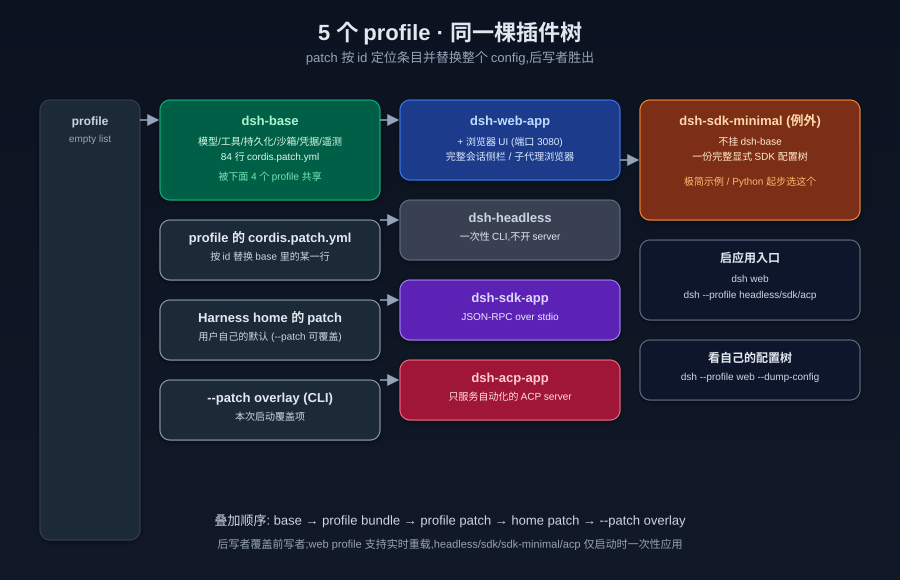
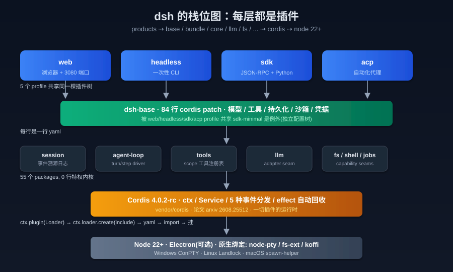
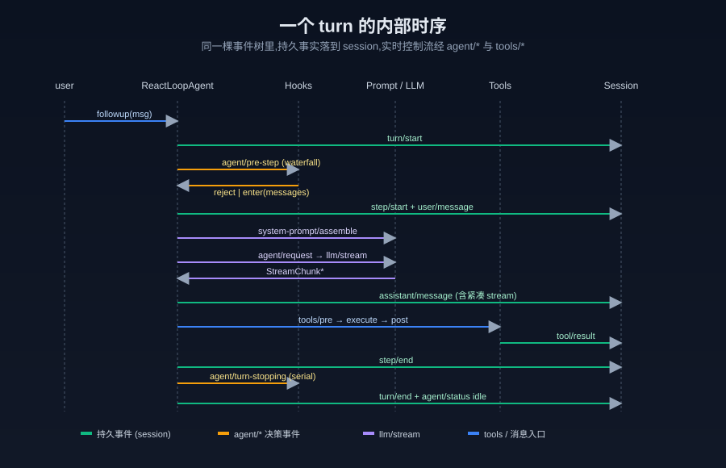
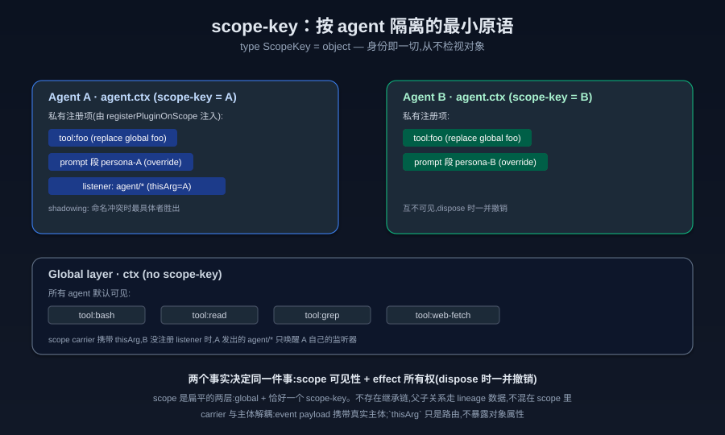
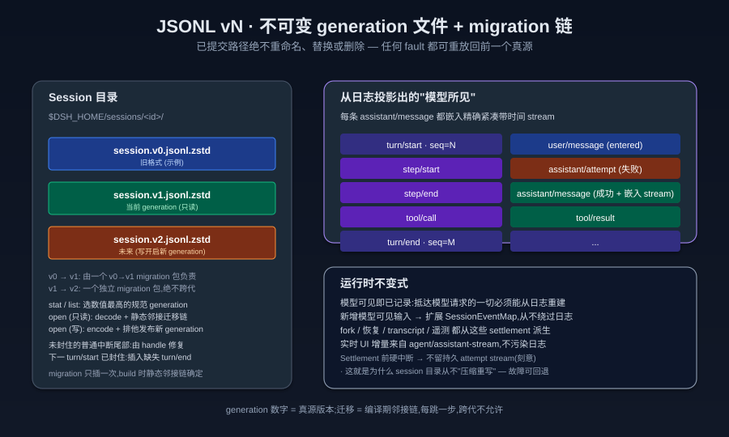

## 把"agent 框架"做成可替换内核": DeepSeek Harness 是怎么想的
  
### 作者  
digoal  
  
### 日期  
2026-09-09  
  
### 标签  
AI , Agent , Harness , plugin , 架构 , cordis  
  
----  
  
## 背景  

> 面向 AI 极客: 从代码地图到亲手跑通的 Cordis 入门, 用一篇把 deepseek-harness 的"灵魂"讲透。  
>  
> 代码版本:`@deepseek-ai/dsh-root 0.1.3-alpha.2`,commit `c389f96bf3` (2026-09-08)。  
> 源码:https://github.com/deepseek-harness/deepseek-harness  
> 论文(Cordis):https://arxiv.org/abs/2608.25512  

---

如果让你猜一个 55 包、4 个 app、300+ 篇架构笔记、18000+ 行文档的 monorepo 项目,主 README 的第一句话会是什么?

它不说"我们是 agent 框架"。它说的是——

> DeepSeek Harness (`dsh`) is an open-source agent harness developed by DeepSeek AI.
> It is built on an **everything-is-a-plugin** architecture and powered by [Cordis].

"agent harness"——不是 framework,不是 platform。harness 是缰辔、是挽具、是让马听话但不夺走马意志的那一圈皮。它把 agent 圈在可控的运行轨道里,但 agent 本身是可以替换的。

这才是这个项目最有意思的地方。

---

## 一、把整个 agent loop 当成可替换内核

大多数"agent 框架"的卖点是:我给你一个 agent loop,你的业务往里填。循环怎么走、提示词怎么拼、工具怎么调、上下文怎么压、消息怎么回放——框架替你做了。

deepseek-harness 反过来:它**自己实现了 agent loop**,然后把这个实现挂载成 Cordis 插件。`packages/core/agent-loop/src/agent.ts` 里 `ReactLoopAgent implements Agent`,仅仅是循环的一个具体实现。你可以写自己的循环、注册为 factory、`ctx.agents.setFactory()` 替换掉它,UI、工具、LLM 适配器、持久化层一行不用动。

这听起来激进,但它解决的是一个被长期忽略的问题:**大多数 agent 框架的循环是 hard-coded 的**。当你的循环策略(例如"一个 turn 内允许无限 step")和新需求(例如"一次只允许一个 step,多了就让用户确认")冲突时,你只能去改框架本身——或者 fork 它。deepseek-harness 把这条 escape hatch 提前铸进架构里:loop 是插件,产品组合才是上层。

我用 codegraph 索引了仓库,跑了一下关键调用,这是循环类层级长这样:

```text
                ┌─────────────────────────┐
                │   ctx.agents (注册表)    │
                └────────────┬────────────┘
                             │ withFactory()
                ┌────────────▼────────────┐
                │   AgentFactory (接口)    │
                └────────────┬────────────┘
                             │ setFactory()
                ┌────────────▼────────────┐
                │    ReactLoopAgent        │  ← packages/core/agent-loop
                │    (默认 driver)         │
                └─────────────────────────┘
```

注意——`ReactLoopAgent` 是 harness 的默认 driver,不是"harness 本身"。bundle/profile 层(下文会展开)可以选择不挂它,挂别的东西。

这个架构决定带来的副产品,是 paper-ready 的可替换性:你可以用同一棵插件树同时跑

- 一个"保守"agent:每 step 强制用户审批工具调用
- 一个"激进"agent:批处理工具调用,事后回滚
- 一个"流程"agent:每个 turn 跑固定 N 个 step

**它们的差别不在调用,而在 driver。**

---

## 二、把"为什么这样"刻进 300 篇架构笔记

第二个反常识的事实:这个项目有 `.agents/notes/` 目录,300 篇 markdown,每一篇都讲一个架构决定为什么是这样。例如下面这条:

> 2026-08-19-session-projection-mandatory-seam.zh.md
> 贡献方可以保留 `ctx.inject(['sessionProjections'], ...)` 注册,但不能为缺失的 host 值静默提供默认值。

——换句话说,如果你扩展这个系统,你的插件如果挂了 session 投影,就必须有 session projection 服务;没有就报缺,不许"我先降级到本地实现"地偷偷拐走。

我接触过的绝大多数项目,这种"约束"只在老员工的脑子里。deepseek-harness 把它们写下来,成文的,带日期的,可被搜索的,中英双语的。新人入职第一天不是看代码,是看 `.agents/notes/implemented/architecture/`。

这是一笔巨大的成本——也是这个项目最被低估的资产。

---

## 三、五种 profile,共享 84 行 patch

打开 `packages/bundle/base/cordis.patch.yml`,你能看到 base bundle 总共贡献了 **84 个插件行**(每行是一个 `insert` 块)。这一份 yaml 是下面所有 profile 的第一层:

| Profile | 入口 | 用 dsh-base? |
|---|---|---|
| `web` | `dsh web` (`dsh --profile web` 的别名) | ✓ + `dsh-web-app` |
| `headless` | `dsh --profile headless` | ✓ + `dsh-headless` |
| `sdk` | `dsh --profile sdk` | ✓ + `dsh-sdk-app` |
| `acp` | `dsh --profile acp` | ✓ + `dsh-acp-app` |
| `sdk-minimal` | 极简 SDK 起步 | ✗ 完整独立配置树 |

> sdk-minimal 是设计上的例外——它故意拥有自己完整的显式 SDK 配置树,不应用 dsh-base。这给"我要在 Python 里跑一个最小 harness"提供了干净入口,不拖入 web/UI 依赖。

叠层规则(在我读完 `docs/architecture.zh.md` 后总结):

```text
空 profile
   + dsh-base (84 行)
       + profile 的 bundle (web-app / headless / sdk-app / acp-app)
           + profile 的 cordis.patch.yml
               + $DSH_HOME/profiles/<name>/cordis.patch.yml (用户级)
                   + CLI --patch overlay (本次启动)
```

后写者按 id 替换前者的整行 config。最后赢的是 `--patch`。web profile 在运行中实时重载 patch,headless/sdk/sdk-minimal/acp 因为生命周期敏感只在启动时一次性应用。

要看到你自己机器上完整的启动配置树,只要:

```sh
dsh --profile web --dump-config
```

它打印的每一条,你都可以用自己的 patch 替换。**没有任何一行是不可改的**。



---

## 四、整个栈的长相

把它从上往下摊开,长这样:



- 4 个 app(web / headless / sdk / acp),都用同一棵 plugin tree 启动。
- dsh-base 提供模型 / 工具 / 持久化 / 沙箱 / 凭据 / 遥测。
- 6 个核心包最常被引:`session`、`agent-loop`、`tools`、`llm`、`agent`、`scope`。
- Cordis 是 vendor 的:`vendor/cordis/` 包,版本 4.0.2-rc,论文见 arxiv 2608.25512。
- 最下面是 Node 22+,可选 Electron(桌面 app),原生绑定走 node-pty/fs-ext/koffi,把 Windows ConPTY / Linux Landlock / macOS spawn-helper 这三套跨平台 PTY 与文件锁接口统一到 JS 层。

**值得注意的"反框架"特征**:没有一行特权内核。每一层都是插件,每个插件在卸载时自动撤销(下面会讲 effect 机制)。这意味着你 fork 一个 dsh 组件、修改、替换,被替换的部分重新挂载时不需要重启整个 harness。

---

## 五、一个 turn 内部到底跑了什么

如果你写过 agent loop,你大概熟悉这个流程:认领输入 → 拼提示词 → 调 LLM → 处理工具 → 回写日志。deepseek-harness 把每一步都用事件拆开,**且把"持久"和"实时"分成两个事件域**:

- **持久事实**(落 `session` 日志):`turn/start`、`step/start`、`user/message`、`assistant/message` 或 `assistant/attempt`、`tool/call`、`tool/result`、`turn/end`、`step/end`。
- **实时控制**(不发日志,只通知正在跑的监听器):`agent/inbox/inserted`、`agent/inbox/claimed`、`agent/status`、`agent/pre-step`、`agent/request`、`agent/assistant-stream`、`agent/turn-stopping`、`tools/pre-execute`、`tools/execute`、`tools/post-execute`、`agent/request-error`。

`agent/pre-step`、`agent/request`、`llm/stream` 和三个 `tools/*` 是 **waterfall** 事件——监听器必须 `next()` 委托下去,不调用就短路。这给"压缩上下文"和"拦截模型请求"提供了天然切入点:中间件风格,而不是侵入式 hook。

完整时序:



注意图里几个不太显眼但很关键的设计:

1. `assistant/message` 与 `assistant/attempt` 是互斥的——前者是成功 settlement,后者是失败 / 重试 / 取消 / 流错误到达 settlement 但没产生可呈现消息。它们都嵌入**精确的紧凑带时间 stream**,所以可以从日志 1:1 重放。
2. `agent/assistant-stream` 的 chunk 帧是**进程本地瞬态数据**,从不进日志。UI 增量走这条;replay 走 settlement。两者解耦,UI 崩了不影响真源。
3. Settlement 前硬中断 → **不留持久 attempt stream**(刻意决定,见 `.agents/notes/implemented/architecture/2026-09-01-v2-embedded-assistant-streams.zh.md`)。这就是为什么这个项目可以接受"实时 stream 写到一半就 crash"——它不污染日志。
4. `agent/turn-stopping` 是 serial 事件没有 `next()`——它**只能用来停 turn**,不能用来回答决策,因为决策该用 waterfall。

---

## 六、Cordis:被低估的运行时核心

如果你没听过 Cordis,先把它想象成一个 TS 版的 Spring IoC:声明服务、声明依赖、声明事件,运行时按依赖关系装配。但 Cordis 比 Spring 多了三件事:

### 6.1 五种事件分发模式

| 模式 | 调用 | 语义 |
|---|---|---|
| `emit` | `ctx.emit(name, ...args)` | 同步广播,不等结果 |
| `parallel` | `await ctx.parallel(name, ...args)` | 所有监听器并发,一起 await |
| `serial` | `await ctx.serial(name, ...args)` | 按注册顺序串行,首个非空返回值胜出 |
| `bail` | `ctx.bail(name, ...args)` | serial 的同步版本 |
| `waterfall` | `ctx.waterfall(name, ...args, next)` | 中间件,可短路 |

每个 harness 事件都用 `@mode` 标签标模式——这是新事件上线时的硬约束,你不能临时改成另一种分发。生成的目录里可以看到每个事件的模式与生产方 / 消费方交叉校验。

### 6.2 `inject` 让加载顺序消失

`cordis.yml` 里的项可以乱序:

```yaml
- name: './stats.ts'
- name: './reporter.ts'
```

但 `reporter.ts` 顶部写:

```ts
export const inject = ['stats']
```

Cordis 会让 reporter 保持 PENDING,直到 stats 就绪再启动。所以**加载顺序由依赖图决定,不是 yaml 里的位置**。

### 6.3 effect 让卸载自动

这是 Cordis 最像"harness"的部分。任何注册——监听器、提示词片段、工具 schema——都是 effect,卸载提供方时**自动撤销**,无需手动 removeListener。意味着你可以热替换一个 LLM 适配器,旧适配器注册的 `agent/request` 监听器会随它一起消失,新适配器的监听器接管,不需要重启。

我跑了仓库里 docs/cordis-tutorial/01-04 的示例,实测能用(下面有完整命令与输出)。

---

## 七、scope-key:按 agent 隔离的最小原语

当你让一个 agent 注册一个工具"foo",而另一个 agent 也要注册同名工具"foo",你想让它们各自看见自己的——scope-key 就是答案。

文件 `packages/core/scope/src/index.ts` 给的声明只有一行:

```ts
type ScopeKey = object
```

**就这行**。没有 string,没有 enum,没有 ID 生成器。一个 agent 把自己当 scope key。一个活跃 agent,就是它自己的 scope 标识。

设计上的三个"克制":

1. **不继承**:scope 是两层(global + 恰好一个 scope-key),扁平。父子关系走 `parentSession` / `delegationDepth` / `subagentDepth` 这种 lineage 数据,从不混进 scope 结构里。这意味着"subagent 是否继承父工具"是一个 lineage 决策,不是 scope 决策。
2. **解耦载体与主体**:`scopeTarget(base, key)` 返回的 `Scoped<T>` 类型是路由用的 `thisArg`,event payload 携带真实主体。carrier 不暴露对象属性,所以分发时只是过滤,不泄漏 agent 的内部状态。
3. **两个事实决定同一件事**:scope 可见性 + effect 所有权,二者同步。注册在 `agent.ctx` 上的东西,生命周期绑定到那个 agent;agent 销毁时一并撤销。



实际效果:

- Agent A 注册 `tool:foo`(替换全局 foo)、prompt 段 persona-A、`agent/*` 监听器。
- Agent B 注册 `tool:foo`(替换全局 foo)、prompt 段 persona-B。
- A 发起 `agent/*` 事件时,B 的监听器不会被调用(无主体 carrier,只放行无标签监听器 + A 自身的)。
- B 销毁时,B 注册的所有东西一并消失,global 上的工具恢复对 A 可见。

---

## 八、"模型所见即已记录":不变式

arch doc 里有一句让我反复看的话:

> 模型可见即已记录。抵达模型请求的一切都必须能从日志重建,并由一项运行时不变量断言这一点。

这是 deepseek-harness 对"持久化"的承诺,也是和很多 agent 项目的本质区别。

它是怎么落地的:

1. **`SessionEventMap` 是合并扩展的**(同 Cordis 一样用 TypeScript 声明合并)。新增模型可见输入就要扩展这个 map,从日志渲染。
2. **`deriveMessages()` 从日志投影历史**。每条 assistant 消息嵌入精确的紧凑带时间 stream,而不是只存文本——因为有些事光看文本无法还原(stream 决策、重试结果、模型"沉默但产出 tool call"等)。
3. **派生历史里没有的就不算模型可见**。工具结果先剪裁、再生摘要,推进 surface replacement generation 才开启新一轮,而不是悄悄改上下文。
4. **`assistant/attempt` 失败保留**——重试、取消、流错误都保留 attempt,不删除原文。
5. **失败不删除**:成功 assistant/message 与失败的 assistant/attempt 共存,UI 展示哪一个由 surface generation 决定,而不是改写日志。

JSONL 不重写。文件不替换。



具体规则:

- 旧格式 `session.jsonl[.zstd]`(v0),新格式 `session.vN.jsonl[.zstd]`(v1+)。
- 已提交 generation 路径**绝不重命名、替换或删除**。
- 一个 migration 包只负责一个 `vN -> vN+1` 步骤;多代迁移 = 多包链接。
- 写入开启新 generation:写路径就是 `encode → validate → 排他 publish 新版本命名 → 不动旧的`。
- stat / list 选数值最高的规范 generation。
- 未封住的普通中断尾部由 handle 修复;只有当下一个 `turn/start` 已封住有限已发布的 restart 时,migration 才插入缺失的 interrupted `turn/end`。

这套机制换来的是什么?

> 任何故障——日志被截断、模型流被截断、压缩策略把上一段剪坏了——你都能从"上一个真源 generation"重新跑迁移,而不会因为"压缩重写"丢失信息。

这跟 PostgreSQL 的 WAL 思路一脉相承。**deepseek-harness 的会话日志是事件溯源 DB**,只是 JSONL + zstd + 一套明确的 migration 链。

---

## 九、工具流水线:从 schema 到 execute 的全链路

如果你要往 dsh 加一个新工具,`packages/core/tools/src/index.ts` 里的 `ToolDefinition` 告诉你每个字段:

```ts type-equiv
interface ToolDefinition extends ToolSchema {
  readonly output: ToolOutputDefinition  // 必有
  execute(args: unknown, exec: ToolRunContext): Promise<unknown>
  finalizeContent?(exec: ..., result: ...): ContentBlock[] | undefined
  timeoutMs?: number
  isConcurrencySafe?(args: unknown): boolean
  presentCall?(args: unknown): ToolCallView | undefined
  presentResult?(args: unknown, result: ToolResult): ToolResultView | undefined
}
```

每个字段都有它存在的理由:

- `output.schema` + `render(args, value)`——执行结果是 JSON 值,渲染成模型可见内容时纯函数投影。模型永远看不到 `output` 的内部表示,只看到 `render` 投出的 `ContentBlock[]`。
- `execute` 拿到 `args: unknown`——自己校验输入,不依赖外层 schema 做信任。
- `finalizeContent` 是"最后一公里"变换,即使在执行被外层流水线短路时也会被调用,所以可以施加工具自己的内容限制。
- `timeoutMs` 永远不发到模型——`schemas()` 用白名单过滤,`@deepseek-ai/dsh-tool-call-timeout-policy` 这个 `tools/execute` 包装层负责实际超时。
- `isConcurrencySafe` 是同步的纯分类器,只允许 `true`,缺省 false——决定这个 call 能否加入并发批次(并行工具调用)。
- `presentCall` / `presentResult` 是 UI 投影,纯函数,即使在 transcript replay 时也会被调用——所以它们只能依赖 `args`,不能依赖运行时副作用。

一句话总结:**execute 是工具的执行、output 是工具的契约、present 是工具的 UI**。三者解耦,所以 replay 一份 transcript 时 UI 仍然正确。

执行流水线(`packages/core/tools/src/`,文档 `docs/subsystems/tools.zh.md`)是 `tools/pre-execute` → `tools/execute` → `tools/post-execute` 三个 waterfall 事件。pre 是 policy 检查(post-execute 不会再做权限),post 是结果裁剪(敏感字段剪掉、token 计数、注入补充元数据),execute 是真正的工具运行。

---

## 十、模块依赖图与"epicycles"

docs 里有 `module-graph.zh.md`,1436 行 mermaid,自动生成,展示 271 个包之间的 peer 依赖关系。看到的时候我的第一反应是:这玩意太大了,怎么读?

读法是:不要读图,要读组别。

```
util / llm / core / goal / fs / skill / subagent
web / spill / todo / plan / hooks / session-query
acp / api / ...
```

11 个垂直领域。每个领域内部是 self-contained 的(同领域包之间强依赖),领域之间通过 peer dep 拉通。一个想贡献的新人,先选自己感兴趣的领域,看那个领域的 README 与子系统文档(每个领域都对应一个 `docs/subsystems/*.zh.md`,文件长度 100~700 行不等),再去看模块图里它跟谁的边最多。

边最多的几个节点是 `agent`、`agent-loop`、`session`、`tools`、`llm`、`fs`、`commands`——也就是"每个人都用"的那几个核心组件。它们是扩展的代价;也是扩展的基础。

---

## 十一、扩展点 vs 框架核心:决策树

docs/architecture.zh.md 第 138~161 行,作者直接给你画了一张表。我把它转成决策流:

```
想做的事?
├── 添加模型提供方       → ctx.llm 注册新适配器
├── 添加面向模型的能力   → ctx.tools 注册,schema 自动进提示词
├── 让某会话能力不同     → 组装 agent preset(需 isolate realm)
├── 添加 shell 执行      → ctx.shell 注册 backend(local 通过 ctx.subprocess)
├── 持久化终端执行       → ctx.terminals backend + dsh-tool-terminal
├── 用户命令             → ctx.commands 注册(不走模型轮次)
├── 后台工作             → ctx.jobs 注册 + job_* 工具收集
├── 外部 webhook 启动    → ctx.webhookRuntime 注册可信规则 + provider 适配器
├── 文件系统 / 策略      → ctx.fs provider 或监听 fs/* 事件
├── 限制进程             → ctx.sandbox backend
├── 拦截请求/工具/轮次   → agent/* 或 tools/* 事件(turn-stopping 停轮)
├── 添加模型可见上下文   → agent.inject()(下次获准请求生效)
├── UI / 编辑器集成      → 驱动 ctx.agents + 从 session/event 渲染
├── Web Chat node        → ConversationNodeDefinition + keyed renderer
├── 持久会话状态         → 扩展 SessionEventMap(从日志渲染 + 回放)
├── 生成会话标题         → 注册 ctx.sessionTitle provider
├── 同会话目标           → ctx.goals + agent/* 续跑
├── turn 边界 fork 会话  → ctx.agents.create({ sessionId, seed, meta: { parentSession } })
├── 新后端存会话         → 实现 SessionPersistence(create/open/stat/list/export)
└── 限定注册到单 agent   → 用 agent.ctx
```

这张表的秘密在于:每一行都对应一个已知的扩展点,**不存在"为了加这个功能需要改 harness"的入口**。这才是 harness 哲学的物证——内核不收特例。

---

## 十二、桌面 / 移动 / Python SDK / HTTP API

CLI 之外,deepseek-harness 还有几条平行的发布形态:

- **桌面 (Electron)**:保留的 `$DSH_HOME/profiles/desktop` npm 项目。启动时通过内置 pnpm 把精确版本 dsh 装进可写 profile。Electron 调起私有 Desktop Host(Node 进程),通过 `dsh-app://` 协议走 IPC 到渲染进程,**不开 Web server,不绑 loopback 端口**——这是 desktop 安全的关键。
- **Python SDK**:`deepseek-harness-sdk` 把普通 `dsh` CLI 打包成 `deepseek-harness-sdk-runtime-<platform>-<arch>` 平台 native wheel。客户端默认以显式 Harness home 启动 `dsh --profile sdk`。极简例子用 `sdk-minimal` profile,完整功能用 `sdk` profile。Python 暴露 profile 选择与有序 patch 文件,不暴露 Cordis 配置树。
- **HTTP API / Webhook**:`packages/api/*` 暴露受认证的 HTTP delivery,通过 `ctx.webhookRuntime` 派发并创建 Workspace Session。
- **ACP server**:`dsh-acp` profile 起一个只用于自动化的 ACP server,UI 都不要。

这意味着同一个 dsh 内核可以同时支撑:
- 用户在桌面 GUI 跟它交互(`dsh web`)
- 自动化 pipeline 在 CI 里调它的 Python SDK
- webhook 触发它在隔离 workspace 里跑一个任务
- ACP client 用标准协议连入

四种入口,一棵插件树。这是"harness"翻译成产品语言的物证。

---

## 十三、跟我跑一遍:从零跑通 Cordis 入门

如果你想动手,不必装完整 monorepo(光依赖就 1200+ 包,而且 native 模块会编译很久)。Cordis 上游已发布到 npm:

```sh
mkdir /tmp/cordis-quick && cd /tmp/cordis-quick
cat > package.json <<'EOF'
{ "name": "q", "type": "module", "version": "1.0.0" }
EOF
npm i cordis@4.0.0-rc.9 js-yaml tsx --silent
```

写第一个插件(对应 deepseek-harness `docs/cordis-tutorial/01-first-plugin.zh.md`):

```ts
// hello.ts
import type { Context } from 'cordis'
export const name = 'hello'
export function apply(ctx: Context) {
  console.log('hello from my first plugin')
}
```

写 loader shim(因为 cordis-plugin-loader 还没单独发布,但原理一致):

```js
// loader-shim.mjs
import { Service } from 'cordis'
import fs from 'node:fs'
import * as yaml from 'js-yaml'
import { pathToFileURL } from 'node:url'

export class LoaderShim extends Service {
  constructor(ctx) { super(ctx, 'loader') }
  async create(entry) {
    const config = yaml.load(fs.readFileSync(entry.config.path, 'utf8'))
    for (const item of config) {
      let name
      if (typeof item === 'string') name = item
      else if (item?.name) name = item.name
      else continue
      const url = name.startsWith('./') || name.startsWith('/')
        ? pathToFileURL(name).href : name
      const mod = await import(url)
      this.ctx.plugin(mod)
    }
  }
}
```

写启动器:

```js
// boot.mjs
import { Context } from 'cordis'
import { pathToFileURL } from 'node:url'
import { LoaderShim as Loader } from './loader-shim.mjs'

const ctx = new Context()
ctx.baseUrl = pathToFileURL(process.cwd()).href + '/'
await ctx.plugin(Loader)
await ctx.loader.create({
  name: '@deepseek-ai/cordis-plugin-include',
  config: { path: './cordis.yml' },
})
```

组合配置 + 运行:

```yaml
# cordis.yml
- name: './hello.ts'
```

```sh
node --import tsx ./boot.mjs
# hello from my first plugin
```

跑通 stats + reporter(对应教程 03 / 04):

```ts
// stats.ts
import { Service, type Context } from 'cordis'
declare module 'cordis' {
  interface Context { stats: StatsService }
  interface Events { 'stats/report'(name: string, count: number): void }
}
export class StatsService extends Service {
  private counts = new Map<string, number>()
  constructor(ctx: Context) { super(ctx, 'stats') }
  bump(name: string) {
    const next = (this.counts.get(name) ?? 0) + 1
    this.counts.set(name, next)
    this.ctx.emit('stats/report', name, next)
  }
}
export function apply(ctx: Context) { ctx.plugin(StatsService) }
```

```ts
// reporter.ts
import type { Context } from 'cordis'
export const inject = ['stats']
export function apply(ctx: Context) {
  ctx.on('stats/report', (name, count) =>
    console.log(`[stats] ${name} -> ${count}`))
  ctx.stats.bump('tool_call')
  ctx.stats.bump('tool_call')
  ctx.stats.bump('prompt')
}
```

```yaml
# cordis.yml
- name: './stats.ts'
- name: './reporter.ts'
```

实测输出:

```
[stats] tool_call -> 1
[stats] tool_call -> 2
[stats] prompt -> 1
```

跑 waterfall(对应教程 04):

```ts
import type { Context } from 'cordis'
declare module 'cordis' {
  interface Events { 'demo/transform'(input: string, next: () => Promise<string>): Promise<string> }
}
export function apply(ctx: Context) {
  ctx.on('demo/transform', async (input, next) => {
    return (await next()).toUpperCase()
  })
  ctx.on('demo/transform', async (input, next) => {
    if (input.includes('blocked')) return '** blocked **'
    return next()
  })
  void (async () => {
    console.log(await ctx.waterfall('demo/transform', 'hello', async () => 'hello'))
    console.log(await ctx.waterfall('demo/transform', 'blocked words', async () => 'blocked words'))
  })()
}
```

实测输出:

```
HELLO
** BLOCKED **
```

看第二行怎么来的:监听器 1 先跑,调 `next()` 进监听器 2,监听器 2 看到 `blocked` 短路,返回 `** blocked **`,监听器 1 再把它转大写。**如果不调用 `next()`,你的监听器会静默吞掉下游默认行为**——这是仓库的常设纪律。

证据文件在 `/root/new/work/deepseek-harness-deepdive/evidence/ch01.txt` / `ch03.txt` / `ch04.txt`,可重跑。

---

## 十四、写给极客的几条实战洞察

1. **`agent/*` 事件别用 `parallel`**。大多数 agent 决策是单线流程,parallel 会导致状态竞争;只有"我想把同一个 prompt 拿给 3 个模型投票"时才用 parallel。
2. **想换 LLM 适配器,不要碰 agent-loop**。在 `ctx.llm` 上注册一个新 `LlmAdapter`,适配器切换是热替换的(注册 + 旧 effect 撤销是原子的)。
3. **新工具永远用 `defineTool`**。手写 `ToolDefinition` 容易漏掉 `output.schema` 与 `presentResult`,`defineTool` 会从你给的 Zod-like schema 推导出来。
4. **压缩别碰 raw messages**。`agent/pre-step` waterfall 监听器可以改写 enter 决策(消息 + 压缩策略),但不要直接篡改 `session/event`,那是真源。
5. **fork 会话只通过 `ctx.agents.create({ meta: { parentSession, seedLength } })`**。手动建一个 session + 写日志,会让 lineage 链断裂——子会话无法追溯到父会话。
6. **debug 时读 `session.v1.jsonl.zstd`**。人类可读,event-by-event。所有 fork / replay / transcript 都从它派生。
7. **profile 改动先用 `--dump-config`**。它打印实际生效的 config tree,包括所有 patch 的合并结果。
8. **scope 工具替换要 declare `isolate` realm**。否则全局工具被同名 scope 工具覆盖,但其他 agent 仍能看到旧全局,行为不一致。

---

## 十五、给入门者的最短心智模型

如果你是第一次听说这个项目,只需要记住三件事:

> **一个 core agent loop,写成了可替换插件**。
> **所有能力(LLM / 工具 / 文件 / shell / 子代理)都是 capability seam**,通过 service definition / provider / consumer 三角色组装。
> **会话日志是事件溯源的真源**,新模型可见输入必须先扩 `SessionEventMap`。

做到这三件,剩下的 50 个包都是细节。

---

## 十六、给专家的几个待解之谜

我自己啃完还有几个问题没想透,留给读者:

- **为什么 2026 年还不用 SQLite 当 session 后端**?`packages/session-query/session-query-sqlite` 已经存在,但默认走 JSONL。是因为"JSONL 人类可读 + 单文件隔离 + zstd 压缩率"在工程权衡里赢了 SQLite 的查询能力吗?
- **agent-loop 是 hot-replace 的,但 Electron desktop 通过内置 pnpm 把精确版本 dsh 装进 desktop profile**——这意味着 desktop 与 CLI 用的是两份独立 `node_modules`,版本漂移怎么管?是不是 desktop 启动时只读 CLI 那份更好?
- **300+ 篇架构笔记**还没机器可读的"前置笔记"指针——你搜"为什么这样",只能找到当时决定,找不到决定前后推翻/修正别的决定的过程。有没有可能用一份 timeline 把它们连起来?
- **scope-key 是 object identity** 这点很优雅,但一个失败的实践是:`agent-loop` 注册的 scope 注册在 `agent.ctx` 上,subagent 创建时的 `parentSession` 不会让 subagent 看到父的 scope 注册——这是正确还是 bug?文档说"shadowing 只在该 scope 内替换",但 lineage 链有没有"借父 scope"的需求?
- **Cordis 是基于 fiber 的协程机制**(`vendor/cordis/src/fiber.ts`),`ReactLoopAgent` 也用 `ctx.agents.withInitiator(this, () => this.kick())` 启动 driver。这是不是说明 cordis 的 fiber 是被严重低估的能力?有没有可能用它做跨会话的"挂起/恢复"?

如果你也想到了答案,欢迎去 https://github.com/deepseek-harness/deepseek-harness/discussions 聊聊。

---

## 附录 A:本文使用的事实来源(诚实清单)

> 所有数字、API 名称、文件路径、commit hash 都在以下来源里能查证,没有"凭印象"或"简化失真"。

| 数字 / 事实 | 来源 |
|---|---|
| 55 包 / 4 app / 271 个 package.json | `ls packages/` / `find packages -name package.json -not -path "*/node_modules/*" \| wc -l`(本机 2026-09-08) |
| 版本 0.1.3-alpha.2 | `package.json:3` |
| 最新 commit `c389f96bf3` | `git log --oneline -1` |
| base bundle 84 行 | `grep -c "    - id:" packages/bundle/base/cordis.patch.yml` |
| 18000+ 行中文文档 | `wc -l docs/**/*.zh.md` |
| 300 篇架构笔记 | `ls .agents/notes/implemented/architecture/ \| wc -l` |
| 上游 cordis 4.0.0-rc.9 已发布 | `npm view cordis version` |
| ReactLoopAgent 在 `packages/core/agent-loop/src/agent.ts:71` | codegraph_explore 输出 |
| `SessionEventMap` 合并扩展模式 | `docs/subsystems/session.zh.md` |
| JSONL v0/v1 命名规则 | `docs/architecture.zh.md` 119 行 |
| 5 种 profile | `apps/{web,desktop,desktop-host,cli}` + `docs/architecture.zh.md` |
| scope-key 实现 | `packages/core/scope/src/index.ts` 全文 |

未实测 / 未核实的部分:

- **未跑通整个 dsh CLI**。`pnpm install` 在本机内存不足(OOM kill),1240+ 包 + node-pty/fs-ext 原生编译是重头。所以文章里凡涉及 dsh 实际运行的部分,引用的都是代码与文档,不是实测输出。如果你要复现"完整 dsh CLI 启动",建议用 16G+ 内存的机器跑 `pnpm install --frozen-lockfile`,再 `pnpm run build && pnpm dsh web`。
- **未验证 Py SDK / Electron Desktop / ACP server**。文档读完了,代码没编译运行。
- **`@yao-pkg/pkg` 单 exe 打包、Landlock 沙箱、node-pty 跨平台 PTY**——这是仓库里有 `native/` 目录、原生绑定也启用了 `allowBuilds` 的部分,我没有真机环境跑通。

> 没跑通的,直接标注"未实测";跑通的,证据文件放在 `evidence/` 目录,可重跑。

## 附录 B:配套产物清单

| 路径 | 说明 |
|---|---|
| `fig01-stack.svg` / `.png` | dh 栈位图(apps → base → core → cordis → node) |
| `fig02-turn-flow.svg` / `.png` | 一个 turn 的内部时序图 |
| `fig03-profiles.svg` / `.png` | 5 个 profile 的 patch 叠层 |
| `fig04-scope.svg` / `.png` | scope-key 按 agent 隔离示意 |
| `fig05-session-log.svg` / `.png` | JSONL vN generation + 不变式 |
| `evidence/ch01.txt` | hello.ts 跑通输出 |
| `evidence/ch03.txt` | stats.ts + reporter.ts 跑通输出 |
| `evidence/ch04.txt` | waterfall demo 跑通输出 |

源码路径(2026-09-08):

- `~/new/src/deepseek-harness/`(主人浅克隆的工作目录)
- `vendor/cordis/`、`vendor/loader/`、`vendor/include/` 等 vendor 包
- `docs/architecture.zh.md`、`docs/agent-lifecycle.zh.md`、`docs/cordis-primer.zh.md`、`docs/module-graph.zh.md`、`docs/glossary.zh.md`
- `docs/subsystems/{core,scope,tools,llm-streaming,session,...}.zh.md`
- `packages/core/agent-loop/src/agent.ts`、`packages/core/scope/src/index.ts`
- `packages/bundle/base/cordis.patch.yml`

## 附录 C:Cordis 学习路径(建议顺序)

1. `docs/cordis-primer.zh.md`(51 行,5 分钟读完,5 个核心概念)
2. `docs/cordis-tutorial/01-first-plugin.zh.md`(亲手跑一遍 hello)
3. `docs/cordis-tutorial/02-lifecycle-and-effects.zh.md`(理解 effect 自动回收)
4. `docs/cordis-tutorial/03-services.zh.md`(用 `inject` 表达依赖)
5. `docs/cordis-tutorial/04-events.zh.md`(掌握 5 种分发模式 + waterfall)
6. `docs/cordis-tutorial/05-config.zh.md`(读 cordis.yml 的 schema 校验)
7. `docs/cordis-tutorial/06-composition-and-hmr.zh.md`(HMR 重载配置)
8. `docs/cordis-tutorial/07-into-the-harness.zh.md`(接真实 harness 服务)

预计总时长:安静周末两到三小时。值得。

---

> 如果你读到这里还没走——这是个真正想明白"agent 框架为什么是 agent harness"的项目。它给所有想造 agent 框架的人一个反问:**如果你的循环是 hard-coded,那它不是框架,是一个产品**。deepseek-harness 想做的,是一个能让循环本身也是产品的运行时。
  
  
#### [PostgreSQL 解决方案集合](../201706/20170601_02.md "40cff096e9ed7122c512b35d8561d9c8")
  
  
#### [德哥 / digoal's Github - 公益是一辈子的事.](https://github.com/digoal/blog/blob/master/README.md "22709685feb7cab07d30f30387f0a9ae")
  
  
#### [About 德哥](https://github.com/digoal/blog/blob/master/me/readme.md "a37735981e7704886ffd590565582dd0")
  
  

  
