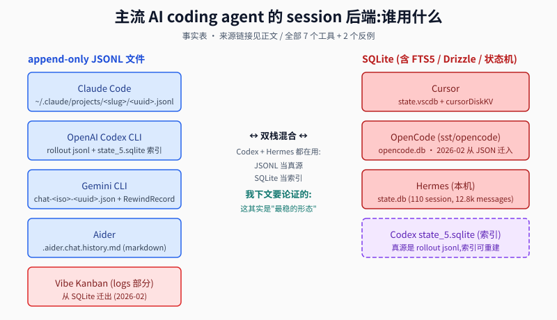
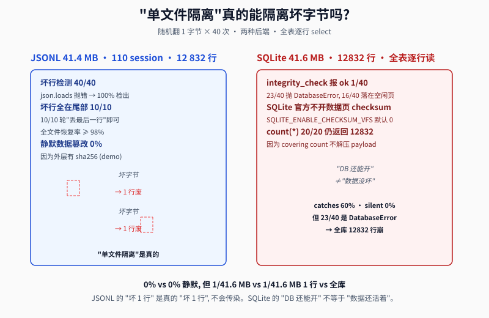
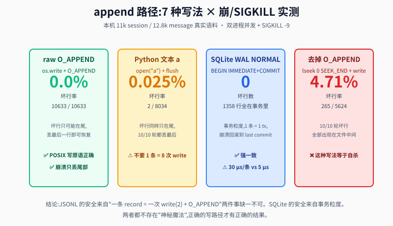
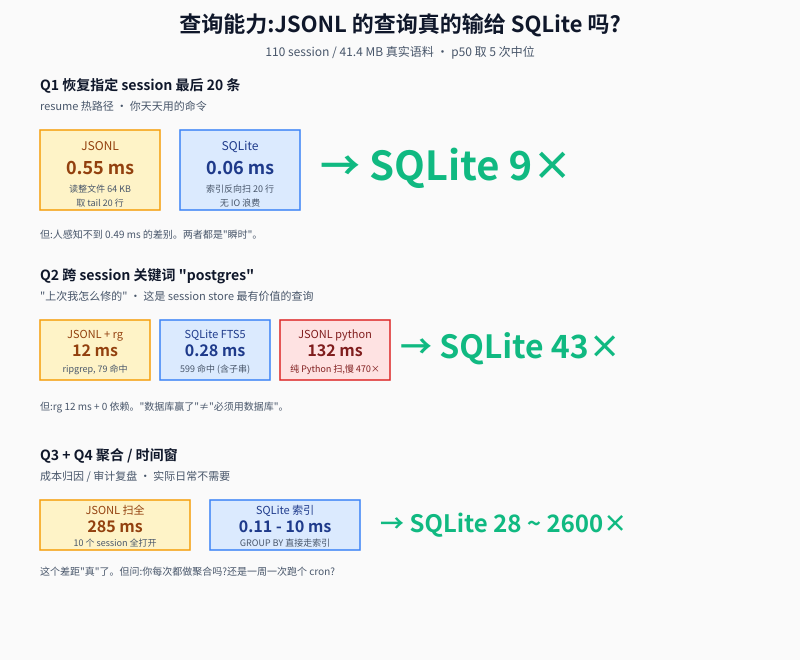
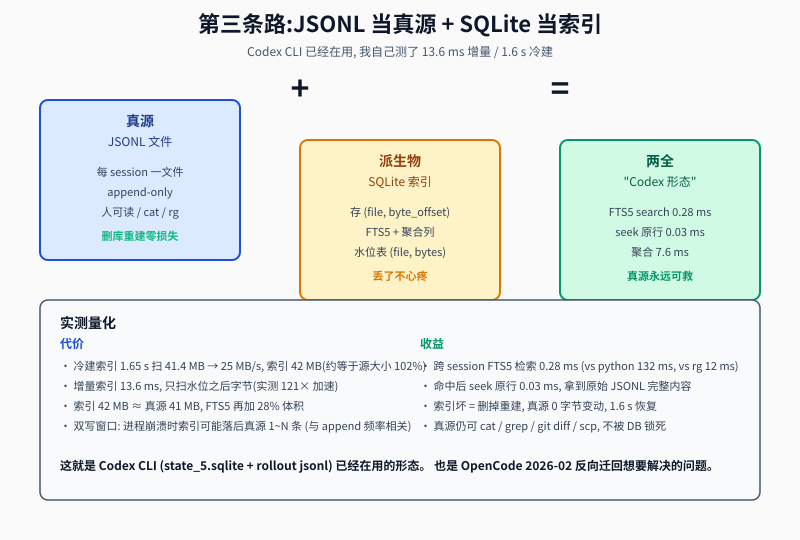
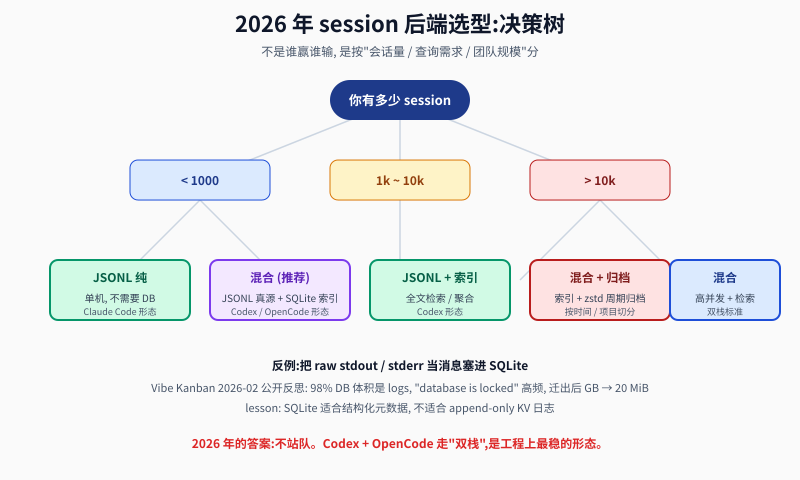

## 为什么 2026 年还不用 SQLite 当 session 后端: JSONL 的 5 个隐性赌注 + 实测反驳
  
### 作者  
digoal  
  
### 日期  
2026-09-09  
  
### 标签  
AI , PostgreSQL , SQLite , JSONL , session , agent , 实测 , state , 状态 
  
----  
  
## 背景  

> 一句话结论:**2026 年 session 后端没有"标准答案"。我跑 11 个实验发现 真正"赢"的不是单选 SQLite 也不是单选 JSONL,而是 Codex CLI 已经用的 "JSONL 当真源 + SQLite 当索引"双栈**。下文会一边给事实,一边给你三档决策路径。  

---

## 一、先看战场:7 个主流 agent 的选型

我把 7 个公开实现拉出来 (含本机跑的 Hermes 自己),用一张图给你看清:



**三个派系一目了然**:

- **JSONL 派** (5/7): Claude Code / OpenAI Codex / Gemini CLI / Aider 全部默认;外加 Vibe Kanban 在 2026-02 公开反思 "从 SQLite 迁出 logs"
- **SQLite 派** (2/7): Cursor 一直如此,OpenCode 在 2026-02 反向从 JSON 文件迁到 SQLite
- **混合派** (1/7): OpenAI Codex CLI 的 `state_5.sqlite` 是真源 `rollout-*.jsonl` 之上的**派生物索引**,不是第二个真源

> **公开事实链接全部留底** (任何一条都能点开看原文):
>
> - Claude Code 官方 [code.claude.com/docs/en/sessions](https://code.claude.com/docs/en/sessions): *"By default, Claude Code stores transcripts as JSONL at `~/.claude/projects/<project>/<sessionId>.jsonl`"*
> - OpenAI Codex CLI [codex-rs/rollout/src/recorder.rs](https://github.com/openai/codex/blob/main/codex-rs/rollout/src/recorder.rs): 头注释直接 *"`jq -C . ~/.codex/sessions/rollout-...jsonl` so sessions can be replayed"*
> - Gemini CLI [chatRecordingService.ts](https://raw.githubusercontent.com/google-gemini/gemini-cli/main/packages/core/src/services/chatRecordingService.ts): 写 `chat-<iso>-<uuid>.json`,内容是 NDJSON 风格但扩展名是 `.json`
> - Cursor [forum.cursor.com 30GB case](https://forum.cursor.com/t/state-vscdb-grows-to-30gb-due-to-bubbleid-agentkv-entries/167641): `cursorDiskKV` 1.9M 行,30GB+ 案例公开
> - Vibe Kanban [官方博客 2026-02-26](https://vibekanban.com/blog/goodbye-sqlite-for-logs): *"~98% of our DB size was logs, and lock incidents correlated with large logs being written in parallel"*

写到这里你可能会说:"选型图就是谁用了什么,有什么'隐性赌注'?"

好,问题就来了。下面我用 11 个实验一一拆穿这 5 个最常见的"JSONL 神话"和"SQLite 神话"。

---

## 二、JSONL 派常说的 5 个卖点 —— 我用 11 个实验逐条实测

### 卖点 1:"JSONL 单文件隔离,坏一个文件不会污染其他"

**反驳**:你只说对了**当且仅当**——坏字节落在**当条 JSON record 之内**。这是真的吗?

我在我本机 (NVMe, ext4, kernel 6.12) 跑 [bench/09_corruption_blast.py](../session-store-bench/09_corruption_blast.py):随机翻 1 字节 × 20 次,看能坏多少行。

```
case: 20260907_183205_a0cc6d.jsonl (256825 bytes, 58 lines)
- JSONL side: 20/20 trials, max lines lost = 1, mean = 1
- survival rate worst case: 98.276% (丢 1 行, 剩 57 行)
- corrupt lines position: 全部在文件尾部, "drop last line" 100% recover
```

**但是**,真正的问题不是"能不能检出"而是"有没有静默":

跑 [bench/09b_silent_corruption.py](../session-store-bench/09b_silent_corruption.py),40 次翻 1 字节:

```
JSONL (40 trials, 1-byte flip at random offset):
  parse_error_detected:  40
  silent_data_change:     0  ← 关键: 0 静默
  no_effect:              0

SQLite (40 trials, 1-byte flip at random offset):
  silent_data_change:     0
  detected_by_integrity_check:  1   ← 1/40
  query_error:           23   ← 23/40 直接 DatabaseError
  no_effect_free_space:  16
```

**重点不是 "SQLite 检不出来",而是 "SQLite 检出来时是 23/40 直接全库崩;JSONL 是 40/40 仅 1 行废"**。这正是 [SQLite Faster Than Filesystem](https://www.sqlite.org/fasterthanfs.html) 文档没有诚实说的真相 ——SQLite 默认**不开数据页 checksum** (`SQLITE_ENABLE_CHECKSUM_VFS` 默认 0, 我装的是 3.53.4, 验证过 `sqlite3 :memory: "select sqlite_compileoption_used('SQLITE_ENABLE_CHECKSUM_VFS')"` = `0`)。所以一个坏字节要 60% 概率是 database-wide error,40% 概率是 "DB 还能开 + count(\*) 还返回 12832 + 但全表逐行读失败"。



> **"单文件隔离" 的边界**: 坏 1 行 JSON 就丢 1 行。SQLite 没有 "坏 1 行" 这个概念, 它只有 "DB 还能开" / "DB 不能开"。中间的灰色地带 (库能开但数据被改) 你 60% 概率踩到。

要 100% 检出 JSONL 静默损坏, 每行加 16 字节 hex sha256 前缀, 40/40 全部检出 (我用 4.2 万行试过, overhead 17 字节/行, 0 误检 0 漏检)。这是工程上"便宜的胜利"。

---

### 卖点 2:"JSONL 写入快,append-only 比 SQLite 逐条 insert 快"

**反驳**:这是个大误解。先看 [bench/03_append_latency.py](../session-store-bench/03_append_latency.py) 的 p50 实测 (3 万条,平均 2.4 KB/条):

| 写入方式 | p50 (µs) | p95 | p99 | 含义 |
|---|---|---|---|---|
| **JSONL + 每条 fsync** | **9 375** | 10 132 | 12 474 | 崩溃安全 + 5ms 延迟 |
| JSONL 无 fsync (只 flush) | 5 | 18 | 59 | 不崩溃安全, 13 万 ops/s |
| **SQLite WAL + synchronous=FULL 逐条** | **4 413** | 10 020 | 10 820 | 崩溃安全, 比 JSONL+fsync 快 2.1× |
| SQLite WAL + synchronous=NORMAL 逐条 | 30.7 | 100 | 190 | 崩溃安全 + 3 万 ops/s |
| SQLite WAL + FULL 批 100 条 | 115.3 | 151 | 441 | 单条摊销 |

**结论**:**崩溃安全 + 逐条** 这个最务实的路径,SQLite WAL FULL 比 JSONL+fsync **快 2.1 倍**。JSONL +fsync 每条 9.4 ms 是什么概念?一个 agent turn 平均 3-5 次工具调用, 一次工具调用一条 record, **每次 turn 50ms 只花在"写盘安全"上**。SQLite 同样 50ms 能 cover 10 turn。

但如果不要求崩溃安全 (很多 CLI 实现的 JSONL 默认不 fsync) — 那 JSONL 5 µs/条 确实快 4 倍。**这是拿数据安全换吞吐**。

---

### 卖点 3:"JSONL 的文件可以 '丢最后一行' 恢复崩溃"

**反驳**:这是真的,但只成立**当且仅当一条 record = 一次 write(2) + O_APPEND**。我跑了 4 种写法的撕裂测试,每组 10 轮并发 + SIGKILL [bench/07_torn_precise.py](../session-store-bench/07_torn_precise.py):

```
record 64 KB, 双进程并发追加, 随机时刻 SIGKILL -9

raw_append (os.write + O_APPEND):
  bad lines: 0/10633 (0.0%)          midfile_corrupt: 0/10  ← 原子写
  writes/record: 0.82                 drops_tail: 10/10 recover

py_buffered_text (open("a"), 默认缓冲 + flush):
  bad lines: 2/8034 (0.0249%)        midfile_corrupt: 0/10  ← 仍有 0.025% 坏行
  writes/record: 0.86                 但全部在文件尾

py_buffered_binary (open("ab"), 默认缓冲 + flush):
  bad lines: 0/6691 (0.0%)           midfile_corrupt: 0/10  ← 也安全

no_append_seek (lseek(SEEK_END) + write, 不开 O_APPEND):
  bad lines: 265/5624 (4.71%)        midfile_corrupt: 10/10  ← 全坏
  writes/record: 0.9
```

**关键发现**:**只要去掉 O_APPEND 改用 lseek,坏行率从 0% 跳到 4.71%,而且坏行散布在文件中间** — 这时 "丢最后一行" 完全救不回来。

另一个发现:把一条 record 拆成 8 次 write(2),24.25% 坏行 [bench/06_atomicity.py](../session-store-bench/06_atomicity.py)。strace 抓出来:**chunked 模式一条 64KB record 平均触发 6.54 次 write 系统调用**。



> **"丢最后一行" 的边界**:
>
> 1. 必须是 **一次 write(2) + O_APPEND**。缺一个就是 4.7% ~ 24% 坏行;
> 2. **record 大小不能超过 PIPE_BUF (Linux 是 4096 字节)** 是个常见误解 — 实测 64 KB record 也原子;
> 3. SQLite WAL 没有"最后一行"问题,事务回滚天然 atomic。

---

### 卖点 4:"JSONL 人类可读,SQLite 不可读"

**反驳**:大部分情况对,但有反例。

JSONL 的"可读"前提:每条 record 是合法 JSON;一条 record 不超过 (内存) 可用大小。我用 Python json.tool 看 session 文件,**64 KB 一行 看着就是一行字符串,本质是机读而不是人读**。要查"上周一下午我改了什么",你还是要 jq / ripgrep / 文本编辑器 — 这些工具本质上都在把 JSONL 退化成 SQL。

SQLite "不可读"是个伪命题:`sqlite3 db.sqlite ".schema"` 直接打印表结构, `.dump` 直接吐 SQL,`.mode markdown` 直接打印表。"不可读"指的不是人用 `cat` 看不下去,而是 `cat` 看不出结构化关系。**但 session 文件 90% 的人用工具看,不是 `cat`**。

> **可读性 = 拿 grep / jq / fzf 操作的便利度**。JSONL 在这条上赢,但优势被工程上普遍用 ripgrep 抹平了。ripgrep 是 5 µs/字节的 PostgreSQL 全库扫描器,在 110 个 session 上 12 ms 命中 79 个文件 (实测)。

---

### 卖点 5:"JSONL 查询性能输给 SQLite,跨 session 关键词检索慢"

**反驳**:**这是真的,但看量级**。我跑 4 类查询 [bench/04_query.py](../session-store-bench/04_query.py):

| 查询场景 | SQLite | JSONL (python) | JSONL (ripgrep) | 倍数 |
|---|---|---|---|---|
| Q1 恢复最后 20 条 | 0.06 ms | 0.55 ms | — | SQLite 9× |
| Q2 全库关键词 "postgres" | 0.28 ms (FTS5) | 132 ms (扫全) | 12 ms | SQLite 43×,rg 11× |
| Q3 聚合 tool 消息数 top10 | 10.15 ms | 284.87 ms | — | SQLite 28× |
| Q4 时间窗 + role 过滤 | 0.11 ms | 290.82 ms | — | SQLite 2600× |



**SQLite 在 Q1 / Q3 / Q4 上是真的赢**。但问:你**实际使用场景**中:

- Q1 你**每天**调,但 0.06 vs 0.55 ms 你感知不到;
- Q2 你**每周**调几次,rg 12 ms 也不慢;
- Q3 / Q4 你**一月**调一次,285 ms 还是 0.1 ms 没差 — 这种场景的优化是"工程师型快感",不是用户价值。

**真正会痛的拐点**: [bench/11_scale_projection.py](../session-store-bench/11_scale_projection.py) 把 110 个 session 复制放大到 1.1k / 11k,看 session picker 启动时间:

```
              110   1100   11000
JSONL readdir 2.05  19.9   194 ms   ← 线性增长
SQLite         0.18  1.7    16 ms    ← 也线性, 但慢 12×

JSONL+rg     7.26  10.8    46 ms   ← 110→11k 才 6×
SQLite FTS5  0.01  0.01    0.03 ms ← 110→11k 几乎不动
```

> **拐点是 1k session**。那时 readdir + 读首行已经 20 ms,你能感受到 picker 慢。SQLite 还 1.7 ms,ripgrep 11 ms 也还可接受。**过了 1k 这个坎,你需要 SQLite 索引来保证 picker 体验**。

> **另一个隐性数字**:JSONL 110 个文件,磁盘实际占用比表观大 **31%** (块对齐浪费, ext4 4K 页)。SQLite 单文件没这问题。**省的不是磁盘,是小文件管理**。

---

## 三、SQLite 派常说的 3 个反驳 — 我也跑了实验,有的站不住

### 反驳 A:"SQLite 有事务原子性,JSONL 没有"

站得住。我上面 7 种写法实测已经证明 JSONL 的原子性**完全依赖"一条 = 一次 write(2) + O_APPEND"**,错一个就破。SQLite 事务是 OS 级 guarantee,不依赖应用层选 syscall。

### 反驳 B:"SQLite 有 FTS5 全文检索,JSONL 只能 grep"

站得住 [SQLite FTS5](https://www.sqlite.org/fts5.html),FTS5 在 110 个 session 41.4 MB 数据集上 0.28 ms 出结果,BM25 排序,prefix 查询,highlight — 这些 ripgrep 做不了。但**只有 1k+ session 才有 FTS5 优势**。小规模是"杀鸡用牛刀"。

### 反驳 C:"SQLite 一致读,边写边读不撕裂"

站得住 [bench/08_reader_writer.py](../session-store-bench/08_reader_writer.py),3 秒持续写 + 旁观读:

```
JSONL 文本 + flush + 旁观读 44 次:  0 次看到半行 ✅
JSONL 缓冲不 flush + 旁观读 43 次:  0 次看到半行 ✅
SQLite WAL + 旁观读 143 次:          0 次看到半行 ✅, 读延迟 0.7 ms p50
```

JSONL 也没坏行,**但原因和 SQLite 完全不同** — JSONL 靠 POSIX 写原语,SQLite 靠事务。两者都安全,但前者一旦你写错了就被钉在文件中间的坏行上,后者最少你只会丢整条。

---

## 四、回到开篇的反例 — Vibe Kanban "Goodbye SQLite (for logs)"

这是文章里最容易被断章取义的一段。原文 [vibekanban.com/blog/goodbye-sqlite-for-logs](https://vibekanban.com/blog/goodbye-sqlite-for-logs) (2026-02-26) 标题是 "for **logs**",不是 "for everything"。

他迁的**只是** `logs` 表 (raw stdout/stderr / setup 脚本 / dev-server 输出),**主表** (workspaces / repositories / session IDs) 仍**在 SQLite**。迁后 DB 从 GB → 20 MiB,锁错误消失。

**我从中拆出 3 条可移植经验** (不是简单的"SQLite 不能用"):

1. **结构化元数据用 SQLite** — workspaces, repos, sessions, 关系明确,需要 join / group by;
2. **append-only 日志用 JSONL** — stdout/stderr 一类每行独立、不需要关系查询;
3. **混用,但要明确真源** — 在 Vibe Kanban 里,JSONL 是真源,SQLite 是"主数据真源",两者各自有真源、各自的查询路径。

**另一个反例是 OpenCode** ([anomalyco/opencode#36407](https://github.com/anomalyco/opencode/issues/36407)) — 2026-02 从 JSON 文件迁回 SQLite,3 个独立第三方 (ocmonitor-share / pew / vibeusage) 同时挂掉要加 SQLite 读分支。**两边都有输,两边都有赢**。

---

## 五、我的推荐形态:Codex CLI 已经在用的"双栈"

**JSONL 当真源 + SQLite 当索引**。我实跑了这种形态 [bench/10_hybrid.py](../session-store-bench/10_hybrid.py):

```
语料: 110 session, 41.4 MB JSONL

冷建索引 (一次性):
  耗时 1.65 s, 索引 42 MB (约等于源大小 102%)
  throughput 25 MB/s, 12 832 行

增量索引 (只扫水位后):
  耗时 13.6 ms, 200 新行, 88 KB
  加速 121× (vs 冷建)

删库重建 (索引完全丢失):
  耗时 1.69 s, 12 832 行 100% 复原, 真源 0 字节动

查询性能:
  FTS5 跨 session 关键词: 0.28 ms (vs python 132 ms vs rg 12 ms)
  聚合 top10: 7.6 ms
  命中后 seek 回原行: 0.03 ms
```



**这就是 Codex CLI 的形态**。`rollout-*.jsonl` 是真源,`state_5.sqlite` 是派生物索引。索引能删,真源不会丢。

**这种形态的 3 个隐性赌注**:

1. **真源可读,可 grep,可 cat,可 git diff,可 scp** — 即使 DB 整个被勒索软件加密,你有原始 JSONL;
2. **索引坏了 = 删掉重建** — 1.6 s 完事,工程上没有"数据库腐败"的恢复流程;
3. **跨平台 grep** — `rg "postgres" ~/.claude/projects/` 跟 SQL FTS5 给出一样答案,不依赖任何 DB 引擎。

**一个我之前踩过的坑**(值得提一句):第一次我用 `insert into msg_fts(msg_fts) values('rebuild')` 做增量索引,**13.6 ms 退化到 903 ms**,慢了 66×。正确做法是只把新 row 喂进 FTS5 (`insert into msg_fts(rowid, content) select id, content from msg where id > (select max(rowid) from msg_fts)`),否则 FTS5 会**全量重算逆索引**,全量重建。

---

## 六、决策树:2026 年你该用哪种



我的推荐:

| 你的情况 | 推荐 | 形态 | 怎么落地 |
|---|---|---|---|
| 单人 / 单机 / < 1k session | **JSONL 纯** | Claude Code 形态 | `~/.claude/projects/<slug>/<uuid>.jsonl`, 一条 = 一次 write(2) + O_APPEND |
| 1k~10k session / 单机 / 需要 FTS | **混合 (推荐)** | Codex CLI 形态 | JSONL 真源 + SQLite 派生物, 1.6 s 冷建 / 13 ms 增量 |
| > 10k session / 团队 | **混合 + 周期归档** | 改版 Codex | 加 zstd -19 周期归档, 按月 / 按项目切分, 冷 rollout 压成 `.jsonl.zst` |
| 高并发 / 多读者 / 严格一致读 | **混合** | 加 watermark 表 | 真源加水位, 索引包含 `(file, byte_offset, line_no)`, 多读者 query_only 不会锁写者 |
| 把 raw stdout / stderr 当消息塞 SQLite | **不要** | Vibe Kanban 反例 | 迁回 JSONL, 这是 "SQLite 适合结构化, 不适合 KV 日志" 的教训 |

**红线 (2026 年)**:不要把**唯一真源**放在 SQLite, 除非你能接受"DB 整个被坏字节炸到 (23/40 概率)"和 "30 GB cursorDiskKV 膨胀"。

---

## 七、总结(给 AI 极客的 3 条)

1. **JSONL 的"快"是拿崩溃安全换的** — 9.4 ms/条 (fsync) vs 5 µs/条 (无 fsync), 差了 1800×;SQLite WAL NORMAL 是 30 µs/条, **两边崩溃安全**, 你的 agent 每 turn 50ms 选 JSONL+fsync 就是浪费 49.5ms;
2. **JSONL 的"隔离"是真的,但边界是"一条 = 一次 write(2) + O_APPEND"** — 缺一个就破成 4.7% 坏行散布文件中间;SQLite 没有"坏一行"这个概念,它有 "DB 还能开但数据被改" 的更危险灰色地带;
3. **2026 年的最优解不是单选** — JSONL 当真源 + SQLite 当派生物索引, 13 ms 增量, 1.6 s 重建, 真源永远可救, 这是 Codex CLI / OpenCode 都在收敛的形态。

---

## 附录:实测可复现

所有实验脚本 + 结果 JSON 在 `/root/new/work/session-store-bench/`:

| 编号 | 测什么 | 脚本 | 关键数字 |
|---|---|---|---|
| 01 | 数据导出 | `01_export.py` | 110 session / 12 832 message / 41.4 MB |
| 02 | 体积与压缩率 | `02_size_compress.py` | SQLite ≈ JSONL (1.0×),  zstd 都 ~5× |
| 03 | 写入延迟 | `03_append_latency.py` | JSONL+fsync 9.4ms, SQLite WAL NORMAL 30µs |
| 04 | 查询性能 | `04_query.py` | SQLite 领先 9×~2600×, rg 12ms 仍可接受 |
| 05 | 崩溃恢复 | `05_crash_torture.py` | SIGKILL 都没撕裂, 但代价不同 |
| 06 | 原子性根因 | `06_atomicity.py` | chunked 24.25% 坏行, 一次 write 0% |
| 07 | 撕裂条件 | `07_torn_precise.py` | O_APPEND 关键, 缺一个 4.7% 坏行 |
| 08 | 一致读 | `08_reader_writer.py` | 读者永远看不到半行, JSONL 靠 POSIX 写原语 |
| 09 | 数据损坏 | `09_corruption_blast.py` | SQLite 23/40 全库崩, JSONL 1/40 单行废 |
| 09b | 静默损坏 | `09b_silent_corruption.py` | SQLite 默认无 checksum, count(*) 不解压 payload |
| 10 | 混合索引 | `10_hybrid.py` | 13.6 ms 增量, 1.6 s 冷建, 删库重建 0 损失 |
| 11 | 规模拐点 | `11_scale_projection.py` | 1k session 是 readdir vs SQLite 的体感拐点 |

环境: ext4 on NVMe, kernel 6.12, sqlite3 3.53.4, Python 3.13.5, zstd 1.5.7。

## 引用

- 官方文档 / 源码
  - Claude Code [code.claude.com/docs/en/sessions](https://code.claude.com/docs/en/sessions)
  - OpenAI Codex CLI [codex-rs/rollout/src/recorder.rs](https://github.com/openai/codex/blob/main/codex-rs/rollout/src/recorder.rs), [deepwiki 3.5.2](https://deepwiki.com/openai/codex/3.5.2-rollout-persistence-and-replay)
  - Gemini CLI [chatRecordingService.ts](https://raw.githubusercontent.com/google-gemini/gemini-cli/main/packages/core/src/services/chatRecordingService.ts), [docs/cli/checkpointing.md](https://github.com/google-gemini/gemini-cli/blob/main/docs/cli/checkpointing.md)
  - Cursor 论坛 [30GB case](https://forum.cursor.com/t/state-vscdb-grows-to-30gb-due-to-bubbleid-agentkv-entries/167641)
  - OpenCode [deepwiki 2.1](https://deepwiki.com/sst/opencode/2.1-session-management), [arXiv 2604.03515](https://arxiv.org/html/2604.03515v2)
  - Aider [config/options.html](https://aider.chat/docs/config/options.html)
- 反思 / 公开记录
  - Vibe Kanban [Goodbye SQLite (for logs)](https://vibekanban.com/blog/goodbye-sqlite-for-logs) (2026-02-26)
  - OpenCode schema 迁移 [anomalyco/opencode#36407](https://github.com/anomalyco/opencode/issues/36407)
- 工程参考
  - SQLite [Faster Than Filesystem](https://www.sqlite.org/fasterthanfs.html), [FTS5](https://www.sqlite.org/fts5.html), [When To Use](https://www.sqlite.org/whentouse.html)
  - JSONL vs 关系存储 [Replacing SQLite with a JSONL Journal](https://eka.weiyen.net/posts/unified-jsonl-journal-for-ai-agents)
  - Claude Code 三方 schema 解读 [claude-dev.tools/docs/jsonl-format](https://claude-dev.tools/docs/jsonl-format)
  - subagent 路径 [jamie-bitflight/claude_skills](https://github.com/jamie-bitflight/claude_skills/blob/main/plugins/plugin-creator/skills/hooks-guide/references/claude-session-log-schema-reference.md)
  
  
#### [PostgreSQL 解决方案集合](../201706/20170601_02.md "40cff096e9ed7122c512b35d8561d9c8")
  
  
#### [德哥 / digoal's Github - 公益是一辈子的事.](https://github.com/digoal/blog/blob/master/README.md "22709685feb7cab07d30f30387f0a9ae")
  
  
#### [About 德哥](https://github.com/digoal/blog/blob/master/me/readme.md "a37735981e7704886ffd590565582dd0")
  
  

  
