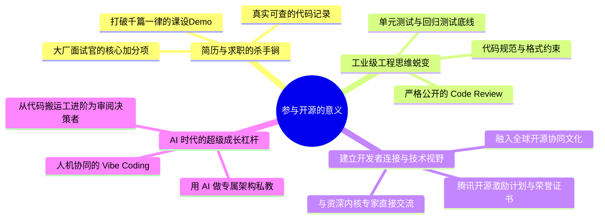
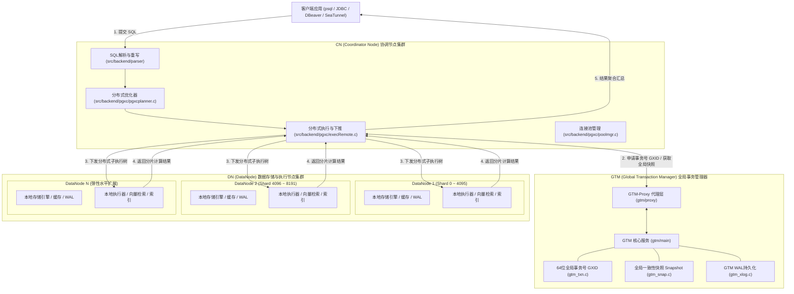

## 利用 AI 完成你的第一次 PR：面向高校学生的 OpenTenBase 开源实战指南
  
### 作者  
digoal  
  
### 日期  
2026-09-09  
  
### 标签  
AI , Agent , openTenbase , PostgreSQL , 贡献代码 , CLA  
  
----  
  
## 背景  

> **导读**：在学校里写代码，我们习惯了“只要单测能跑过、老师给分就行”的玩具项目；而在真实工业界，成千上万台服务器上运行的系统，每天都在经受真实高并发的考验。  
> 参与顶级开源项目，就是你走出象牙塔、拥抱工业级软件工程最平缓也是最硬核的阶梯。  
> 本文紧扣高校开发者关心的实际问题，以腾讯开源的企业级分布式 HTAP 数据库 **OpenTenBase**（[GitHub 仓库](https://github.com/OpenTenBase/OpenTenBase)）为实战样本，配合 AI 编程工具（Vibe Coding），手把手带你完成人生中的第一个 Pull Request（PR）。

---

## 目录（PPT 演讲核心脉络）

- **第一章：参与开源项目的意义** —— 为什么在大学期间就该拥有属于自己的第一个 PR？
- **第二章：OpenTenBase 架构介绍** —— 揭开分布式数据库内核面纱（附架构图与代码剖析）
- **第三章：OpenTenBase 贡献全流程** —— 从环境准备到 AI 辅助编码（Vibe Coding）全闭环
- **第四章：社区 Issue 全景介绍与精选导航** —— 找准你的切入点（分门别类与综合评估表）

---

## 第一章：参与开源项目的意义

很多同学在大一、大二时，觉得“开源贡献”是大神、内核工程师、架构师才能做的事。其实这是一个巨大的误区。 **开源社区并不是只接纳改动几万行代码的“颠覆性巨作”，开源社区更渴望无数细水长流、严谨踏实的点滴改进。**

对于身处大学阶段的你，参与开源至少能带给你四大维度的质变：



### 1.1 简历与求职的“硬通货”
- **不可伪造的技术名片**：毕业找工作时，HR 和技术面试官看过了太多“学生管理系统”、“商城前后端”。如果你在简历上写上一句：*“OpenTenBase（腾讯开源分布式数据库）Contributor，独立排查并修复了 GTM 进程内存分配空指针异常 / 完善了集群管理工具的并发安全机制，PR 已合入主干”*，并附上 GitHub PR 链接，你在面试官眼里的工程能力评级会瞬间跃升。
- **开源影响力与激励**：OpenTenBase 深度参与了**腾讯开源激励计划**与**腾讯犀牛鸟开源人才培养计划**。在社区提交有价值的贡献，不仅能收获社区导师的亲自指导，还有机会拿到官方颁发的贡献者证书、周边纪念品，甚至获得大厂校招免笔试直通面试的绿卡。

### 1.2 工业级软件工程的“淬火炉”
在学校写代码，很多人的习惯是：没有注释、变量名叫 `a1`, `temp2`、只要输出正确就万事大吉。但在开源项目中，你会第一次体验到什么是**真正的工业级规范**：
- **代码规范（Style Guide）** ：缩进、命名、注释必须符合标准；
- **防御式编程**：内存申请是否判空？指针释放是否防悬挂？边界溢出是否拦截？
- **测试为王**：没有回归测试（Regression Test）的代码，在内核项目里是绝对不允许合入的；
- **Code Review 文化**：全世界的维护者会像拿着显微镜一样审视你的代码，指出的问题会让你真正明白“原来代码还可以写得这么优雅健壮”。

### 1.3 结识顶级工程师，拓展技术圈层
在 GitHub 上，没有导师与学生的身份鸿沟，大家都以代码为准绳。你在 Issue 里的提问、在 PR 里的讨论，直面的可能是负责腾讯微信支付底层数据库架构的核心技术专家。这种交流能极大拓宽你的技术视野。

### 1.4 AI 时代：人人都能成为“有杠杆”的开发者
过去，啃一个十几万行 C 语言的数据库项目，光是搭建环境、看懂语法树可能就要耗费几周。  
今天有了 AI（如 GitHub Copilot、Cursor、Claude、Antigravity），AI 可以做你的**代码导师**——帮你解释复杂函数调用链、帮你生成测试用例原型、帮你纠正编译报错。你只需要负责**把握问题方向、核对事实与逻辑、做最终的把关者**。

---

## 第二章：OpenTenBase 架构介绍

想要给一个数据库贡献代码，先要在脑海中建立起它的“骨架地图”。

### 2.1 什么是 OpenTenBase？
**OpenTenBase** 是腾讯开源的企业级分布式 HTAP（混合事务与分析处理）数据库，起源于 Postgres-XL 架构，经过腾讯团队多年在海量业务（如微信支付、政企金融等）中的打磨演进，具备**强一致分布式事务、高可扩展性、两地三中心高可用、兼容 Oracle 常用语法与 AI 向量检索**等核心特性。

我们通过 `codegraph` 对本地源码（`~/new/src/OpenTenBase`）进行统计与代码探索，OpenTenBase 核心 C/C++ 代码量接近 **18 万行**，结构高度模块化。

### 2.2 核心三大组件：CN、GTM、DN 的精密协作

单机 PostgreSQL 是“一个进程处理客户端连接”。而 OpenTenBase 面对海量并发和 PB 级数据时，采用的是**计算、存储与全局事务分离**的分布式架构：



#### 1. CN (Coordinator Node) 协调节点 —— 系统的“前台总调度”
- **源码位置**：`src/backend/pgxc/`、`src/backend/optimizer/`
- **主要职责**：对外提供与单机 PostgreSQL 完全兼容的通信协议接口。用户发来的 SQL 首先进入 CN。CN 负责词法语法解析、查询重写，并利用分布式优化器将查询切分为针对不同分片的执行计划，最终推送到各个 DN 节点并行执行，并在 CN 上完成结果聚合与排序。

#### 2. GTM (Global Transaction Manager) 全局事务管理器 —— 分布式“公证处”
- **源码位置**：`src/gtm/`（代码量超过 7.6 万行，是核心自主研发模块）
- **主要职责**：在分布式环境下，数据分散在不同的机器上，如何保证事务 ACID 特性？GTM 就是负责统一度量衡的枢纽：
  - 发放 64 位全局唯一事务 ID（`GlobalTransactionId` / GXID）；
  - 提供全局一致性快照（Snapshot），实现全集群的多版本并发控制（MVCC）；
  - 管理全局序列（Global Sequence）；
  - 拥有专属的 GTM-Proxy 代理层（缓解客户端并发对 GTM 主节点的长连接压力）和 WAL 日志持久化能力（`gtm_xlog.c`）。

#### 3. DN (DataNode) 数据节点 —— 真正的“数据仓库与执行工兵”
- **源码位置**：基于 PostgreSQL 扩展，负责具体的分片存储与本地算子执行。
- **主要职责**：每个 DN 负责管理一部分分片（Shard）。在表创建时可以指定分布键（Distribution Key），数据自动按 Hash 或 Range 分散到各个 DN。DN 收到 CN 下发的算子后，利用本地的 Buffer Pool、B-Tree 索引、pgvector 向量索引快速执行，并将中间数据通过内部 Interconnect 高速通道反馈给 CN。

### 2.3 架构全景可视化

为了方便大家在 PPT 演讲或报告中引用，我们为该架构专门绘制了高清矢量架构图，可直接在文章中查看或在项目目录的 [`svg/opentenbase-architecture.svg`](file:///root/new/work/svg/opentenbase-architecture.svg) 中获取：


---

## 第三章：OpenTenBase 贡献全流程

很多同学担心：“万一我不懂规则把代码搞乱了怎么办？”  
不用担心！Git 的分支机制和开源社区的工作流本身就是天然的安全网。只要按照标准流程，每一步都是可逆且安全的。

### 3.1 极简标准流水线（14 步 SOP）

```
[准备篇]
 1. 注册并完善 GitHub 账号
 2. 签署贡献者许可协议 (CLA)
 3. 挑选心仪的 Issue
 4. 在 Issue 下礼貌留言讨论思路
 5. 获得认领分配 (Assign)

[实操篇]
 6. Fork 官方仓库到个人账号
 7. 本地 Clone 并设置 upstream 上游
 8. 创建独立的语义化特性分支
 9. 结合 AI 工具开启 Vibe Coding (编码与自纠)
10. 编写单元测试与回归测试用例
11. 本地完整编译与自动化回归测试跑测

[交付篇]
12. 提交规范 Commit 并发起 Pull Request (PR)
13. 根据 Maintainer 的 Code Review 意见迭代修正
14. 测试通过，合入主干 (Merged)！成为官方 Contributor 🎉
```

---

### 3.2 逐步操作详解与避坑指导

#### 第 1 步：注册与配置 GitHub
如果还没有 GitHub 账号，先在 [github.com](https://github.com) 注册。建议个人 Profile 写上你的学校、专业及技术方向，头像尽量整洁大方。  
本地配置好 Git 用户名与邮箱（必须与 GitHub 邮箱一致）：
```bash
git config --global user.name "Your Name"
git config --global user.email "your_email@domain.com"
```

#### 第 2 步：签署 CLA 协议
OpenTenBase 作为企业级开源项目，为了保障知识产权和代码合规，要求贡献者签署 Contributor License Agreement（CLA）。在首次提交 PR 时，GitHub 机器人通常会自动在 PR 下方给出签署链接（或提示），点击授权即可；或者按照仓库 `CONTRIBUTING_ZH.md` 的指引完成登记。这是合法贡献代码的标准门票。

#### 第 3 步 & 第 4 步：认领 Issue 与沟通思路
不要一上来就盲目写代码！先在 [OpenTenBase Issues](https://github.com/OpenTenBase/OpenTenBase/issues) 列表中寻找适合自己的任务。  
找到后，在 Issue 下方友好回复：
> *"Hi maintainers, I am a university student interested in this issue. My initial plan is to inspect `src/gtm/xxx.c` and add null checks for the return value of `malloc`. Could you please assign this issue to me?"*  

#### 第 5 步：等待 Assign
当 Maintainer 回复并将该 Issue 的 Assignee 设置为你后，就意味着你拥有了“认领锁”，可以放心开工，避免和其他人冲突。

#### 第 6 步 & 第 7 步：Fork、Clone 与配置 Upstream
在 OpenTenBase 仓库右上角点击 **Fork**，克隆到自己的个人空间：
```bash
# 克隆你 fork 后的个人仓库
git clone git@github.com:YOUR_USERNAME/OpenTenBase.git
cd OpenTenBase

# 绑定官方主仓库为 upstream
git remote add upstream https://github.com/OpenTenBase/OpenTenBase.git

# 验证远程仓库映射
git remote -v
# origin   -> 你的个人仓库 (push/fetch)
# upstream -> 官方主仓库 (fetch)
```

#### 第 8 步：新建特性分支
永远不要在 `main` 或 `master` 上直接开发：
```bash
git fetch upstream
git checkout -b fix/issue-282-null-dereference upstream/main
```

#### 第 9 步：AI 辅助编码（Vibe Coding 的正确姿势）
**Vibe Coding 并不等于让 AI 替你胡乱拼凑！** 面对大型 C 语言工程，AI 是你的代码副驾驶：

> **高校学生实战 Prompt 模板（以排查空指针 Bug 为例）** ：  
> ```markdown  
> 我正在为开源分布式数据库 OpenTenBase 修复 Issue #282。  
> 报错场景：gtm_ctl 进程中，pg_malloc 的返回值未进行判空检查，可能导致 NULL 指针解引用引发崩溃。  
> 请帮我分析以下代码段：  
> [贴出 gtm_ctl.c 对应行号附近代码]  
>   
> 请给出：  
> 1. 潜在的空指针调用路径分析；  
> 2. 符合 PostgreSQL/OpenTenBase 编码习惯的优雅修复方式（使用适当的错误日志宏和退出策略）；  
> 3. 是否存在上下文内存泄漏的风险？  
> ```  

**Vibe Coding 的三不原则**：
1. **不盲从**：AI 经常会自己“发明”并不存在的库函数或宏，一定要在当前工程中 grep 验证！
2. **不偷懒**：每一行修改都必须自己能读懂并解释原因。
3. **不污染**：严格保持项目既有的代码风格（OpenTenBase 采用经典的 PostgreSQL 格式，Tab 缩进，禁止混入无关的格式化）。

#### 第 10 步 & 第 11 步：写测试与跑测（重中之重）
内核代码最怕“按下葫芦浮起瓢”。
```bash
# 1. 编译
./configure --prefix=/tmp/opentenbase_bin
make -j$(nproc)
make install

# 2. 跑回归测试 (Regression Test)
make check
```
对于新增的逻辑，在对应的测试套件（如 `src/test/regress/`）中补充正向测试、边界测试以及异常测试用例。测试全绿是 PR 能够被合入的根本前提。

#### 第 12 步：规范 Commit 与提交 PR
```bash
git add .
git commit -s -m "fix(gtm): check return value of pg_malloc in gtm_ctl

Prevent potential NULL pointer dereference during initialization.
Fixes #282"

git push origin fix/issue-282-null-dereference
```
提交后，访问你的 GitHub 页面，点击 **Compare & pull request**，在描述中清楚交代：
- **What**：改了什么；
- **Why**：解决什么问题，引用 `Fixes #282`；
- **How**：如何本地验证的（附上测试命令或运行日志）。

#### 第 13 步 & 第 14 步：Code Review 迭代与合入
Maintainer 如果提出修改意见（Review Comments），不要紧张或灰心，这是最好的学习时刻！直接在本地分支上继续修改、commit 并 push：
```bash
# 修改代码后追加提交
git commit -s -m "chore: refine error message format per review"
git push origin fix/issue-282-null-dereference
```
PR 会自动检测更新。一旦所有的 checks 通过且 Maintainer 给出 LGTM（Looks Good To Me），代码就会被 **Merge** 到主分支。此时，你就是 OpenTenBase 官方记录在册的贡献者了！

---

## 第四章：Issue 介绍与精选分类导航

为了让大家不再面对代码库感到迷茫，我们通过 GitHub API 对 OpenTenBase 仓库现存的所有真实 Issue 进行了深度梳理与归类，并从**技术方向、技术与工程意义、开发耗时估算、新手友好度**四个维度制作了完整的推荐指南。

### 4.1 Issue 门类全景划分

OpenTenBase 社区中的任务通常分为以下六大阵营：

1. **文档与体验优化（Docs & Beginner Quickstart）** ：最适合大学生的破冰入口。不需要复杂的编译调试即可熟悉 PR 机制。
2. **构建系统与环境兼容（Build & Environment Portability）** ：适配现代化新发行版（如 Ubuntu 24.04、OpenSSL 3.0、GCC 14、ARM64 架构），属于痛点明确、收益显著的工程任务。
3. **运维工具与可观测性（Cluster Tools & Observability）** ：围绕 `opentenbase_ctl`、GTS 工具、监控告警、连接池分析展开，代码相对独立，适合 C/Shell 熟练的同学。
4. **测试用例与质量保障（Test Cases & Quality Assurance）** ：给分布式事务、DML 语句设计完备测试用例，是深入理解分布式数据库行为的最佳途径。
5. **周边生态与协议兼容（Ecosystem & Dialect Compatibility）** ：MySQL/Oracle 语法兼容、PostGIS 地理信息、SeaTunnel 数据集成、AI 向量数据库对接等。
6. **内核健壮性与 Bug 修复（Kernel Robustness & Deep Bugs）** ：包括内存安全检查、空指针防御、分布式查询下推 Bug、网络转发协议修复等，含金量极高。

---

### 4.2 社区核心 Issue 综合评估与推荐大表

下表精选自 OpenTenBase 社区真实开放的典型 Issue，并按照**新手友好度由高到低**排列：

| Issue 编号与标题 | 技术分类 | 核心技术意义与工程价值 | 预估耗时 | 新手友好度 | 推荐贡献策略与前置技能 |
| :--- | :--- | :--- | :--- | :---: | :--- |
| **#200** OpenTenBase 架构术语表与新手导览补充 | 文档与体验 (犀牛鸟专项) | 极大降低新晋开发者与学生的认知门槛，梳理 CN/DN/GTM/GTS 等专有名词 | 2~4 小时 | ⭐⭐⭐⭐⭐ | 适合大一/大二零基础破冰；通读本文与官方架构文档即可整理输出 |
| **#199** OpenTenBase 快速部署体验优化与文档校验 | 部署/文档 (犀牛鸟专项) | 验证现存 Docker 部署、1C2D 脚本在各系统上的可用性并修复文档坑点 | 4~8 小时 | ⭐⭐⭐⭐⭐ | 适合熟悉 Docker 与 Linux 基础的同学，复现教程跑一遍，记录并修正问题 |
| **#4** / **#1** / **#2** 翻译系列 (CONTRIBUTING_ZH / Release Notes) | 国际化与翻译 | 完善中英文双语社区生态，让海外和国内开发者无障碍参与交流 | 2~3 小时 | ⭐⭐⭐⭐⭐ | 英文读写能力；可借助 AI 润色翻译，确保数据库专业术语准确一致 |
| **#18** 为 `contrib/pg_stat_cluster_activity` 撰写使用文档 | 模块文档 | 该插件用于统计全集群活跃会话，补充参数说明与使用 SQL 能直接提升易用性 | 3~5 小时 | ⭐⭐⭐⭐☆ | 查阅 `contrib/pg_stat_cluster_activity/` 源码中的结构体与注释即可成文 |
| **#282** / **#281** GTM/gtm_ctl 中检查 `pg_malloc` 返回值防止空指针解引用 | 内核内存安全 | 防御系统在高并发或内存不足时直接 Segfault 崩溃，提升内核级健壮性 | 4~6 小时 | ⭐⭐⭐⭐☆ | **强烈推荐计算机系学生首选！** 范围局限在单个文件，逻辑清晰，判空逻辑规范 |
| **#280** / **#279** `stat_transaction` / `RecoverShardStatistic` 中 malloc 判空检查 | 内核健壮性 | 修复统计与分片恢复模块的未检查 malloc 隐患，消除潜在异常退出风险 | 4~6 小时 | ⭐⭐⭐⭐☆ | C 语言指针与动态内存管理基础；定位具体函数补充安全释放与退出分支 |
| **#167** 适配 Ubuntu 24.04 与 OpenSSL 3.0 编译失败问题 | 构建与打包 | OpenSSL 3.0 弃用了一批旧 API，修复构建可以让最新 Linux 发行版开箱即用 | 1~2 天 | ⭐⭐⭐☆☆ | 了解 Makefile 与 C 语言预处理宏，锁定兼容层版本或宏定义包装接口 |
| **#192** 解决 GCC-14 编译器下的兼容性告警与指针类型隐式转换报错 | 构建系统 | GCC 14 默认将多种以往的 Warning 提升为 Error，解决该问题是现代编译器支持刚需 | 1~2 天 | ⭐⭐⭐☆☆ | 熟悉 C 语言指针严格类型检查规范与常见类型转换规约 |
| **#10** / **#11** / **#12** 为 UPDATE / INSERT / DELETE 命令设计回归测试用例 | 测试与质量 | 覆盖分布式分片表的数据增删改场景，确保分布式场景下数据不重不漏 | 1~2 天 | ⭐⭐⭐☆☆ | 熟悉 SQL 编写与 PostgreSQL `pg_regress` 测试套件写法，对分布式有直观理解 |
| **#215** opentenbase_ctl 在 EulerOS/aarch64 平台端口生成负数导致部署失败 | 自动化运维工具 | 解决 ARM64 架构下整型溢出或随机数种子导致的无效端口缺陷 | 1 天 | ⭐⭐⭐☆☆ | 检查 `contrib/opentenbase_ctl` 中端口生成函数的无符号类型（unsigned int）边界 |
| **#220** 修复 opentenbase_ctl 并发操作中的非线程安全计数器与缓冲区 | 并发工具安全 | 杜绝并发多节点执行命令时可能引发的日志乱序覆盖与竞态条件 | 2~3 天 | ⭐⭐⭐☆☆ | 熟悉 POSIX 线程安全、互斥锁（Mutex）或原子操作变量的应用 |
| **#13** 设计针对分布式事务（2PC / 全局一致性）的测试用例 | 事务测试 | 模拟网络丢包、DN 异常下分布式事务的原子性（要么全提、要么全回滚） | 2~3 天 | ⭐⭐☆☆☆ | 深入理解两阶段提交（2PC）原理与异常注入思想，含金量极高 |
| **#268** CN 透明转发 text DataRow 导致 pgjdbc 无法解析 binary timestamp | 协议与网络通信 | 修复 PostgreSQL 原生前端网络协议（Frontend/Backend Protocol）转发格式混乱 | 3~5 天 | ⭐⭐☆☆☆ | 熟悉 PostgreSQL 流通信报文格式与 JDBC 协议交互细节，极锻炼排错嗅觉 |
| **#44** Apache SeaTunnel 与 OpenTenBase 适配兼容 | 跨开源生态连接 | 让 OpenTenBase 能够无缝接入 SeaTunnel 大数据同步生态，打通企业级管道 | 3~5 天 | ⭐⭐☆☆☆ | 具备 Java/Connector 开发经验与分布式数据流接入常识 |
| **#31** 适配 AI 向量数据库与生态扩展 (结合 pgvector) | AI 与向量检索 | 在分布式 HTAP 数据库中支持高维向量相似度检索（如 ANN / HNSW），迎合大模型 RAG 刚需 | 1~2 周 | ⭐☆☆☆☆ | 适合对大模型应用与 pgvector 有研究的进阶同学，设计跨分片向量合并检索 |

---

## 总结：迈出你的开源第一步

很多同学在面对庞大的工业级开源项目时，总觉得自己“还没学完”。但软件工程领域最残酷也最迷人的事实是： **你永远不可能等学完所有的知识再开始做项目。**

正如 Linux 之父 Linus Torvalds 所言：*“Talk is cheap. Show me the code.”*

- 如果你还在大一、大二，今天就可以去领取一个 **术语表补充（#200）** 或 **文档校对（#199）** 任务，跑通一次完整的 GitHub Fork-Clone-PR 流程；
- 如果你已经学过了操作系统和 C 语言，不妨深入查看 **#282 / #281 的空指针修复**，在你的本地克隆一份代码，让 AI 做你的领航员，把防御性编程写进真实数据库的源码中。

当你收到官方“**Merged**”邮件通知的那一刻，你会发现，你不再仅仅是一个教科书的使用者，而是一个**正在为全世界开发者构建数字基础设施的开源贡献者**。

现在，就去打开 [OpenTenBase GitHub](https://github.com/OpenTenBase/OpenTenBase)，开始你的第一次 PR 之旅吧！
  
  
#### [PostgreSQL 解决方案集合](../201706/20170601_02.md "40cff096e9ed7122c512b35d8561d9c8")
  
  
#### [德哥 / digoal's Github - 公益是一辈子的事.](https://github.com/digoal/blog/blob/master/README.md "22709685feb7cab07d30f30387f0a9ae")
  
  
#### [About 德哥](https://github.com/digoal/blog/blob/master/me/readme.md "a37735981e7704886ffd590565582dd0")
  
  

  
