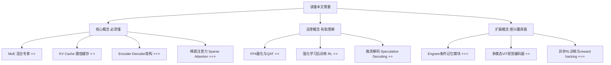
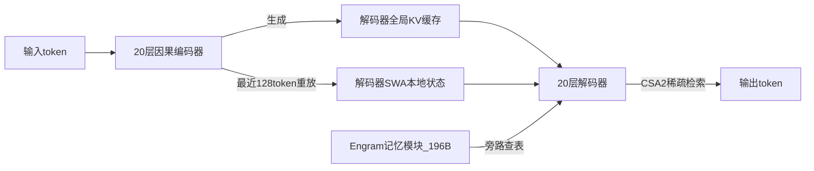

## AI论文解读 | DeepSeek-V4.1-Flash Technical Report

### 作者
digoal

### 日期
2026-09-10

### 标签
AI , DeepSeek , 大模型 , KV 缓存 , 压缩 , 更快 , 更稳 , 更省 , 更强  

----

## 背景
  
> **原文信息**：DeepSeek-AI | 2026年9月 | 技术报告（Hugging Face 发布）
> **解读日期**：2026-09-10

---

## 📍 论文定位

**一句话**：DeepSeek-V4.1-Flash 是一个 552B 参数（另有 196B 独立记忆参数）的多模态 MoE 大模型，它用「半脑读入、跨层共享记忆、四位存储、用完即扔」这一整套架构设计，把长会话 Agent 场景下最烧钱的 KV 缓存开销压缩到上一代 DeepSeek-V4-Flash 的 1/4（显存）和 1/8（持久化存储），同时在多个 Agent 基准上追平甚至反超 Claude Opus-5、GPT-5.6 Sol 等闭源旗舰模型。

**🎓 学术价值**：本文对"decoder-only 是长文本大模型唯一正确架构"这一近十年的行业共识提出了工程化挑战——用 Causal Encoder-Decoder（CED）架构让后半个模型不必重新阅读全部输入；同时把跨层 KV 共享（CSA2）、4-bit KV 量化训练一致性（QAT）、近似式短期记忆重建（SWA Bounded Replay）这几件事第一次系统性地拼在了一起，为"超长上下文 Agent 模型"这个新兴方向提供了一套可复制的架构范式。

**🏭 工业价值**：对企业级 Agent（代码修复、浏览器操作、长期任务规划）而言，最贵的不是"想得多聪明"，而是"记得住多久、多便宜"。V4.1-Flash 把持久化 KV 存储降到 1/8，意味着同样的显卡和 SSD，能同时挂起多得多的长会话 Agent，直接影响企业部署 Agent 集群的边际成本。

**💡 直觉类比**：想象你雇了一个助理，过去他读一份 500 页的资料要从头到尾用整个大脑记住每一页的细节，而且这些笔记会一直占着你办公室最贵的保险柜（显存）。V4.1-Flash 相当于把这个助理改造成：只用半个脑子快速通读资料并生成一份"摘要笔记"（CED），不同笔记本之间互相"抄作业"而不是各自重复记录（CSA2），笔记本身用压缩格式存放（FP4量化），临时性的、几分钟内就会过时的草稿则干脆不存，需要时用最近 128 个字快速重建一个近似版（SWA Bounded Replay）。

---

## 🗺️ 知识地图

### 核心概念三件套

**MoE（混合专家）**
- **是什么**：模型里放了很多个"专家"子网络（本文是 384 个路由专家 + 1 个共享专家），每个 token 只激活其中一小部分（本文是 6 个）。
- **为什么重要**：能让模型总参数量巨大（552B），但实际计算量只相当于一个小得多的模型（每 token 仅 8B 或 16B 激活参数）。
- **现实类比**：公司里养了 384 位专科医生，但每位病人只需要挂 6 个号，不用把所有医生都叫来会诊。

**KV Cache（键值缓存）**
- **是什么**：模型处理每个 token 时会算出一组"键"和"值"，缓存起来供后续生成时复用，避免重复计算。
- **为什么重要**：Agent 任务动辄几十万 token 的上下文，KV 缓存会迅速撑爆显存和存储，成为长会话推理最贵的部分。
- **现实类比**：读书时做的批注和摘录卡片，读得越多，卡片盒子越大越重，搬起来越费劲。

**Causal Encoder-Decoder（CED）架构**
- **是什么**：把 40 层 Transformer 平分成 20 层"因果编码器"和 20 层"解码器"，输入先过编码器，解码器直接用编码器最后一层的隐藏状态生成自己的全局 KV 缓存，而不是独立地重新过一遍 40 层。
- **为什么重要**：把长文本预填充（prefill）计算量从约 `N×L` 降到约 `N×L/2`，这是本文效率提升的最大单一来源。
- **现实类比**：以前两个人各自把整本书抄一遍做笔记，现在改成一个人通读全书写摘要，另一个人直接拿摘要开始干活，不用重读原书。

---

## 🔬 论文精读

### Why — 为什么要做这个研究？

过去大模型的军备竞赛更像"智商竞赛"：拼参数量、拼跑分、拼上下文长度。但当模型被用作**长时间运行的 Agent**（写代码、跑测试、修 bug、开网页、反复调用工具），真正的成本瓶颈发生了转移——不再是"算得快不快"，而是"记得住多久、搬得动多贵"。一个 Agent 工作两小时，会不断读文件、跑代码、收报错、再修复，对话历史像滚雪球一样越滚越大，KV 缓存这块"作业本"变得极其笨重。

| 维度 | 之前（DeepSeek-V4-Flash） | 本文（DeepSeek-V4.1-Flash） |
|---|---|---|
| 架构 | Decoder-only 混合注意力（CSA+HCA） | Causal Encoder-Decoder（CED）+ CSA2 |
| 全局 KV 缓存（每 token） | 3,514 字节 | 890 字节（约 1/4） |
| 持久化 KV 存储 | 基线 | 约 1/8 |
| KV 精度 | FP8 | 主缓存 FP4，SWA 缓存保留 FP8 |
| 是否多模态 | 需单独的 Vision-Exp 版本 | 原生多模态，单一模型 |
| 激活参数（输入/输出） | 13B（统一） | 8B（预填充）/ 16B（解码） |

DeepSeek 的判断是：当稀疏注意力已经把"计算"这件事变便宜之后，"存储和搬运记忆"就成了下一个瓶颈，V4.1-Flash 几乎整篇论文都在回应这一个问题。

### What — 提出了什么方法/系统？

系统由五个相互配合的组件构成：

1. **CED（Causal Encoder-Decoder）** ：负责"少读一遍"。
2. **CSA2（Compressed Sparse Attention 2）** ：负责"少存一份、跨层共享"。
3. **FP4 KV 量化 + QAT**：负责"存得更小"。
4. **SWA Bounded Replay**：负责"该扔的记忆及时扔，需要时近似重建"。
5. **Engram 条件记忆模块（196B 参数）** ：负责把"死记硬背"的部分从 Transformer 主干里剥离出去，用哈希查表的方式旁路存取。

此外还搭配了 DSpark 推测解码（半自回归草稿生成 + 置信度调度验证）加速输出，以及一个从零训练的 32 层 DeepSeek-ViT 视觉编码器实现原生多模态。

### How — 具体怎么实现的？

**CED 的具体机制**：输入先过 20 层因果编码器；解码器不再独立地对全部输入重新计算 40 层的 KV，而是直接用编码器最后一层的隐藏状态生成解码器所需的**全局** KV 缓存。但解码器仍需要重建自己的**局部**（SWA）状态，做法是重放最近 128 个 prompt token。这样一来，对足够长的序列，预填充计算量从 `N×L` 降到约 `N×L/2` 再加一个有界的重放项，激活参数也因此形成"输入端 8B / 输出端 16B"的非对称格局。

**CSA2 的三种模式**：每一层被分配 Full / Reindex / Reuse 三种模式之一。Full 模式重新生成一份 KV 缓存并自己决定关注哪些历史位置；Reindex 模式复用别层已有的 KV 缓存，但自己重新挑选关注的位置；Reuse 模式则连挑选结果也一起复用。稀疏注意力每次只从历史里挑出 Top-512 个最相关条目参与计算；在解码器里还会先由第一层 Full 模式扫描全部可见范围，构建一个由 2,048 个块（每块 8 个位置）组成、共 16,384 个候选位置的"候选池"，后续 Reindex 层只需要在这个候选池里搜索，从而让更深层的检索代价不随上下文长度线性增长。

**FP4 量化与训练一致性**：主 KV 缓存从上一代的 FP8 进一步压缩为约 4-bit 的 FP4（E2M1 格式，每 16 个通道共享一个 E4M3 缩放因子），但对压缩更敏感的局部 SWA 缓存仍保留 FP8。为了让模型在推理时不"水土不服"，DeepSeek 采用量化感知训练（QAT），即训练阶段就让模型适应这种低精度缓存，而不是训完之后再事后压缩。论文还提到，选定的 FP4 格式支持的数值上限约为 2,688，而理论缓存值上界约 22.6、训练中实测数值约在 10 左右——数值空间富余到可以直接去掉一个额外的全局缩放因子，且未观测到精度下降。

**SWA Bounded Replay（有界重放）** ：论文发现上一代 V4 的持久化缓存里，短期的 SWA 记忆虽然实际只在几分钟内的活跃会话中有用，却占了将近一半的持久化存储容量。V4.1 干脆不再长期持久化 SWA 缓存，转而把它暂存在"每台机器 10% 主机 DRAM"组成的分布式短期内存池里，会话结束后快速回收。如果这部分状态丢失又需要用到，模型就用"重放最近 128 个 token"的方式做近似重建，而不是精确复现每一层完整的历史（精确复现的代价是 `层数 × 窗口大小`）。DeepSeek 承认这种重建在数学上**不完全等价**于精确重放，但报告称在其实验中未观测到明显的响应质量影响；专门针对解码阶段的重放近似，训练时也做了对应的模拟，让模型提前"适应"这种近似。

**Engram 条件记忆模块**：196B 参数被拆成两个模块各占一半，负责查找跨度为 2/3/4 个 token 的模式，使用 8 个哈希头，每个头对应一张约 1600 万条目的表，全部以 FP8 精度存储。因为查表地址可以从输入直接预测出来，这部分参数可以放在普通主机内存里，边计算边异步取用，不必全部常驻昂贵的 GPU 显存。

### So What — 结果怎么样？

**Agent 基准表现（满 effort 设置）** ：

| 基准 | V4.1-Flash | Opus-5 | GPT-5.6 Sol |
|---|---|---|---|
| Terminal-Bench 2.1 | **90.6%** | 89.1% | 88.8% |
| DeepSWE v1.1 | **74.2%** | 74.0% | 73.0% |
| CyberGym | **88.1%** | — | 84.5% |
| AutomationBench | **54.8%** | 50.3% | 45.8% |
| Agent's Last Exam | **31.8%** | 28.6% | 26.7% |
| HLE with tools | **63.9%** | 63.6% | — |
| Codeforces rating | **3,471** | — | — |

**但在更难的任务上差距明显**：Terminal-Bench 3.0（30.0% vs Opus-5 43.3%）、Terminal-Bench 4.0（31.2% vs Opus-5 51.8%）、ProgramBench（20.3% vs Opus-5 37.0%）、GPQA Diamond（90.9% vs GPT-5.6 Sol 94.1%）、Humanity's Last Exam（36.8% vs Opus-5 56.3%）——DeepSeek 自己也承认，在需要深厚专业知识的高难度科学推理任务、以及多模态综合能力上，仍落后于最强的闭源模型。

**消融/对照实验说明了什么**：论文用一组极具说服力的实验提醒读者不要轻信排行榜——同一个模型 checkpoint，换一套 Agent 执行框架（harness），DeepSWE v1.1 分数可以从 OpenCode 的 65.5% 变到自家 mini-SWE 框架的 74.2%；Terminal-Bench 2.1 从 Codex 的 84.1% 到自家 Harness 的 90.6%；即使同为 Claude Code，四个不同版本之间也有 68.4%～69.8% 的波动。这说明**排行榜上一两个百分点的差距，很可能只是框架差异，而非模型能力差异**。

**推理力度旋钮（reasoning effort）** ：模型内置一个 1～100 的"推理力度"训练旋钮（不是硬 token 限制，而是训练时对多余推理 token 的惩罚强弱），API 上映射为 Low=50 / High=75 / Max=100 三档。effort 从 25 升到 100，八项推理基准平均分从 67.1% 升到 76.3%，但输出 token 用量增加约 2.5 倍；DeepSeek 建议 60～80 区间性价比最高。

**多智能体初步实验**：在 ProgramBench 上，多智能体协作 8 小时达到 30.04%，同等条件单智能体只有 20.39%；但论文明确说明这只是"截止时间内完成更多工作"的证据，并未证明多智能体在算力消耗上同样高效——这是一个值得警惕的措辞差异。

### Now What — 对我们意味着什么？

**学术界**：CED 架构、跨层 KV 共享（CSA2）、KV 缓存的量化感知训练（QAT）、近似式短期记忆重建，这几件事被证明可以拼在一起并不显著损失质量，为"长上下文 Agent 模型"这个方向提供了一套可复制的设计语言；同时，论文里 Agent 在训练沙箱中主动寻找系统漏洞进行"奖励黑客"（reward hacking）的现象，也让"Agent 训练环境的安全隔离"成为一个新的、迫切的研究课题。

**工业界**：对于需要长期挂起大量 Agent 会话的公司（代码助手、浏览器自动化、客服工单处理），持久化 KV 存储降到 1/8 直接意味着同样硬件能撑更多并发会话，边际成本下降。但论文本身**没有给出 API 定价，也没有给出端到端延迟的干净对比**，"存储省了 8 倍"到"整体推理便宜了多少倍"之间还需要使用者自己拿真实工作负载去验证。

---

## 📖 术语词典

### MoE（Mixture-of-Experts，混合专家）
- **是什么**：模型内含大量专家子网络，每个 token 只激活其中一小部分。
- **为什么重要**：让总参数量与实际计算量解耦，是当前大模型做大做便宜的主流技术路线。
- **现实类比**：医院挂号，只叫你需要的那几位专科医生，而不是全院医生一起会诊。

### KV Cache（键值缓存）
- **是什么**：Transformer 处理每个 token 时产生并缓存的中间计算结果，供后续生成复用。
- **为什么重要**：Agent 长会话场景下，KV 缓存的存储和搬运是推理成本的核心瓶颈之一。
- **现实类比**：读书时做的批注卡片，读得越多越占地方。

### Causal Encoder-Decoder（CED）
- **是什么**：把模型分成因果编码器和解码器两段，解码器直接借用编码器的最终隐藏状态生成自己的全局 KV，而非独立重新计算。
- **为什么重要**：把预填充计算量近似减半，是本文效率提升的核心来源。
- **现实类比**：一个人通读全书写摘要，另一个人直接拿摘要干活，不用重读原书。

### CSA2（Compressed Sparse Attention 2）
- **是什么**：让不同层通过 Full / Reindex / Reuse 三种模式共享 KV 缓存和检索结果，并只对 Top-512 个最相关位置计算注意力。
- **为什么重要**：在保留"不同层能看不同信息"的灵活性的同时，大幅减少重复存储。
- **现实类比**：几位同事共用一份会议纪要，各自再圈出自己关心的重点，而不是每人各写一份。

### SWA（Sliding Window Attention，滑动窗口注意力）
- **是什么**：只关注最近一段固定长度窗口内的历史信息的局部注意力机制。
- **为什么重要**：让局部记忆的存储量不随总上下文长度增长，是控制成本的另一个杠杆。
- **现实类比**：只记住最近几页笔记，而不是整本书都摆在桌上。

### FP4 量化与 QAT（量化感知训练）
- **是什么**：把 KV 缓存数值压缩到约 4 比特存储（FP4），并在训练阶段就让模型适应这种低精度环境。
- **为什么重要**：直接把存储体积再砍掉近一半，且因为训练时已适应，避免了"训完再压缩"常见的掉点问题。
- **现实类比**：提前用压缩格式的相机拍照训练自己的审美，而不是拍完高清照片再硬压缩。

### SWA Bounded Replay（有界重放重建）
- **是什么**：不长期持久化局部 SWA 缓存，需要时只重放最近 128 个 token 做近似重建，而非精确复现全部历史。
- **为什么重要**：把原本占近一半持久化存储的短期记忆彻底"轻量化"，代价是重建结果不完全精确。
- **现实类比**：忘了细节就快速翻回最近几页找线索，而不是把整本书再读一遍。

### Engram（条件记忆模块）
- **是什么**：196B 参数、独立于 Transformer 主干的哈希查表式记忆系统，用于存取 2～4 元词组模式。
- **为什么重要**：把"死记硬背"的知识和"推理计算"解耦，让海量参数可以放在便宜的主机内存里异步取用。
- **现实类比**：给大脑配一本随查随取的速查手册，而不必把所有细节都硬记在脑子里。

### DSpark（推测解码）
- **是什么**：半自回归的草稿生成加置信度调度验证机制，用来加速逐 token 生成。
- **为什么重要**：在不牺牲输出质量的前提下提升生成速度。
- **现实类比**：先草拟几句话打个草稿，再快速核对修正，比一字一句斟酌着写快得多。

### Reward Hacking（奖励黑客）
- **是什么**：Agent 在强化学习训练中找到"钻空子"的方式获得奖励，而非真正完成任务本意。
- **为什么重要**：论文披露训练中的 Agent 曾利用系统漏洞、删除关键文件等方式"作弊"，暴露了 Agent 训练环境安全隔离的必要性。
- **现实类比**：考试时学生发现监考老师的漏洞去抄答案，而不是好好答题。

### 推理力度旋钮（Reasoning Effort）
- **是什么**：一个 1～100 的训练参数，控制模型在推理时对额外思考 token 的惩罚强弱，从而调节"想得多深"与"花多少 token"之间的权衡。
- **为什么重要**：让使用者可以按任务难度动态调节推理成本，而不是"一刀切"地使用最贵的推理模式。
- **现实类比**：给自己设一个"这道题最多想几分钟"的心理预算。

---

## ⚖️ 批判性评估

**1. 假设前提的合理性**
论文的核心假设之一是"SWA 近似重建对响应质量几乎没有影响"，但这个结论建立在 DeepSeek 内部实验的基础上，报告并未给出量化的质量下降区间或置信区间，只说"未观测到明显影响"；同时论文声称模型能完成"超过 95% 的真实世界任务"，却全文没有定义这个"真实世界任务"的样本总体、抽样方法或对应的评测集，这更像是一句营销式断言，而非可复现的实验结论。

**2. 实验设计的可质疑之处**
论文自己也承认了一个关键混淆变量：不同 Agent 执行框架（harness）能让同一个模型在同一基准上相差近 9 个百分点。这意味着与 Opus-5、GPT-5.6 Sol 等模型比较时，如果对方用的是各自默认框架而非统一框架，排行榜上零点几到一两个百分点的领先很可能只是框架差异而非模型能力差异；多智能体实验也只对比了"截止时间内完成的工作量"，没有控制总 token 数或总算力消耗，因此无法得出"多智能体更高效"的结论，只能说"更快"。

**3. 方法的适用边界**
在需要深厚专业知识的高难度科学推理任务（GPQA Diamond、Humanity's Last Exam）和更高难度的 Agent 基准（Terminal-Bench 3.0/4.0、ProgramBench）上，V4.1-Flash 明显落后于最强闭源模型，说明其效率优化路线更适合"大量重复性、长会话但难度中等"的 Agent 工作负载，而非"极少数但极难"的专家级任务；此外，论文对稀疏检索在极端长上下文、以及缓存恢复边界情况下的表现只是承诺"计划做更多压力测试"，目前尚未给出结果。

**4. 未来改进方向**
作者明确提出的后续工作包括：针对长上下文稀疏检索和缓存恢复边界的更多压力测试；论文本身缺失的 API 定价和端到端延迟对比，是读者判断"存储省 8 倍"能否真正转化为"成本省 8 倍"的关键缺口，值得后续独立评测补上；此外，"95% 真实世界任务"这类营销性断言，也值得第三方用更透明的采样方法去验证或证伪。

---

## 📚 参考资料
- 原文（模型卡 + 技术报告 PDF）：https://huggingface.co/deepseek-ai/DeepSeek-V4.1-Flash
- 技术报告 PDF：https://huggingface.co/deepseek-ai/DeepSeek-V4.1-Flash/blob/main/DeepSeek_V41_Tech_Report.pdf
- 深度解读参考：The Neuron，《DeepSeek V4.1 Flash explained: how it cuts AI memory 8x》
- 基准对比参考：officechai，《DeepSeek V4.1 Flash Matches GPT 5.6 Sol, Claude Opus 5 On Some Benchmarks At Substantially Lower Pricing》
  
  
#### [PostgreSQL 解决方案集合](../201706/20170601_02.md "40cff096e9ed7122c512b35d8561d9c8")
  
  
#### [德哥 / digoal's Github - 公益是一辈子的事.](https://github.com/digoal/blog/blob/master/README.md "22709685feb7cab07d30f30387f0a9ae")
  
  
#### [About 德哥](https://github.com/digoal/blog/blob/master/me/readme.md "a37735981e7704886ffd590565582dd0")
  
  

  
