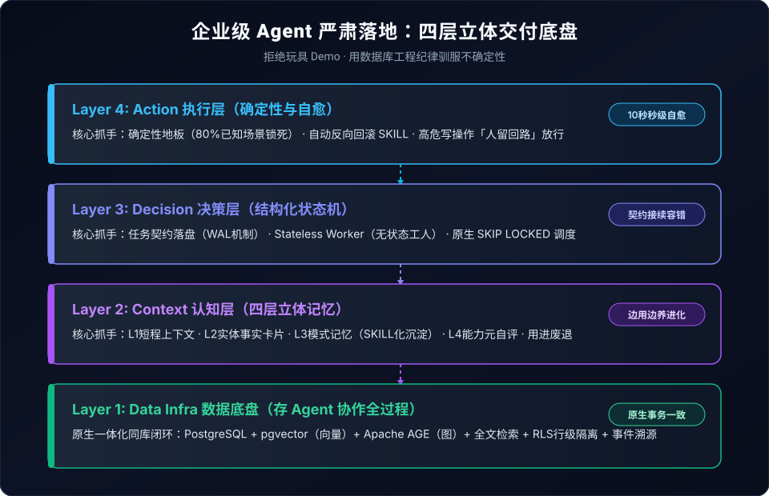

## Agent 在 Demo 阶段看着惊艳全场，为什么一进生产环境就漏洞百出？

### 作者
digoal

### 日期
2026-09-11

### 标签
TiDB , 圆桌 , 沙龙 , AI , Agent , 实践 , 生产 , 活物 , 进化 , 沉淀 , 工具 , 不确定 , 确定性  

----

## 背景

今天在 TiDB 杭州站参加了一场 AI Agent 圆桌。

核心其实就一件事：  
**“Agent 在 Demo 阶段看着惊艳全场，为什么一进生产环境就漏洞百出？”**

更让人沮丧的是另一个现象：  
人类员工在一个岗位上干一年，往往能成为独当一面的业务骨干；  
而绝大多数企业的 Agent，用了大半年不仅没有变聪明，反而越来越像个“弱智”——同样的坑踩一万次，每次都得人工现写提示词去哄着它干活。

做了二十年数据库内核与架构，现在我几乎全职扑在 AI Agent 交付一线。今天我就把圆桌上毫无保留的真干货梳理出来，聊聊企业级 Agent 严肃落地的底层逻辑。

---

## 核心心法：别把 Agent 当工具，把它当“活物”养

市面上 90% 的团队把 Agent 当成了单纯的自动化脚本或 API 工具。

但我自己手里的“AI 屠龙刀”，从第一天起就是按 **“活物”** 来养的。

什么叫活物？活物有两部分组成：
- **出厂配置**：大语言模型 + Agent 框架 + 运行环境 + 全网检索能力。这是躯壳，但在真实交付体系里，它只占两成。
- **实战沉淀**：剩下的八成，完全是留给使用者的进化空间——**用进废退，越用越好**。

所谓用进废退，本质上跟顶级人才的成长路径一模一样：  
在日复一日的业务实战中，不断沉淀记忆、沉淀好的经验与踩坑记录、固化出标准作业程序（SOP）、封装出高频工具包、编排成定时任务，并主动遗忘过时的无用信息。

以我们内部一个 5 人的业余投研团队为例：  
- **日层**：每天 15:00 自动触发动态监控与研报初稿；
- **周层**：周末跑 7 个领域的子智能体跨界思维碰撞；
- **月层**：月末自动进行全盘投资复盘，把新认知直接升格为主库技能。

跑了不到三个月，这个 AI 助理产出的研报质量，已经大幅反超了我们过去雇佣的初级分析师，而综合成本只有原来的十分之一。

**不是模型变神了，而是我们把每次踩过的坑、看财报的分析路径，全变成了可复用的技能。新人或者新会话接手的第一秒，就能无缝继承这套“肌肉记忆”。**

不养，Agent 永远只能是个玩具。

---

## 第一记重锤：把“记忆”当向量检索，从根上就走歪了

很多团队做记忆，脑子里只有一条流水线：  
`切分 Chunks → 向量化 Embed → 塞进向量库做 RAG 召回`。

这套方案在 PPT 上很唬人，一进企业真实场景就翻车。

我在实际基准测试中对比过，单纯依赖向量匹配，测量仪器、提示词甚至上下文长度稍有变动，评测得分就能从 0.74 剧烈断崖至 0.095。

为什么？因为真实企业的业务记忆根本不是单薄的关键词卡片：
- 上周三与法务开会交代的 3 条严苛合规底线；
- 上个月某次罕见客诉事件的核心排查路径；
- 管理层在季度战略会上随口定调的业务转向。

这些信息弱结构化、强上下文敏感、跨越多个业务事件，并且随着时间推移具备衰减特性。拿生硬的余弦相似度去搜，根本召不回来。

要支撑严肃生产，必须把记忆拆解为四层立体底盘：

| 记忆层级 | 对应载体 | 解决的核心问题 |
| :--- | :--- | :--- |
| **L1 工作记忆** | Short-term 上下文 | 保证单次任务链路不跑偏、上下文连贯 |
| **L2 实体记忆** | 结构化事实卡片 | 人、事、物轻量级动态档案 |
| **L3 模式记忆** | 经过实战检验的 SKILL | 业务 SOP、踩坑避雷指南、最佳工程实践 |
| **L4 元记忆** | Agent 自省自评边界 | 让智能体明确知道自己“擅长什么、不确定什么” |

**更关键的是闭环：记忆绝不是全自动凭空长出来的。**  
每一个生产任务跑完，必须执行“30 秒反思”：  
- 踩了坑，立刻写成避坑 SKILL；
- 有了新经验，立刻升级现有 SKILL；
- 发现了陈旧逻辑，立刻修剪冗余 SKILL。

一个动作如果重复了三次，就必须抽象成通用版本。这才是智能体真正的“智商积累”。

---

## 第二记重锤：企业稳定不靠模型聪明，靠“工程纪律”

在企业级语境下，“稳定”从来不是虚无缥缈的 99.99% SLA。  
**稳定是指：它什么时候崩了，你得能秒级告诉我为什么崩；并且崩了之后，你得能毫秒级退回去。**

这里有三个必须坚守的工程支点：

### 1. 确定性地板 > 灵活性天花板
很多技术团队痴迷于展示“大模型自己摸索未知解法”。  
但在企业里，80% 的工作都是已知高频流程（财务对账、采购审批、合规报表、固定工单）。这些场景如果每次输出都随机飘忽，下游系统根本无法承接。

我们的原则极其明确： **把已知场景 100% 锁死**（写死 SOP 流程、写死工具入参映射、配置化约束），只把灵活性留给真正的未知推理。底层稳如磐石，顶层才敢创新。

### 2. 全链路可观测 > 盲盒
没有观测，谈何运维？必须对齐三大审计流：
- **Prompt 审计**：记录完整上下文与交互日志；
- **Tool 审计**：每次工具调用的出入参、延迟与 Token 消耗；
- **业务语义审计**：类似数据库审计日志，明确记录这个 Agent 改了哪行数据、动了什么权限。

### 3. 可回滚是刚性底线
上个月我的一个定时任务在做数据库变更，因为 SKILL 里的分支条件写反，误将重命名列判断成了删除列。  
但整个线上业务完全零感知，为什么？  
因为我的体系里有一条铁律： **“任何产生副作用的写操作，必须同步生成反向回滚 SKILL。”** 触发告警后，系统直接调用反向指令，十秒钟之内完全自愈。

---

## 第三记重锤：Data + AI 的终局，是数据库被全面重构

未经结构化整理的数据只是原始素材，未能被智能体认知的数据更谈不上洞察。

在 AI 推理全面工业化的今天，数据栈最大的范式转移正在发生：  
**数据库的核心使命，正在从“存储业务数据”，演进为“存储 Agent 协作的全生命周期”。**

未来数据栈最大的下游调用者不再是 BI 报表和分析师，而是蜂拥而至的智能体群。多智能体协作需要混合检索、行级数据安全、层级依赖树、调度队列表与行为溯源，这每一项，本质上都是成熟关系型数据库的基本功。

这就是为什么我坚决不使用外挂拼凑方案，而是直接将环境跑在 **PostgreSQL 18** 核心上：
- **向量检索**：同库调用 `pgvector`；
- **知识图谱**：同库集成 `Apache AGE`（支持 TinkerPop 图查询）；
- **全文与模糊匹配**：原生 `pg_trgm` 与 `tsvector`；
- **安全与权限防线**：直接用 PG 的 **Row-Level Security（RLS）** 划定每个 Agent 的可见行与修改范围，杜绝越权裸奔；
- **决策秒级反演**：建立 Append-only 事件溯源日志，充当 AGI 时代的“WAL 日志”；
- **原生任务编排**：直接用 `SELECT ... FOR UPDATE SKIP LOCKED` 调度任务队列表，零额外依赖实现高一致性协作。

未来三年，行业一定会分化出一个全新的独立赛道 —— **“Agent 协作数据库”** 。所有大厂的数据基础设施底座，在接下来的 18 个月内都将面临一场以智能体为中心的重做浪潮。

---

## 落地四句铁律

把今天的分享收敛为四句可执行的铁律，供正在做 Agent 落地的朋友参考：

1. **任务跑完必须沉淀**：踩坑写技能，经验升技能，用进废退。
2. **技能必须走工程纪律**：确定性地板第一，写操作必留反向回滚路径。
3. **每一个动作必须留痕**：把事件溯源当成 AI 时代的 WAL 来看待。
4. **权限边界坚决收紧**：用数据库行级安全控范围，生产高危写操作必须“人在回路”。

**把 Agent 当工具用，它就永远困在演示 Demo 里；把它当活体来养，它才能真正扛起企业级生产的重担。**
  
  
#### [PostgreSQL 解决方案集合](../201706/20170601_02.md "40cff096e9ed7122c512b35d8561d9c8")
  
  
#### [德哥 / digoal's Github - 公益是一辈子的事.](https://github.com/digoal/blog/blob/master/README.md "22709685feb7cab07d30f30387f0a9ae")
  
  
#### [About 德哥](https://github.com/digoal/blog/blob/master/me/readme.md "a37735981e7704886ffd590565582dd0")
  
  

  
