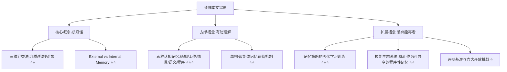
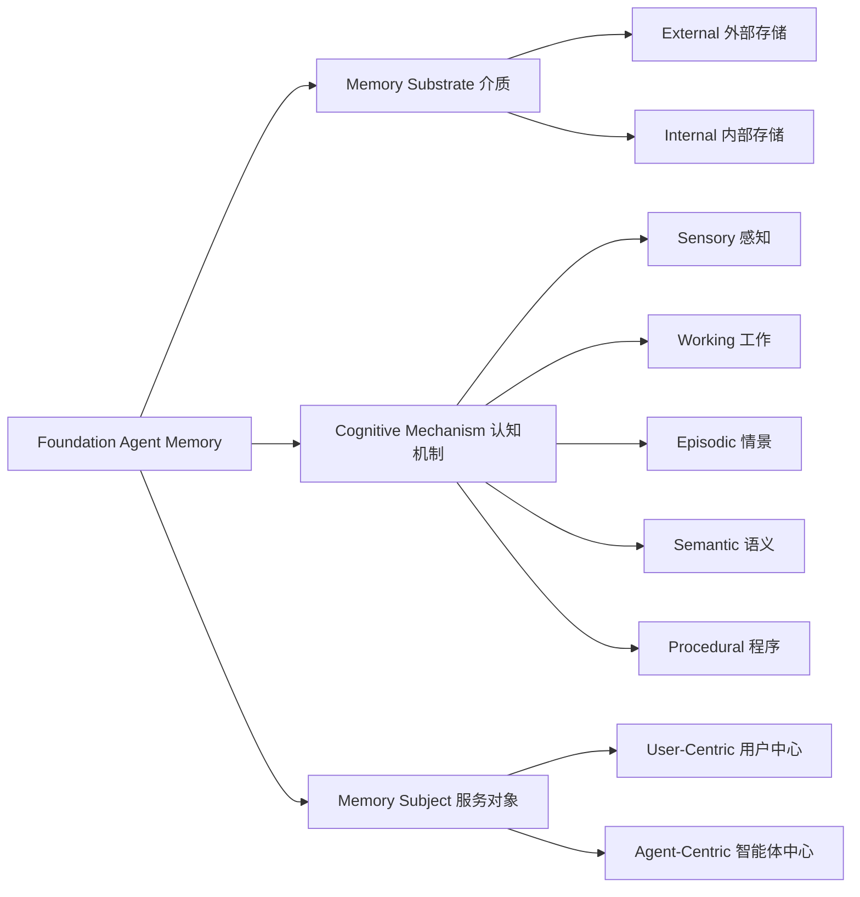

## AI论文解读 | A Survey of Agent Memory in the Second Half: Towards Self-Evolving and Long-Horizon Agents

### 作者
digoal

### 日期
2026-09-11

### 标签
AI , memory  

----

## 背景

> **原文信息**：Wei-Chieh Huang, Kai Shu 等 60+ 位作者（UIC、UIUC、Stanford、Salesforce、Google、Meta 等联合团队）| 2026年1月提交，8月修订v4 | 已被 TMLR（Transactions on Machine Learning Research）接收，获 Survey Certification  
> **原文链接**：https://arxiv.org/abs/2602.06052  
> **解读日期**：2026-09-11  

---

## 📍 论文定位

**一句话**：这是一篇系统梳理"智能体记忆（Agent Memory）"的重量级综述，从 218 篇 2023–2025 年的关键论文中提炼出一套三维分类体系（存储介质 × 认知机制 × 服务对象），并第一次把"记忆管理本身也可以被训练"这件事讲透——记忆不再只是给 Agent 存东西的仓库，而是 Agent 能不能在部署后持续自我进化的"底层基础设施"。

**🎓 学术价值**：此前的 Agent Memory 综述要么按任务场景归类（客服、推荐、编程助手各写各的），要么照搬神经科学的人类记忆分类硬套到 LLM 上，都没有说清楚"记忆存在什么地方"和"记忆服务于谁"这两个正交但同样关键的问题。本文首次把 substrate（介质）、mechanism（认知功能）、subject（服务对象）三个维度拆开又连起来看，并把"记忆运营策略本身可学习"作为独立议题系统化，填补了系统设计视角的空白。

**🏭 工业价值**：这篇论文几乎是当前所有"给 Agent 加记忆"工程实践的一张全景地图——无论是用 pgvector 做向量检索、用知识图谱做结构化记忆，还是像 Cognee 这类 GraphRAG 记忆后端接入 PostgreSQL，都能在论文的 taxonomy 里找到自己的坐标。对于正在做 Cognee + PostgreSQL 19 记忆系统集成的场景来说，这篇论文相当于把"我在做的这一小块，到底属于记忆系统里的哪个模块、该跟哪些模块协作、该学哪些论文的经验"这件事讲清楚了。

**💡 直觉类比**：如果把一个 Agent 比作一个刚入职的新员工，"第一半场"的 AI 研究是在拼命提高他做标准化考试的分数；而"第二半场"面对的是——这个员工能不能在真实项目里干得越来越顺手、记住客户的脾气、总结出一套可复用的工作方法，而不是每次开会都像失忆一样从零开始。这篇论文讲的就是：怎么给这个员工装一套"越用越聪明"的记忆系统。

---

## 🗺️ 知识地图

读懂这篇论文，你需要理解三层概念：核心必须懂的三维分类体系，支撑理解的五种认知记忆类型，以及扩展的"记忆如何被训练/进化"这条新线索。

---

## 🔬 论文精读（5W1H框架）

### Why — 为什么要做这个研究？

作者们提出一个判断：AI 研究已经从"第一半场"走进了"第二半场"。第一半场靠堆数据、堆参数、卷 MMLU/MATH 这类静态基准分数，现在很多模型都能轻松刷到 90% 以上；但这些分数跟真实世界能不能用是两回事——现实中的任务（agentic coding、深度研究、GUI 自动化、具身智能、人机协作）都是长周期、动态、高度依赖用户历史的，Agent 面临的是"上下文爆炸"：交互产生的信息量远超固定上下文窗口能装下的量。

| 维度 | 第一半场（Before） | 第二半场（本文关注） |
|---|---|---|
| 目标 | 刷基准分数 | 真实场景可用性 |
| 任务设定 | 短程、孤立 | 长周期、多轮、跨 session |
| 能力来源 | 训练/预训练时固化 | 部署后持续积累与自我进化 |
| 核心瓶颈 | 模型架构/参数规模 | 记忆的存储、检索、遗忘、巩固 |

已有的记忆类综述要么按应用场景分（客服/推荐各写一套），要么照搬人类认知心理学的记忆分类往 LLM 上套，都没能把"记忆存在哪种介质里"和"记忆是给谁用的"这两个正交问题讲清楚。这就是本文要填的坑。

### What — 提出了什么方法/系统？

本文的核心贡献是一套**三维正交分类体系**，外加对"记忆如何被运营和训练"的系统梳理：

三个维度互相独立但可以叠加着看：比如一条"用户上次偏好两页摘要"的记忆，介质上可能是一条 vector index 里的文本记录，认知机制上属于 episodic memory，服务对象上是 user-centric。同一套系统里，working memory、procedural memory、sensory memory 更多偏 agent-centric（服务于任务执行本身），而 semantic 和 episodic memory 则在 user-centric 和 agent-centric 两边都大量出现。

论文还给出了整个记忆生命周期的"闭环"图景：working memory 决定什么信息能进入并留在活跃上下文里（这个筛选策略现在越来越多用强化学习训练，而不是手写规则）；被保留下来的经验积累成 episodic 记录，再经反思和巩固蒸馏成 semantic 事实和 procedural 技能；这些技能进一步被外部化为显式的、可打包、可共享的 "Skill"（这正是 Anolis SkillHub 这类平台在做的事）。这个闭环，就是论文反复强调的"记忆即自我进化的基质"。

### How — 具体怎么实现的？

#### 1）Memory Substrate（介质）：存在哪里

**External Memory（外部记忆）** ：存在模型参数之外，可显式读写。论文细分为四种实现形态：

| 实现形态 | 原理 | 代表技术/系统 |
|---|---|---|
| Vector Index | 把记忆条目和查询都嵌入同一向量空间，做近似最近邻检索 | HNSW、IVF、PQ 索引；RAG 框架 |
| Text Record | 用人类可读的文本文档（核心摘要+情景日志）而非向量/图 | MemGPT 一类系统 |
| Structural Store | 显式 schema + 符号化查询/遍历 | 关系表（SQL）、知识图谱（节点/边）、树状记忆（层级摘要） |
| Hierarchical Store | 多个独立模块各自维护 schema，由 meta-memory manager 路由 | 核心记忆+情景记忆+语义记忆+程序记忆+资源记忆+敏感信息库 |

代表系统：Mem0、Zep、A-Mem、HippoRAG2、MIRIX、MemTree。这里特别值得一提的是**图结构记忆**——知识图谱把信息组织成实体节点和关系边，新信息进来时结合语义嵌入和关键词检索做遍历，检测边的变化、解决冲突。这正是 GraphRAG 类系统（如 Cognee）的核心机制：当把这类图结构后端接到 PostgreSQL 上（借助 pgvector 做向量检索、SQL/PGQ 做图查询）时，本质上就是在同一个数据库里同时实现了论文说的 vector index 和 structural store 两种介质形态的融合。

**Internal Memory（内部记忆）** ：存在模型架构内部，包括三种：
- **Weights（权重）** ：通过预训练/后训练/参数编辑把知识写进参数里，检索快但更新代价高，容易灾难性遗忘。
- **Latent-State（隐状态）** ：跨步骤/跨片段复用中间隐藏状态，支持会话内连贯性，但不持久。
- **KV Cache**：Transformer 自注意力机制里缓存的 key/value，加速自回归解码，但显存开销随序列长度线性增长。

**两者权衡**（论文 Table 1 的核心结论）：

$$\text{内部记忆} = \text{访问快、更新贵、易遗忘、容量受训练时固定}$$
$$\text{外部记忆} = \text{可扩展、易编辑、但检索延迟高、精度依赖嵌入质量}$$

一句话总结： **没有一种介质能通吃所有场景**，成熟系统普遍走向混合架构——用内部记忆存稳定的通用知识，用隐状态做快速的会话内推理，用外部记忆做可扩展的经验存储。

#### 2）Cognitive Mechanism（认知机制）：功能上扮演什么角色

论文借鉴认知心理学，提炼出五种"原子级"认知记忆类型，短期的两种（感知、工作）负责"筛选进什么"，长期的三种（情景、语义、程序）负责"把筛选出来的东西固化成什么"：

| 类型 | 一句话定义 | 现实类比 |
|---|---|---|
| Sensory 感知记忆 | 感知输入的极短暂缓冲，供后续处理前的注意力筛选 | 眼睛余光扫过的画面，0.5 秒后就忘了细节 |
| Working 工作记忆 | 当前任务相关状态的临时存储与操作 | 心算时脑子里暂存的中间结果 |
| Episodic 情景记忆 | 特定时间/情境下发生的具体经历 | "上次你说过喜欢两页摘要" |
| Semantic 语义记忆 | 抽象化、去情境化的事实和概念知识 | 项目的固定信息、术语定义 |
| Procedural 程序记忆 | 怎么做事的技能、动作序列 | "先搜索→再阅读→再提取→再引用"这套固定流程 |

值得强调的是**工作记忆的角色转变**：过去是"prompt 太长就截断/摘要"这类手写规则，现在越来越多研究把"该留什么、该压缩什么、该丢什么"这个决策本身，当作一个可以用强化学习端到端训练的策略——工作记忆从"被动缓冲区"变成了"自我管理的工作台"，这也是整篇论文"自我进化"主线的起点：短期记忆的筛选质量，直接决定了长期记忆能积累出什么样的知识和技能。

**程序记忆**这一节尤其值得关注，因为它直接对应"Skill"生态系统的兴起：从 Voyager 这类早期的"技能库"（Agent 自己积累可复用的验证过的程序），发展到今天把技能打包成"指令+代码+资源"的可组合 bundle，按需加载——这正是 Anolis SkillHub 平台在做的事情：把程序性记忆从 Agent 私有状态里拿出来，变成可检视、可共享、可跨模型复用的基础设施。论文也提醒了两个警示：自动生成的技能目前仍不如人工精心打磨的技能好用；技能作为共享制品在社区流通时会带来新的安全治理风险（相当比例的社区贡献技能被发现存在漏洞）。

#### 3）Memory Subject（服务对象）：为了谁

- **User-Centric（用户中心）** ：抽象用户的事实、偏好、历史交互，服务于长期个性化。论文列出三个关键子问题——长对话中的记忆管理（该记什么、该忘什么）、持久化用户模拟（低成本训练/评测替身）、长期个性化（区分"持久偏好"和"临时状态"，随用户目标变化而修正记忆）。
- **Agent-Centric（智能体中心）** ：服务于任务执行本身而非特定用户，比如跨用户积累的调试策略、世界建模能力。

论文特别指出这两者并非互斥：一个编程助手可以同时维护"用户特定的代码风格偏好"（user-centric）和"跨众多用户积累的通用调试策略"（agent-centric）——但目前的评测基准很少同时要求两者，导致研究普遍偏重一边。

#### 4）记忆的运营与训练（Section 4-5，基于目录结构与摘要综述）

论文进一步区分了**单智能体系统**的记忆运营五个环节（存储与索引、加载与检索、更新与刷新、压缩与摘要、遗忘与保留）和**多智能体系统**的记忆架构（私有专属、共享工作区、混合、编排式）与路由机制（编排者驱动、智能体自主发起、记忆驱动）。多智能体场景下还额外面临"写入隔离"和"一致性反馈闭环"的问题——多个 Agent 同时往共享记忆里写东西时，怎么避免冲突、保证一致性。

在"记忆进化与优化策略"部分，论文把训练记忆策略的方法分为三条线： **提示驱动**（静态/动态的 prompt 层面控制）、**微调**（把记忆策略内化进参数，做稳定性与边界控制、检索效率优化）、**强化学习**（在单步决策、整条轨迹、跨 episode/多智能体三个粒度上训练记忆操作策略）。这三条线合在一起，就是论文反复强调的"记忆管理本身正在变成一种可训练能力"的具体路径。

### So What — 结果怎么样？

这不是一篇提出新方法、跑实验刷榜的论文，而是一篇系统性文献综述，所以"结果"体现在两个地方：

**文献计量结果**：作者系统检索并筛选出 2023 Q1–2025 Q4 期间的 218 篇关键论文，发现记忆相关研究呈现爆发式增长，2025 年全年、尤其是 Q4 增速最快——这本身就说明"记忆"正在从边缘话题变成 Agent 研究的核心议题之一。

**结构性发现**：
1. 记忆介质、认知机制、服务对象三个维度确实是正交但可以互相映射的（Figure 5 用散点图展示了论文在"认知机制 × 服务对象"网格里的分布密度）；
2. 工作记忆、程序记忆、感知记忆更多服务于 Agent 自身任务执行（agent-centric），而语义和情景记忆在用户和智能体两个维度上都大量存在；
3. 感知记忆在当前主流文本类 Agent 里基本没有被显式建模，但在多模态/具身智能体里正在变得重要；
4. 没有单一记忆介质能在所有八个运营维度（延迟、存储成本、更新灵活性、上下文开销、跨会话持久性、可扩展性、遗忘风险、检索精度）上全面占优，混合架构是必然选择。

### Now What — 对我们意味着什么？

**学术界**：论文明确指出六个开放挑战方向（对应 Section 9 的六个小节）——持续学习与自我进化、多人-多智能体记忆组织、记忆基础设施与效率、终身个性化与可信记忆、多模态/具身/世界模型 Agent 的记忆、更贴近真实世界的评测基准。每一个方向背后都对应着可以直接下场做的研究课题。

**工业界**：对于正在做数据库+AI 记忆系统的工程实践（比如把 Cognee 这类 GraphRAG 后端接入 PostgreSQL 19），这篇论文提供的最大价值是一套"自检清单"——你的系统属于哪种 substrate（大概率是 external memory 里的 structural store，图结构 + 向量索引的混合）？覆盖了哪几种 cognitive mechanism（图结构天然适合做 semantic 和 episodic，工作记忆和程序记忆通常要在应用层单独设计）？服务对象是 user-centric 还是 agent-centric，还是要两者兼顾？此外论文反复强调的"遗忘与保留策略""压缩与摘要机制"，对应到数据库工程上就是：什么时候该做记忆条目的 TTL/归档、什么时候该做摘要压缩防止向量库膨胀、检索精度如何随着数据量增长而退化——这些都是纯算法论文不会细讲、但数据库工程师必须面对的落地问题。

---

## 📖 术语词典

### Foundation Agent（基础模型智能体）
- **是什么**：以 LLM/VLM/世界模型为核心决策模块，具备感知、推理、规划、工具使用、记忆管理能力的自主/半自主系统。
- **为什么重要**：这是全文讨论"记忆"的载体和前提——脱离 Agent 语境单独谈记忆没有意义。
- **现实类比**：就像一个具备完整认知能力的"数字员工"，而不只是一问一答的聊天机器人。

### External Memory / Internal Memory（外部/内部记忆）
- **是什么**：外部记忆存在模型参数之外（数据库、向量库）；内部记忆存在模型架构内部（权重、隐状态、KV Cache）。
- **为什么重要**：这是论文三维分类法里的第一维，决定了记忆的更新代价、持久性和检索方式。
- **现实类比**：外部记忆像笔记本电脑外接的移动硬盘，随时插拔更新；内部记忆像刻在脑子里的肌肉记忆，改起来要"重新训练"。

### Vector Index（向量索引）
- **是什么**：把记忆条目嵌入高维向量空间，用近似最近邻算法（HNSW/IVF/PQ）检索语义相似内容。
- **为什么重要**：目前外部记忆最主流的实现方式，是绝大多数 RAG 系统的底层机制。
- **现实类比**：像图书馆按内容相似度而不是书名字母顺序摆放图书，让"找相关的书"变得高效。

### Working Memory（工作记忆）
- **是什么**：任务执行期间临时持有和操作的、有严格容量限制的状态，对应 LLM 的活跃上下文（prompt + 推理轨迹 + 工具输出）。
- **为什么重要**：LLM 本身无状态，工作记忆是让多步推理得以连续进行的唯一机制；它的筛选策略决定了后续能沉淀出什么长期记忆。
- **现实类比**：像开会时随手记的便签，决定了会后能整理出什么样的会议纪要。

### Episodic / Semantic / Procedural Memory（情景/语义/程序记忆）
- **是什么**：情景记忆记录具体发生过的事；语义记忆存储抽象事实；程序记忆编码怎么做事的技能。
- **为什么重要**：这是长期记忆的三种功能分工，情景记忆经反思蒸馏成语义记忆和程序记忆，是"经验变成能力"的核心机制。
- **现实类比**：情景记忆是"上周三客户投诉过响应慢"；语义记忆是"这个客户对响应速度敏感"；程序记忆是"以后处理该客户工单要优先分配"。

### Skill（可共享技能）
- **是什么**：把程序性记忆外部化为显式、可打包、可版本管理的指令+代码+资源 bundle，Agent 按需加载。
- **为什么重要**：是程序记忆研究的最新趋势，让 Agent 的"经验"从私有状态变成可检视、可共享的基础设施——直接对应 Anolis SkillHub 这类技能平台的设计理念。
- **现实类比**：像把一位老员工总结的操作手册标准化、上传到公司知识库，让其他人和其他团队都能直接复用。

### Catastrophic Forgetting（灾难性遗忘）
- **是什么**：模型在用新数据持续微调/编辑权重时，覆盖或破坏了此前学到的知识。
- **为什么重要**：是内部记忆（尤其是权重记忆）最大的风险，直接制约了"把记忆写进参数"这条路的可行性。
- **现实类比**：像重新粉刷墙壁时不小心把旧的珍贵壁画一起盖掉了。

### KV Cache（键值缓存）
- **是什么**：Transformer 自注意力机制中缓存前序 token 的 key/value 矩阵，避免每步重复计算。
- **为什么重要**：是推理加速的关键机制，同时也是内部记忆里"上下文窗口开销"的主要来源，压缩 KV Cache 是当前系统优化的热点。
- **现实类比**：像做菜时提前把常用食材切好放在手边，不用每道菜都重新洗切一遍。

### Self-Evolving Agent（自我进化智能体）
- **是什么**：能在部署时通过自身执行经验持续改进，而非只靠离线训练获得能力提升的 Agent。
- **为什么重要**：是全文的核心论点——记忆是这种"边用边学"能力得以实现的基质，没有记忆机制，每一次交互都是孤立的、Agent 不会变得更聪明。
- **现实类比**：像一个"越干越顺手"的老师傅，而不是每天都得从头学一遍的新手。

---

## ⚖️ 批判性评估

### 1. 假设前提的合理性

论文的核心假设是"人类认知心理学的五种记忆类型（感知/工作/情景/语义/程序）足以完整刻画 LLM Agent 的记忆需求"。这个假设有实用价值（提供了清晰的组织框架），但也存在争议：LLM 的"记忆"本质上是工程系统对信息的存储与调用，未必真的映射到人类大脑的功能分区。论文自己也承认，感知记忆在当前文本类 Agent 里基本是"隐性存在、罕有显式建模"——这说明这套五分类框架本身在不同 Agent 类型上的适配程度并不均匀，某种程度上是"为了体系完整性而保留"了一个目前证据稀薄的类别。

### 2. 实验设计的可质疑之处

严格来说本文不是实验性论文，而是文献综述，所以"实验设计"这个维度要转化为"文献筛选方法论是否可靠"。论文的筛选方式是通过 Google Scholar 关键词检索 + 人工筛选顶会顶刊论文，最终选出 218 篇。这个方法论存在几个潜在问题：
- **关键词依赖症**：用"agent memory""long-term memory""context management""personalization memory"这类关键词检索，天然会漏掉那些用了不同术语体系（比如纯粹从"长上下文建模"或"持续学习"角度切入、不自称"记忆"的工作）的相关研究，导致样本存在选择偏差。
- **时间窗口的局限**：2023 Q1–2025 Q4 这个窗口恰好覆盖了 Agent 记忆研究爆发的阶段，但截止到 2025 Q4 意味着 2026 年的最新进展（包括论文自己 v4 版本修订时应该已经出现的新工作）未必被完整纳入，综述类论文天生有"出版即过时"的风险。
- **缺少定量对比**：论文虽然给出了 Table 1（八维度定性对比）和发文量统计图，但没有对不同记忆系统在同一基准上的性能做横向定量比较——这类"综述"更像是"地图绘制"而非"优劣评判"，对工程选型的直接指导性有限，读者仍需要自己去查具体 benchmark 的数字。

### 3. 方法的适用边界

三维分类法（介质/机制/对象）作为一种"组织框架"是有效的，但论文自己也承认：user-centric 和 agent-centric 并非互斥类别，很多实际系统同时需要两者，而"当前基准很少同时要求两者"——这暴露了一个更深的问题： **分类框架清晰，但评测生态尚未跟上**。也就是说，即便读完本文能清楚地把自己的系统"贴标签"归类，也很难找到一个综合性的 benchmark 来验证"我的系统在三个维度上综合表现如何"。对于想要做端到端记忆系统评测的团队，仍然需要自己拼凑多个专项 benchmark。

另外，论文对"记忆策略可以被强化学习训练"这条线着墨很多、态度也偏乐观，但从工程落地角度看，这条路径目前主要停留在学术实验阶段——把记忆管理策略端到端训练，需要精心设计的奖励信号和大量交互数据，对于中小团队或者传统数据库工程场景（比如把 Cognee 接入 PostgreSQL 这类基础设施集成工作）而言，短期内更现实的路径仍然是论文里提到的"提示驱动"和"结构化存储+人工设计的压缩/遗忘策略"，而非端到端 RL 训练记忆策略。

### 4. 未来改进方向

论文自己给出的六个开放挑战（持续学习与自我进化、多人-多智能体记忆组织、记忆基础设施与效率、终身个性化与可信记忆、多模态/具身/世界模型记忆、真实世界评测基准）方向正确，但都停留在"是什么问题"的层面，没有给出具体的技术路线图——这符合综述论文的定位，但也意味着读者需要自行去追踪后续论文才能看到这些方向的具体解法。

从读者（尤其是数据库/AI 基础设施工程师）的视角，我认为还可以补充几个论文未充分展开的方向：
- **记忆系统的可观测性与可调试性**：论文详细讨论了"怎么存、怎么检索、怎么遗忘"，但几乎没有涉及"记忆系统出错了怎么排查"——比如检索到了错误/过时的记忆导致 Agent 行为异常时，如何像数据库的慢查询日志一样，对记忆系统做可观测性建设，这是纯算法研究容易忽视、但生产系统必须解决的问题。
- **记忆系统与传统数据库能力的融合深度**：论文把"结构化存储（关系表/知识图谱/树）"作为 external memory 的一种子类型讨论，但对于像 PostgreSQL 这样兼具事务、索引、图查询（SQL/PGQ）、向量检索（pgvector）能力的成熟数据库系统，如何承担起论文里描述的"meta-memory manager"这一协调多个记忆模块的角色，论文并未展开——这恰恰是当前数据库社区正在探索、也最有工程价值的方向之一。

---

## 📚 参考资料
- 原文链接：https://arxiv.org/abs/2602.06052
- 项目主页（论文配套 Awesome List）：https://github.com/AgentMemoryWorld/Awesome-Agent-Memory
- HTML 全文（推荐阅读体验）：https://arxiv.org/html/2602.06052v4
  
  
#### [PostgreSQL 解决方案集合](../201706/20170601_02.md "40cff096e9ed7122c512b35d8561d9c8")
  
  
#### [德哥 / digoal's Github - 公益是一辈子的事.](https://github.com/digoal/blog/blob/master/README.md "22709685feb7cab07d30f30387f0a9ae")
  
  
#### [About 德哥](https://github.com/digoal/blog/blob/master/me/readme.md "a37735981e7704886ffd590565582dd0")
  
  

  
