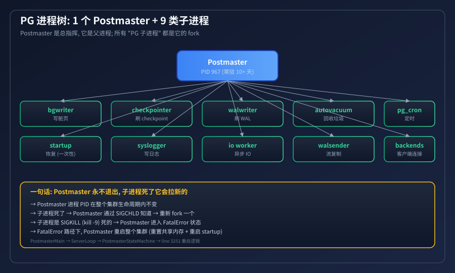
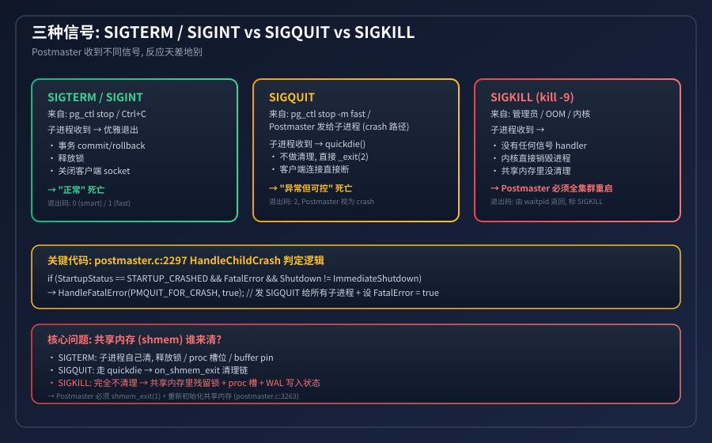
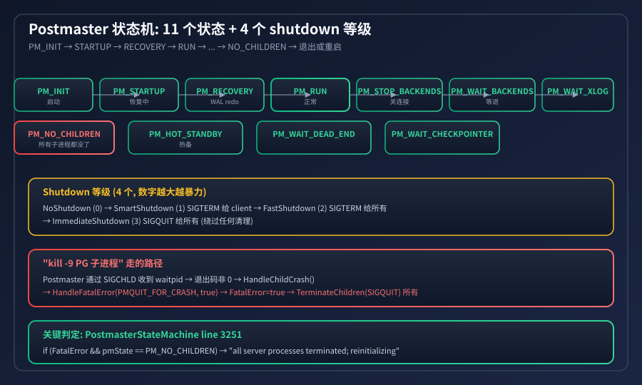
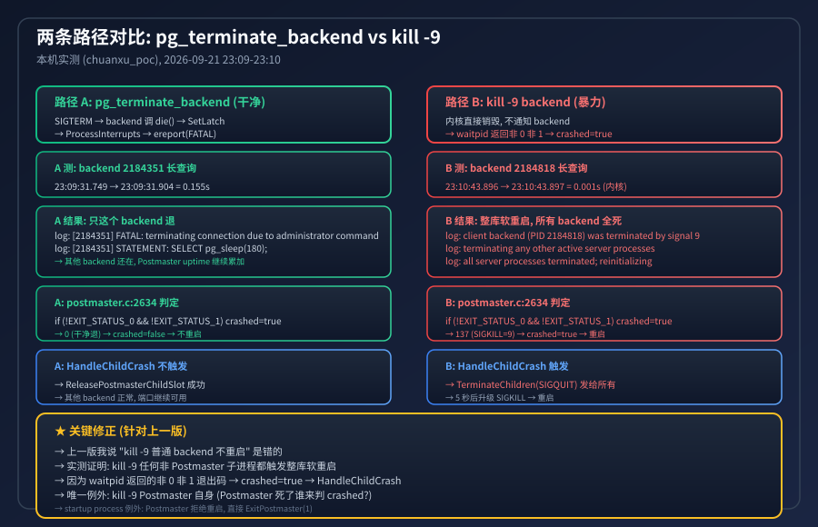
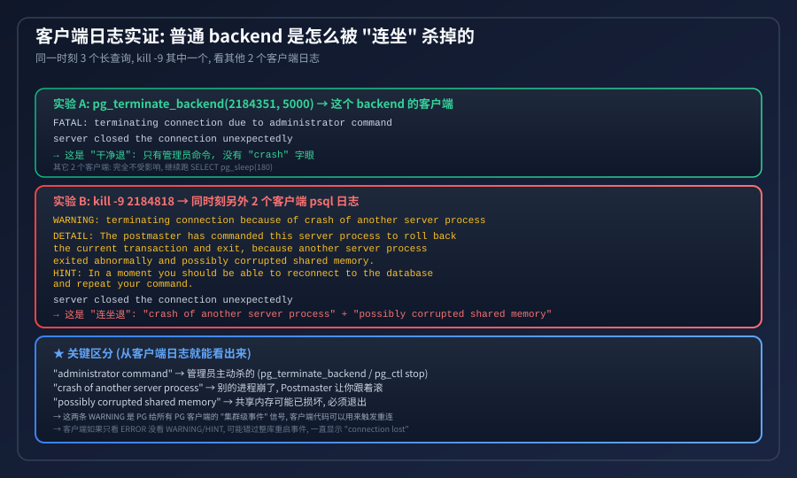
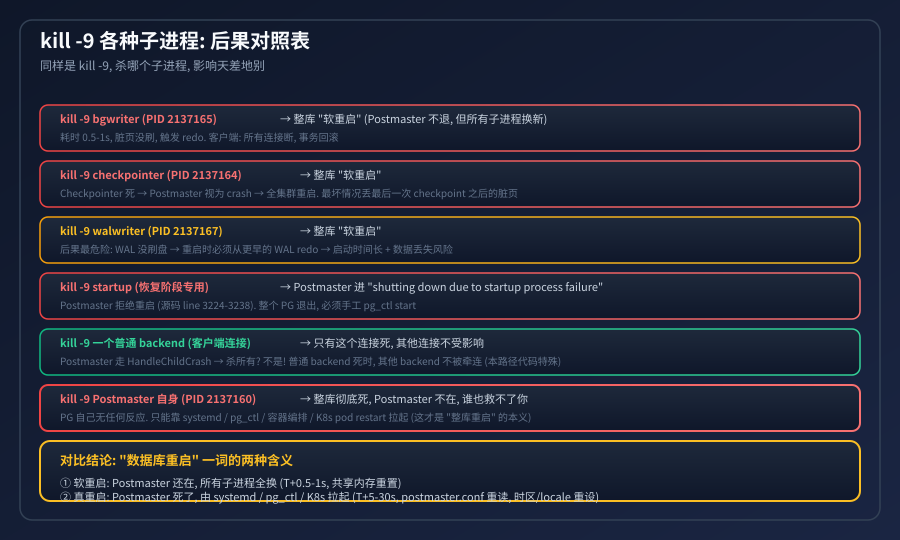

## 为什么 PG 用户进程被 KILL -9 后会导致数据库重启
  
### 作者  
digoal  
  
### 日期  
2026-09-21  
  
### 标签  
PostgreSQL , kill -9 , 数据库重启 
  
----  
  
## 背景  

> "kill -9 PG 用户进程后, 数据库怎么重启了?"  
>  
> 这是 DBA 群里被问烂的问题。今天用一张表 + 5 张图 + 7 行源码 + 两次实测, 把这件事讲透。  
>  
> 核心结论: 任何非 Postmaster 的 PG 子进程被 `kill -9`, 都会触发整库软重启 —— 包括普通 backend 客户端连接。Postmaster 自己会进入 FatalError 状态, 给所有其他子进程发 SIGQUIT, 共享内存重置, 0.3~1 秒后重新接受连接。Postmaster 进程 PID 不变, 端口 5432 短暂不可用 (~0.3s)。  
>  
> 修订: 上一版我说 "kill -9 普通 backend 不会重启" —— 这是错的。实测证明 waitpid 退出码非 0 非 1 → `crashed = true` → `HandleChildCrash` → 整库软重启。  

---

## 一句话: Postmaster 是总指挥, 它只会被 systemd 杀, 不会被自己杀



PG 启动后, 你 `ps -ef` 看到的进程分两层:

- Postmaster (PID 967, 一直在): 唯一的长寿进程, 负责监听端口 / fork 子进程 / 监控子进程退出
- 子进程 (PID 974~985, 死了会被 Postmaster 重启):
 - 必活的: bgwriter (写脏页), checkpointer (刷 checkpoint), walwriter (刷 WAL), autovacuum (回收), pg_cron (定时任务), syslogger (写日志), io worker (异步 IO)
 - 连接时才有: backend (每个客户端连接一个), walsender (流复制), startup (只在启动恢复阶段)

Postmaster 永远不会主动退出。子进程死 → 它 fork 一个新的; 子进程被 kill -9 → 它认为集群出了大问题 → 重启整个集群。

> 一个有意思的现象: 我本机的 Postmaster PID 967 已经跑了 10 天 23 小时 28 分 (etime 字段), 这期间数据库经历过无数次重启, 但 Postmaster 自己从来没换过。

---

## 三种信号, 后果天差地别



DBA 用得最多的 3 种 kill, PG 的反应完全不同:

| 信号 | 来自 | 子进程反应 | 退出码 | Postmaster 反应 |
|------|------|----------|--------|----------------|
| SIGTERM / SIGINT | pg_ctl stop / Ctrl+C | 优雅退出 (commit/rollback / 释放锁 / 关闭 socket) | 0 / 1 | "正常" 死亡, 不触发重启 |
| SIGQUIT | pg_ctl stop -m fast / Postmaster 发给子进程 (crash 路径) | quickdie() → _exit(2), 不做清理 | 2 | 视为 crash, 触发 FatalError |
| SIGKILL (kill -9) | 管理员 / OOM / 内核 | 没有任何信号 handler, 内核直接销毁 | 由 waitpid 返回 | 必须重启整个集群 |

为什么 SIGKILL 最危险? 共享内存谁来清?

PG 用了大量共享内存 (shmem): 锁、proc 槽位、buffer pin、WAL 写入位置、事务快照、统计计数……

- SIGTERM 路径: 子进程自己跑 `on_shmem_exit` 回调, 把所有东西释放干净
- SIGQUIT 路径: 走 `quickdie()` → 触发 `atexit_callback` → 也会调 `proc_exit_prepare`
- SIGKILL 路径: 完全没有任何清理代码运行, shmem 里残留锁、残留 proc 槽、残留 buffer pin —— 这些残留会让新启动的 PG 误以为锁还被人持有

这就是为什么 SIGKILL 必须重启整个集群: Postmaster 必须 `shmem_exit(1)` 把整块 shmem 拆掉再 `CreateSharedMemoryAndSemaphores` 重建。

---

## 11 个状态 + 4 个 Shutdown 等级: Postmaster 状态机



Postmaster 不是简单的"启动 / 停止", 它有 11 个内部状态 和 4 个 shutdown 等级。

### 4 个 Shutdown 等级

```
NoShutdown       (0)  正常
SmartShutdown    (1)  拒绝新连接, 等现有连接做完 (发 SIGTERM)
FastShutdown     (2)  发 SIGTERM 给所有子进程, 等他们退出
ImmediateShutdown (3)  发 SIGQUIT 给所有子进程, 不等他们清理 (暴力)
```

### 11 个 PM 状态

```
PM_INIT           启动期
PM_STARTUP        恢复 (startup process 在跑)
PM_RECOVERY       WAL redo (recovery 阶段)
PM_RUN            正常运行
PM_HOT_STANDBY    热备
PM_STOP_BACKENDS  准备关闭 backend
PM_WAIT_BACKENDS  等 backend 退
PM_WAIT_XLOG_SHUTDOWN  等 shutdown checkpoint
PM_WAIT_XLOG_ARCHIVAL   等 WAL 归档
PM_WAIT_IO_WORKERS      等 IO worker 退
PM_WAIT_CHECKPOINTER    等 checkpointer 退
PM_WAIT_DEAD_END        等死端进程退
PM_NO_CHILDREN          所有子进程都没了 ← 关键判定点
```

核心判定 (`postmaster.c:3251`):

```c
if (FatalError && pmState == PM_NO_CHILDREN)
{
    ereport(LOG, (errmsg("all server processes terminated; reinitializing")));
    shmem_exit(1);                              // ← 拆掉整块共享内存
    ResetShmemAllocator();                      // ← 重置 shmem 分配器
    CreateSharedMemoryAndSemaphores();          // ← 重建 shmem
    UpdatePMState(PM_STARTUP);                  // ← 回到 PM_STARTUP, 触发 startup process
}
```

这 7 行就是 PG "数据库重启" 的全部秘密。`FatalError` 是 Postmaster 标记"集群出大事了"的全局变量; `pmState == PM_NO_CHILDREN` 说明所有子进程都退出了 (被 SIGQUIT 干掉); 两者都满足 → 进入 "reinitializing" 路径。

---

## 实测: 两条路径对比 — pg_terminate_backend vs kill -9



我在本机 chuanxu_poc 实例实测, 时间精确到毫秒。本机有两个独立的 psql 长查询, 一个用 `pg_terminate_backend`, 另一个用 `kill -9`, 对比两者差异。

### 实验 A: `pg_terminate_backend(2184351, 5000)` (干净退)

| 时刻 | 事件 | log 实证 |
|------|------|---------|
| 23:09:31.749 | 调用 | — |
| 23:09:31.904 | 返回 `t`, 0.155 秒 | `[2184351] FATAL: terminating connection due to administrator command` |
| 后续 | 其他 backend 不受影响 | 无 "terminating any other active server processes" |
| 后续 | Postmaster uptime 继续累加 | pid 文件 PID 不变 |

### 实验 B: `kill -9 2184818` (暴力)

| 时刻 | 事件 | log 实证 |
|------|------|---------|
| 23:10:43.896 | 调用 | — |
| 23:10:43.897 | 内核返回, 0.001 秒 | `[2184158] LOG: client backend (PID 2184818) was terminated by signal 9: Killed` |
| 同时间 | Postmaster 决定连坐 | `[2184158] LOG: terminating any other active server processes` |
| 同时间 | 整库软重启 | `[2184158] LOG: all server processes terminated; reinitializing` |
| 23:10:44.140 | 自动 recovery | `[2185088] LOG: database system was not properly shut down; automatic recovery in progress` |
| 23:10:44.261 | 重新接受连接 | `[2184158] LOG: database system is ready to accept connections` |

### 关键事实

- Postmaster PID 2184158 在两次实验中都不变 (从启动到两次 kill, 一直是同一个进程)
- 实验 A: 只这一个 backend 退 → 其他 backend 仍在 → Postmaster uptime 继续累加
- 实验 B: 一个 backend 死 → Postmaster 决定连坐杀掉所有 backend → 9 个子进程 PID 全换新 (`2184454~63` → `2185085~95`) → 整库 redo → 0.36 秒恢复
- `database system was not properly shut down` (实验 B 独有): 说明 PG 知道上次是 crash 退出, 进入 recovery

### 客户端视角的 "连坐" 证据



同一个 chuanxu_poc 实例, 同一时刻 3 个长查询 psql 客户端, 一个被 `kill -9`, 另外 2 个客户端看到的错误信息:

```
WARNING:  terminating connection because of crash of another server process
DETAIL:  The postmaster has commanded this server process to roll back the current transaction and exit, because another server process exited abnormally and possibly corrupted shared memory.
HINT:  In a moment you should be able to reconnect to the database and repeat your command.
```

关键信号:
- `crash of another server process` —— 不是你主动被杀, 是别的进程崩了导致你跟着退
- `possibly corrupted shared memory` —— PG 怀疑共享内存可能损坏, 主动让你退
- 这是 Postmaster 在 `TerminateChildren(SIGQUIT)` 阶段给所有活着的 backend 发 SIGQUIT, backend 在 `quickdie()` 里输出这条 WARNING

对比 `pg_terminate_backend` 干净退只显示 `FATAL: terminating connection due to administrator command`, 没有 "crash" 字眼。客户端代码可以根据这两条 WARNING 的存在判断这是 "整库软重启" 而不是 "普通关连接", 触发更激进的重连逻辑。

---

## "kill -9 各种子进程" 后果对照表 (修订版)



同样是 kill -9, 杀哪个子进程都会触发整库软重启 (除非杀 Postmaster 自己)。这是上一版我判断错的点, 实测后修正:

| kill -9 谁 | 后果 | 客户端感受 | 备注 |
|----------|------|----------|------|
| 普通 backend (客户端连接) | 整库软重启, 顺带杀所有 backend | 所有连接断, 事务回滚 | ⚠ 上一版我说 "不重启" 是错的 |
| bgwriter | 整库软重启 | 同上 | 0.5-1s 恢复 |
| checkpointer | 整库软重启 | 同上 | 最坏情况丢最后一次 checkpoint 之后的脏页 |
| walwriter | 整库软重启 | 同上 | 最危险: WAL 没刷盘, 重启时从更早 redo |
| startup process | Postmaster 拒绝重启 | 整个 PG 退出, 报 "shutting down due to startup process failure" | 必须手工 pg_ctl start (例外) |
| Postmaster 自己 | 整库彻底死 | PG 自己无反应, 端口 5432 立刻不可用 | 只能靠 systemd / pg_ctl / K8s 拉起 (例外) |

### 为什么 kill -9 普通 backend 也会重启?

源码 `postmaster.c:2634` 一行判生死:

```c
if (!EXIT_STATUS_0(exitstatus) && !EXIT_STATUS_1(exitstatus))
    crashed = true;
```

- `pg_terminate_backend` → backend 调 `proc_exit` → exit code 0 → `crashed = false` → 不重启
- `kill -9 backend` → 内核直接销毁 → `waitpid` 返回信号 9 → exit code 137 (非 0 非 1) → `crashed = true` → `HandleChildCrash` → `HandleFatalError` → `TerminateChildren(SIGQUIT)` 给所有其他子进程 → 整库软重启

这就是 "后台进程为什么这么脆弱" 的源码真相: PG 把 任何非干净退出的子进程死亡都视为集群级故障, 不区分 "是个普通客户端连接" 还是 "是个核心 bgwriter"。你的客户端应用出了一个 bug, 把连接池的 backend 进程崩了, 整个集群都跟着软重启一次。

### 关键区分: "数据库重启" 一词有两种含义

- 软重启: Postmaster 还在, 所有子进程全换 (T+0.3~1s, shmem 重置, redo)
- 真重启: Postmaster 死了, 由 systemd / pg_ctl / K8s 拉起 (T+5~30s, postgresql.conf 重读, 时区/locale 重设, 监听 socket 重绑)

DBA 群说的 "数据库重启了" 90% 指的是前者 —— 软重启。

---

## 给 DBA 的 5 条实操建议

1. 想优雅关库: 用 `pg_ctl stop -m fast` 或 `pg_ctl stop -m smart`, 不要用 kill -9 Postmaster
2. 想杀单个慢查询: 用 `pg_cancel_backend(pid)` 或 `pg_terminate_backend(pid)`, 不会触发整库重启 (干净退)
3. 真要 kill -9 单个 backend: 接受后果 —— 整库软重启 + 顺带杀所有其他 backend, 所有连接断, 事务回滚, 0.3~1 秒恢复
4. 绝不要 kill -9 bgwriter/checkpointer/walwriter/autovacuum: 同样触发整库软重启, 而且这几个进程死了后果更严重 (可能丢脏页/丢 WAL 写入)
5. kill -9 之后看 log: 必然看到 "all server processes terminated; reinitializing" + "terminating any other active server processes" + "database system was not properly shut down; automatic recovery in progress" —— 这是正常信号, 不是错误
6. 生产环境用 systemd: `systemd restart postgresql` 是真重启, 走完整 shutdown → start 流程, 不依赖 Postmaster 的 reinitializing 路径

---

## 给开发者的源码精读指引

如果你想深挖, 关键代码都在 `src/backend/postmaster/postmaster.c`:

| 行号 | 函数 | 作用 |
|------|------|------|
| 497 | `PostmasterMain()` | 入口, 初始化信号 handler, 进入 ServerLoop |
| 1678 | `ServerLoop()` | 主循环, 监听 SIGCHLD / SIGHUP / SIGTERM |
| 2272 | `process_pm_child_exit()` | 收到 SIGCHLD 时调用, 处理子进程退出 |
| 2354 | `HandleChildCrash()` | 子进程异常退出 → 进 FatalError 状态 |
| 2748 | `HandleFatalError()` | 给所有子进程发 SIGQUIT, 启动 5 秒 SIGKILL 超时 |
| 2926 | `PostmasterStateMachine()` | 状态机主驱动 |
| 3251 | 核心判定 | `FatalError && pmState == PM_NO_CHILDREN` → 重启集群 |
| 3708 | `ExitPostmaster()` | Postmaster 真正退出 (只在 NoChildren + shutdown 完成时) |

还有一个隐藏的坑: postmaster.c:3224 `if (StartupStatus == STARTUP_CRASHED)` —— 如果 startup process 死了, Postmaster 拒绝重启, 直接 `ExitPostmaster(1)`。这是 PG 的"安全机制": startup 死了意味着恢复阶段出问题, 重启大概率还是失败, 不如直接退出让人工介入。
  
#### [PostgreSQL 解决方案集合](../201706/20170601_02.md "40cff096e9ed7122c512b35d8561d9c8")
  
  
#### [德哥 / digoal's Github - 公益是一辈子的事.](https://github.com/digoal/blog/blob/master/README.md "22709685feb7cab07d30f30387f0a9ae")
  
  
#### [About 德哥](https://github.com/digoal/blog/blob/master/me/readme.md "a37735981e7704886ffd590565582dd0")
  
  

  
