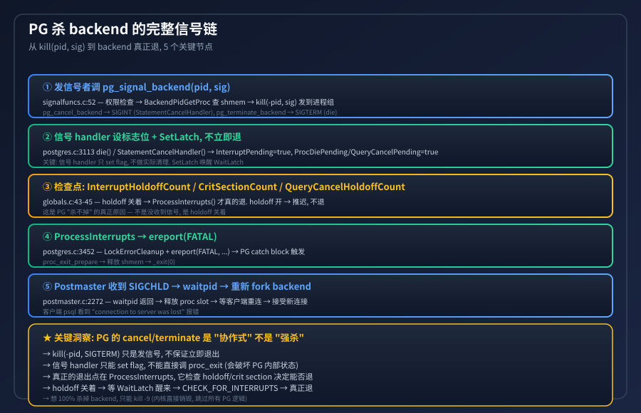
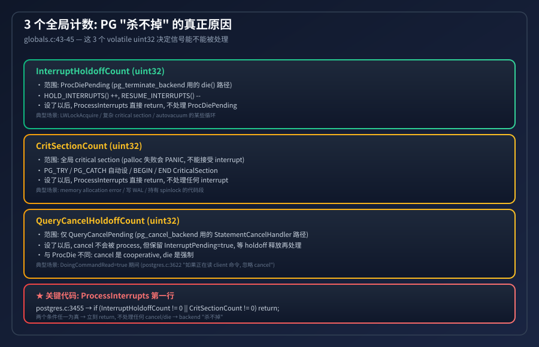
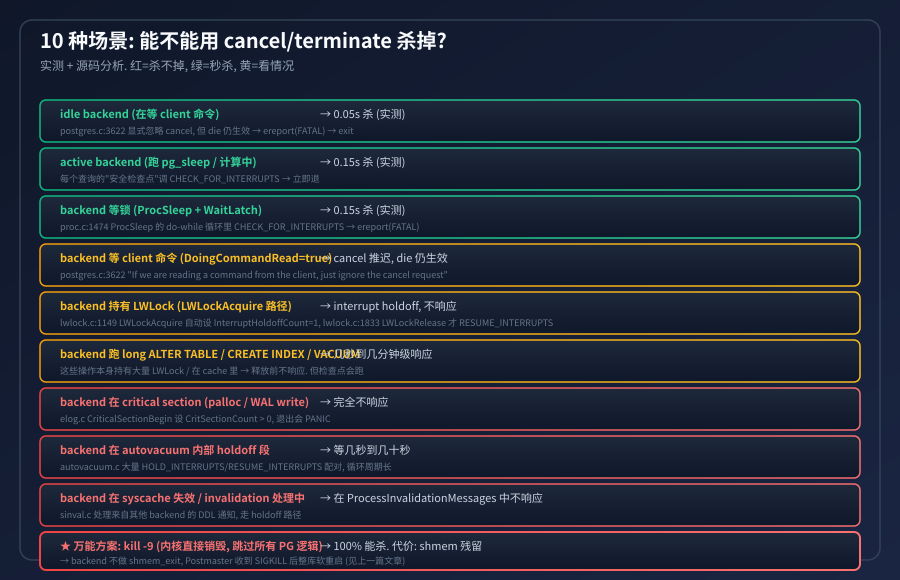
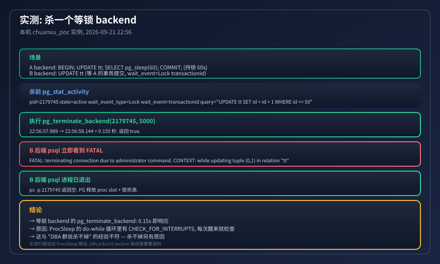
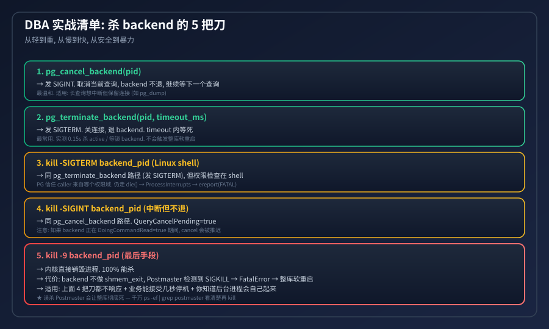

## 为什么 PG backend 杀不掉? 不可中断代码分析
  
### 作者  
digoal  
  
### 日期  
2026-09-21  
  
### 标签  
PostgreSQL , 不可中断代码分析 , pg_terminate_backend , pg_cancel_backend 
  
----  
  
## 背景 
  
> "我 `pg_terminate_backend(pid)` 了, 怎么 backend 还活着?"  
>  
> DBA 群被这问题问烂。今天把它讲透 —— PG 的 cancel/terminate 是 协作式, 不是强杀; 真正能 100% 杀掉 backend 的, 只有 `kill -9` 但是别这么干, 上一篇已经分析过原因了。  
>  
> 核心结论: backend 之所以"杀不掉", 不是因为没收到信号, 而是因为它正处在 `InterruptHoldoffCount > 0` 或 `CritSectionCount > 0` 的代码段里, 信号被 holdoff 推迟了。  

---

## 一句话: PG 的 cancel/terminate 是 "发信号 + 协作退出", 不是 "强杀"



完整信号链是 5 步:

| 步 | 谁 | 做什么 | 关键源码 |
|---|----|------|--------|
| ① | caller | `pg_signal_backend(pid, sig)` | signalfuncs.c:52 |
| ② | backend 的 signal handler | 只 set flag, 不立即退 | postgres.c:3113 `die()` |
| ③ | 检查点 | `InterruptHoldoffCount / CritSectionCount / QueryCancelHoldoffCount` 任何一个 ≠ 0 → 推迟 | globals.c:43-45 |
| ④ | `ProcessInterrupts` 真正退 | `ereport(FATAL)` → PG catch block → `proc_exit` | postgres.c:3452 |
| ⑤ | Postmaster | `waitpid` 收到 → 释放 proc slot → 接受新连接 | postmaster.c:2272 |

最容易卡住的环节是 ③: holdoff 开 → 信号被推迟。PG 信任当前正在执行的代码, 不愿意打断它 (打断可能损坏内部状态)。

---

## 3 个全局计数: "杀不掉" 的真正原因



`globals.c:43-45` 定义了 3 个 volatile uint32, 它们决定 cancel/die 能不能被处理:

```c
volatile uint32 InterruptHoldoffCount = 0;        // ← 信号 holdoff
volatile uint32 QueryCancelHoldoffCount = 0;      // ← 仅 cancel holdoff
volatile uint32 CritSectionCount = 0;             // ← critical section
```

`ProcessInterrupts` 第一行就是这 3 个检查 (`postgres.c:3455`):

```c
if (InterruptHoldoffCount != 0 || CritSectionCount != 0)
    return;
```

任意一个 ≠ 0 → 直接 return, 不处理任何 cancel/die。

### 三者的区别

| 计数 | 谁会 ++ 它 | 范围 | 典型场景 |
|------|---------|------|---------|
| `InterruptHoldoffCount` | `HOLD_INTERRUPTS()` | ProcDiePending (pg_terminate_backend 的 die 路径) | LWLockAcquire / autovacuum 内部循环 |
| `CritSectionCount` | `PG_TRY/PG_CATCH` 或 `BEGIN_CRIT_SECTION/END_CRIT_SECTION` | 所有 interrupt | memory 分配失败 / WAL 写入 / 持有 spinlock |
| `QueryCancelHoldoffCount` | `HOLD_CANCEL_INTERRUPTS()` | 仅 QueryCancelPending (pg_cancel_backend 的 StatementCancelHandler 路径) | `DoingCommandRead=true` (读 client 命令时) |

关键洞察: `QueryCancelHoldoffCount` 只影响 cancel, 不影响 die。所以 `pg_terminate_backend` 在 `DoingCommandRead` 时仍能杀 (只要没被 CritSection 拦截)。

---

## 10 种场景: 能不能杀? 怎么杀?



| 场景 | cancel/terminate 响应 | 原因 |
|------|----------------------|------|
| idle backend (等 client 命令) | ✅ 0.05s 杀 | DoingCommandRead=true 时 cancel 推迟, 但 die 仍生效 |
| active backend (跑 pg_sleep / 计算) | ✅ 0.15s 杀 | 每个查询的"安全检查点"调 `CHECK_FOR_INTERRUPTS()` |
| 等锁 backend (ProcSleep 等 transactionid) | ✅ 0.15s 杀 | proc.c:1474 `do { WaitLatch + CHECK_FOR_INTERRUPTS } while(0)` |
| DoingCommandRead=true (读 client 命令) | 🟡 cancel 推迟, die 仍生效 | postgres.c:3622 显式逻辑 |
| 持有 LWLock (LWLockAcquire 路径) | 🟡 holdoff 不响应 | lwlock.c:1149 自动设 InterruptHoldoffCount=1 |
| 长 ALTER TABLE / CREATE INDEX / VACUUM | 🟡 几秒到几分钟 | 这些操作本身持有大量 LWLock + cache |
| critical section (palloc / WAL write) | ❌ 完全不响应 | elog.c CriticalSectionBegin 设 CritSectionCount > 0 |
| autovacuum 内部 holdoff 段 | ❌ 等几秒到几十秒 | autovacuum.c 大量 HOLD/RESUME 配对 |
| syscache 失效处理 | ❌ 在 ProcessInvalidationMessages 中不响应 | sinval.c 走 holdoff 路径 |
| kill -9 backend_pid | ✅ 100% 杀, 但触发整库软重启 | 内核直接销毁, 跳过所有 PG 逻辑 |

实测数据 (本机 chuanxu_poc 实例, 2026-09-21 22:56):



```
22:56:57.989 → 执行 SELECT pg_terminate_backend(2179745, 5000)
22:56:58.144 → 返回 true, 总耗时 0.155 秒
```

- 后端 psql 立即收到 `FATAL: terminating connection due to administrator command`
- `CONTEXT: while updating tuple (0,1) in relation "tt"` — 知道在哪行 SQL 死的
- `ps -p 2179745` 返回空 — 进程已退

为什么能杀? 因为 ProcSleep 等锁时 `InterruptHoldoffCount = 0` (ProcSleep 自己设过, 但 WaitLatch 后会清掉), 所以 ProcessInterrupts 能正常执行。

---

## DBA 实战清单: 杀 backend 的 5 把刀



从轻到重, 从慢到快, 从安全到暴力:

| # | 方法 | 副作用 | 适用 |
|---|------|--------|------|
| 1 | `pg_cancel_backend(pid)` | 取消当前查询, backend 不退, 继续等下一个查询 | 长查询想中断但保留连接 (如 `pg_dump`) |
| 2 | `pg_terminate_backend(pid, timeout_ms)` | 关连接, 退 backend, 等 timeout | 最常用. 实测 0.15s 杀 active/等锁 backend. 不会触发整库软重启 |
| 3 | `kill -SIGTERM backend_pid` (shell) | 同 pg_terminate_backend, 但权限检查在 shell | 想绕开 SQL 权限 (但 PG 还是调 die()) |
| 4 | `kill -SIGINT backend_pid` (shell) | 同 pg_cancel_backend | 同上 |
| 5 | `kill -9 backend_pid` (最后手段) | 100% 杀, 但 Postmaster 检测到 SIGKILL → FatalError → 整库软重启 | 上面 4 把刀都不响应 + 业务能接受几秒停机 + 你知道后台进程会自己起来 |

⚠️ 千万注意: `kill -9 Postmaster` 会让整库彻底死, 没有任何 PG 自动拉起机制 — 必须 `pg_ctl start` / `systemd start postgresql` / K8s pod restart。

---

## 给开发者的源码精读指引

如果你想深挖, 关键代码都在这 3 个文件:

| 文件 | 行号 | 函数 | 作用 |
|------|------|------|------|
| `src/backend/storage/ipc/signalfuncs.c` | 52 | `pg_signal_backend()` | 入口, 权限检查, `kill(-pid, sig)` |
| `src/backend/tcop/postgres.c` | 3113 | `die()` | SIGTERM handler, 只 set flag + SetLatch |
| `src/backend/tcop/postgres.c` | 3452 | `ProcessInterrupts()` | 真正退, 检查 holdoff |
| `src/backend/storage/lmgr/proc.c` | 1371 | `ProcSleep()` | 等锁, do-while 里 CHECK_FOR_INTERRUPTS |
| `src/backend/storage/lmgr/lwlock.c` | 1149 | `LWLockAcquire()` | 自动 HOLD_INTERRUPTS |
| `src/backend/storage/lmgr/lwlock.c` | 1833 | `LWLockRelease()` | 自动 RESUME_INTERRUPTS |
| `src/backend/utils/init/globals.c` | 43-45 | 3 个 holdoff 计数 | 真正决定信号能不能处理 |
| `src/backend/postmaster/postmaster.c` | 2272 | `process_pm_child_exit()` | 收到 SIGCHLD → 释放 proc slot |

### 一个反直觉的细节

`pg_signal_backend` 用 `kill(-pid, sig)` —— 进程组, 不是单进程。这意味着如果你给这个 backend 派生过子进程 (比如 plpython 的 subprocess), 子进程也会收到信号。如果用 `kill -9 backend_pid`, 因为没加 `-`, 不会发给进程组, 子进程可能变孤儿。

### 一个有意思的安全设计

`pg_signal_backend` 有"目标 PID 不再是 backend" 防护: 它先 `BackendPidGetProc(pid)` 在 shmem 里查 proc entry, 查不到就 WARNING 退出。这避免了 PID 复用 race condition (PostgreSQL 9.0 之前有过 PID 复用, 杀掉别人的 bug)。
  
  
#### [PostgreSQL 解决方案集合](../201706/20170601_02.md "40cff096e9ed7122c512b35d8561d9c8")
  
  
#### [德哥 / digoal's Github - 公益是一辈子的事.](https://github.com/digoal/blog/blob/master/README.md "22709685feb7cab07d30f30387f0a9ae")
  
  
#### [About 德哥](https://github.com/digoal/blog/blob/master/me/readme.md "a37735981e7704886ffd590565582dd0")
  
  

  
