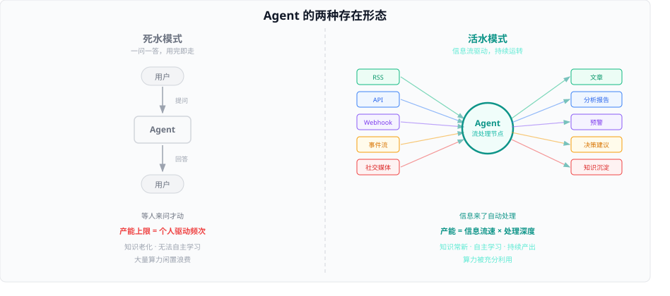
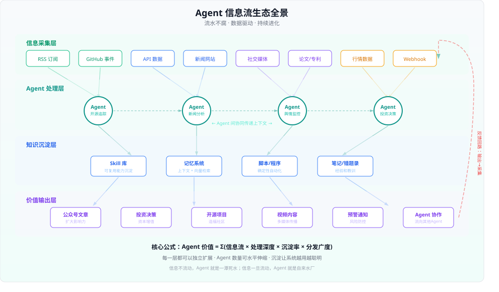
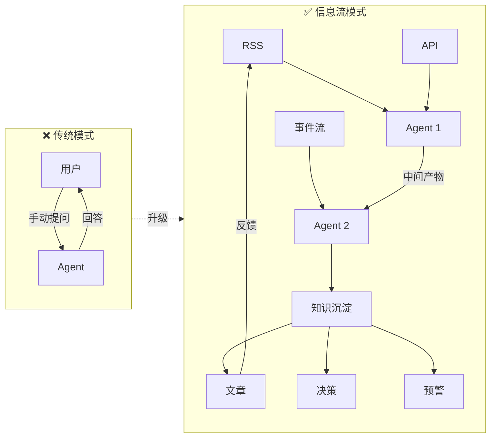
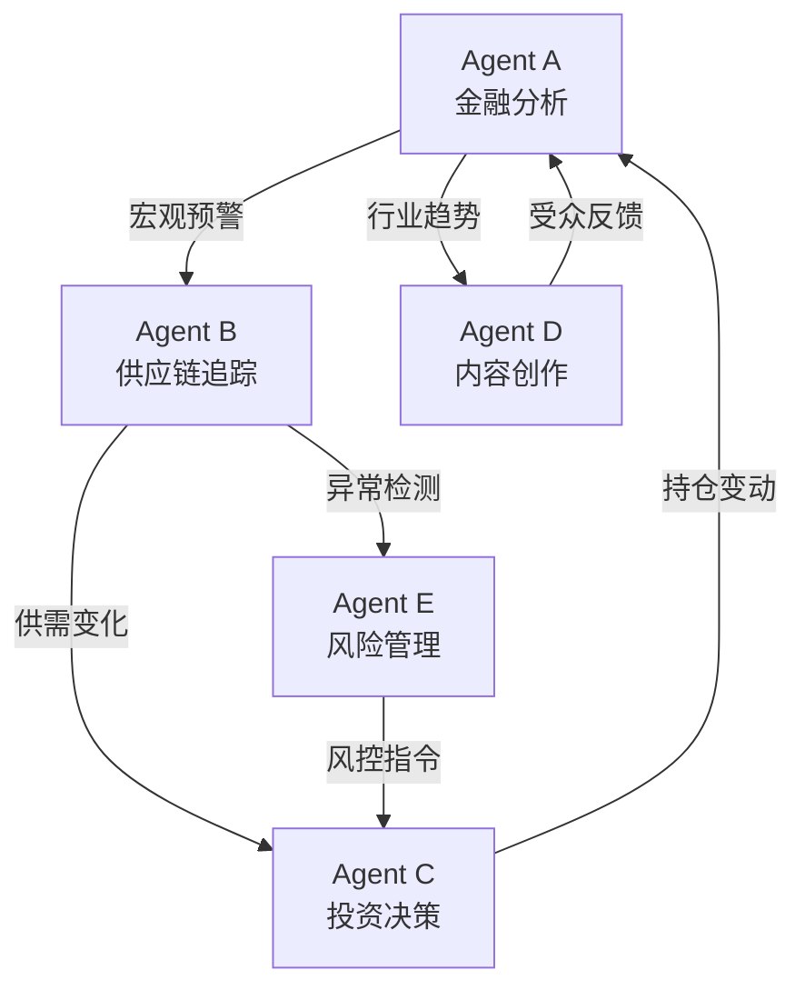

## 德说-第535期, 流水不腐, Agent 必将成为信息网络神经元节点
  
### 作者  
digoal  
  
### 日期  
2026-09-22  
  
### 标签  
AI , 意识 , 神经元 , Agent , 网络 , 数字世界 , 流水不腐  
  
----  
  
## 背景 

 
> 流水不腐  
> 
> 生命在于流动  
>   
> agent 也要接入流动的信息流中, 才能“活”起来  
>   
> 如果只是个人驱动 Agent 干活, 它的产能将受限于个人, 因为个人的信息流输入是有限的.  
>   
> 得把 agent 接入更大的信息流, 并让他成为信息流其中的一个处理节点, 把信息再流出去.  
>   
> 所以未来AI世界, 数据的流动非常重要, agent 因接入流动的数据而闪烁  
 
# 流水不腐：当 Agent 接入信息流，AI 才真正"活"过来

> 一条水渠如果不流水，三个月就长满青苔。一个 Agent 如果没有信息流灌入，和一个 txt 文件有什么区别？

你有没有想过一个问题——

我们现在用 AI 的方式，本质上和用计算器一模一样：打开、用、关上、等下次再打开。即使你用的是最聪明的模型，GPT-5 也好、Claude 4 也好，它的产能上限，取决于你打开它的频率。

你一天问它 10 个问题，它就只能回 10 个答案。你忙了一天没空问，它就闲了一天什么都没干——算力、记忆、能力全部空转浪费。

这不是 AI 本身的瓶颈，这是使用模式的瓶颈。



把上面这张图盯着看十秒钟。左边那个灰蒙蒙的循环，就是今天绝大多数人用 AI 的方式。右边那个多彩的网络，是 Agent 真正该有的样子——接入信息流的活水模式。

区别在哪？一句话：谁在驱动 Agent 干活。

左边靠人驱动，人不来它就停。右边靠数据驱动，数据流不停它就不停。这个差异带来的后果是指数级的。

---

## 一滴水的命运

我们借一个比喻来展开。

一滴水如果掉进了杯子里，它的命运就是蒸发。但如果这滴水汇入了河流，它可能经过十个省、冲刷出一个三角洲、灌溉一整片平原、最终入海蒸腾成云再降下来——它参与了一个巨大的循环系统。

Agent 也是一样。

一个 Agent 如果只被关在本地、等主人来问问题，它就是杯子里的水。但如果你把它接入 RSS、GitHub 事件流、新闻 API、行情数据、社交媒体 Webhook——它就变成了河流中的水。信息流过它，它处理、沉淀、再流出去，成为更大生态系统的一个节点。

这不是夸张。这是正在发生的事情。

---

## 信息流驱动的 Agent 到底长什么样？

让我用一个真实运行的系统来说明。

每天凌晨，一组 cron 定时任务自动触发，抓取全球新闻、PostgreSQL 社区动态、GitHub 周榜、AI 论文趋势。这些数据不是抓来堆在那里的——它们被输送进不同的 Agent：

| 信息源 | 处理 Agent | 输出物 |
|:---|:---|:---|
| 财经新闻 API | daily-finance Agent | 每日财经简报 |
| 财经简报（上一步输出） | finance-core-analysis Agent | 深度机制分析 |
| 深度分析（上一步输出） | finance-explosive-article Agent | 公众号爆款文章 |
| PostgreSQL git log | postgres-commit-history Agent | PG 内核变更解读 |
| GitHub trending | github-weekly-trending Agent | 开源热门项目文章 |
| 权威网站状态 | authority-sites-curator Agent | 站点健康日报 |

注意看第 1-3 行——它是一条流水线。上一个 Agent 的输出，是下一个 Agent 的输入。信息像水一样流过三个节点，每经过一个节点就被提纯、加工、增值。

这就是"Agent 因接入流动的数据而闪烁"的具体含义。

---

## 不只是管道，是一个生态

如果你只看到了流水线，那只看到了冰山一角。

真正有意思的是生态效应——当多个 Agent 同时运转，它们之间会产生化学反应。



这个四层架构的核心洞察是：

第一层，信息采集——Agent 不挑食。RSS、API、Webhook、爬虫、社交媒体、论文数据库，什么都可以接入。每多接一个信息源，系统的"视野"就宽一分。

第二层，Agent 处理——Agent 不是孤岛。Agent 之间可以传递上下文、可以协同、可以把自己的输出喂给另一个 Agent。一个追踪开源项目的 Agent 发现了重大更新，可以触发另一个 Agent 去写公众号文章。

第三层，知识沉淀——这是让系统越用越聪明的关键。每次处理不是用完就扔，而是往 Skill 库、记忆系统、脚本程序、笔记系统里沉淀。下次遇到同类问题，不用重头来过。

第四层，价值输出——沉淀不是目的，输出才是。文章、决策、代码、预警、视频——这些才是流到外部世界的"活水"。而且，输出本身又会反馈回第一层：文章发出去有了阅读数据和评论，这些数据又可以被采集回来，形成闭环。

右侧那条红色虚线画的就是这个反馈回路。有了它，整个系统就从"流水线"变成了"自来水厂"——自我循环、自我优化、永不停转。

---

## 一个核心公式

把上面的逻辑压缩成一个公式：

$$
\text{Agent 价值} = \sum(\text{信息流} \times \text{处理深度} \times \text{沉淀率} \times \text{分发广度})
$$

四个变量，每个都可以独立优化：

- 信息流：接入更多数据源，提高更新频率
- 处理深度：让 Agent 不只是搬运信息，而是做深度分析、交叉验证、生成洞察
- 沉淀率：处理过的信息有多少变成了可复用的 Skill、脚本、记忆
- 分发广度：产出物能触达多少人，能反馈多少信号回来

传统模式下，这四个变量的值都接近于 0——因为没有信息流，自然没有后面三个。



---

## 这件事对不同角色意味着什么？

### 对产品经理

"Agent + 信息流"不是一个技术细节，是一个产品范式变迁。

过去做 AI 产品，核心指标是 DAU（日活用户数）——因为用户不打开产品，AI 就没用。但当 Agent 接入信息流后，产品的价值不再取决于用户打开了多少次，而是取决于它背后连接了多少条信息管道。

这意味着 AI 产品的竞争维度变了：

| 维度 | 旧范式 | 新范式 |
|:---|:---|:---|
| 核心指标 | DAU / 停留时长 | 信息流覆盖度 / 产出频率 |
| 用户界面 | 对话框 | 仪表盘 + 订阅流 |
| 付费模式 | 按 token 计费 | 按信息管道数计费 |
| 护城河 | 模型能力 | 数据接入 + 沉淀资产 |
| 用户粘性来源 | 习惯 | 积累的知识图谱和自动化流程 |

注意最后一行——用户粘性来源从"习惯"变成了"资产"。当你的 Agent 沉淀了三个月的行业知识、跑通了十几条自动化流水线、积累了几百个 Skill，你还会换产品吗？这就是信息流模式天然的护城河。

### 对研发

技术栈要变了。过去做 AI 应用就是包一层 API 加个前端。现在你需要：

1. 消息队列 / 事件总线——信息流的基础设施。Kafka、NATS、甚至简单的 cron + 文件系统都行
2. Agent 编排引擎——管理多个 Agent 的生命周期、调度、协同
3. 持久化记忆——向量数据库 + 关系型数据库（PG + pgvector 是最佳选择）
4. Skill 管理系统——让 Agent 的能力可以积累、版本化、共享
5. 可观测性——当你有 20 个 Agent 同时跑，你必须知道每个在干什么、输出质量如何

技术选型建议：别一上来就搞微服务。一台机器、几个 cron、一个 PostgreSQL 实例、一套 Agent 框架——这就够跑起来了。复杂度是后面的事。

### 对投资人

有三个信号值得关注：

第一，"Agent 基础设施"赛道。做 Agent 编排的公司（LangGraph、CrewAI、AutoGen 等），做 Agent 记忆的公司（Cognee、Mem0、Zep 等），做 Agent 可观测的公司——这些是"卖铲子"的角色。信息流模式越普及，它们越受益。

第二，"数据管道"赛道。连接各种数据源到 Agent 的中间件。API 聚合、RSS 托管、Webhook 网关——这些可能比模型本身更有商业价值，因为它们直接决定了 Agent 的"水源"。

第三，"垂直领域 Agent"赛道。一个跑通了金融信息流分析的 Agent 系统，它积累的 Skill、记忆、自动化流程，本身就是壁垒。这不是 SaaS，这是"越用越值钱"的资产——和数据飞轮的逻辑一样。

估值框架也要变：不要只看 ARR，还要看沉淀资产的体量和质量。一个 Agent 系统沉淀了 200 个经过验证的 Skill、5TB 的行业知识图谱、300 条跑通的自动化流水线——这些东西比客户数更能说明它的长期价值。

### 对普通人

你可能觉得这离你很远，但其实不是。

想想你每天被动接收了多少信息——微信群、朋友圈、新闻推送、短视频算法。这些信息流过你的大脑，但 99% 都没有被处理、没有被沉淀、没有产生行动。

如果你有一个 Agent，它帮你：
- 把你关注的行业新闻每天整理成一页纸
- 把你持有的股票相关消息做成预警
- 把你感兴趣的技术动态变成学习计划

你不需要"去用它"，它会主动把处理好的信息送到你面前。这不就是你一直想要的"个人助理"吗？

区别在于——过去的"个人助理"需要你去驱动它，未来的个人助理由信息流驱动，你只需要看结果。

---

## 终局推演：Agent 网络效应

如果我们把视线拉到更远的未来，会看到一个更激动人心的图景。

当单个 Agent 接入信息流已经成为常态后，下一步是什么？是 Agent 与 Agent 之间也形成信息流。



这就是 Agent 网络效应——当 N 个 Agent 互联互通，系统价值不是 N 倍增长，而是 N² 倍增长。

每个 Agent 既是信息的消费者，也是信息的生产者。它们之间的连接越密，整个网络就越聪明。这和互联网的成长逻辑完全一样——价值不在单个节点，在节点之间的连接。

想象一下：

- 一个追踪中美关系的 Agent，发现了一条政策变化
- 它的输出流入追踪供应链的 Agent，后者评估了对芯片产业的影响
- 芯片产业影响又流入投资决策 Agent，后者调整了仓位建议
- 仓位变动又触发了内容创作 Agent，后者写了一篇分析文章
- 文章发出后的受众反馈，又流回金融分析 Agent 修正模型

这一切，不需要任何人手动操作。信息从产生到处理到行动到反馈，全程由数据流驱动。人只在两个地方出现：设计系统、审核结果。

---

## 这不是科幻，是基建

读到这里你可能觉得："这个图景很美好，但离现实太远了吧？"

其实没有那么远。所有的技术组件今天都已经存在：

| 组件 | 当前可用方案 | 成熟度 |
|:---|:---|:---|
| 大模型推理 | GPT-4o / Claude / Gemini / Llama / Qwen | ★★★★★ |
| 向量存储 | PG + pgvector / Milvus / Qdrant | ★★★★☆ |
| Agent 框架 | LangGraph / CrewAI / AutoGen / Antigravity | ★★★★☆ |
| 定时调度 | cron / Airflow / Prefect | ★★★★★ |
| 消息队列 | Kafka / NATS / Redis Streams | ★★★★★ |
| Skill 管理 | YAML + Markdown（手工） | ★★★☆☆ |
| Agent 记忆 | Cognee / Mem0 / Zep / 自建 | ★★★☆☆ |
| Agent 可观测 | LangSmith / Langfuse（早期） | ★★☆☆☆ |

成熟度最低的两项——Skill 管理和可观测性——恰恰是最大的创业机会。

而且你不需要等所有组件都完美才能开始。最简方案就是：

```
一台服务器 + cron + Agent 框架 + PostgreSQL
```

用 cron 做调度，用 Agent 框架做处理，用 PostgreSQL 做存储和向量检索。简单、稳定、可迭代。等跑通了核心流程，再逐步替换成更专业的组件。

---

## 写在最后

2500 年前，《吕氏春秋》里写道：

> 流水不腐，户枢不蠹

这八个字不仅是物理规律，更是一切"活"系统的第一性原理。

生命因为有血液循环才能存活。经济因为有资金流动才能繁荣。互联网因为有数据流动才有价值。Agent 因为接入信息流才能真正"活"起来。

接下来的三到五年，AI 行业最重要的基础设施建设，不是更大的模型、更快的推理——而是让 Agent 接入流动的数据。谁能把信息流的管道建得又粗又多又稳，谁就拥有了 AI 时代的"自来水厂"。

而自来水厂的价值，你懂的——整座城市都离不开它。
  
  
  
#### [PostgreSQL 解决方案集合](../201706/20170601_02.md "40cff096e9ed7122c512b35d8561d9c8")
  
  
#### [德哥 / digoal's Github - 公益是一辈子的事.](https://github.com/digoal/blog/blob/master/README.md "22709685feb7cab07d30f30387f0a9ae")
  
  
#### [About 德哥](https://github.com/digoal/blog/blob/master/me/readme.md "a37735981e7704886ffd590565582dd0")
  
  

  
