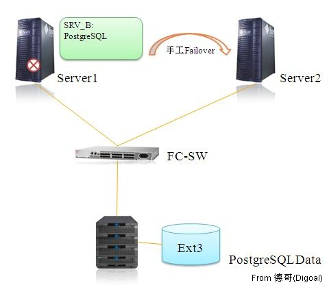
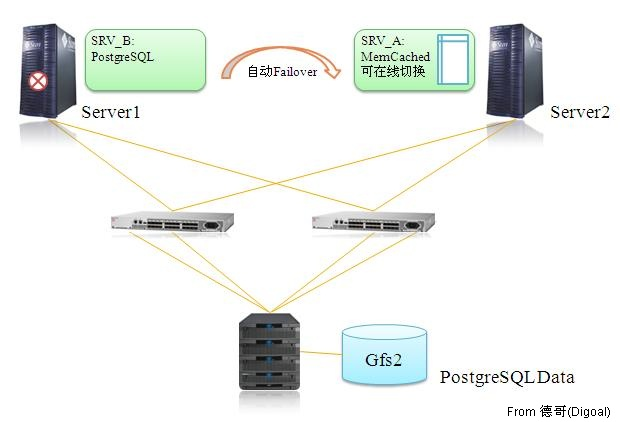

## MemCached.PostgreSQL.RHEL.GFS2.MultiPath  
       
### 作者       
digoal      
        
### 日期      
2010-05-11                                                                                             
       
### 标签                     
PostgreSQL , MemCached , PostgreSQL , RHEL , GFS2 , MultiPath    
          
----         
          
## 背景     
PostgreSQL数据库运行的OLTP系统在DML(非DQL)操作后,日积月累碎片文件会越来越多(即便开启AUTOVACUUM),大大增加数据库页面扫描的个数已经系统IO负载,同时也浪费DBBUFFER;这和PostgreSQL的数据处理机制有关就不多说了。  
  
具体的处理办法很多,单节点的数据库如数据重新加载,rebuild表,或者使用slony这样的工具结合一些中间件pgpool等减少维护时间。  
  
使用RHEL的Failover套件实现PostgreSQL高可用一例  
  
  
  
PostgreSQL8.3  
  
multipath  
  
RHEL5.4 x64  
  
Memcached  
  
Gfs2  
  
Redhat Cluster  
  
  
  
简单步骤:  
  
1\. 配置存储  
  
RAID,  hotspare.  
  
2\. 安装操作系统  
  
redhat enterprise linux x64  
  
3\. 配置Multipath  
  
```  
/etc/multipath.conf  
  
blacklist {  
  
devnode “^cciss/*”  
  
}  
  
blacklist {        devnode “^cciss/*”}  
```  
  
4\. 安装数据库服务端  
  
5\.1 配置集群  
  
5\.2 配置IPTABLES  
  
6\. 配置gfs2文件系统  
  
7\. 初始化数据库  
  
7\.1 初始化  
  
7\.2 创建用户(与老系统一致)  
  
7\.3 创建表空间  
  
7\.4 创建数据库  
  
7\.5 修改数据库,表空间权限  
  
7\.6 FAILOVER测试  
  
8\. 安装memcached  
  
9\. 数据迁移  
  
9\.1 停业务  
  
9\.2 修改IPTABLES切断数据库与外部链接  
  
9\.3 导出数据  
  
9\.4 导入数据  
  
9\.5 checklist  
  
9\.6 切换VIP地址  
  
9\.7 起业务  
  
10\. 加载常用表到memcached  
    
[Count](http://info.flagcounter.com/h9V1)        
        
