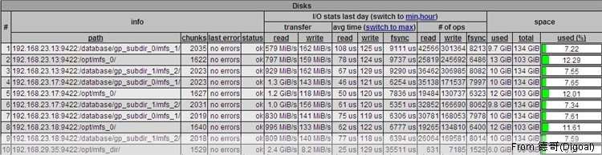

## Moose File System分布文件系统测试  
                                             
### 作者                                             
digoal                                            
                                              
### 日期                                            
2010-05-11                                                                                                                                   
                                             
### 标签                                                           
moose file system , moosefs                    
                                                
----                                               
                                                
## 背景                                           
moosefs是一个开源的分布文件系统软件，可提供高效，可靠的数据存储能力.配置，维护都比较简单。  
  
MOOSEFS对离散读写的性能提升明显。  
  
建议底层使用xfs文件系统,支持更大的文件系统和更多的文件，这个的话rhel6已经加入支持了。  
  
整个分布存储系统由三部分组成：  
  
master:  
  
存储数据位图,权限信息,提供客户端挂载接口,提供图形管理接口等。  
  
metalog(optional)  
  
master服务器的备份。  
  
chunkserver  
  
数据存储服务器，负责存储数据。  
  
clientserver  
  
挂载客户端，负责挂载MASTER节点EXPORT的存储，配置目录冗余度等.需要fuse模块支持.  
  
安装与配置：  
  
1\. master  
  
下载最新稳定程序mfs-1.6.15  
  
添加组、用户  
  
添加程序家目录  
  
配置用户环境变量  
  
编译安装  
  
配置mfsmaster.cfg , mfsmetalogger.cfg , mfsexports.cfg  
  
转移metadata.mfs  
  
配置/etc/hosts  
  
启动mfsmaster进程，mfscgiserv进程  
  
2\. metalogger  
  
下载最新稳定程序mfs-1.6.15  
  
添加组、用户  
  
添加程序家目录  
  
配置用户环境变量  
  
编译安装  
  
配置mfsmaster.cfg , mfsmetalogger.cfg , mfsexports.cfg  
  
转移metadata.mfs  
  
配置/etc/hosts  
  
启动mfsmetalogger进程  
  
3\. chunkserver  
  
下载最新稳定程序mfs-1.6.15  
  
添加组、用户  
  
添加程序家目录  
  
配置用户环境变量  
  
编译安装  
  
分配参与分布文件系统的目录 ， 添加目录的MFS用户可访问权限。  
  
配置mfschunkserver.cfg , mfshdd.cfg  
  
配置/etc/hosts  
  
启动mfschunkserver进程  
  
重复配置剩余的chunkserver  
  
4\. clientserver  
  
下载最新稳定程序mfs-1.6.15 ，fuse  
  
首先安装fuse(modprobe fuse,vi /etc/ld.so.conf,ldconfig)  
  
然后添加组、用户  
  
添加程序家目录  
  
配置用户环境变量  
  
编译安装mfs  
  
配置/etc/hosts  
  
加载mfs文件夹,配置目录goal等  
  
使用：  
  
监控(http://masterserver:9425)  
  
启动(master,metalogger,chunkserver,client)  
  
关闭(client,chunkserver,metalogger,master)  
  
测试(待续)：  
  
测试环境  
  
master 8核8G MEM  
  
metalogger 8核8G MEM  
  
chunkserver1 8核8G MEM 3disks  
  
chunkserver2 8核8G MEM 3disks  
  
chunkserver3 8核8G MEM 3disks  
  
client1 8核8G MEM  
  
client2 8核8G MEM  
  
switch bandwidth 1G  
  
1\. 读写测试  
  
测试读写性能,2台客户机同时拷贝数据至MFS.  
  
goal转换  
  
  
  
2\. 冗余度测试  
  
设置目录冗余度，在目录中创建文件，CRASH掉冗余度-1台节点，查看文件是否完整。  
  
结论：完整  
  
设置目录A冗余度，-r 2,设置目录冗余度B，-r 3,在目录A中创建文件a，查看文件a冗余度，拷贝a到B目录，查看a冗余度。将文件从A目录移动到B目录，查看移动后文件冗余度。  
  
结论：移动不影响冗余度，复制冗余度受目录限制。  
  
3\. MASTER节点恢复测试  
  
CRASH MASTER节点，恢复。查看数据是否丢失。  
  
结论：无丢失。  
  
4\. chunkserver扩展测试  
  
记录总容量A，增加节点，记录总容量B。比较A,B  
  
结论：容量立即增加。  
  
5\. CHUNKSERVER节点crash测试  
  
记录总容量A，CRASH某节点，记录总容量B，恢复某节点，记录总容量C。比较A,B,C  
  
结论：CRASH后容量减去被CRASH的节点容量，恢复后容量恢复原状。  
  
6\. 数据一致性测试  
  
写A文件，CRASH某CHUNK，修改A文件，恢复某CRASH，查看A文件。  
  
多个节点同时VI某个文件。  
  
结论：文件一致。  
  
7\. 回收站测试  
  
超时测试：新建文件，设置trashtime，删除文件，查看剩余容量。比较超时设置与剩余容量。  
  
回退测试：删除，回退。  
  
结论：超时配置与预期一致，回退功能正常。  
  
8\. 权限设置测试  
  
测试目标uid,gid  
  
结论：与目标UID,GID一致。  
  
总结：  
  
1\. 从MOOSEFS的架构可以看出最容易出现瓶颈的是MASTER节点部分，通信瓶颈或服务器的瓶颈  
  
2\. 最好在MOUNT的时候取消文件和目录的CACHE，防止不同步  
  
3\. 适当调整超时时间,必要时删除META立即回收空间  
  
4\. 配置hotstandby提高可靠性，官方称可以将切换做到1分钟以内。  
  
5\. 做好CHUNKSERVER的配额，防止溢出。  
  
命令参考：  
  
http://moosefs.org/  
          
[Count](http://info.flagcounter.com/h9V1)                                              
                                              
