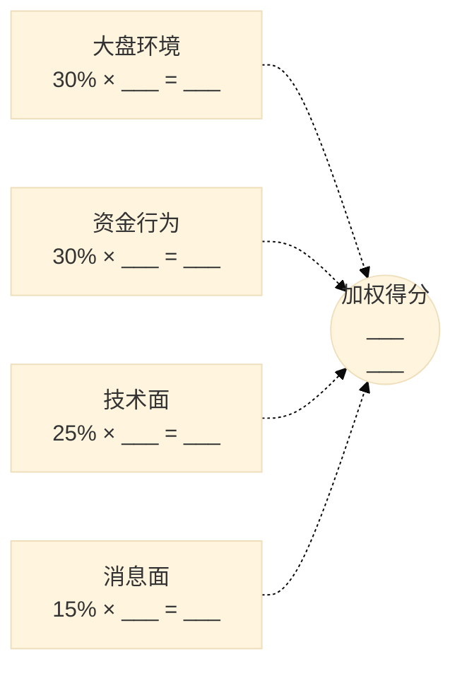
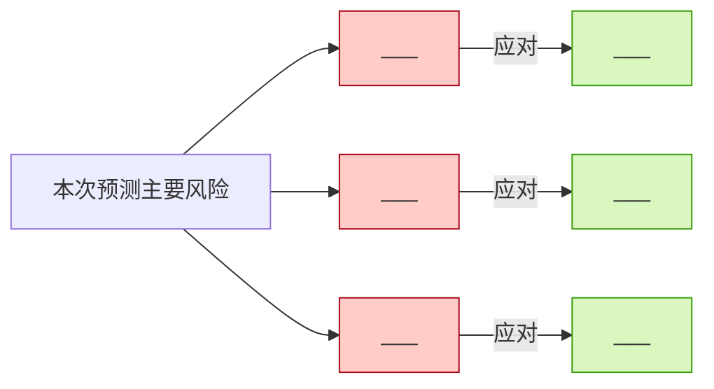

# A股个股次日走势预测报告模板

> 这是写出 markdown 报告的标准骨架。把所有 `___` 占位符替换成真实值,删除所有"📝 说明:"行(那是给作者看的),保留所有"⚠️ 免责声明"。
> 文件命名:`a-stock-{代码}-{YYYY-MM-DD}.md`,保存到 `<项目根目录>/markdown/` 下。

---

# {股票代码} {公司全称} 次日走势预测

> **预测日期:** YYYY-MM-DD(预测生成时间)
> **目标交易日:** YYYY-MM-DD(预测对应的次日)
> ⚠️ **免责声明:** 本预测基于公开信息与概率推断,**不构成投资建议**。A股次日方向是低信噪比事件,任何 ≥ 65% 的概率都视为过度自信。请基于自己的风险承受能力做决策,股市有风险,入市需谨慎。

---

## 一、核心结论(速读)

| 项目 | 内容 |
|---|---|
| **方向预测** | ___ (看多 / 看空 / 震荡) |
| **次日方向概率** | ___% (区间 ___ % - ___ %) |
| **置信度** | ___ (高 / 中 / 中低 / 低) |
| **价格区间(80% 置信)** | ___ 元 - ___ 元 |
| **期望中枢** | ___ 元(较收盘 ___%) |
| **建议入场价** | ___ 元 |
| **建议止损价** | ___ 元(亏损 ___%) |
| **建议目标 TP1** | ___ 元(赔率 1:1) |
| **建议目标 TP2** | ___ 元(赔率 2:1) |
| **建议仓位** | 总资金的 ___% |

**一句话总结**:___ (用 30 字内说清楚:为什么这个方向、最大的看多 / 看空理由是什么、最大的风险是什么)

---

## 二、标的画像

| 字段 | 值 |
|---|---|
| 股票代码 | ___ |
| 公司全称 | ___ |
| 所属交易所 | ___ (沪市主板 / 深市主板 / 创业板 / 科创板 / 北交所) |
| 涨跌停幅度 | ±___ % |
| 申万一级行业 | ___ |
| 主要概念题材 | ___ |
| 是否 ST | ___ |
| 是否融资融券标的 | ___ |
| 是否陆股通标的 | ___ |
| 当前流通市值 | ___ 亿元 |
| 今日收盘价 | ___ 元 |
| 今日涨跌幅 | ___% |
| 今日成交额 | ___ 亿元 |
| 今日换手率 | ___% |

---

## 三、四维分析详细推导

### 3.1 大盘环境(权重 30%,打分 ___)

**核心证据(每条都要有数据来源 [n]):**

1. **指数状态**: 上证指数 ___ 点(_/_/__ 收盘),___ 5 日均线 [1]
2. **涨跌停家数**: 今日涨停 ___ 家,跌停 ___ 家,涨跌家数比 ___ [2]
3. **主线连板**: 今日最高 ___ 板,主线板块是 ___ [3]
4. **北向资金**: 净 ___ ___ 亿元 [4]

**打分理由**:大盘整体 ___ (强 / 弱 / 中性),给个股提供 ___ 的环境。综合给 ___ 分。

📝 说明(给作者):
- 满 4 项强势条件 → +2;3-4 项 → +1;混合 → 0;3-4 项弱势 → -1;满 4 项弱势 → -2
- 数据严重缺失 → 打 0 并标注"数据缺失"

### 3.2 资金行为(权重 30%,打分 ___)

**核心证据:**

1. **龙虎榜**: ___ (有上榜 / 无)。若有,买一席位 ___,净买入 ___ 万元 [5]
2. **主力资金净流入**: 今日 ___ ___ 万元,占流通市值 ___ % [6]
3. **北向持股变化**: 较昨日 ___ ___ % [7]
4. **融资余额变化**: 较昨日 ___ ___ % [8]

**打分理由**:大资金的态度是 ___,综合给 ___ 分。

📝 说明:
- 龙虎榜 + 知名游资 + 净买入 5000 万+ → 该项 +1 分
- 主力净流入 > 流通市值 1% → 该项 +1 分
- 北向连续 3 日加仓 → 该项 +0.5 分
- 融资放大 → 该项 +0.5 分(慎,杠杆资金可能是顶部信号)

### 3.3 技术面(权重 25%,打分 ___)

**核心证据:**

1. **K 线形态**: 今日 ___ (大阳 / 大阴 / 十字星 / 长上影 / 长下影),收盘价 ___ 元 [9]
2. **均线系统**: 站上 5/10/20/60/250 日均线?___,均线排列 ___ (多头 / 空头 / 缠绕)[10]
3. **量价配合**: 量比 ___,___ (放量 / 缩量),___ (与价格方向配合 / 背离)[11]
4. **关键位置**: 当前价 ___ 元,前期高点 ___ 元(差 ___%),前期低点 ___ 元(差 ___%)[12]
5. **ATR(近 5 日平均真实波幅)**: ___ 元 [13]

**打分理由**:技术面整体 ___,综合给 ___ 分。

### 3.4 消息面(权重 15%,打分 ___)

**核心证据:**

1. **近一周公告**: ___ (列举关键公告,如"5/30 披露 Q1 业绩超预期")[14]
2. **行业政策**: ___ (近 3 日是否有政策利好 / 利空)[15]
3. **次日公告日历**: ___ (是否有股东大会、解禁、除权除息)[16]
4. **业绩窗口期判断**: 当前是否处于业绩公告窗口期?___ [17]

**打分理由**:消息面整体 ___,综合给 ___ 分。

---

## 四、四维加权汇总

### 加权得分表

| 维度 | 打分 | 权重 | 加权 |
|---|---|---|---|
| 大盘环境 | ___ | 30% | ___ |
| 资金行为 | ___ | 30% | ___ |
| 技术面 | ___ | 25% | ___ |
| 消息面 | ___ | 15% | ___ |
| **加权得分合计** | | | **___** |

### 四维评分可视化(mermaid)



📝 说明:把 `___` 替换为实际值;A/B/C/D 的 class 按 +/- 选择 positive/negative/neutral。

### 方向与置信度

加权得分 ___ 落在 "___ ~ ___" 区间 → **方向: ___** (置信度: ___)

**对冲信号检查:** ___ (如有对冲,如"大盘强 + 技术弱",必须列出并把置信度降一级)

---

## 五、概率推导与价格区间

### 概率计算过程

```
基础概率           = 50% (A股次日方向接近随机)
偏移               = 加权得分 ___ × 7.5% = ___ %
初步概率           = 50% + ___% = ___%
微调               = ___ (说明每条微调的理由)
最终概率           = ___ % (硬性 clamp 到 35-65%)
80% 置信区间       = [___ % - 5%, ___ % + 5%] = [ ___ %, ___ %]
```

### 价格区间计算

```
今日收盘价              = ___ 元
加权得分                = ___
中枢价                  = ___ × (1 + ___ × 1.5%) = ___ 元
近 5 日 ATR             = ___ 元
理论上界                = ___ + ___ × 1.28 = ___ 元
理论下界                = ___ - ___ × 1.28 = ___ 元

涨跌停板硬约束:
涨停价                  = ___ × 1.10(主板)= ___ 元
跌停价                  = ___ × 0.90(主板)= ___ 元
最终上界 = min(理论上界, 涨停价) = ___ 元
最终下界 = max(理论下界, 跌停价) = ___ 元
```

### 概率分布可视化

```
次日方向概率分布:

看多 ___ % ███████████████████████░░░░░░░░░░░░░░░░░░  ___%
看空 ___ % ██████████░░░░░░░░░░░░░░░░░░░░░░░░░░░░░░░  ___%
震荡 ___ % ████░░░░░░░░░░░░░░░░░░░░░░░░░░░░░░░░░░░░░  ___%

80% 置信区间:[___%, ___%]
```

### 价格区间可视化(ASCII)

```
   ←跌停                                                  涨停→
   ___ ────|──── ___ ────|──── ___ ────|──── ___ ────|──── ___
   跌停    止损          入场         TP1          TP2     涨停
```

---

## 六、交易计划(仅置信度 ≥ "中" 才给)

📝 如果置信度 < "中",直接写"建议观望,等待更明确信号",跳过本节。

### 计划细则

- **入场触发价**: ___ 元
   - 理由: ___ (如"突破 5 日均线 + 量比 > 2")
- **止损价**: ___ 元
   - 理由: ___ (如"跌破 ___ 元前期支撑;或单日亏损 7% 无条件清仓")
- **目标 TP1**: ___ 元(赔率 1:1,平 50% 仓位)
- **目标 TP2**: ___ 元(赔率 2:1,再平 30% 仓位)
- **跟踪止损**: 剩余 20% 仓位,按"当日最高 - 1 × ATR"动态止盈
- **仓位大小**: 总资金的 ___% (基于"单笔亏损 ≤ 2%"反推)
- **最大持仓天数**: ___ 个交易日(到期未触发 TP1 = 平仓)
- **不做条件**: 若次日集合竞价高开 > 7% 或低开 > 5%,放弃执行

### 仓位计算

```
账户净值                       = 假设 ___ 万元
风险预算(2%)                  = ___ 万元
单股最大亏损(入场-止损)       = ___ - ___ = ___ 元
理论仓位股数                   = ___ 元 ÷ ___ 元 = ___ 股
取整(100 倍数)                = ___ 股
仓位金额                       = ___ 股 × ___ 元 = ___ 元
仓位占比                       = ___%

置信度上限约束(___ 置信度上限 ___%)
最终仓位                       = ___ 股 × ___ 元 = ___ 元(___%)
```

---

## 七、风险与陷阱(列 3-5 个)

按风险大小排序,每个风险点必须给"应对方案":

1. **风险点 1**: ___ (具体描述)
   - 应对: ___ (如"如果触发,立即清仓")
2. **风险点 2**: ___
   - 应对: ___
3. **风险点 3**: ___
   - 应对: ___

### 风险陷阱可视化



---

## 八、专业术语小白解释

把本报告中出现的所有专业术语列出,每个用 1-2 句通俗话解释。**默认读者完全不懂股票**。

- **T+1**: ___
- **龙虎榜**: ___
- **主力资金净流入**: ___
- **量比**: ___
- **均线**: ___
- **ATR**: ___
- **赔率(风险报酬比)**: ___
- **置信度**: ___
- **(其他用到的术语)**: ___

📝 说明:可以从 `references/terminology.md` 复制现成解释。

---

## 九、数据来源(编号 [n] 引用)

1. [1] 上证指数收盘数据 - 东方财富网 (URL 或来源说明)
2. [2] 今日涨跌停统计 - 同花顺 (URL)
3. [3] 高度板梳理 - 财联社涨停板池 (URL)
4. [4] 北向资金数据 - 东方财富 (URL)
5. [5] {代码} 龙虎榜 - 交易所龙虎榜 (URL)
6. [6] {代码} 主力资金流 - 东方财富 (URL)
7. ...

📝 说明:每条数据都要标来源,如果是 web_search 结果,标出"经 mcp__MiniMax__web_search 在 YYYY-MM-DD 查询"。

---

## 十、自检清单(给作者用,正式发布时删除本节)

- [ ] 标的画像完整
- [ ] 至少 5 条 P0 搜证查询已执行
- [ ] 四维打分每维都有 2-3 条具体证据 + 数据来源 [n]
- [ ] 加权得分算式清晰、可验证
- [ ] 方向概率 ≤ 65%,并给出区间
- [ ] 价格区间被涨跌停板硬约束
- [ ] 交易计划包含入场/止损/目标/仓位/时间止损/不做条件
- [ ] 至少 2 个可视化图(mermaid + ascii / svg)
- [ ] 至少 5 个专业术语有小白解释
- [ ] 数据来源在文末以 [n] 编号列出
- [ ] 风险点列出 3-5 个,每个有应对方案
- [ ] 文件名:a-stock-{代码}-{YYYY-MM-DD}.md
- [ ] 保存到 <项目根目录>/markdown/

---

> 📌 **再次提醒**:本报告基于公开信息与概率推断,**不构成投资建议**。请基于自己的风险承受能力独立决策。股市有风险,入市需谨慎。
