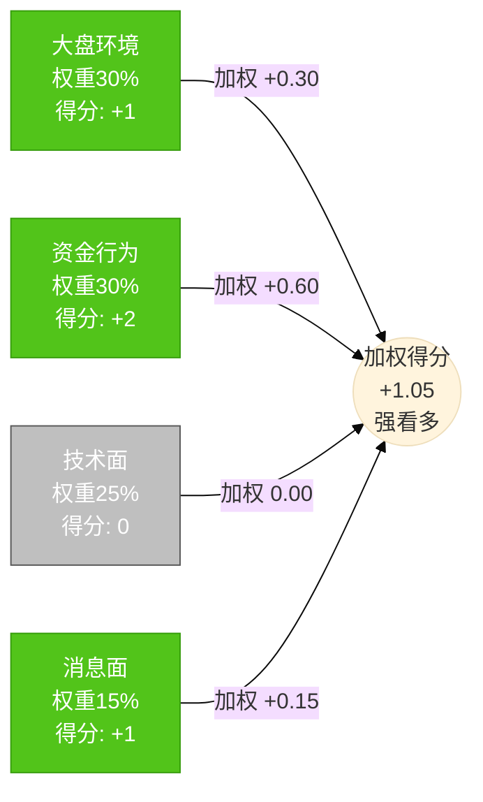
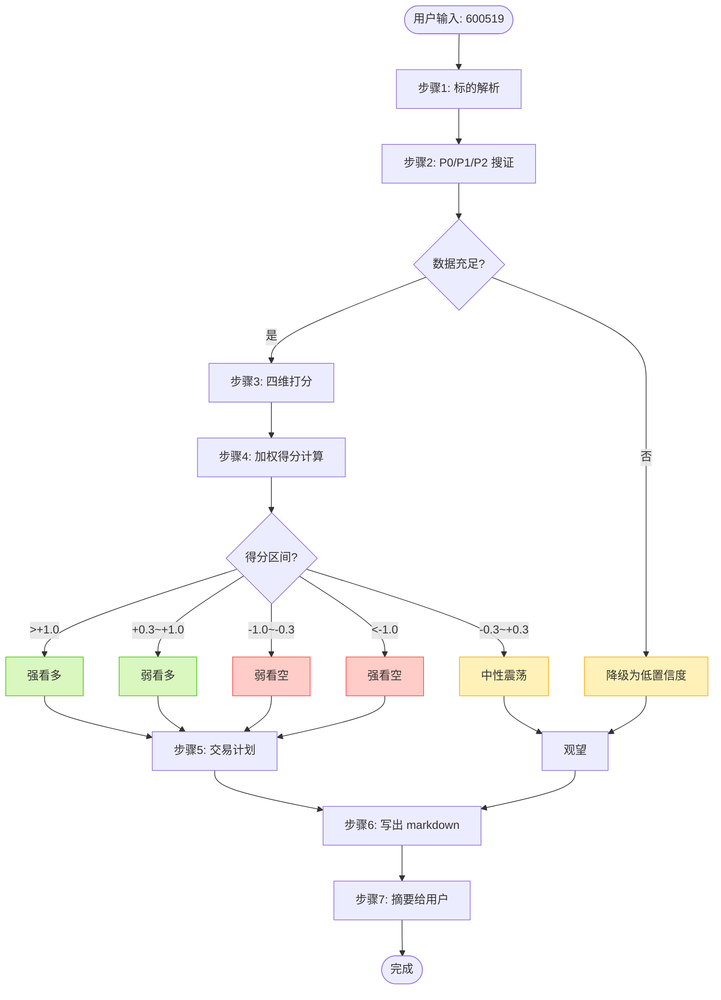
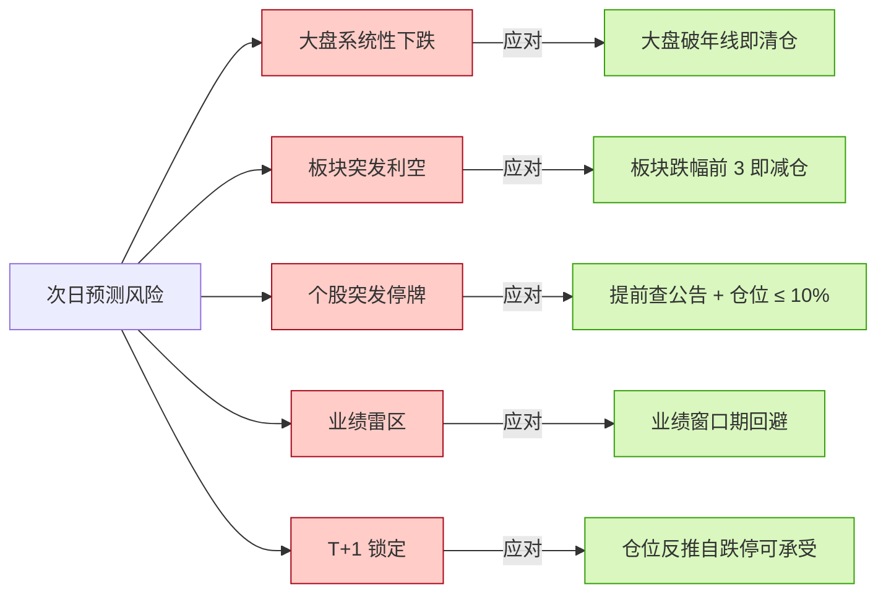

# 可视化模板库(mermaid / ascii / svg)

> 这是 SKILL.md 步骤 6 的扩展。每份预测报告**必须包含至少 2 个图**,优先级:四维雷达 mermaid > 价格刻度 ascii > 概率分布 svg。
> 写报告前先 Read 本文件,挑选适合的模板,把占位符 `___` 替换成实际值。

## 一、四维评分雷达图(mermaid,推荐)

### 模板 A:radar 图(mermaid 11+ 支持)

```mermaid
radar
    title 四维分析雷达图
    "大盘环境(30%)" : ___
    "资金行为(30%)" : ___
    "技术面(25%)" : ___
    "消息面(15%)" : ___
```

> 把 `___` 替换成 -2 ~ +2 的分值。注意:并非所有 mermaid 渲染器都支持 radar,如不支持改用模板 B。

### 模板 B:替代方案 - bar chart



### 模板 C:ASCII 雷达(渲染器不支持 mermaid 时的兜底)

```
四维评分(范围 -2 ~ +2):

                    大盘环境(30%)
                          ▲
                     +2 ─┼─
                     +1 ─┼─ ●  ← 当前 +1
                      0 ─┼─
                     -1 ─┼─
                     -2 ─┼─
    资金行为 ──────────────●────────────── 技术面
       (30%) +2 +1 0 -1 -2   -2 -1 0 +1 +2 (25%)
              ●                 ●
            (+2)              (0)
                     -2 ─┼─
                     -1 ─┼─
                      0 ─┼─
                     +1 ─┼─ ●  ← 当前 +1
                     +2 ─┼─
                          ▼
                    消息面(15%)
```

---

## 二、价格刻度尺(ASCII,推荐)

### 模板 A:横向价格尺(突出止损/入场/目标)

```
价格区间可视化(贵州茅台 600519,单位:元):

   ←跌停                                                  涨停→
   1688 ────|──── 1830 ────|──── 1875 ────|──── 1920 ────|──── 2063
            ↑                ↑              ↑              ↑
          跌停价          止损位         入场价         TP1 目标
                          (-2.4%)        (基准)        (+2.4%)
                                                                     ↑
                                                                 涨停价
                                                                 (+10%)

风险:           入场价 - 止损价 = 45 元(-2.4%)
赔率:           TP1 - 入场价 = 45 元(+2.4%)→ 赔率 1:1(平 50%)
                TP2 - 入场价 = 90 元(+4.8%)→ 赔率 2:1(再平 30%)
```

### 模板 B:竖向价格刻度

```
价格区间(自上而下):

涨停 ─── 2063.05 元  ┐
                    │ 不可能区间
压力位 ── 1965.00 元 │ TP2 (赔率 2:1)
TP1 ──── 1920.50 元  │ (赔率 1:1,平 50%)
            │
   ✦ 中枢 ─ 1905.00 元 ✦  ← 概率最高的次日运行中枢
            │
入场 ──── 1875.50 元  │ 当前收盘价
            │
止损 ──── 1830.00 元  │ 跌破此位无条件清仓
            │
            │ 危险区
跌停 ─── 1687.95 元  ┘

期望区间:1851 - 1959 元(80% 置信)
```

---

## 三、概率分布(SVG)

### 模板 A:简洁概率条

```svg
<svg width="600" height="120" xmlns="http://www.w3.org/2000/svg">
  <!-- 背景 -->
  <rect x="50" y="40" width="500" height="40" fill="#f0f0f0" stroke="#999"/>
  
  <!-- 看空 35% -->
  <rect x="50" y="40" width="175" height="40" fill="#ff7875"/>
  <!-- 中性 7% -->
  <rect x="225" y="40" width="35" height="40" fill="#ffd591"/>
  <!-- 看多 58% -->
  <rect x="260" y="40" width="290" height="40" fill="#73d13d"/>
  
  <!-- 标签 -->
  <text x="137" y="65" text-anchor="middle" fill="#fff" font-size="14" font-weight="bold">看空 35%</text>
  <text x="242" y="65" text-anchor="middle" fill="#fff" font-size="11">7%</text>
  <text x="405" y="65" text-anchor="middle" fill="#fff" font-size="14" font-weight="bold">看多 58%</text>
  
  <!-- 标题 -->
  <text x="300" y="25" text-anchor="middle" font-size="14" font-weight="bold">次日方向概率分布</text>
  
  <!-- 置信区间 -->
  <line x1="237" y1="85" x2="288" y2="85" stroke="#333" stroke-width="2"/>
  <text x="262" y="105" text-anchor="middle" font-size="11" fill="#666">中性 53-63% 置信区间</text>
</svg>
```

### 模板 B:ASCII 概率柱状图(兜底)

```
次日方向概率分布(总和 100%):

看多 58% ████████████████████████████████░░░░░░░░░░░░░░░░░░░░░░  58%
看空 35% ████████████████░░░░░░░░░░░░░░░░░░░░░░░░░░░░░░░░░░░░░░  35%
震荡  7% ███░░░░░░░░░░░░░░░░░░░░░░░░░░░░░░░░░░░░░░░░░░░░░░░░░░░   7%

80% 置信区间: 看多概率 [53%, 63%]
```

---

## 四、决策流程图(mermaid)



---

## 五、ASCII K 线示意(可选)

```
近 5 日 K 线(自左至右,从老到新):

价 1920 ┤                              ┌─┐
   1910 ┤                              │█│       ← 今日(放量大阳)
   1900 ┤                          ┌─┐ │█│
   1890 ┤                  ┌─┐     │█│ │█│
   1880 ┤         ┌─┐      │█│     │█│ │█│
   1870 ┤  ┌─┐    │█│      │█│     │█│ │█│
   1860 ┤  │█│    │█│  ┌─┐ │█│     │█│ │█│
   1850 ┤  │█│    │█│  │░│ │█│     │█│ │█│
   1840 ┤  │█│    │░│  │░│ │█│ ┌─┐ │█│ │█│
   1830 ┤  │█│    │░│  │░│ │█│ │░│ │█│ │█│
   1820 ┤  └─┘    └─┘  └─┘ └─┘ └─┘ └─┘ └─┘
          T-4    T-3   T-2  T-1   T  T(收盘)
        阳线     阴线   阴线  阳线  阳线 阳线
        放量     缩量   缩量  放量  缩量 放量

近 5 日趋势: 阳阴阴阳阳 → 缩量回踩后再次放量,健康趋势
ATR(平均波幅): ~25 元
```

---

## 六、时间轴(mermaid timeline)

```mermaid
timeline
    title 交易计划时间轴(以 2026-06-08 为目标交易日)
    
    section 盘前(8:30-9:25)
        8:30  : 复查隔夜 A50 期指
        9:00  : 扫描突发公告与新闻
        9:15  : 集合竞价开盘
        9:25  : 集合竞价结束、确定开盘价
    
    section 开盘观察(9:30-10:00)
        9:30  : 开盘
        9:45  : 评估开盘 15 分钟量价
        10:00 : 决定是否触发入场
    
    section 持仓监控(10:00-14:30)
        10:00 : 入场后设定止损单
        11:30 : 午盘评估
        13:00 : 午后开盘
        14:00 : 关注尾盘异动
    
    section 收盘前(14:30-15:00)
        14:30 : 触发 TP1 平 50%
        14:50 : 评估剩余仓位
        15:00 : 收盘,记录复盘
```

---

## 七、风险陷阱可视化(mermaid graph)



---

## 使用建议

1. **每份报告至少 2 个图**(雷达 + 价格尺是黄金组合)
2. **mermaid 优先**,因为 Github / Notion / 大多数 markdown 渲染器都支持
3. **mermaid 不渲染时,降级用 ASCII**(永远兼容)
4. **SVG 适合作为概率分布、视觉冲击的辅助**
5. **图必须配文字说明**,不能光给图不解释
6. **图里的数字必须和正文一致**(占位符 `___` 必须替换)
