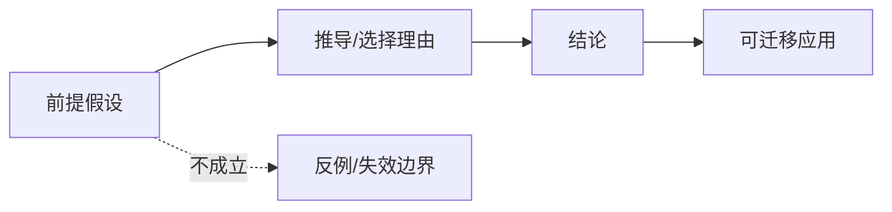

# Axiom Explainer

## Overview

Generate a clear Chinese teaching article for university students and adults with social experience from a single viewpoint, axiom, theorem, law, principle, or theory system. The output must be Markdown, visually rich, and saved under the current project's `markdown/` directory.

## Input Contract

Required input:
- One target concept: a viewpoint, axiom, theorem, law, principle, or theory system.

Optional input:
- Audience level. Default: university students and adults with social experience.
- Desired length. Default: 1800-3000 Chinese characters.
- Source material or references supplied by the user.
- Output filename or topic slug.

If the user gives several concepts, choose the central one only when the concepts clearly form one theory chain. Otherwise ask the user to pick one concept before writing.

## Workflow

1. Identify the input type:
   - Axiom or postulate: explain that it is not proven inside the system. Describe why people choose it, what problem it solves, what assumptions it introduces, and what changes if it is replaced.
   - Theorem or proposition: trace the axioms, definitions, lemmas, and reasoning chain that support it. Give an intuitive proof first, then a concise formal skeleton when useful.
   - Viewpoint, law, principle, or theory system: rewrite it as claims plus assumptions, then explain its evidence chain, mechanism, scope, and failure cases.

2. Scope the audience:
   - Default to university students and adults with social experience unless the user specifies another level.
   - Use concrete analogies before abstract notation.
   - Define specialized terms at first use.
   - State any simplifications made for readability.

3. Verify the concept:
   - Use reliable references when the derivation, history, statement, or applicability is uncertain.
   - Prefer primary sources, standard textbooks, official course notes, or authoritative encyclopedia references.
   - Do not invent historical stories, theorem proofs, or real-world applications.
   - If a topic has multiple versions, name the version being explained.

🔴 CHECKPOINT: Before writing the article, confirm these internal decisions: input type, chosen version, audience level, central question, and the 3-5 named assumptions or boundaries. If any item is unclear and cannot be resolved from the user's prompt or reliable references, ask one concise clarification question.

Write this decision sheet before drafting, then use it as the article's control plan:

| Item | Required content |
|---|---|
| Input type | One of: axiom/postulate, theorem/proposition, viewpoint/law/principle, theory system |
| Chosen version | Exact statement or named version being explained; mark "standard textbook version" or "user-supplied wording" when no narrower source is available |
| Central question | One sentence in the reader's language, not a broad topic label |
| Assumptions and boundaries | 3-5 named premises, each with "成立时" and "不成立时" consequences |
| Evidence or derivation route | For axioms: motivation/model/independence route; for theorems: definition -> lemma -> conclusion route; for viewpoints: claim -> evidence -> counterevidence route |
| Visual plan | Mermaid purpose, SVG purpose, and table/TXT/second-SVG purpose; each must map to one assumption, mechanism, proof step, or failure boundary |

4. Create visuals:
   - Include at least one Mermaid diagram.
   - Include at least one standalone SVG file for mechanism, structure, boundary, geometry, set, coordinate, timeline, or comparison visuals.
   - Include at least one additional visual form: Markdown table, ASCII/TXT diagram, or another standalone SVG file.
   - Use visuals to explain causal chains, assumption boundaries, proof structure, transfer paths, or failure cases.
   - Do not use decorative visuals that do not teach anything.

5. Write and save:
   - Create `markdown/` in the current project if it does not exist.
   - Save the article as `markdown/YYYYMMDD-<topic-slug>.md`.
   - Save SVG assets under `markdown/assets/<topic-slug>/`.
   - Reference each SVG from Markdown with a relative image link: ``.
   - Use a readable topic slug. Pinyin or short English is preferred; Chinese is acceptable when clearer.
   - In the final response, report the saved file path and a short summary. Do not paste the full article unless the user asks.

🔴 CHECKPOINT: Before saving the final Markdown, run this quality gate. If any row fails, revise the article or asset before responding.

| Gate | Pass condition |
|---|---|
| Concept control | The article explains one target concept, or explicitly states why several concepts form one theory chain |
| 求真/求存 separation | "求真讲法" explains truth, acceptance, proof, derivation, or evidence; "求存讲法" explains use, transfer, boundary, and decision value |
| Assumption linkage | Every positive example and negative example names the assumption or boundary that makes it work or fail |
| Visual usefulness | Mermaid, SVG, and the additional visual each teach a different mechanism, boundary, proof step, or comparison |
| Asset integrity | Every SVG file exists under `markdown/assets/<topic-slug>/`, has a valid `<svg xmlns="http://www.w3.org/2000/svg" viewBox="...">`, and is referenced with a relative path |
| Source honesty | References distinguish user-supplied material, textbook/common knowledge, web-verified sources, and unverified claims |

## Failure Handling

| Trigger | First action | Fallback if still unresolved |
|---|---|---|
| Topic is too broad, such as "explain economics" or "explain mathematics" | Narrow it to one named concept in one sentence and ask the user to confirm | If the user wants a broad overview, write a map article and clearly mark that it is not a deep axiom/theorem explanation |
| The statement has multiple versions or disputed wording | Name the selected version and cite the basis for choosing it | Add a "版本差异" paragraph and explain only the version used in the article |
| The proof, history, or attribution is uncertain | Use cautious wording and verify with reliable references | Omit the uncertain story or proof detail; explain the intuition and state what remains unverified |
| Network or source access is unavailable | Use known textbook-level knowledge and mark "未联网核验" in references | Avoid dates, quotations, origin stories, and named attributions that depend on fresh verification |
| The concept is advanced for the requested audience | Use analogy and intuition first, then a small formal skeleton | Move advanced proof details to "进一步学习", and do not pretend the full proof was shown |
| The requested format conflicts with required parts | Preserve `求真讲法`, `求存讲法`, and `思考` as sections or clearly named equivalents | If the conflict is explicit, follow the user format but mention which required parts were mapped where |
| The visual plan cannot be made meaningful | Replace the weak visual with a table, boundary diagram, proof skeleton, set relation, timeline, or counterexample map tied to a named assumption | If only one meaningful visual exists, keep it and state why the extra visual requirement would be decorative |
| SVG creation or validation fails | Repair the SVG syntax, escape special characters, and re-check the relative Markdown link | Fall back to one valid SVG plus a Markdown table; report the limitation in the final summary |
| References cannot verify an attribution or quote | Remove the attribution or quote and explain the concept without it | Mark the claim as "未联网核验" only when the claim is not central to the explanation |

## Article Structure

Use this structure unless the user asks for a different format:

```markdown
# <主题>: 一句话讲透

> 面向对象: <大学生及有一定社会阅历的成年人>
> 核心问题: <这篇文章要解决的困惑>
> 先说结论: <用一两句话说清楚它到底是什么>

## 一张图先看懂

<Mermaid 概念图、推导图、边界图或迁移图>


## 求真讲法

### 它到底说了什么

<用受过高等教育或有现实经验的成年人能听懂的语言重述>

### 它是怎么来的

<公理讲动机和选择理由；定理讲推导链；观点讲证据链>

### 它依赖哪些假设

<列出前提、定义、理想化条件、隐含边界>

### 常见误解

<说明哪些说法看似相近但其实不对>

## 求存讲法

### 它有什么用

<原生领域的作用>

### 它怎么迁移到熟悉领域

<从诞生领域迁移到学习、工作、生活、管理、技术或商业等领域>

### 它的适用范围和边界

<说明什么条件下有效，什么条件下不能乱用>

### 正例: 怎么用它提升能力

<学习、工作或生活中的可操作例子>

### 反例: 前提不成立会怎样

<实际生活或工作中的失败例子，突出逻辑判断和洞察>

## 思考

<发人深省的拓展问题、反事实设问、跨学科联系>

## 最后记住

<3-5 条可复述要点>

## 参考资料

<列出参考来源；没有联网时说明基于通用知识和已知教材体系>
```

## Explanation Standards

- Teach from concrete to abstract: story or现象 -> intuition -> formal statement -> example -> boundary.
- Keep "求真" and "求存" separate: first explain why it is true or why it is accepted, then explain why it matters and where it works.
- For axioms, never say the axiom was "proved" from inside the same axiom system. Use "动机、选择理由、等价表达、独立性、模型解释" instead.
- For theorems, separate "直观理解" from "严格证明". If the full proof is too long, provide a reliable proof skeleton and name the missing lemmas.
- For viewpoints, expose the hidden assumptions and show what evidence would make the viewpoint stronger or weaker.
- Explain assumptions twice when useful: once in "求真讲法" as logical premises, once in "求存讲法" as practical boundaries.
- Use examples that adults can observe, summarize, and reuse. Prefer university learning, career development, work collaboration, technology, money, time, management, investment, health, and decision-making examples.
- Include at least one positive example and one negative example. The negative example must fail because a named assumption is false, not because the person "did it wrong" vaguely.
- Use concise headings and short paragraphs. Avoid empty motivational language.
- Mark uncertain claims explicitly instead of overstating them.

## Anti-Patterns

Do not:
- Prove an axiom from inside the same axiom system.
- Present a slogan, aphorism, or famous quote as true without exposing its assumptions.
- Invent historical anecdotes, named attributions, theorem proofs, textbook references, or real-world cases.
- Treat a famous attribution as evidence for a principle.
- Use a Mermaid chart, SVG, or table as decoration; every visual must teach a mechanism, boundary, proof chain, or counterexample.
- Put inline SVG markup directly inside the Markdown article.
- Reference SVG files with absolute local paths, `file://` URLs, remote placeholder URLs, or paths outside `markdown/assets/<topic-slug>/`.
- Collapse "why it is true or accepted" and "why it is useful" into one mixed explanation.
- Give a negative example where the only reason for failure is "the person did not work hard" or another vague moral judgment.
- Write a broad motivational essay instead of explaining the target concept.
- Let examples float without naming which assumption, boundary, or proof step they illustrate.
- Say "this is useful everywhere" or imply universal transfer without listing failure conditions.
- Paste the full article in the final response after saving it, unless the user explicitly asks.

## Visual Standards

Use diagrams as teaching tools:



Useful visual patterns:

- Mermaid flowchart for assumption -> reasoning -> conclusion -> application.
- Mermaid timeline for historical development.
- Standalone SVG for geometric, spatial, set, coordinate, mechanism, layered-system, payoff, probability, or boundary diagrams.
- Markdown table for "前提成立/前提不成立" comparisons.
- TXT/ASCII diagram only for simple contrasts or before/after relationships.

SVG file rules:

- Create `markdown/assets/<topic-slug>/` before writing SVG files.
- Use lowercase hyphenated SVG filenames, such as `assumption-boundary.svg` or `proof-chain.svg`.
- Keep each SVG self-contained: include `<svg xmlns="http://www.w3.org/2000/svg" viewBox="...">`, embedded text, shapes, labels, and arrows; do not depend on external fonts, CSS, scripts, or remote images.
- Use readable dimensions through `viewBox`; avoid fixed tiny canvases.
- Escape special characters in SVG text, especially `&`, `<`, and `>`.
- Reference the SVG in Markdown with relative syntax only: ``.
- Use SVG aggressively when it improves comprehension: prefer 2-4 standalone SVG figures for complex topics, especially when explaining boundaries, set relations, geometric intuition, proof skeletons, feedback loops, tradeoff curves, or counterexamples.

Do not add fake image URLs. If using an external image, cite its source and make sure it directly supports the explanation.

## Final Checks

Before finishing, verify:

- The article is saved under the current project's `markdown/` directory.
- SVG assets are saved under `markdown/assets/<topic-slug>/` and referenced from the article with relative links.
- The Markdown contains the three required parts: `求真讲法`, `求存讲法`, and `思考`.
- The explanation names the assumptions behind the concept.
- The article includes at least one Mermaid diagram, at least one standalone SVG file reference, and one additional visual/table/SVG/TXT figure.
- The article includes positive and negative examples tied to the assumptions.
- The article distinguishes derivation, proof, motivation, and applicability boundaries correctly.
- Any uncertain statement is marked or removed.
- The article does not contain any anti-pattern listed above.
- The final response gives the saved path and does not flood the user with the full article.
