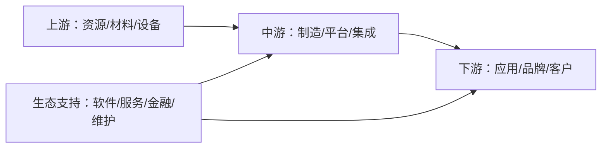
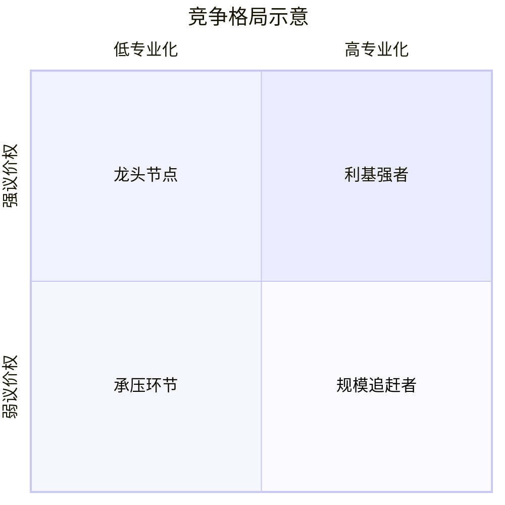

# Report Framework

## Success Criteria

The final artifact must be a source-backed Markdown report saved under the current project's `markdown/` directory. It must let an ordinary investor answer:

- How does this industry's chain make money?
- Which listed companies represent each chain node?
- Where are the profit pools and bottlenecks?
- Which companies have durable advantages, and what could erode them?
- What risks should be read directly from filings instead of inferred from headlines?

## Recommended Report Structure

```markdown
# [行业/产业]产业链投行视角分析：从链条节点到上市公司

> 数据截至：[YYYY-MM-DD]。本文仅用于研究和教育，不构成个性化投资建议。

## 1. 一页结论
- 行业链条的核心矛盾
- 最有议价权的节点
- 最容易被周期或技术替代冲击的节点
- 普通投资人最该跟踪的 5-8 个信号

## 2. 产业链全景图
[Mermaid diagram]

## 3. 节点拆解：价值如何流动
[node-by-node explanation]

## 4. 代表性上市公司清单
[table by chain node]

## 5. 重点公司分析
[company-by-company analysis]

## 6. 竞争格局与护城河
[matrix, moat durability, profit-pool logic]

## 7. 风险揭露
[filing-based risks + industry risks]

## 8. 投资人跟踪清单
[observable indicators]

## 9. 资料来源
[source list with links]
```

## Industry Chain Mapping

Use only nodes that fit the industry. Typical node types:

- Upstream raw materials, components, IP, equipment, infrastructure, or resource owners.
- Midstream manufacturing, processing, integration, platforms, logistics, or distribution.
- Downstream brands, applications, customers, retailers, operators, or end-user channels.
- Enablers such as software, data, tools, finance, certification, standards, maintenance, or after-sales.

For each node, identify:

- Revenue model: product sale, subscription, transaction take rate, spread, leasing, licensing, service fee, advertising, or hybrid.
- Cost drivers: raw materials, labor, R&D, sales channels, capex, energy, logistics, depreciation, content, traffic acquisition, or regulatory compliance.
- Bargaining power: suppliers, customers, substitutes, switching cost, concentration, standards, and scarcity.
- Cycle sensitivity: commodity cycle, capex cycle, inventory cycle, policy cycle, product cycle, credit cycle, or consumer demand.
- Key indicators: price, volume, utilization, backlog, gross margin, inventory days, churn, ARPU, attach rate, capacity, or order intake.

## Company Selection Rules

Prefer companies that satisfy at least one condition:

- Clear listed-company exposure to a chain node.
- Market leader or important challenger with visible public disclosures.
- Representative pure play that explains the economics of the node.
- Strategic supplier/customer whose public filings reveal industry dynamics.

Avoid:

- Private companies unless they are necessary context.
- Companies with only tiny incidental exposure unless clearly labeled.
- Unsourced market-share rankings.
- Overcrowded lists; pick representative names and explain selection logic.

Recommended table columns:

| 节点 | 公司 | 股票代码/交易所 | 代表性原因 | 主要收入来源 | 上下游关系 | 关键观察指标 |
|---|---|---|---|---|---|---|

## Company Analysis Checklist

For each key company, cover:

- Business model: what it sells, who pays, why customers buy, pricing mechanism.
- Upstream: suppliers, critical inputs, cost exposure, supply concentration.
- Downstream: customers, channels, customer concentration, demand drivers.
- Core competitiveness: technology, scale, brand, network effect, licenses, cost advantage, data, location, ecosystem, patents, execution, or switching costs.
- Moat durability: what protects returns, how long it may last, what would weaken it.
- Competition: direct peers, substitutes, new entrants, bargaining power shifts.
- Financial quality signals: revenue growth quality, gross/operating margin, ROIC/ROE, free cash flow, leverage, capex intensity, working capital, cyclicality.
- Risk disclosure: risks named in filings plus industry-specific risks.
- Investor watchlist: 3-5 observable signals that would confirm or break the thesis.

## Moat Framework

Classify moats conservatively:

- Scale economy: lower unit cost, stronger procurement, manufacturing learning curve.
- Switching cost: integration depth, retraining cost, certification, data lock-in, operational risk.
- Network effect: more participants improve product value or liquidity.
- Intangible assets: brand, patents, licenses, standards, trust, regulatory approvals.
- Cost/resource advantage: scarce resource, superior location, process know-how, energy cost, logistics.

Always state the counterargument: why the moat may be weaker than it appears.

## Risk Language

Separate risks into:

- Industry risks: demand slowdown, overcapacity, price war, policy/regulation, technology replacement, geopolitical restrictions, commodity inputs, environmental constraints.
- Company risks: customer concentration, supplier dependence, leverage, related-party transactions, execution, litigation, governance, accounting quality, key-person dependence.
- Valuation risks: high expectations, multiple compression, earnings volatility, dilution, liquidity.

Use filing language when possible, but paraphrase. Do not quote long passages.

## Visual Templates

### Mermaid Industry Chain



### Competitive Landscape Matrix



### ASCII Profit-Pool Sketch

```text
利润池强度： 低 [.] [..] [...] [....] [.....] 高

上游材料      [...]
核心设备      [.....]
中游制造      [..]
品牌/渠道     [....]
运维服务      [...]
```

## Source Standards

Prioritize:

- Company annual reports, 10-K/20-F, exchange filings, prospectuses, investor presentations.
- Regulator, industry association, exchange, customs, central bank, statistics bureau, or official policy documents.
- Reputable financial media and research only for context, not as sole support for critical claims.

Every precise market-size, market-share, financial, or regulatory claim needs a source link. If sources conflict, show the range and explain likely reasons.
