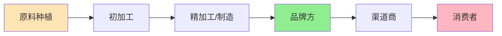
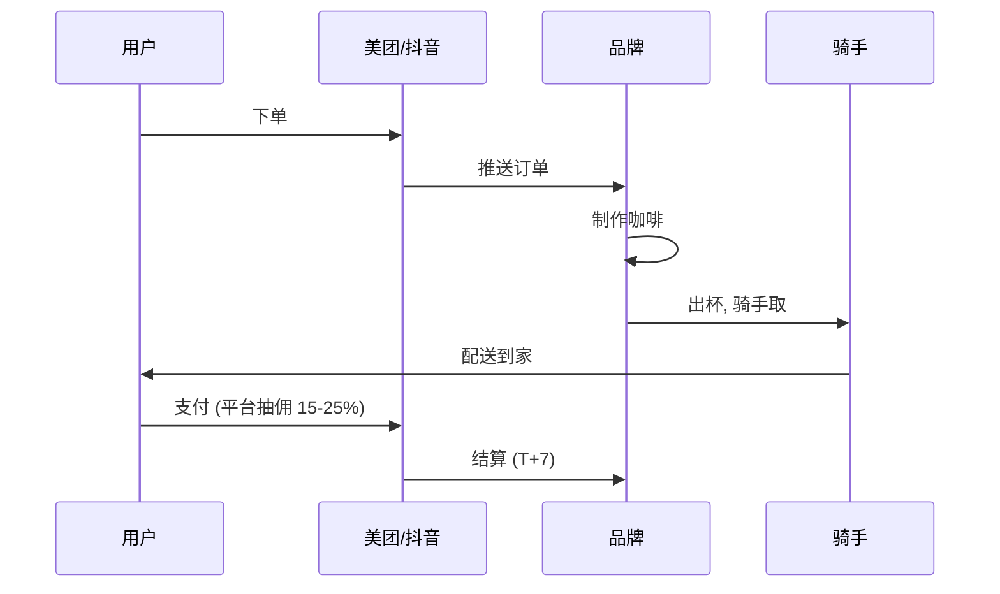
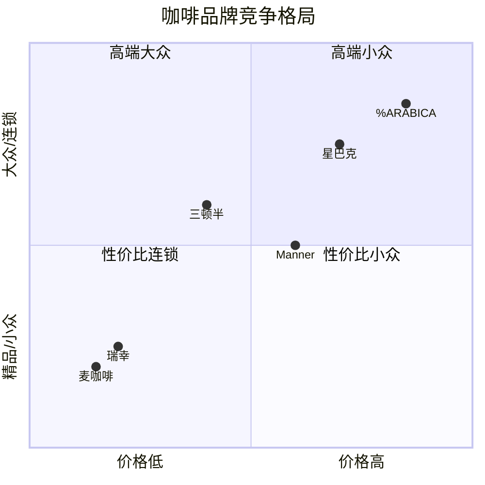
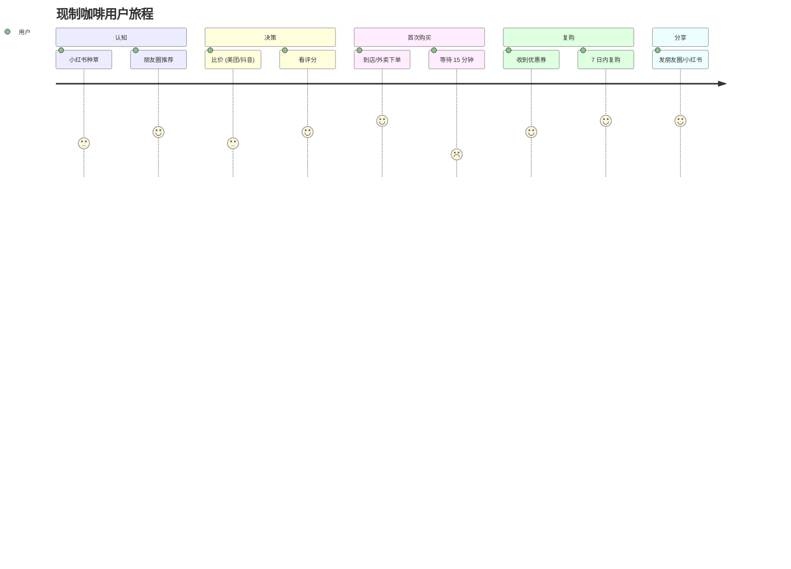
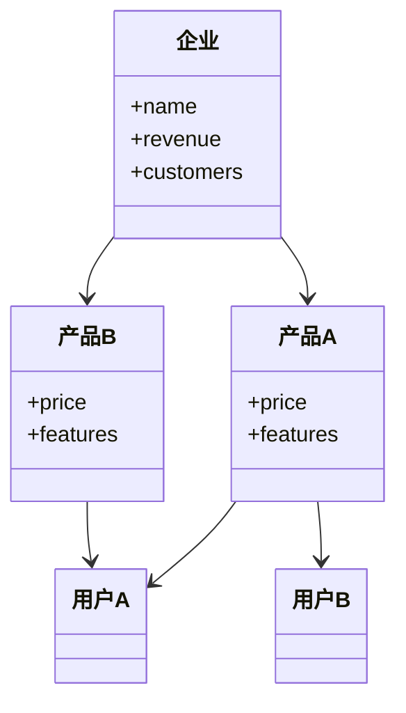

# 可视化规范与范例

本文件规范本 skill 输出报告时使用的图表类型、语法、命名。

---

## 总原则

| 复杂度 | 推荐图表 | 备注 |
|---|---|---|
| 简单 (≤6 节点) | **mermaid flowchart** | 写在 markdown 中 |
| 中等 (流程/时序/关系) | **mermaid sequence / class / state** | 写在 markdown 中 |
| 数据流/利润分布 | **mermaid sankey-beta** | 写在 markdown 中 |
| 象限/位置 | **mermaid quadrantChart** | 写在 markdown 中 |
| 简单对比/层次 | **ASCII art** | 写在 markdown 中 |
| 复杂视觉 (战略地图/生态图/价值网) | **外部 SVG 文件** | 必须外挂, 引用 |

**硬性要求**:
- SVG **绝不内嵌** 在 markdown 中(会大幅膨胀)
- 复杂图必须存为独立 `.svg` 文件, 放在 `markdown/svg/{name}.svg`
- markdown 中用 `` 引用
- SVG 文件命名: `{行业}-{图名}.svg`, 如 `咖啡-价值网.svg`

---

## 1. mermaid flowchart — 产业链全景图

**适用**: 展示上中下游、节点关系

**语法**:
- `LR` (左到右) 适合产业链
- `TD` (上到下) 适合层级结构
- 节点类型: `[]` 矩形、`()` 圆角、`{}` 菱形、`([()])` 胶囊

**范例**:


**配色建议**:
- 上游(原材料): `#FFE4B5` 浅橙
- 中游(制造): `#ADD8E6` 浅蓝
- 下游(品牌/渠道): `#90EE90` 浅绿
- 终端(消费者): `#FFB6C1` 浅粉

---

## 2. mermaid sankey-beta — 利润流向

**适用**: 展示利润/收入如何在产业链节点间分配

**语法**:
```mermaid
sankey-beta
原料端,种植,100
原料端,加工,80
加工,品牌,40
加工,渠道,20
渠道,消费者,30
```

**范例: 咖啡产业链利润流向**
```mermaid
sankey-beta
咖啡豆种植,初级加工,10
初级加工,烘焙,30
初级加工,速溶制造,15
烘焙,品牌零售,60
速溶制造,品牌零售,40
品牌零售,咖啡门店,80
品牌零售,商超电商,40
咖啡门店,消费者,100
商超电商,消费者,30
```

(注意: sankey-beta 在部分 markdown 渲染器中可能不支持, 备选 ASCII 微笑曲线)

---

## 3. ASCII 微笑曲线 — 利润分布备选

```
毛利率 (%)
 50 ┤                                    ╭─● 品牌零售
 45 ┤                                ╭───╯
 40 ┤                            ╭───╯
 35 ┤                        ╭───╯
 30 ┤                    ╭───╯   ● 烘焙/品牌
 25 ┤                ╭───╯
 20 ┤            ╭───╯
 15 ┤        ╭───╯
 10 ┤    ╭───╯
  5 ┤●───╯  ● 加工/制造
  2 ┤●   种植
    └─┬───┬───┬───┬───┬───┬───→
      原料 烘焙 制造 品牌 渠道 终端
```

---

## 4. mermaid sequenceDiagram — 供需连接

**适用**: 展示用户/品牌/平台/履约方之间的交互时序

**范例: 外卖咖啡的连接关系**


---

## 5. mermaid quadrantChart — 竞争格局

**适用**: 展示竞品在两个维度上的位置

**范例: 咖啡品牌定位象限**


---

## 6. mermaid journey — 用户旅程

**适用**: 展示用户从认知到分享的完整旅程

**范例: 现制咖啡用户旅程**


---

## 7. mermaid classDiagram — 商业模式结构

**适用**: 展示企业、产品、用户之间的多对多关系

**范例: SaaS 业务结构**


---

## 8. ASCII 对比矩阵 — 简单表格

**适用**: 当 mermaid 表格不支持或不方便时

```
                    维度       A 公司    B 公司
                    ────────  ───────  ───────
                    营收(2024) 200 亿   80 亿
                    毛利率      35%     22%
                    市占率      25%     8%
                    核心优势   品牌+渠道  技术+成本
                    主要风险   增长见顶  资金链
                    估值 PE     35x     18x
```

---

## 9. ASCII 战略地图 — 替代 SVG 的轻量方案

**适用**: 复杂布局但又想保持纯文本

```
        上游 ── 高利润 ──┐
                         │
        中游 ── 低利润 ──┼── 微笑曲线
                         │
        下游 ── 高利润 ──┘
        
                  ╱ 高毛利 ╲
                 ╱          ╲
        研发端 ╱            ╲ 品牌端
        ───────────────────────────
         左端(设计/IP)    右端(品牌/服务)
```

---

## 10. 外部 SVG — 复杂视觉图

**何时必须用 SVG**:
- 战略地图 (Strategy Map) — 多层级的因果链
- 价值网图 (Value Net) — 多方博弈关系
- 生态图 (Ecosystem Map) — 平台+双边+多边
- 用户体验地图 (Customer Experience Map) — 多触点多情绪
- 商业模式画布的可视化
- 复杂流程图(>15 节点)

### 10.1 SVG 文件结构建议

```xml
<svg xmlns="http://www.w3.org/2000/svg" 
     viewBox="0 0 1200 800" 
     width="1200" 
     height="800"
     font-family="sans-serif">
  <defs>
    <marker id="arrow" markerWidth="10" markerHeight="10" 
            refX="9" refY="3" orient="auto">
      <path d="M0,0 L0,6 L9,3 z" fill="#666"/>
    </marker>
  </defs>
  
  <!-- 背景 -->
  <rect width="1200" height="800" fill="#FAFAFA"/>
  
  <!-- 标题 -->
  <text x="600" y="40" text-anchor="middle" 
        font-size="24" font-weight="bold">
    咖啡产业链价值网
  </text>
  
  <!-- 节点示例 -->
  <g transform="translate(100,150)">
    <rect width="180" height="60" rx="8" 
          fill="#FFE4B5" stroke="#888"/>
    <text x="90" y="35" text-anchor="middle" font-size="14">
      咖啡豆种植
    </text>
  </g>
  
  <!-- 连线示例 -->
  <line x1="280" y1="180" x2="380" y2="180" 
        stroke="#666" stroke-width="2" 
        marker-end="url(#arrow)"/>
  
  <!-- 利润标签 -->
  <text x="330" y="170" text-anchor="middle" 
        font-size="12" fill="#666">
    利润 5-10%
  </text>
</svg>
```

### 10.2 命名规范

放在 `markdown/svg/` 子目录:

```
markdown/
├── 咖啡-行业深度分析.md
└── svg/
    ├── 咖啡-价值网.svg
    ├── 咖啡-战略地图.svg
    └── 咖啡-用户体验地图.svg
```

### 10.3 在 markdown 中引用

```markdown
### 价值网全景


(图中展示 X、Y、Z 三方玩家的博弈关系...)
```

### 10.4 SVG 工具推荐

- **手写**: 简单图用文本编辑器
- **Figma/Sketch**: 设计后导出 SVG
- **draw.io (diagrams.net)**: 免费, 直接导出 SVG
- **Mermaid Live Editor**: 复杂 mermaid 可截图或导出
- **Excalidraw**: 手绘风格, 适合战略地图
- **AI 生成**: 让模型直接生成 SVG 代码 (本 skill 推荐, 但生成后必须人工 review)

---

## 11. 图表选型决策树

```
开始
  │
  ├─ 要展示关系(谁连接谁)?
  │   ├─ 节点 ≤ 6 → mermaid flowchart
  │   ├─ 节点 7-15 → mermaid flowchart (慎用) 或 外部 SVG
  │   └─ 节点 > 15 → 外部 SVG
  │
  ├─ 要展示流向(钱/货/信息)?
  │   ├─ 简单 → mermaid sankey-beta
  │   └─ 复杂 → 外部 SVG
  │
  ├─ 要展示时序(谁先谁后)?
  │   └─ mermaid sequenceDiagram
  │
  ├─ 要展示位置(象限)?
  │   └─ mermaid quadrantChart
  │
  ├─ 要展示用户旅程?
  │   └─ mermaid journey
  │
  ├─ 要展示分类层级?
  │   └─ mermaid classDiagram 或 ASCII
  │
  └─ 要展示对比?
      ├─ 简单 (≤5 项) → ASCII 表格
      └─ 复杂 → mermaid flowchart 矩阵化 或 外部 SVG
```

---

## 12. 风格一致性

为保证整篇报告视觉统一, 遵循:

- **配色**: 上游橙、中游蓝、下游绿、终端粉
- **字体**: sans-serif (SVG 中显式指定)
- **节点形状**: 矩形圆角, `rx="8"`
- **连线粗细**: 1.5-2px
- **标签字号**: 节点内 14-16px, 标签 11-13px
- **背景**: 浅灰 `#FAFAFA` 或纯白
- **避免**: 3D 效果、阴影、过度装饰

---

## 13. 自检清单

输出前对照:

- [ ] 至少 1 张产业链全景图 (mermaid flowchart)
- [ ] 至少 1 张利润分布图 (mermaid sankey 或 ASCII 微笑曲线)
- [ ] 至少 1 张竞争/合作图 (mermaid quadrantChart 或 flowchart)
- [ ] 至少 1 张时序/连接图 (mermaid sequenceDiagram 或 journey)
- [ ] 复杂图已外挂为 SVG 文件
- [ ] SVG 文件在 markdown/svg/ 子目录
- [ ] 引用用 `` 标签
- [ ] 视觉总元素 ≥ 5 个
