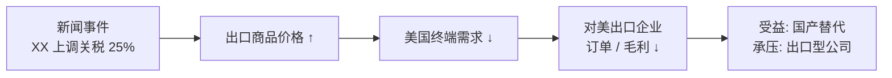
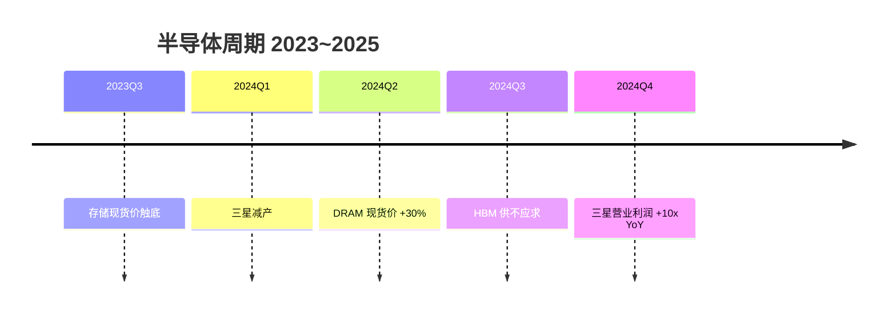
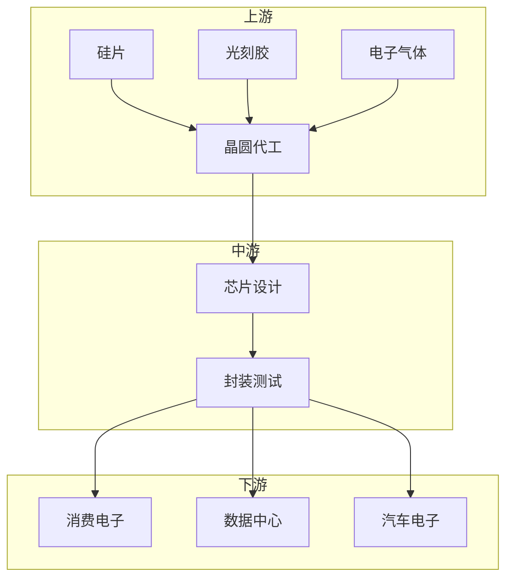
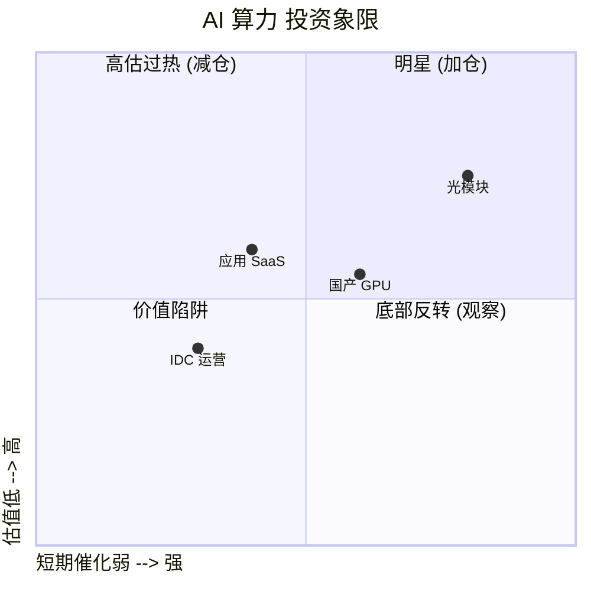

# Diagram Patterns

Step 5 出图时加载本参考。原则: **优先 mermaid 内嵌, 复杂拓扑落地为外部 svg**。

## 1. mermaid 模板

### 1.1 因果链 (最常用)



- 节点文字不超过 2 行, 必要时用 `<br/>` 换行
- 箭头方向 LR / RL / TD 选一个保持全局一致

### 1.2 时序/事件流



### 1.3 产业链 / 桑基 (简化版)



- 节点超过 12 个或层级 > 3 层时, 改用外部 svg

### 1.4 多空博弈 (象限)



## 2. SVG 外部文件规范

### 2.1 何时用 svg 而非 mermaid

- 节点 > 12 个, mermaid 自动布局会糊
- 需要精确控制位置 (如产业链拓扑、对照表)
- 需要自定义图形 (矩形/圆/图标混合)
- 跨平台分享, 不想依赖 mermaid 渲染器

### 2.2 文件存放

- 路径: `markdown/diagrams/` (markdown 报告同级)
- 命名: `kebab-case-<topic>.svg`
  - 例: `semicon-supply-chain.svg`、`fed-rate-transmission.svg`
- 编码: UTF-8, viewBox 设置, 不要写死 width/height

### 2.3 引用语法

在 markdown 中:

```markdown

```

或带尺寸:

```markdown

```

### 2.4 svg 最小可工作模板

```svg
<?xml version="1.0" encoding="UTF-8"?>
<svg xmlns="http://www.w3.org/2000/svg" viewBox="0 0 800 400" font-family="sans-serif">
  <defs>
    <marker id="arrow" viewBox="0 0 10 10" refX="9" refY="5" markerWidth="6" markerHeight="6" orient="auto">
      <path d="M 0 0 L 10 5 L 0 10 z" fill="#333"/>
    </marker>
  </defs>
  <rect x="40" y="40" width="160" height="60" rx="8" fill="#e3f2fd" stroke="#1976d2"/>
  <text x="120" y="75" text-anchor="middle" font-size="14">新闻事件</text>
  <line x1="200" y1="70" x2="280" y2="70" stroke="#333" stroke-width="2" marker-end="url(#arrow)"/>
  <rect x="280" y="40" width="160" height="60" rx="8" fill="#fff3e0" stroke="#f57c00"/>
  <text x="360" y="75" text-anchor="middle" font-size="14">中间变量</text>
  <!-- 继续追加 ... -->
</svg>
```

### 2.5 svg 文字兼容

- **禁用** Web 字体, 全部用 `sans-serif` / `serif` / `monospace` 系统字体
- 中文字符确保 svg 文件以 UTF-8 编码保存
- 字号 ≥ 12px, 否则在 dark mode 下不可读
- 颜色优先用 `currentColor` 或低饱和度, 适配深色背景

## 3. 选择决策树

```
要画的图是 ...
├─ 简单的单向因果 (3~6 节点)
│   └─ mermaid flowchart LR
├─ 时间线 / 事件序列
│   └─ mermaid timeline
├─ 产业链/桑基 (节点 < 12, 层级 < 3)
│   └─ mermaid flowchart TB + subgraph
├─ 2x2 象限 / 散点
│   └─ mermaid quadrantChart
├─ 复杂拓扑 / 精确布局 / 自定义形状
│   └─ 外部 svg (落地到 diagrams/)
└─ 不确定
    └─ 默认 mermaid, 跑出来太乱再升级 svg
```

## 4. 资源清单模板 (放在 markdown 末尾)

```markdown
---
*Sources: [1] Reuters ... [2] 财新 ...*
*Diagrams: [semicon-supply-chain.svg](diagrams/semicon-supply-chain.svg) · [fed-rate-transmission.svg](diagrams/fed-rate-transmission.svg)*
```
