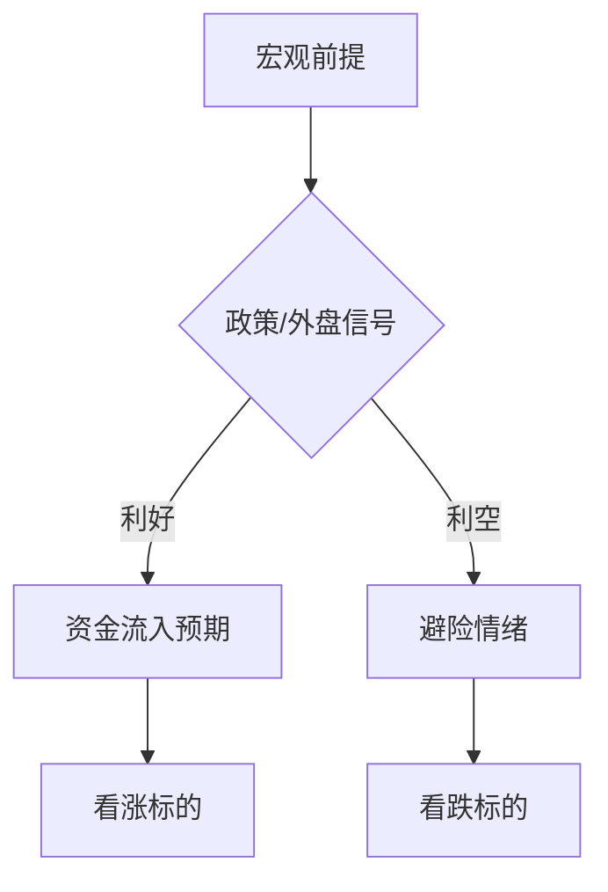

# Market Opening Analyst — 市场开局分析

## 技能目标

在下一次开市前，基于宏观环境、政策信号、资金动向、技术面、市场情绪等多维度数据，对**可能引爆上涨的行业/标的**与**可能下跌的行业/标的**进行系统性推演，并输出带有**前提条件 → 逻辑推导 → 事实验证 → 前提崩塌备选结论**的专业报告。

---

## 工作流程

### Step 1：搜集当前关键信息

使用 `web_search` 搜集以下数据（优先搜索中英文权威来源）：

1. **宏观面**：美联储/央行最新表态、利率动向、汇率（美元指数、人民币中间价）
2. **政策面**：最新政策发布（国务院、证监会、行业监管）、两会/重要会议信号
3. **外盘动向**：美股三大指数、纳斯达克科技板块、港股恒指、日经、欧股收盘
4. **大宗商品**：原油、黄金、铜、铁矿石、农产品期货价格变动
5. **资金面**：北向资金、融资融券余额、ETF申赎、大宗交易异常
6. **市场情绪**：涨跌停个数、量能变化、龙虎榜游资动向、情绪指数
7. **行业催化剂**：最新财报超预期、重大合同公告、行业景气数据（PMI/PPI/CPI等）
8. **近期热点**：AI/新能源/半导体/消费等主线最新进展

搜索策略：
- 关键词：`"A股" OR "中国股市" 今日 开盘`、`美股 隔夜 收盘`、`北向资金 今日`
- 用 `web_fetch` 拉取财经媒体头条（东方财富、同花顺、Bloomberg中文、wind）
- 若无法获取实时数据，明确标注"数据截至知识截点"并基于近期趋势推演

---

### Step 2：构建前提假设矩阵

对每个看涨/看跌结论，设定**基准前提**（Base Case）和**备选前提**（Alt Case），格式如下：

```
前提A（基准）：[描述当前最可能成立的市场假设]
  └─ 逻辑推导：[A → B → C，得出结论]
  └─ 数据支撑：[引用具体数据/事件]
  └─ 结论：[涨/跌，行业/标的]

前提A崩塌条件：[什么情况下该前提不成立]
  └─ 备选前提A'：[替代假设]
  └─ 备选结论：[新的涨跌判断]
```

---

### Step 3：生成报告

输出 Markdown 文件，保存路径：`markdown/市场开局分析_[日期].md`

报告必须包含以下模块（顺序固定）：

---

## 报告结构模板

```markdown
# 📈 市场开局分析 — [开市日期/周期]
> 生成时间：[当前时间] | 分析师：Claude Market Analyst
> ⚠️ 本报告为逻辑推演，不构成投资建议

---

## 一、宏观环境快照

[用 ASCII 表格或 Mermaid 图呈现关键指标]

| 指标 | 最新值 | 变动 | 信号 |
|------|--------|------|------|
| 美元指数 | ... | ... | 🔴/🟢 |
| 人民币汇率 | ... | ... | ... |
| 美股纳指 | ... | ... | ... |
| 北向资金(近5日) | ... | ... | ... |

---

## 二、逻辑推演框架

[Mermaid flowchart 展示整体推演逻辑]



---

## 三、看涨分析 🟢

### 板块/标的 1：[名称]

**前提条件（基准）**
> [清晰陈述该判断成立的前提]

**逻辑推导链**
```
[前提] → [传导机制] → [板块受益] → [预期表现]
```

**数据支撑**
- 📊 [具体数据/事件/政策]
- 📰 [信息来源]

**关键标的**：[公司名/代码]（原因：...）

**前提崩塌预案**
| 崩塌条件 | 备选结论 |
|---------|---------|
| [如果...] | [那么结论反转为...] |

---

## 四、看跌分析 🔴

[同上结构]

---

## 五、不确定性矩阵

[ASCII 图或 Mermaid 象限图，展示各判断的确定性 vs 潜在影响]

```
高确定性
    │   [标的B]          [标的A]
    │
    │──────────────────────────→ 高影响
    │
    │   [标的D]          [标的C]
低确定性
```

---

## 六、开盘观察清单

> 开盘后15分钟内，重点观察以下信号来验证/推翻前提：

- [ ] 量能是否 > 上日50%（验证做多意愿）
- [ ] 北向资金开盘流向（验证外资预判）
- [ ] [看涨板块]指数是否高开高走
- [ ] [看跌标的]是否出现封死跌停
- [ ] 情绪龙头 [标的] 的分时走势

---

## 七、风险提示

[3-5条核心风险，简洁直接]
```

---

## 质量标准

- **每个看涨/看跌结论**必须有：前提 → 推导 → 数据 → 崩塌预案，缺一不可
- **数据引用**：必须标注来源和时间，若为推断需注明"基于近期趋势"
- **图表**：至少包含1个 Mermaid flowchart（逻辑推演）+ 1个 ASCII 矩阵/表格
- **看涨/看跌各至少2个板块或标的**，每个深度分析，不能只列标题
- **语言**：中文，专业但通俗，散户可读，机构可信
- **文件命名**：`市场开局分析_YYYYMMDD.md`（用下一开市日期）

---

## 特殊场景处理

### 节假日后开市
- 搜索节假日期间全球市场变化（美股、港股、商品）
- 额外分析：资金回流节奏、假期效应、节后情绪修复
- 特别标注：`【节后开市专项】`

### 重大事件前夕（央行议息、重要数据发布）
- 加入"事件前后情景分析"模块
- 分析市场定价是否已充分反映预期
- 标注博弈窗口期

### 数据不足时
- 明确标注`⚠️ 数据受限，以下为逻辑推演`
- 基于最近可知数据进行推演
- 降低确定性评级，扩大崩塌预案覆盖

---

## 输出检查清单

完成报告前，自检：
- [ ] 有宏观环境快照（表格/图）
- [ ] 有整体逻辑推演 Mermaid 图
- [ ] 看涨至少2个标的，每个有完整四段（前提/推导/数据/崩塌）
- [ ] 看跌至少2个标的，同上
- [ ] 有不确定性矩阵图
- [ ] 有开盘观察清单（可操作）
- [ ] 文件已保存到 markdown/ 目录
