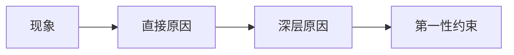
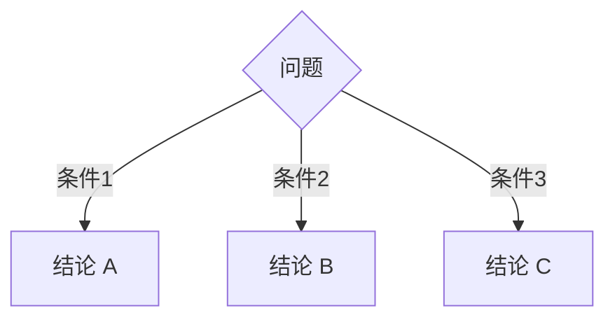
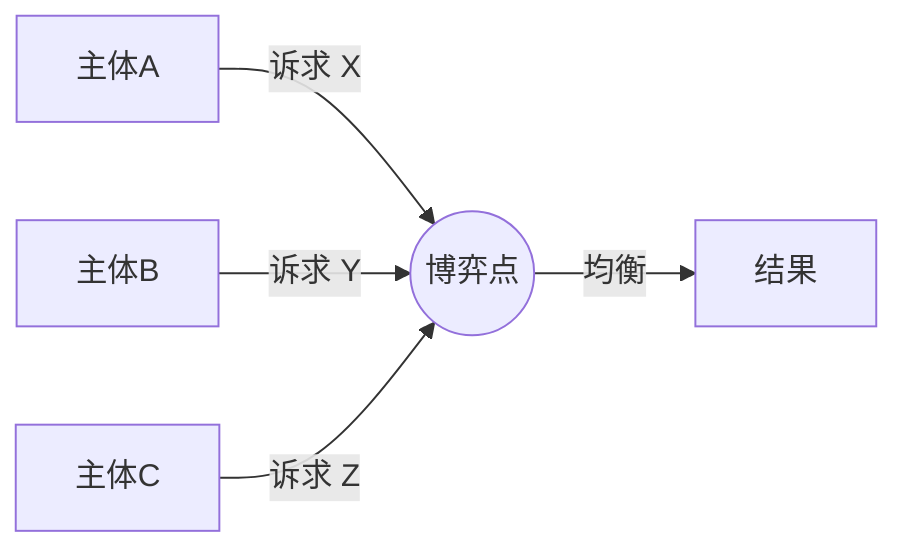
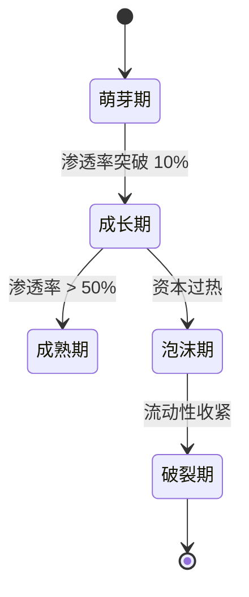
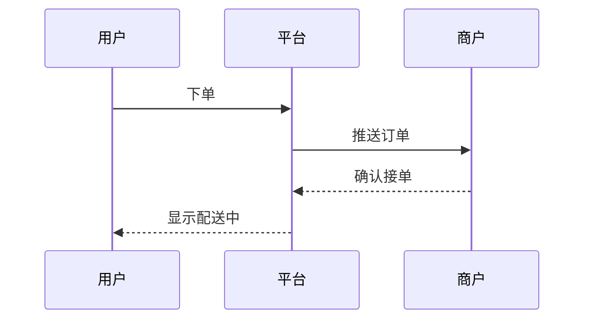
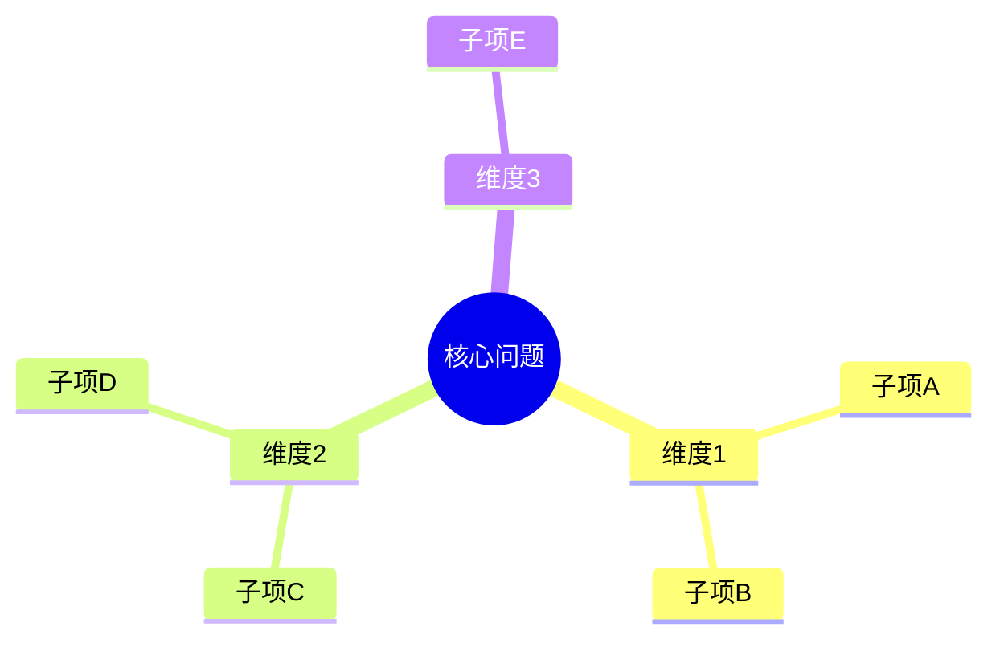
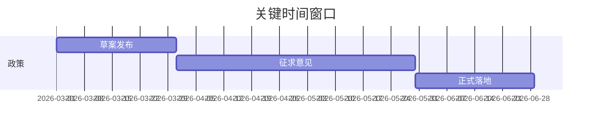
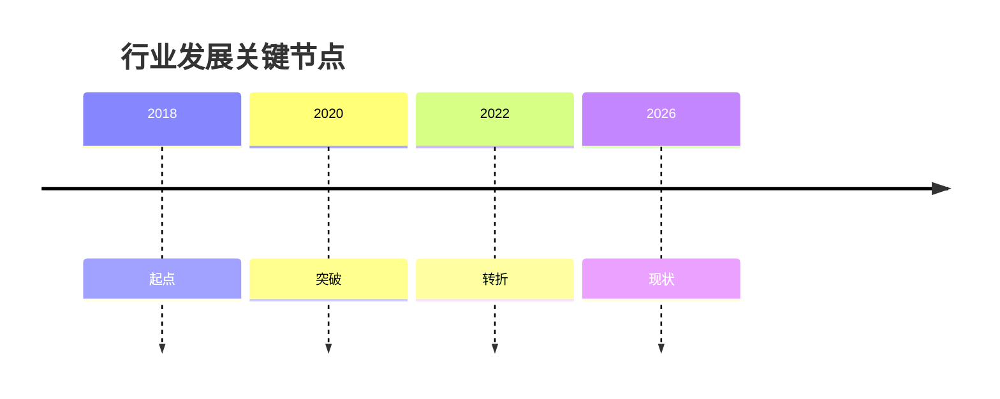

# 图示速查

> 图示服务推理, 不是装饰。一张图能省 500 字, 但前提是图本身不需文字解释就能看懂 80%。

---

## 选型决策树

```
需要表达"时间上的流程/状态切换"?
  ├── 是 → mermaid sequenceDiagram / stateDiagram / gantt
  └── 否
        │
        需要表达"分类/层级/包含"?
        ├── 是 → mermaid mindmap / flowchart TB
        └── 否
              │
              需要表达"循环/反馈/动态平衡"?
              ├── 是 → mermaid flowchart LR (带循环箭头)
              └── 否
                    │
                    需要表达"时间轴上的事件标注"?
                    ├── 是 → mermaid timeline
                    └── 否 → mermaid 思维导图 或 svg 自定义
```

---

## Mermaid 常用范式

### 1. 因果链 (最简单的图, 80% 场景够用)



### 2. 决策树 (二选一/三选一)



### 3. 多方博弈/利益相关者



### 4. 状态机 (政策/产品/项目演变)



### 5. 时序图 (多方互动)



### 6. 思维导图 (拆解复杂主题)



### 7. 甘特图 (时间表 + 里程碑)



### 8. 时间线 (timeline, mermaid 较新语法)



---

## SVG 使用场景

**什么时候必须用 SVG 而非 mermaid**:
- 需要严格控制排版 (画一个真实的产品形态、组织架构、地理示意图)
- 需要用图标/插画表达 (mermaid 不支持图片嵌入)
- 需要做成海报级别的"概念图"
- 需要精确坐标 (例如可视化数学模型)

**SVG 写法约定**:
- 输出**单独文件**: `figure-1.svg`, 放在 markdown 同目录
- 在 markdown 中用 `` 引用
- 推荐 viewBox 而非固定宽高, 自适应缩放
- 中文字体: `font-family="PingFang SC, Microsoft YaHei, sans-serif"`

**最小可用 SVG 模板**:

```xml
<?xml version="1.0" encoding="UTF-8"?>
<svg xmlns="http://www.w3.org/2000/svg" viewBox="0 0 800 500" font-family="PingFang SC, Microsoft YaHei, sans-serif">
  <rect width="800" height="500" fill="#fafafa"/>
  <text x="400" y="40" text-anchor="middle" font-size="24" fill="#222">图标题</text>
  <!-- 你的内容 -->
</svg>
```

---

## ASCII Art (应急/小图)

**适用于**: 简单层级、一两组对比、关键路径高亮, 文字为主时穿插。

```
决策路径
─────────
开始
  │
  ├─ 条件 A 满足 ──→ 走路径 1
  │                     │
  │                     ↓
  │                  验证信号 X
  │                     │
  └─ 条件 A 不满足 ──→ 走路径 2
                        │
                        ↓
                    验证信号 Y
```

**其他常用 ASCII 结构**:
- 时间线: `2018 ─── 2020 ─── 2022 ─── 2026`
- 数值范围: `[0 ─── 10 ─── 50 ─── 100]`
- 对比表: 用 `│` 分列, `─` 分行
- 流程箭头: `→`、`↓`、`↗`

---

## 图的"小白友好"原则

- **节点不超过 7 个**: 米勒定律, 7±2 已经是人类短时记忆极限
- **文字不超过 6 个字/节点**: 长句要拆
- **箭头方向一致**: 不要 LRLR 乱跳
- **配色不超过 3 种**: 冷暖 + 中性
- **关键路径加粗/高亮**: 视觉上指给读者看
- **图标题用疑问句**: "为什么 A 会导致 B?" 比 "因果关系图" 更引导阅读
- **图与图距离一屏以上**: 不要堆 3 张图让读者窒息
