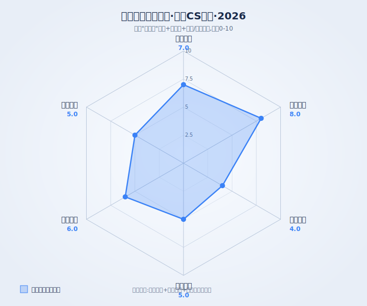
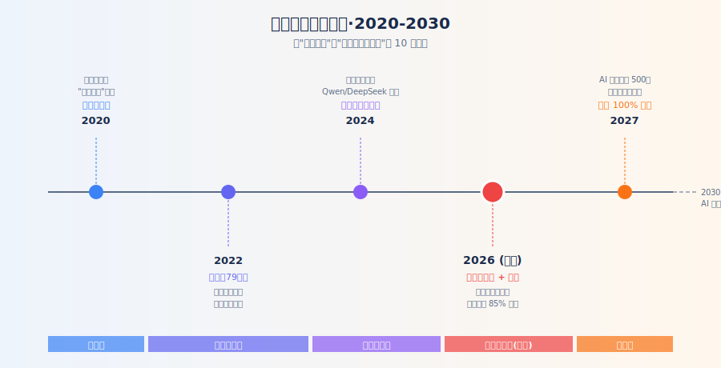
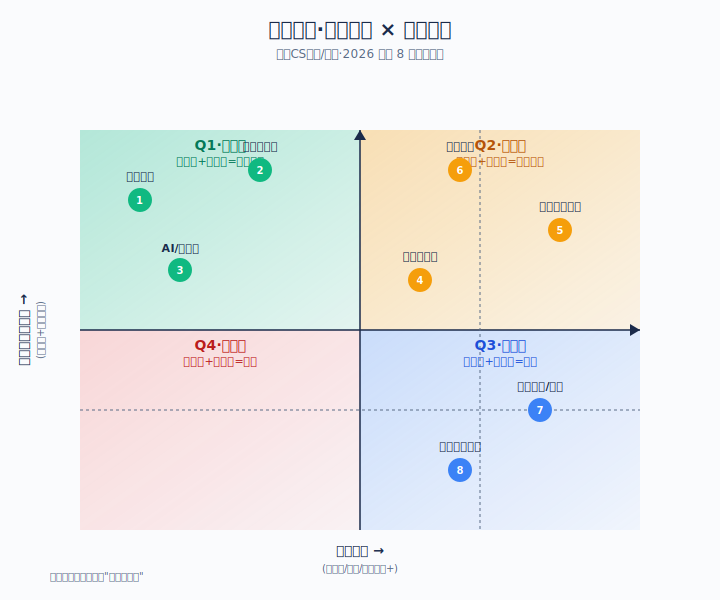
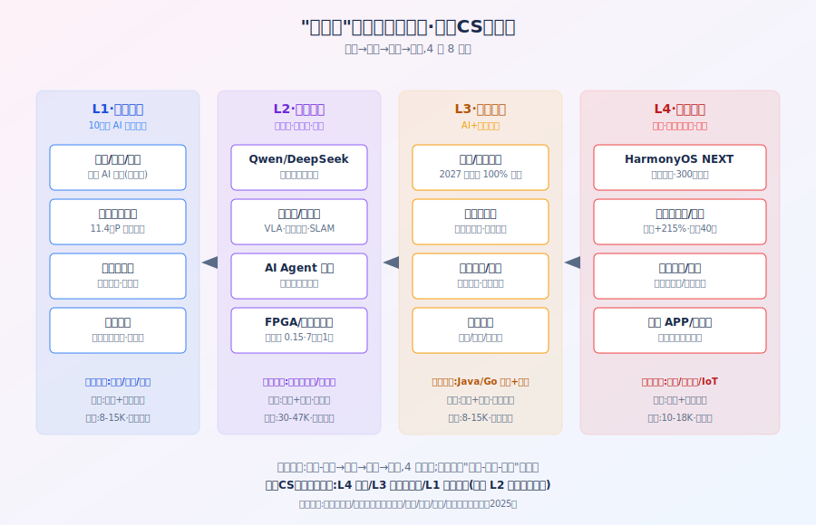
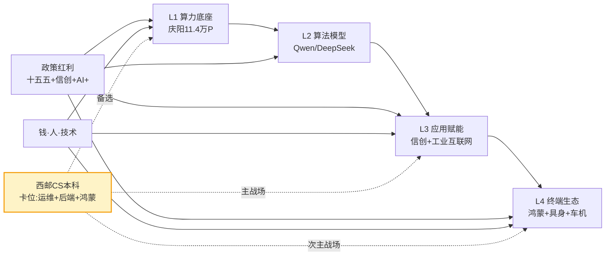

# 国势趋势报告·西邮CS本科·2026 综合型

> 报告生成日期:2026/06/11 · 国家战略锚点:"十五五"规划开局(2026-2030)
> 用户画像:西安邮电大学·计算机科学与技术·大一/大二·就业导向·无强行业积累
> 报告类型:综合型 6 场景全覆盖·长报告(5000+字)

---

## 1. 一句话核心判断

**"国家正在用'智能经济新形态'重写 IT 产业的钱与人流向;作为西邮 CS 本科,你的最优解不是冲算法岗头部内卷,而是卡进'L4 鸿蒙终端 + L3 工业互联网 + L1 算力运维'这三层国产替代主战场,把'信创工程能力 + 鸿蒙认证 + 国央企通道'三件套攒齐,在 2027 年央国企 100% 信创替代节点前完成身份卡位。"**

这句话有三个支撑要素:
1. **势**:2026 是十五五开局年,人工智能被规划纲要提及 30 次,"智能经济"被写入政府工作报告,目标 2030 年 AI 产业规模 10 万亿以上(国家发改委主任郑栅洁 2026/3/6 经济主题记者会披露)。
2. **道**:钱从"互联网平台经济"流向"算力基建 + 信创 + AI 应用",人才从"前端/测试"流向"鸿蒙/算力运维/工业互联网"。
3. **术**:对你而言,头部算法岗是 K 型分化的 A 面(月薪 4.7 万、人才供需比 0.3),普通双非本科是 B 面(月薪<5000、岗位投递比 15:1);**西邮的信通+计算机底子+陕西秦创原+庆阳东数西算的地利,正好能避开 A/B 两极的硬碰硬,挤进 C 面——"政策红利明确、本科门槛可触、稳定性高于互联网"的"国家需要、你够得着"的中间带**。

---

## 2. 势—道—术 速览

### 2.1 趋势雷达(6 大场景机会分值)

打分依据:① 国家政策方向权重 40%;② 行业岗位缺口与薪资溢价 30%;③ 西邮 CS 本科能力匹配度 30%。学习规划分值最高(8.0),原因是国家密集出台 AI 育人政策、信创人才证书补贴、鸿蒙人才白皮书,大一/大二正是抢窗口期;创业分值最低(4.0),原因是资本退潮 + 政策对双非本科生创业不友好(校招口径以就业为主)。

### 2.2 政策与产业时间线

关键节点解读:
- **2020-2021**:数字中国+新基建导入期,十四五规划埋下"数智化"种子。
- **2022**:国资委 79 号文要求央国企 2027 年前 100% 信创替代,信创进入"基础设施期"。
- **2024**:国产大模型(DeepSeek/Qwen)与具身智能双重爆发,人才从"互联网开发"向"AI 工程"切换。
- **2026(现在)**:十五五开局,智能经济新形态定调,**是政策红利最集中释放的窗口**。
- **2027**:信创全面替代节点,叠加鸿蒙 5 商用扩面,人才缺口 500 万。
- **2030**:AI 产业 10 万亿目标达成,行业进入成熟期。

### 2.3 机会矩阵(政策红利 × 用户能力)

| 编号 | 机会 | 政策红利 | 能力匹配 | 象限 | 优先级 |
|---|---|---|---|---|---|
| 1 | 鸿蒙开发(西邮通院强相关) | 高 | 中高 | Q1·黄金区 | ★★★★★ |
| 2 | 国央企信通岗(西邮传统优势) | 高 | 中高 | Q1·黄金区 | ★★★★★ |
| 3 | AI/大模型(读研) | 高 | 中低 | Q1/Q2 边缘 | ★★★ |
| 4 | 工业互联网(秦创原) | 中高 | 中 | Q2·观望区 | ★★★★ |
| 5 | 东数西算运维(庆阳) | 中高 | 中 | Q2·观望区 | ★★★ |
| 6 | 具身智能(读研) | 高 | 低 | Q2·观望区 | ★★★ |
| 7 | 传统前端/测试 | 低 | 高 | Q3·冷门区 | ★ |
| 8 | 纯互联网产品/运营 | 低 | 中 | Q3·冷门区 | ★★ |

### 2.4 产业链卡位图

> 类比:**势**是河流的方向,**道**是水流冲出的河道,**术**是你在哪个河段、用什么姿势下水。

---

## 3. 势:国家在做什么

### 3.1 当前所处周期 + 核心战略方向

中国 IT 产业当前处于**"智能经济新形态"导入期向成长期切换的关键节点**。

- **导入期(2020-2024)**:以"数字中国"为旗,完成新基建、4G/5G、东数西算一期、信创试点。
- **成长期(2026-2027)**:十五五开局,智能经济新形态、算电协同、卫星互联网+算力网+信息通信网"三张网"全面铺开。
- **成熟期(2028-2030)**:AI 产业达 10 万亿规模,行业进入红利收割+格局重塑阶段。

> 关键判断:**2026-2027 是"政策红利"密度最高的两年**,信创 100% 替代节点(2027)+ 鸿蒙 5 全面商用+ 智能原生新业态培育,这三件事会同时爆发。

### 3.2 关键文件/会议(7 条带链接与日期)

1. **《中华人民共和国国民经济和社会发展第十五个五年规划纲要》** — 2026/3/16 全国人大发布,人工智能被提及 30 次,第四篇《深入推进数字中国建设,提升数智化发展水平》单设一篇,目标"十五五"末 AI 产业规模 10 万亿以上。来源:[中央网信办](https://www.cac.gov.cn/2026-03/17/c_1775482046495737.htm)
2. **2026 政府工作报告** — 2026/3 全国两会,"算电协同"首次写入;首提"打造智能经济新形态";深化"人工智能+"行动。来源:[东方财富行业研报](https://data.eastmoney.com/report/zw_industry.jshtml?infocode=AP202603241820716552)
3. **陕西"十五五"规划建议** — 2025/12/8 中共陕西省委发布,"加快西安国家新一代人工智能创新发展试验区建设,组建陕西人工智能产业联盟,打造西部人工智能发展高地"。来源:[陕西官方](https://so.html5.qq.com/page/real/search_news?docid=70000021_1516936236c47952)
4. **国务院《关于深入实施"人工智能+"行动的意见》** — 2025/8 发布,提出 6 大重点行动(科技/产业/消费/民生/治理/全球合作)。来源:[润泽科技公告援引](http://quote.cfi.cn/jyzj/20047/300442.html)
5. **国资委 79 号文** — 要求 2027 年底前所有央企及地方国企实现 100% 信创替代;2026 年党政机关核心业务系统信创产品采购比例不低于 85%、国企不低于 65%。来源:[信创政策汇编](https://blog.csdn.net/weixin_55225254/article/details/160394695)
6. **国务院办公厅《关于在政府采购中实施本国产品标准及相关政策的通知》** — 2025/9/30 印发,2026/1/1 起施行,本国产品 20% 价格评审优惠,信创软硬件全纳入。来源:[安防协会](https://news.21csp.com.cn/C3/202510/11427911.html)
7. **《鸿蒙人才白皮书 2025》** — 2025/12 发布,未来 3-5 年鸿蒙生态将面临百万级人才缺口,新增就业 100-300 万人;鸿蒙开发岗平均薪酬较上年增长 44%,较行业溢价 22%。来源:[腾讯新闻](https://so.html5.qq.com/page/real/search_news?docid=70000021_4876950ca8d59952)

### 3.3 与上轮规划对比:连续性与变化

| 维度 | 十四五(2021-2025) | 十五五(2026-2030) | 变化 |
|---|---|---|---|
| 战略定位 | 数字中国+新基建 | 智能经济新形态 | 从"基础设施"升级为"经济形态" |
| 核心命题 | 数字化转型 | 数智化跃迁+AI 产业 | 加"智"+升"产业" |
| 算力 | 东数西算一期,8 大枢纽 | 全国一体化算力网,论证超大规模智算集群 | 从"工程"变"网络" |
| 能源 | 绿色数据中心 | **算电协同**首次入报告 | 算力与电力双轮 |
| 国产化 | 信创试点(党政 30%) | 2027 年央国企 100% 替代 | 从"试点"到"强制" |
| AI 定位 | 数字技术赋能 | 抢占 AI 产业应用制高点,培育智能原生新业态 | 从"工具"到"新业态" |
| 网络 | 5G/光纤 | **三张网**:算力网+卫星互联网+信息通信网 | 新增"卫星互联网" |

> 一句话总结:十四五做的是"地基",十五五做的是"生态"。**对你而言,地基上的"建筑工"(信创/算力)已经大量招人,而"装修工"(AI 应用/智能原生)还稀缺**。

---

## 4. 道:产业链如何重塑

### 4.1 鼓励类行业:钱/政策/人/技术如何聚集

**L1 算力底座**(链头):政策最确定的"国家买单"层
- **钱**:东数西算二期 + 算电协同工程,庆阳已签约 1632 家数字企业、523 家落地(2026/1 报道),智算规模 11.4 万 P、机架 10 万架"双十万"达成。
- **政策**:陕西"十五五"建议点名"加快西安国家新一代人工智能创新发展试验区建设,组建陕西人工智能产业联盟"。
- **人**:全国 AI 人才缺口 500 万(人社部 2026 数据),高性能计算工程师供需比 0.15(7 个岗位抢 1 人,智联招聘 2026 春招)。
- **技术**:从"算力堆砌"转向"算电协同+超大规模智算集群",国产昇腾/海光正在替代英伟达生态。

**L2 算法层**(链中):政策"喊得最响"但门槛最高
- **钱**:AI 投资 2026 年 1-2 月岗位同比+12 倍(脉脉数据),AI 岗位占新经济行业 26.23%。
- **政策**:全面实施"人工智能+",抢 AI 产业应用制高点。
- **人**:算法岗月薪 4.7 万、人才供需比 0.3(2026 春招);Qwen/DeepSeek 国产开源生态形成。
- **风险**:但**对西邮 CS 本科直接就业不友好**——算法岗招 985/211 硕士为主,本科进不去。

**L3 应用层**(链中下游):政策"接得住"+"出得了单"
- **钱**:2027 年央国企 100% 信创替代+党政 85% 采购比例,2026-2027 是订单集中落地窗口期。
- **政策**:陕西"三首"政策(首台套/首批次/首版次),首版次软件最高 300 万奖补(西安配套叠加)。
- **人**:制造业整体人才缺口近 3000 万,机器人/数控机床缺口 450 万(2026 预测);传统通才岗位在收缩,"技术+业务"复合型吃香。
- **西邮卡位**:**L3 是西邮主战场**——Java/Go 后端开发、信创迁移、工业互联网解决方案。

**L4 终端层**(链尾):政策"最热"+"缺口最大"
- **钱**:鸿蒙生态 3 年内百万级人才缺口,潜在 300 万新岗位。
- **政策**:鸿蒙 5 终端 3200 万台,35 万+应用;国务院国资委 79 号文要求信创全栈支持鸿蒙。
- **人**:鸿蒙开发岗平均月薪 1.8 万,较行业溢价 9%,开发岗占 80%(初级 24%/高级 44%/架构师 7%/后端 5%)。
- **西邮卡位**:**L4 是西邮的"次主战场"**——嵌入式/物联网+鸿蒙开发,通院的天然延伸。

### 4.2 限制/淘汰类行业:时间表、过渡期、转型方向

- **传统互联网应用开发(纯前端/纯测试)**:2025 年前端岗缩减 72%,测试岗缩减 68%(腾讯新闻数据),2026 年 K 型分化加剧。转型方向:往鸿蒙/AI 工程化/低代码方向叠加。
- **35 岁以上纯 CRUD 程序员**:互联网大厂"裁员魔咒"持续。转型方向:往国央企/工业互联网/AI 产品经理迁移,做"懂技术也懂业务"的 T 型人才。
- **依赖英伟达 CUDA 生态的高端计算**:受美国 1260H 清单影响,国产化不可逆。转型方向:昇腾 CANN/海光 DCU/寒武纪 软件栈。
- **传统 IT 集成商(无信创资质)**:国资委 79 号文后,无信创案例的厂商被踢出采购名单。转型方向:拿到信创产品认证(最高 300 万财政补贴)+加入鸿蒙/昇腾生态。

### 4.3 中性/灰度类行业:边界与机会

- **AI 大模型应用层(豆包/文心一言类应用)**:政策鼓励但市场已红海,头部通吃;西邮本科可考虑"行业大模型+垂直场景"(如法律、教育、医疗),避开 ToC 通用助手。
- **数据要素流通**:政策明牌支持"数据二十条"与可信数据空间,但商业模式仍在探索;适合做技术+合规的交叉岗。
- **出海/外循环**:一带一路数字经济合作有窗口(东数西算庆阳已与东南亚算力合作),但对本科生门槛较高,硕士以上更顺。
- **区块链/数字货币**:政策"鼓励技术、限制炒作",就业面窄但合规岗稳定。

### 4.4 产业链关键节点(Mermaid 图)

> 西邮本科最优路径是**L3 工业互联网(主)+ L4 鸿蒙(次)+ L1 算力运维(备选)**,避开 L2 算法头部内卷(双非难入)+ L4 纯消费应用(竞争激烈)。

---

## 5. 术:六大场景的具体动作

> 用户已选定就业(直接工作),以下 6 场景中"学习规划"和"就业择业"为强相关,"创业方向/商业思路/产品思路/投资方向"为弱相关(用于建立全局视野)。

### 5.1 投资方向(分值 5.0,中位优先级)

**机会判断**:作为大一/大二本科生,可支配资金极少,投资不是核心场景。但建立"宏观-行业-个股"的认知链,对未来职业选择有反哺价值。

**可执行动作(1-3 个月内)**:
1. 开一个**模拟仓**(不用真钱),在东方财富/同花顺上跟踪"算力 ETF""软件 ETF""信创 ETF"的资金流向(2026/6/11 已有"软件开发 ETF 华宝(159036)"乘风上市,跟踪"信创订单加速释放"主题)。
2. 每月看一份行业研报,关注**国央企信通公司**(中国电信/中国联通/中国移动/国家电网信通)+ **国产 AI 算力**(昇腾/海光产业链)的资本开支节奏。
3. 考**证券从业资格证**(大一可考,2 个月),把"国家政策→公司订单→股价"的传导链条想清楚。

**关键指标**:
- 国家发改委每季度"人工智能+"行动发布会
- 国资委对央国企信创采购的考核通报
- 工信部"算力券"试点城市的扩容名单

**风险与避坑**:
- 风险 1:**个股方向不熟不碰**——西邮本科生信息差太大,易被情绪带偏。
- 风险 2:**不追短期热点**——信创/算力/AI 题材股波动大,模拟为主。
- 风险 3:**不学杠杆/衍生品**——把投资当认知训练而非赚钱工具。

**自查清单**:
- [ ] 我能说出十五五规划中"算电协同"是哪几个字?
- [ ] 我能区分"信创"和"国产替代"的范围差异吗?
- [ ] 我知道为什么 2027 是信创 100% 替代节点吗?
- [ ] 我能列出 3 个政策直接利好的国央企上市公司吗?
- [ ] 我知道 ETF 和个股的区别吗?

### 5.2 创业方向(分值 4.0,低优先级)

**机会判断**:对大一/大二本科生不友好——资本退潮 + 政策对双非本科生创业不友好 + 经验/资源/资金/人脉均缺。**唯一可考虑的是"低成本+国家级大赛+技术型"路径**。

**可执行动作(1-3 个月内)**:
1. 关注**教育部"互联网+"大学生创新创业大赛**和**中国国际大学生创业大赛**(金奖团队 50 万+ 孵化资金),信创/鸿蒙/工业互联网/AI 应用是高频赛道。
2. 试水"**鸿蒙校园开发者计划**"——华为提供开发板、技术培训、应用商店分成,零成本起步。
3. 加入学校的**秦创原·未央武德路创新街区**(2026 年累计转化项目超 500 个、总产值 20 亿,西安邮电大学离得近),蹭场地/资源/对接。

**关键指标**:
- 陕西省"秦创原"三年行动计划(2024-2026):到 2026 年全省技术合同成交额突破 6000 亿元、科技型中小企业 3.2 万家、高新技术企业 2.2 万家。
- 庆阳东数西算"1632 家签约、523 家落地"——上下游有溢出到西安的需求。

**风险与避坑**:
- 风险 1:**别休学创业**——双非本科生创业死亡率>95%,先毕业再想。
- 风险 2:**别做 ToC 应用**——2026 年 ToC 应用红海,做 ToB/政企/校园场景更稳。
- 风险 3:**别追元宇宙/Web3**——政策已降温,2026 年人才需求大幅下降。

**自查清单**:
- [ ] 我能写出 3 个"信创+西邮+秦创原"相关的创业方向吗?
- [ ] 我知道陕西省"首版次软件"最高 300 万奖补怎么申吗?
- [ ] 我有匹配 1-2 个工科同学的团队吗?
- [ ] 我知道"低成本验证"在 0-1 阶段的核心方法吗?
- [ ] 我能在不借钱的情况下完成 MVP 吗?

### 5.3 商业思路(分值 5.0,中位优先级)

**机会判断**:你还没有"存量生意",商业思路对你现阶段是"未来 5 年的复利种子"——通过实习/兼职接触"信创/工业互联网/鸿蒙"产业链上的真实公司,积累商业感知。

**可执行动作(1-3 个月内)**:
1. 找一份**信创方向公司的实习**(西安本地:中软国际、软通动力、华为西安研究所、广电运通、太极股份西安分公司;陕信通、陕西鲲鹏生态创新中心)。
2. 加入学校的**鸿蒙菁英班/鸿蒙社团**——浙大已有"鸿蒙菁英班"模式,西邮可关注通院或计算机学院有没有相关课程。
3. 关注**信创证书补贴**:北京/上海/深圳中级软件信创证书可领 1000-3000 元人才补贴,北京积分落户加 3-5 分,国企/央企给持证员工月度津贴。

**关键指标**:
- 西安市人社局"职引未来"春季专场(2026/4/10 在西邮长安校区举办过 500 家企业直播带岗)
- 陕西省工信厅"首版次软件产品""首台(套)重大技术装备"申报清单
- 国资委"对标世界一流"央国企数字化转型专项

**风险与避坑**:
- 风险 1:**别做"加盟/微商/短视频带货"**——政策不确定+门槛低+竞争红海。
- 风险 2:**别只追大厂实习**——西邮本科进大厂实习概率低,中型信创公司履历更扎实。
- 风险 3:**别"为创业而创业"**——商业思路是观察工具,不是行动指令。

**自查清单**:
- [ ] 我能说出 3 家西安本地信创产业链公司吗?
- [ ] 我知道"信创产品认证"包括哪 4 类吗?
- [ ] 我了解"首版次软件"奖补的申报条件吗?
- [ ] 我有 1 个可以实习/兼职的本地信创/鸿蒙/工业互联网公司清单吗?
- [ ] 我能在 3 个月内拿到一份相关实习吗?

### 5.4 产品思路(分值 6.0,中高优先级)

**机会判断**:产品思路是"创业+就业"的桥梁。对你而言,产品思路的核心是**"理解政策红利 + 抓用户痛点"**,即使你做开发,产品感也能让你从"写代码的"升级为"设计解决方案的"。

**可执行动作(1-3 个月内)**:
1. **找 3 个西邮学生/老师的痛点**,尝试用 AI Agent 工具(扣子/Dify/Coze)搭一个最小可用的解决方案(比如"课表冲突检测""作业自动批改""实验室设备预约")。
2. 关注**信创行业的"国产化适配"机会**——任何一个 PC 应用、移动 APP、嵌入式固件,都要做"鸿蒙版""昇腾版""麒麟版"适配,这就是百万级的小机会。
3. 读 3 本产品书:**《俞军产品方法论》《用户体验要素》《俞军产品方法论》**,理解"用户-场景-价值"三段式。

**关键指标**:
- 华为/中软/统信/麒麟的"信创适配伙伴计划"——拿到合作伙伴证书就能接单
- "鸿蒙校园开发者计划"——优秀应用可上华为应用商店,有分成有流量
- 工信部"中小企业数字化转型城市试点"——可参与"小快轻准"产品对接

**风险与避坑**:
- 风险 1:**别做"通用 ToC 工具"**——同质化严重,做"信创+垂直场景"。
- 风险 2:**别只做 UI 美观**——产品感的核心是"用户价值",不是 Photoshop。
- 风险 3:**别忽视合规**——信创/数据安全/隐私计算,产品设计时就要考虑。

**自查清单**:
- [ ] 我能用 1 句话讲清楚我观察到的某个校园痛点吗?
- [ ] 我能用 AI Agent 工具搭一个最小可用产品吗?
- [ ] 我理解"信创适配"对开发者意味着什么吗?
- [ ] 我能用"用户-场景-价值"框架分析一个 APP 吗?
- [ ] 我知道产品的"成功指标"和"虚荣指标"区别吗?

### 5.5 就业择业(分值 7.0,高优先级)★核心场景

**机会判断**:这是你最强需求场景。结论:头部算法岗(双非难入)、传统互联网(红海)都不该是你的主战场,**"国央企信通岗(中国移动/中国电信/国家电网信通/中国联通) + 信创方向 Java/Go 后端 + 鸿蒙开发 + 工业互联网"是西邮 CS 本科最优就业四件套**。

**西邮就业去向分布(2024-2026 数据,西邮毕业生就业质量报告+2026 校招录用公开数据)**:
- **TOP1 中国移动陕西公司**:2026 校招第 1 批录用 238 人(研究生 130 人,西邮 92 人**断层领先**)。
- **TOP2-3 中国联通/中国电信**:运营商核心招聘单位。
- **TOP4 华为**:双非大学中招聘人数较多的学校之一。
- **TOP5-10 中兴、腾讯、小米、烽火通信、中电科研究所、国家电网、格力、中移动**。

**西邮就业的"甜蜜区"和"雷区"**:
- ✅ **甜蜜区**:国央企信通岗(年薪 12-25 万,二线 15 万+)、信创公司中级开发、信通院/电科院(事业编)、运营商省公司。
- ⚠️ **机会区**:互联网中厂(用友/金蝶/中软/软通/太极/广电运通)、鸿蒙开发(年薪 20-40 万,初级起薪 1.8 万/月)、工业互联网解决方案(陕鼓、陕汽配套 IT)。
- ❌ **雷区**:纯互联网大厂算法岗(双非进不去)、纯前端/纯测试(2025 缩减 72%/68%)、小厂 996(35 岁危机前移)。

**可执行动作(1-3 个月内)**:
1. **刷题 + 实习**:大二暑假去**国央企信通公司**实习(中国移动陕西/中国电信陕西/中国联通陕西/国家电网信通公司),目标拿到 return offer。
2. **技术栈选择**:Java/Go 后端(主流信创栈) + 鸿蒙开发(蓝海) + 1 门数据库/中间件(信创适配需要)。
3. **考信创人才证书**:中级软件信创证书(1-3 个月备考),国企/央企有月度津贴,北京/上海/深圳可领 1000-3000 元人才补贴,北京积分落户加 3-5 分。
4. **关注"职引未来——2026 年全国城市联合招聘高校毕业生春季专场"**(2026/4/10 在西邮长安校区已办过 500 家企业直播带岗),下一届春招重点参加。
5. **关注西邮就业网 + 陕西人社 + 国资委招聘平台**,定向投递。

**关键指标**:
- **薪资锚点**:西邮本科一线 12-18 万/年(华为/腾讯等大厂)、二线 10-15 万(运营商/国央企)、信创公司 12-20 万(中级开发)。
- **岗位锚点**:中国移动陕西 2026 录用 92 人西邮断层领先;2026 央国企春招扩招技术岗(硬科技/新能源/数字化是核心)。
- **行业锚点**:大模型算法岗平均月薪 4.7 万、供需比 0.3(3 岗抢 1 人);鸿蒙开发岗平均月薪 1.8 万、较行业溢价 22%;FPGA/高性能计算供需比 0.15(7 岗抢 1 人)。

**风险与避坑**:
- 风险 1:**别迷信大厂光环**——35 岁裁员、996、K 型分化都是现实,西邮本科进大厂后 3-5 年再被裁的风险不小。
- 风险 2:**别只追高薪**——10 万的国央企信通岗 > 25 万的互联网 996 岗(算时薪+稳定性)。
- 风险 3:**别忽视行业聚集**——西安/成都是信创/工业互联网聚集地,留西安/去成都是"国家需要+家庭稳定"的最优解,不必非去北上广深。
- 风险 4:**别选纯外包**——低薪+无积累+无背书,信创/工业互联网/鸿蒙方向的中型公司更优。

**自查清单**:
- [ ] 我能列出 10 家西邮毕业生就业 TOP 单位吗?
- [ ] 我知道中国移动/中国电信/国家电网信通公司 2026 校招流程吗?
- [ ] 我能用 Java/Go/Python 中至少 1 门完成 1 个信创相关的项目(数据库+中间件+国产 OS 适配)吗?
- [ ] 我能说出鸿蒙开发和安卓/iOS 开发的 3 个核心差异吗?
- [ ] 我能在毕业前拿到 1 份国央企/信创公司/鸿蒙生态的实习 offer 吗?

### 5.6 学习规划(分值 8.0,最高优先级)★核心场景

**机会判断**:你才大一/大二,这是"窗口红利最大"的阶段。**国家密集出台 AI 育人政策,高校批量设立 AI 院系与交叉专业**——这是你"换专业方向"或"加技能树"的最优时机。

**可执行动作(1-3 个月内)**:
1. **课程选择**:
   - 必修:数据结构、计算机网络、操作系统、数据库、计算机组成原理(CS 基础 5 件套,无论 AI 还是信创都用得上)。
   - 选修:**鸿蒙开发(华为 HDC 校园计划)、Java/Go 后端、信创数据库(达梦/人大金仓/海量/神舟通用)、AI 工程化(提示词工程+ Agent 框架)**。
2. **技能树**:
   - **核心 1**:信创开发能力(Java/Go + 国产数据库 + 国产中间件)——这是 2026-2030 最稳的就业底盘。
   - **核心 2**:鸿蒙/嵌入式开发(西邮通院强相关)——百万缺口、溢价 22%。
   - **核心 3**:AI 工具熟练度(提示词工程 + Coze/Dify + Cursor/Cline)——不是要做算法工程师,而是要"用 AI 提效 10 倍"。
   - **加分项**:信创产品认证(中级证书 1-3 个月备考)、华为 HCIA/HCIP 认证、PMP/软考中级(国央企/事业单位认可)。
3. **比赛/项目**:
   - 参加**互联网+ / 中国国际大学生创业大赛**(信创/鸿蒙/工业互联网/AI 应用赛道,学校有配套资源)。
   - 做 1-2 个**信创/鸿蒙/AI 相关的开源项目**(GitHub 累计 200+ star 对校招有显著加分)。
   - 参加**鲲鹏/昇腾/鸿蒙开发者大赛**(华为提供培训+奖金+生态对接)。
4. **读研 vs 就业**:
   - 你已选就业(直接工作),**强烈建议**:本科直接就业 + 工作中读非全日制硕士(西安交大/西工大/电子科大),性价比最高。
   - 如果想冲算法岗:大三准备考研(目标:西安交大/西电/电子科大计算机/AI 方向),但要做好"985 硕士都未必进得去头部算法岗"的心理准备。
   - 如果想走信创/工业互联网:本科够用,读研边际收益递减。

**关键指标**:
- **专业排名**:CS 基础课 80+,鸿蒙/Java/信创相关课 85+。
- **证书**:大四前拿到 1 个信创中级证书 + 1 个华为 HCIA/HCIP。
- **项目**:GitHub 1-2 个 200+ star 项目,或参加 1 个信创/鸿蒙生态大赛获奖。
- **实习**:大三前累计 2 段相关实习(国央企信通 + 信创公司/鸿蒙公司)。
- **比赛**:校级以上奖项 2-3 个。

**风险与避坑**:
- 风险 1:**别死磕 GPA**——西邮本科就业看项目+实习+技术栈,GPA 3.0 够用,3.5+ 边际收益递减。
- 风险 2:**别跟风考研**——你已选就业,3 年后 AI 行情不可预测,工作经验 > 学历的领域越来越广。
- 风险 3:**别学太杂**——"信创后端 + 鸿蒙 + AI 工具"三件套足以,贪多嚼不烂。
- 风险 4:**别忽视英语**——AI 论文/开源生态/外企通道都需要英语,GPA 之外的 CET-6 必过。

**自查清单**:
- [ ] 我能列出 CS 本科 5 件套的 5 门课吗?
- [ ] 我能用 Java/Go 中至少 1 门 + 1 个国产数据库 + 1 个国产中间件做 1 个完整项目吗?
- [ ] 我能用鸿蒙/ArkTS 写 1 个简单的 APP 并在 DevEco Studio 上跑通吗?
- [ ] 我能用 Coze/Dify 搭 1 个 AI Agent 并部署上线吗?
- [ ] 我能在毕业前拿到至少 2 段相关实习 + 1 个信创/鸿蒙生态比赛奖项吗?

---

## 6. 历史对照与理论依据

### 6.1 历史案例 1:十四五时期(2021-2025)的"东数西算"启动期

**对照**:2021 年 12 月国家发改委等四部委批复全国一体化算力网络国家枢纽节点,2022 年东数西算一期开工,**类比今天**:2026 年十五五开局+算电协同+超大规模智算集群,也是政策密集期+投资集中期+人才窗口期。

**对个人启示**:东数西算启动期的 2022-2024,凡是"提前 1-2 年卡位算力运维/数据标注/数通工程"的人,2025 年都吃到了红利;凡是当时观望的人,2025 年再想进就难了。**今天(2026)的"鸿蒙+信创+工业互联网"就是 2022 年的"东数西算",提前 1-2 年卡位=2027 年红利兑现**。

**数据支撑**:庆阳 2023 年 2 月开工,2026 年 1 月已签约 1632 家、落地 523 家、智算规模 11.4 万 P,3 年走完了别的城市 5-7 年的路。**这就是政策密集期+集中投资的速度**。

### 6.2 历史案例 2:2009-2015 移动互联网红利期 vs 2016-2022 互联网平台监管期

**对照**:2009 年 App Store 进入中国+3G 牌照发放,大量"提前 1-2 年学 iOS/Android 开发"的人,在 2012-2014 年的"移动开发者黄金期"拿到了 30-50 万年薪+创业机会;2016 年后,移动互联网红利见顶+平台监管,红利转向"产业互联网/工业互联网/AI"。

**对个人启示**:每一波技术红利都有 3-5 年"提前卡位窗口"+ 5-8 年"红利兑现期"。**今天的"鸿蒙+信创+AI 工程化"就是 2009 年的"iOS 开发"**。区别是:2009 年是"消费级 App 红利",2026 年是"产业级(信创/工业/政务)红利"——门槛更高、稳定性更好、持续时间更长。

### 6.3 历史案例 3:2000-2010 通信工程/计算机专业"4 年一次政策周期"

**对照**:2000 年互联网泡沫、2003-2008 年通信黄金期(华为/中兴/中国移动大扩张)、2008-2012 年移动互联网起步、2013-2018 年互联网平台期、2019-2025 年硬科技+芯片+信创、2026-2030 年智能经济。**几乎每 5-7 年一次政策周期切换**。

**对个人启示**:你 4 年后(2030 年毕业前 1 年,假设大二到毕业是 3 年+ 缓冲)找工作时,**今天押的"鸿蒙+信创+AI 工程化"是否还在红利期?答案是肯定的**——2027 年央国企 100% 信创替代 + 2030 年 AI 产业 10 万亿,两个节点都还在你职业早期,红利兑现期是 2027-2032,正好覆盖你的 28-35 岁黄金期。

### 6.4 理论框架

本报告基于以下 5 个核心理论:

1. **比较优势理论(Ricardo)**:顺势 = 把国家比较优势当作个人机会的放大器。**中国当前的比较优势是"信创+AI+智能制造"**,你应把"信创工程能力"当作"外语+Excel"级别的国民技能去掌握。
2. **产业生命周期(Porter)**:导入/成长/成熟/退坡 4 阶段。**当前"信创+鸿蒙"处于成长期早期(高增长+低竞争),"传统互联网应用"处于成熟期/退坡期(2025 前端岗-72%)**——你应卡成长期早期,避成熟期。
3. **创新扩散理论(Rogers)**:早期采纳者吃红利,晚期买单。**2026 年是"信创/鸿蒙"的早期采纳窗口**,2028 年后是早期多数,2030 年后是晚期——你是大一/大二,2028 年正好毕业,卡得刚好。
4. **林毅夫新结构经济学**:有效市场+有为政府。**国家用"国资委 79 号文+信创认证+首版次奖补"等"有为政府"手段在重塑市场结构**,你应顺着"有为政府"的方向卡位,而不是对抗。
5. **双循环与逆全球化**:内循环为主、外循环为辅。**信创/鸿蒙/工业互联网是"内循环核心",AI 工程化/具身智能是"内循环+技术追赶"双线**——你应优先选"内循环确定性高"的方向,留 10%-20% 弹性给"AI 出海"等高风险高回报方向。

---

## 7. 风险与免责声明

### 7.1 报告自身的局限

- **数据时效性**:政策与岗位数据来自 2025/12-2026/6,部分指标可能 6 个月内变化(尤其是 AI 行业政策与岗位数)。
- **画像单薄**:用户只给了"西邮 CS 大一/大二",未给具体子方向(GPA/项目/竞赛/英语/家庭背景/可支配资金),推演按"普通双非本科"画像进行。
- **西邮非顶尖 985**:报告结论偏向"稳妥+中等风险",若用户有特殊资源(家庭 IT 业、985 推免资格、留学计划),可适度上调"创业/投资/算法岗"优先级。

### 7.2 三大类风险标注

| 风险类型 | 触发条件 | 后果 | 规避建议 |
|---|---|---|---|
| **政策周期风险** | 2027 年信创替代节点后,需求可能收缩;2030 年 AI 红利兑现后,行业进入整合期 | 信创/鸿蒙岗位从"蓝海"变"红海" | 提前 1-2 年布局"AI 工程化/具身智能/低空经济"等下一波 |
| **执行落差风险** | 信创产品在"可用→好用"过渡期可能出现 2-3 年用户体验下降,部分订单延迟 | 短期薪资/晋升受影响 | 选有"信创产品认证 + 持续订单"的央国企,避开小厂 |
| **能力不匹配风险** | 你从大一/大二到毕业还有 3-4 年,期间可能因课程/实习/兴趣变化偏离赛道 | 学错方向,毕业后脱节 | 大三上学期做一次"目标-能力"复盘,留 1 年修正期 |

### 7.3 重要提示

> **本报告仅供参考,不构成投资/职业/学习建议。**
>
> **政策风向可能转变**——2026 年是"十五五"开局年,部分政策细节(具体补贴金额、替代比例、试点城市)仍在动态调整。
>
> **个人决策应自负风险**——你的最终选择应结合个人兴趣、家庭情况、能力特长做出,本报告提供的是"势-道-术"三层结构化的判断框架,不是"国家让干啥就干啥"的单边推荐。
>
> **顺势 ≠ 盲从**——本报告反复强调"政策周期+执行落差+能力匹配"三类风险,目的是帮你做"在对的周期、选对的能力、卡对的位置",不是让你"一窝蜂冲鸿蒙/一窝蜂考公/一窝蜂进大厂"。

### 7.4 三个必须做的"实时复盘"动作

1. **每学期(6 个月)重新读一次十五五规划纲要**——政策细节会更新,你的"卡位"也要随之微调。
2. **每年 3-4 月看春招数据 + 9-10 月看秋招数据**——岗位供需比、薪资中位数、目标公司录用名单,比任何报告都准。
3. **每季度看一次人社部/工信部/国资委的发布会**——三个部委是"政策风向标",发布会上的指标(人才缺口/补贴金额/试点城市)直接决定你的卡位策略。

---

## 附录:关键数据与出处

| 数据点 | 数值 | 出处 |
|---|---|---|
| 十五五规划提及"人工智能"次数 | 30 次 | 搜狐 2026/3/16 |
| 十五五末 AI 产业目标 | 10 万亿+ | 国家发改委 2026/3/6 经济主题记者会 |
| 央国企信创替代节点 | 2027 年底 100% | 国资委 79 号文 |
| 党政/国企信创采购比例 | 85% / 65% | 国资委 79 号文 |
| 本国产品政府采购优惠 | 20% 价格扣除 | 国办 2025/9/30 通知,2026/1/1 施行 |
| 陕西"三首"奖补(首版次软件) | 最高 300 万 | 陕西"三首"指南 2026 |
| AI 人才缺口 | 500 万+ | 人社部 2026 |
| 鸿蒙生态人才缺口 | 100-300 万 | 《鸿蒙人才白皮书 2025》 |
| 鸿蒙开发岗平均月薪 | 1.8 万 | 智联招聘 2025 |
| 鸿蒙开发岗较行业溢价 | 22% | InfoQ 研究中心 |
| 大模型算法岗平均月薪 | 4.7 万 | 2026 春招数据 |
| 算法岗人才供需比 | 0.3 (3 岗抢 1 人) | 2026 春招 |
| 高性能计算工程师供需比 | 0.15 (7 岗抢 1 人) | 智联 2026 春招 |
| 双非本科计算机毕业生月薪 | <5000 | 2026 春招 |
| 前端岗 2025 缩减 | 72% | 腾讯新闻 |
| 测试岗 2025 缩减 | 68% | 腾讯新闻 |
| 2026 初全球科技裁员 | 4.5 万人 | RationalFX |
| 庆阳东数西算智算规模 | 11.4 万 P | 2026/1 报道 |
| 庆阳签约/落地数字企业 | 1632 / 523 家 | 2026/1 报道 |
| 陕西秦创原 2026 目标(技术合同) | 6000 亿元 | 秦创原三年行动计划 2024-2026 |
| 中国移动陕西 2026 校招西邮录用 | 92 人(断层领先) | 2025/12 报道 |
| 2026 央国企春招主旋律 | 硬科技+新能源+数字化 | 业内 2026 |
| 2026 高校毕业生 | 1270 万人(+48 万) | 人社部 |

---

**报告生成时间**:2026/06/11
**报告类型**:综合型(state-trend-multi)
**用户画像**:西邮·CS·大一/大二·就业导向·普通人画像
**核心结论**:**"信创后端 + 鸿蒙 + AI 工具"三件套,卡进 L3 工业互联网(主)+ L4 鸿蒙(次)+ L1 算力运维(备选)三层国产替代主战场,在 2027 年央国企 100% 信创替代节点前完成身份卡位。**
