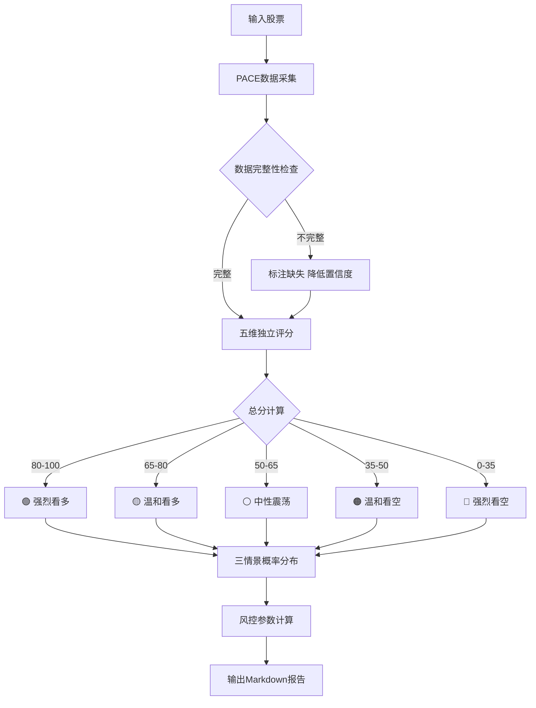

# A股个股次日走势预测 Skill

## 核心方法论：PACE-七维框架

A股市场有其独特性，不同于美股的七大特征：
1. **T+1 制度**：当日买入的股票次日才能卖出，决策失误成本更高
2. **涨跌停板（10%/5%）**：ST股±5%，普通股±10%，预测需关注封板概率
3. **主力资金**：大量散户 + 少量主力的博弈市场，主力行为可监测
4. **政策驱动**：A股对政策极度敏感，监管消息可一日改变趋势
5. **北向资金**：外资（沪深港通北向）是重要的"聪明钱"信号
6. **板块轮动**：A股热点板块轮动规律强，个股往往随板块起伏
7. **龙虎榜**：重要的主力机构进出信号，官方披露

因此，使用专为A股设计的 **PACE框架**：

| 字母 | 维度名称 | 含义 | 权重 |
|------|---------|------|------|
| **P** | Policy & Macro 政策宏观 | 政策消息、宏观数据、监管动向 | 20% |
| **A** | Auction & Flow 资金拍卖 | 主力资金、北向资金、龙虎榜、融资融券 | 25% |
| **C** | Chart & Technicals 图表技术 | 技术形态、均线、MACD、KDJ、量价关系 | 25% |
| **E** | Emotion & Sentiment 情绪舆论 | 板块热度、游资动向、消息面、市场情绪 | 20% |
| **+** | Catalyst & Event 催化事件 | 财报、重大公告、分析师评级、行业事件 | 10% |

**七个子维度补充**（嵌套在PACE中）：
- 涨跌停分析（嵌套在A+C）
- 板块联动分析（嵌套在E）
- 分时量能分析（嵌套在C）

---

## A股次日走势预测方法论详解

### 一、政策宏观分析（P维度，20分）

**搜索要点：**
- 当日国家级政策消息（证监会、发改委、行业主管部门）
- 隔夜美股、欧股收盘情况（外围市场情绪传导）
- 上证、深证、创业板指数当日表现与次日期货方向
- 重要会议（如政治局会议、人大会议、央行议息）

**评分逻辑（满分20分）：**
```
政策利好（+10至+20）
政策中性（+10）
政策利空（+0至+10）

外围顺风（额外+0至+3加权）
外围逆风（额外-0至-3加权）
```

---

### 二、资金拍卖分析（A维度，25分）

A股资金分析是最重要的核心维度，分四个子层：

**2.1 北向资金（满分8分）**
- 北向当日净买入/净卖出金额（重要风向标）
- 是否连续净买入/净卖出该股
- 北向持仓占比变化

```
北向单日净买>10亿 → 强烈利多（8分）
北向单日净买>5亿  → 温和利多（6分）
北向中性           → 中性（4分）
北向单日净卖>5亿  → 温和利空（2分）
北向单日净卖>10亿 → 强烈利空（0分）
```

**2.2 主力资金净流向（满分8分）**
- 超大单（单笔≥100万）买入/卖出净额
- 大单（50-100万）净流向
- 主力净流入占成交额比例

```
主力净流入率 > +5%  → 积极（8分）
主力净流入率 0~5%   → 中性偏多（6分）
主力净流入率 -5~0%  → 中性偏空（4分）
主力净流入率 < -5%  → 出逃（0分）
```

**2.3 龙虎榜数据（满分5分）**
（仅当日换手率>3倍历史均值或股价涨跌幅>7%时触发）
- 上榜买方机构（公募/私募/外资营业部）→ 利多
- 上榜卖方机构 → 利空
- 游资席位两侧同时出现 → 警惕出货

**2.4 融资融券（满分4分）**
- 融资余额变化：增加→看多氛围；减少→风险厌恶
- 融券余量变化：增加→空头入场
- 融资融券比（融资/融券）> 10→散户情绪偏多

---

### 三、图表技术分析（C维度，25分）

**3.1 均线系统（满分8分）**

A股最重要的均线：MA5、MA10、MA20（短线）、MA60（中线）、MA250（年线）

```
判断逻辑：
①价格位置：站上/跌破MA20 → ±3分
②均线多头排列（MA5>MA10>MA20）→ +2分
③均线死叉/金叉形成 → ±2分
④放量突破/跌破均线 → 额外±1分
```

**3.2 量价关系（满分7分）**— A股最核心的量化信号

```
价涨量增（放量上涨）→ 确认趋势 +7分
价涨量缩（缩量上涨）→ 追高风险 +3分
价跌量缩（缩量下跌）→ 洗盘信号 +5分
价跌量增（放量下跌）→ 主力出货 +0分

关键：量比（当日量/过去5日均量）
量比>2且价涨 → 人气旺盛
量比<0.5且价跌 → 缩量整理
```

**3.3 MACD+KDJ组合（满分6分）**

```
MACD：
- 红柱扩大 +2，绿柱缩小 +1（A股MACD金叉相对滞后但可靠）
- DIF上穿DEA（金叉）+2，下穿（死叉）-2
- 二次金叉（背离修复）→ 特别强烈信号 +3

KDJ：
- K>D且均线向上 +2
- KDJ<20（超卖区金叉）→ 反弹信号 +2
- KDJ>80（超买）→ 注意风险 +0
```

**3.4 涨跌停与关键位（满分4分）**

```
当日涨停（封板坚实 封单>5000万）→ 次日高开概率大（+4分）
当日涨停（开板次数多，封板弱）→ 次日高开低走风险（+1分）
当日跌停（恐慌性）→ 次日继续跌或反包（判断需结合消息面）
接近前高阻力位（<2%）→ 突破概率评估
```

---

### 四、情绪舆论分析（E维度，20分）

**4.1 板块热度与轮动（满分8分）**

A股板块轮动极为明显，个股往往跟板块走：
```
所在板块当日领涨（前5）+ 明日有延续性 → +8分
所在板块当日跟涨（前20） → +5分
所在板块当日中性 → +3分
所在板块当日领跌 → +0分
```

判断板块延续性：看板块龙头的封板情况、板块内涨停数量

**4.2 市场整体情绪（满分6分）**
```
两市涨停家数 > 100 → 情绪亢奋（+6分）
两市涨停家数 50~100 → 情绪良好（+4分）
两市涨停家数 20~50 → 情绪中性（+2分）
两市涨停家数 < 20 → 情绪低迷（+0分）

涨跌比（涨家数/跌家数）> 2 → 额外+1分
```

**4.3 消息面情绪（满分6分）**
```
利好：公司层面正向公告/媒体正面报道 +4~6
中性：无重大消息 +3
利空：负面公告/质疑报道 +0~1
```

---

### 五、催化事件（+维度，10分）

```
重大利好催化（定向增发、股份回购、重大合同、业绩超预期）→ +8~10分
无催化事件 → +5分（基准）
财报即将（3日内），历史经常超预期 → +7分
财报即将，历史经常不及预期 → +2分
重大负面催化（问询函、立案调查、业绩预告亏损） → +0分
```

---

## 执行流程（Step-by-Step）

### Step 1：解析输入

- 识别股票代码（6位数字）或名称（如"贵州茅台"）
- 标准化：沪市（60xxxx）、深市（00xxxx/30xxxx）
- 获取基本信息：所属板块、行业、市值

### Step 2：多线并行搜索（至少8条搜索）

```
搜索1："{股票名称/代码} 今日行情 涨跌 成交量"
搜索2："{股票名称} 主力资金 北向资金 净流入"
搜索3："{股票名称} 龙虎榜 机构席位 {当前日期}"
搜索4："{股票名称} MACD KDJ 技术分析 均线"
搜索5："{股票板块} 板块行情 今日热点 涨停股"
搜索6："{股票名称} 最新公告 研报 消息 {当前月份}"
搜索7："A股 今日市场情绪 涨停家数 两市行情"
搜索8："A股 北向资金 今日 净买入净卖出"
搜索9（可选）："{股票名称} 融资融券 余额变化"
搜索10（可选）："{股票名称} 业绩预告 财报日期"
```

**数据收集清单（必须尽量填满）：**

| 维度 | 关键数据项 |
|------|-----------|
| P-政策 | 隔夜外围收盘、当日政策消息、指数方向 |
| A-资金 | 北向净流入、主力净流入率、龙虎榜（如有）、融资余额变化 |
| C-技术 | 收盘价、涨跌幅、MA5/MA20位置、量比、MACD状态、KDJ值 |
| E-情绪 | 两市涨停数、板块排名、相关消息面 |
| +-催化 | 近期公告、财报日期、分析师评级 |

### Step 3：逐维打分（必须展示推理过程）

对每个维度独立评分，**必须写出每个分数的理由**，不能直接给结论分。

```
P得分（0-20）：[具体政策/外围情况 → 理由 → 分数]
A得分（0-25）：[北向X分 + 主力X分 + 龙虎X分 + 融资X分 → 合计]
C得分（0-25）：[均线X分 + 量价X分 + MACD/KDJ X分 + 关键位X分 → 合计]
E得分（0-20）：[板块X分 + 市场情绪X分 + 消息X分 → 合计]
+得分（0-10）：[催化事件描述 → 分数]

总分 = P + A + C + E + (+) （满分100）
```

### Step 4：总分映射到概率与情景

**总分 → 基准看涨概率转换表：**

| 总分区间 | 基准看涨概率 | 解读 |
|---------|------------|------|
| 80-100  | 65-75%     | 强烈看多信号 |
| 65-80   | 55-65%     | 温和看多信号 |
| 50-65   | 45-55%     | 中性/震荡预期 |
| 35-50   | 35-45%     | 温和看空信号 |
| 0-35    | 25-35%     | 强烈看空信号 |

**三情景概率分布（必须合计100%）：**
- **情景A（看涨）**：次日涨幅 > +2%，概率 P_A%
- **情景B（震荡）**：次日涨跌 -2% ~ +2%，概率 P_B%
- **情景C（看跌）**：次日跌幅 < -2%，概率 P_C%

**预期收益率计算：**
```
E(r) = P_A × 典型涨幅 + P_B × 0.5% + P_C × 典型跌幅

若 E(r) > 0.5% 且 P_A/P_C > 1.5（盈亏比），具有操作价值
若 E(r) < 0 或 P_C > 40%，建议回避或轻仓
```

### Step 5：风控参数计算

基于技术分析，输出以下具体数字（非模糊描述）：

```
建议买入区间：[价格下限, 价格上限]（基于支撑位）
第一目标位：[价格]（基于压力位/涨幅预期）
第二目标位：[价格]（如动能足够）
技术止损位：[价格]（跌破关键支撑则止损）
最大允许亏损：不超过 -3%（硬性规定）
建议仓位：[轻仓10-20% / 标准30-40% / 重仓50%以上]（基于置信度）
```

### Step 6：输出 Markdown 报告

---

## 报告结构模板

```markdown
# {股票名称}（{代码}）次日走势预测报告
> 预测日期：{今日} → 预测交易日：{明日}  
> 分析框架：PACE七维量化模型 | 请结合自身风险承受能力决策

---

## ⚡ 核心结论（30秒速览）

> **[🟢强烈看多 / 🟡温和看多 / ⚪震荡观望 / 🟠温和看空 / 🔴强烈看空]**
>
> **建议操作：** [买入/减仓/观望/回避]  
> **核心逻辑：** [一句话]  
> **置信度：** [高 / 中 / 低]

---

## 📊 PACE七维评分仪表盘

[SVG雷达图 + ASCII评分汇总]

---

## 🏛️ 第一维：政策宏观（P，满分20）

[外围市场 → 政策消息 → 指数趋势 → P得分及理由]

---

## 💰 第二维：资金拍卖（A，满分25）

### 北向资金
### 主力净流向
### 龙虎榜（如触发）
### 融资融券
[各子维度分析 + A总得分]

---

## 📈 第三维：图表技术（C，满分25）

### 均线系统
### 量价关系
### MACD + KDJ
### 关键价格位
[ASCII走势示意图 + C总得分]

---

## 🌡️ 第四维：情绪舆论（E，满分20）

### 板块热度与轮动
### 两市整体情绪
### 消息面
[E总得分]

---

## 🔮 第五维：催化事件（+，满分10）

[近期公告/研报/财报日/行业事件 → +得分]

---

## 🎯 综合评分与概率分布

[总分 = P+A+C+E+ → 情景概率 → 预期收益率]

---

## 💡 风控参数与操作建议

[买入区间 / 目标位 / 止损位 / 仓位建议]

---

## ⚠️ 风险提示

[免责声明 + 置信度说明 + 特殊风险]
```

---

## 可视化图表规范

### 1. PACE 五边形雷达图（SVG）

用SVG绘制五边形雷达图，显示五维评分：
- 颜色编码：P=蓝色、A=橙色、C=绿色、E=紫色、+=黄色
- 满分为各维度满分（P20、A25、C25、E20、+10）
- 标注实际得分和百分比

### 2. 技术走势示意（ASCII）

```
  ┌──────────────────────────────────────────────────┐
  │ {股票名称} 近期走势示意（非精确K线）               │
  │                                                  │
  │ 价  ↑  阻力位 {价格}  ─ ─ ─ ─ ─ ─ ─ ─ ─ ─ ─   │
  │ 格  │         ╭──╮                               │
  │     │        ╭╯  ╰──╮   当前价 {价格} ←          │
  │     │       ╭╯      ╰─────                       │
  │     │  ─────────────── MA20({价格}) ─────         │
  │     │  ─ ─ ─ ─ ─ ─ ─ MA5({价格}) ─ ─ ─          │
  │     │  ════════════════ MA60({价格}) ═════        │
  │     │  支撑位 {价格}  ─ ─ ─ ─ ─ ─ ─ ─ ─ ─ ─   │
  │     └──────────────────────────────── 时间 →     │
  └──────────────────────────────────────────────────┘
```

### 3. 三情景概率分布（ASCII条形图）

```
  ┌─────────────────────────────────────────────────┐
  │           次日三情景概率分布                      │
  ├─────────────────────────────────────────────────┤
  │ 🟢 看涨(>+2%)  ████████████░░░░░░░░  XX%        │
  │ ⚪ 震荡(-2%~+2%) ████████░░░░░░░░░░  XX%        │
  │ 🔴 看跌(<-2%)  ████░░░░░░░░░░░░░░░░  XX%        │
  ├─────────────────────────────────────────────────┤
  │ 预期收益率：E(r) = XX%                           │
  │ 盈亏比（看涨/看跌）= X.X : 1                     │
  └─────────────────────────────────────────────────┘
```

### 4. 信号汇总表

```
  ┌──────────────┬──────┬────────┬──────────────────┐
  │ 信号指标     │ 方向 │ 强度   │ 当前值           │
  ├──────────────┼──────┼────────┼──────────────────┤
  │ 北向资金     │  ↑   │ ★★★☆  │ +XX亿（净买入）  │
  │ 主力净流入   │  ↑   │ ★★☆☆  │ +X.X%            │
  │ MA20位置     │  ↑   │ ★★★☆  │ 站上/已突破      │
  │ 量比         │  →   │ ★★☆☆  │ X.X倍            │
  │ MACD         │  ↑   │ ★★☆☆  │ 金叉/红柱扩张    │
  │ KDJ          │  ↓   │ ★★★☆  │ 超买区 XX        │
  │ 板块热度     │  ↑   │ ★★★★  │ 板块今日领涨     │
  │ 市场情绪     │  →   │ ★★☆☆  │ 涨停XX家         │
  └──────────────┴──────┴────────┴──────────────────┘
  综合信号：X多 X空 X中性
```

### 5. Mermaid 逻辑推导流程图



---

## 专业术语词典（报告中首次出现均须附注）

| 术语 | 通俗解释 |
|------|---------|
| T+1 | 今天买的股票，明天才能卖。所以预测明天行情更重要 |
| 涨停板 | A股规定单日最多涨10%（ST股5%），封住涨停意味着买不进去 |
| 北向资金 | 通过沪深港通从香港流入A股的境外资金，俗称"聪明钱" |
| 主力资金 | 超大单买入卖出，通常是机构或大户，比散户更有信息优势 |
| 龙虎榜 | 当天涨跌幅超7%或换手率超3倍时，交易所公示的前5买家和卖家名单 |
| 量比 | 今天成交量 ÷ 过去5天平均成交量。>2说明量能放大，行情活跃 |
| MA5/MA20 | 过去5天/20天的平均股价。价格在均线上方=趋势健康 |
| MACD | 两条均线的差值。金叉（短线穿越长线向上）是看涨信号 |
| KDJ | 超买超卖指标。>80可能超买要小心，<20可能超卖有反弹机会 |
| 融资余额 | 散户借钱炒股的总量。增加说明看多情绪升温 |
| 封单 | 挂在涨停板上等着卖的买单数量。越大封板越稳固 |
| 板块轮动 | A股常见规律：今天涨科技，明天换医药，热点在板块间流动 |
| 盈亏比 | 预期盈利/预期亏损。>1.5才值得出手，小于1不划算 |
| 置信度 | 这份分析有多可靠。数据越完整、信号越一致，置信度越高 |

---

## A股特殊场景处理规则

### 场景1：股票当日涨停
```
→ 特别分析封板强度（封单占流通盘比例）
→ 评估次日高开概率（强势涨停 vs 尾盘涨停）
→ 强封（封单>3亿且全天未打开）→ 次日高开概率70%以上
→ 弱封（多次打开后封板）→ 次日高开低走风险大
→ 操作建议：若已持有，高开后注意观察分时量能决定是否出
```

### 场景2：股票当日跌停
```
→ 区分原因：基本面利空 vs 大盘拖累 vs 游资出货
→ 基本面利空跌停 → 次日大概率继续，建议回避
→ 恐慌性跌停（无重大利空） → 存在次日反包机会
→ 需查龙虎榜：机构大量买入跌停 → 强烈反转信号
```

### 场景3：ST股/退市风险股
```
→ 涨跌幅限制±5%，预测逻辑不同
→ 基本面风险极高，不建议短线操作
→ 报告中明确标注警告
```

### 场景4：数据不完整时
```
→ 标注哪些数据缺失
→ 置信度降至"低"
→ 建议等待完整数据后再决策
→ 该维度取中间分（该维度满分×0.5）
```

---

## 风险控制模块（每份报告必须包含）

```markdown
## ⚠️ 风险提示与免责声明

### 硬性止损规则（必须遵守）
- **技术止损**：跌破 [关键支撑位] 无条件止损
- **幅度止损**：亏损超过 -3% 无条件离场（T+1限制下，次日开盘必须卖）
- **时间止损**：买入后持续3日未达预期，考虑离场

### 特别风险警告
- ⚠️ 若股票距离财报发布 ≤ 5个交易日：仓位减半或回避
- ⚠️ 若大盘VIX性质指标（恐慌指数）异常：降低仓位
- ⚠️ 若当日重大政策出台（未消化完）：谨慎对待次日预测
- ⚠️ 本报告基于公开信息和量化模型，不构成投资建议

### 置信度说明
- 🟢 高置信度：数据完整，信号一致性>70%
- 🟡 中置信度：数据基本完整，信号存在分歧
- 🔴 低置信度：关键数据缺失，信号严重矛盾

### 模型局限性
本模型次日预测准确率行业基准约55-62%，
重大突发事件（黑天鹅）将使预测失效。
**投资有风险，入市需谨慎。本报告仅供学习参考。**
```

---

## 输出文件规范

```
文件名：{股票代码}-{股票名称}-{YYYYMMDD}.md
保存路径：markdown/
编码：UTF-8
语言：中文为主，专业术语保留并附注解
图表：至少包含雷达图、走势示意图、概率分布图、信号汇总表
```

---

## 质量检查清单（输出前必须自查）

- [ ] PACE五维均已分析，无跳过项
- [ ] 每个评分均有具体理由，非凭空给分
- [ ] 三情景概率合计 = 100%
- [ ] 预期收益率 E(r) 已计算
- [ ] 盈亏比已计算
- [ ] 包含具体止损价格（非模糊描述"注意风险"）
- [ ] 包含仓位建议
- [ ] 专业术语首次出现均有注释
- [ ] 可视化图表 ≥ 3个
- [ ] 包含免责声明
- [ ] 核心结论30秒速览清晰简洁
- [ ] 特殊场景（涨跌停/ST股）已单独处理

---

## 使用示例

**用户输入：** "帮我分析一下贵州茅台（600519）明天的走势"

**执行流程：**
1. 识别：600519 = 贵州茅台，沪市主板，白酒龙头，大盘蓝筹
2. 执行10条并行搜索
3. 逐维打分：P=XX/20，A=XX/25，C=XX/25，E=XX/20，+=XX/10
4. 总分→概率→预期收益率→风控参数
5. 输出完整Markdown报告至 markdown/600519-贵州茅台-{日期}.md

