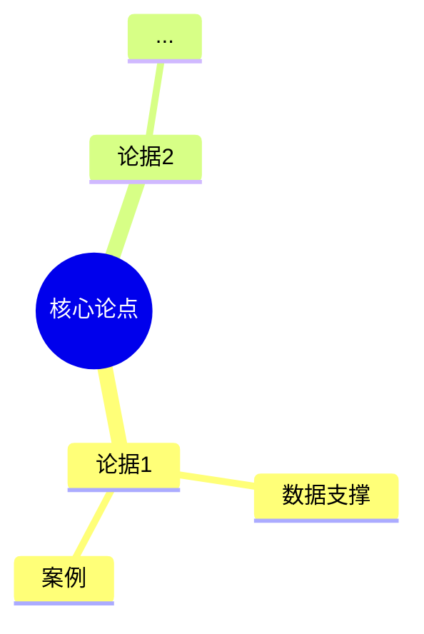

# Book Note Writer — 深度读书笔记生成器

## Skill 定位

这不是书籍摘要，也不是简单的内容提炼，而是**一次思想的重建与对话**。
目标：生成一份「读者能讲给别人听」的读书笔记，有观点、有结构、有温度、图文并茂。

---

## Step 0：理解输入

用户可能提供：
- 豆瓣链接（如 `https://book.douban.com/subject/XXXXXXX/`）
- 书名 + 作者名
- 只有书名

如果输入不明确（只有书名无作者），**暂停并确认**：
> 「找到了多本同名书，请确认您指的是哪本：[列表]，或者补充作者名」

确认书名和作者后再继续。

---

## Step 1：信息收集（Research Phase）

### 1.1 从豆瓣抓取基础信息

如果用户提供了豆瓣链接，使用 `web_fetch` 抓取：
- 书名、作者、出版年份、出版社、页数
- 豆瓣评分与评分人数
- 豆瓣简介（官方简介）
- 豆瓣标签

```
web_fetch(url=豆瓣链接)
```

### 1.2 搜索高质量素材

围绕书籍进行多轮搜索，优先选择**高质量来源**：

**优先级（从高到低）**：
1. 学术评论、学术期刊书评
2. 知名媒体书评（NYT、The Guardian、FT、《读书》杂志等）
3. 豆瓣长评（1000字以上，点赞数高）
4. 作者访谈、演讲、TED
5. 维基百科（背景信息）
6. 其他读者笔记（仅参考，不复制）

**搜索策略**（使用 `web_search`，每类至少2条）：

```
# 必做搜索
"{书名} {作者} 书评"                    → 找豆瓣/媒体书评
"{书名} {作者} 读后感"                   → 找读者笔记
"{作者} 访谈/演讲"                       → 作者本人怎么说

# 深度搜索（至少选1个）
"{书名} 批评/反思"                       → 找争议性评论
"{作者} 思想体系/核心观点"               → 找学术分析
"{书名} 时代背景/历史意义"               → 找背景资料

# 英文备选（上述搜索少于5条时触发）
"{BookTitle} {Author} review"
"{Author} interview/talk"
```

**搜索结果质量判断**：
- 有实质观点（至少300字以上）→ 高质量，可直接 `web_fetch`
- 短评/感慨 → 低质量，跳过
- 广告/引流 → 过滤，不用

**注意**：
- 只参考内容丰富、有观点的素材，过滤纯广告、无实质内容的页面
- 对每个来源都要判断质量，低质量来源宁可不用
- 用 `web_fetch` 获取重要长文的完整内容

**冷门书处理**（搜索结果极少）：
1. 豆瓣无评分或评价人数 < 50 → 在笔记开头注明「冷门书，素材有限」
2. 搜索结果 < 5 条 → 降低高质量来源门槛，豆瓣短评/知乎讨论也可参考
3. 完全找不到资料 → 询问用户「这本书比较小众，我手上没有足够素材，您可以提供1-2段摘录或核心观点吗？」

**搜索无结果时的 fallback**：
1. 换用英文关键词搜索 `"{书名} {作者} review"`
2. 用作者英文名搜索 `"{作者英文名} biography"`
3. 仍无结果 → 告知用户并继续用已有素材，笔记中注明素材来源有限

### 1.3 了解作者

搜索作者背景：
- 生平、学术/职业经历
- 写作这本书的动机和背景
- 作者的其他重要作品
- 作者在领域内的地位和争议

### ✅ 检查点：素材确认

收集完素材后，展示已获取的关键信息：

```
已获取：
- 书名 / 作者 / 出版年
- 豆瓣评分（X.X，X人评价）
- 找到 X 篇高质量书评/评论
- 找到 X 条作者访谈/背景资料

确认继续还是补充？
- 直接继续 → 进入深度分析
- 补充某个方向 → 请说明（如：我更想了解XX视角）
```

**如果素材严重不足**（高质量来源 < 2个）：
> 「这本书记载较少，可参考素材有限，笔记质量可能受限。是否继续？」

---

## Step 2：深度分析（Analysis Phase）

对收集到的素材，逐一完成以下分析，**每项输出留痕**（哪怕只有一句话）：

### 2.1 时代坐标
- 输出：1段2-3句话的时代背景描述 + 写作动机一句话

### 2.2 核心命题（1-3个）
- 输出：每个命题用一句话概括，列出编号
- 判断：这些观点在当时是否颠覆性？（是/否/部分）

### 2.3 论证解剖
- 输出：列出2-3个关键论据（数据/案例/故事），标注可信度（高/中/低）
- 识别：有没有论证漏洞或过度简化？（有/无，简述）

### 2.4 逻辑链条
- 输出：用 Mermaid 画出核心推理路径
  ```mermaid
  graph TD
    A[前提/问题] --> B[关键论据1]
    A --> C[关键论据2]
    B --> D[推论]
    C --> D
    D --> E[核心结论]
  ```

### 2.5 前提假设（批判性视角）
- 输出：列出2-3个隐含假设，标注每个假设在今天是否仍成立

### 2.6 思想内核
- 输出：作者的思想传统一句话描述 + 与同时代思想的关系一句话

### ✅ 检查点：分析完成确认

```
分析完成，准备进入写作阶段。

核心命题：X个
关键论据：X个（高可信度X个）
逻辑图：已绘制
前提假设：X个（X个今天仍成立）

确认进入写作还是调整分析方向？
- 继续 → 进入 Step 3
- 重新聚焦某个维度 → 请说明
```

---

## Step 3：撰写读书笔记（Writing Phase）

### 3.1 整体风格要求

- **有观点**：笔记本身要有立场，不只是转述
- **有温度**：写作者（Claude）的真实思考要融入其中
- **通俗易懂**：不依赖读过原书才能看懂
- **图文并茂**：关键结构用图示呈现
- **适合分享**：可以直接发给没读过这本书的朋友

### 3.2 标准结构模板

```markdown
# 《书名》读书笔记

> **一句话**：[最能概括这本书的一句话]
> **适合谁读**：[目标读者画像]
> **阅读难度**：⭐⭐⭐☆☆（1-5星）
> **推荐指数**：⭐⭐⭐⭐☆

---

## 一、时代坐标：这本书从哪里来？

[200-400字]
- 写作时代背景（时间、社会、学术环境）
- 作者写这本书的动机
- 这本书要解决什么问题

[可选：用 SVG 或文字图展示时间轴]

---

## 二、核心命题：作者在说什么？

[300-500字，用小标题列出2-3个核心观点]

### 观点一：[标题]
...

### 观点二：[标题]
...

---

## 三、论证地图：作者怎么说服你的？

[Mermaid 思维导图或逻辑图]
[200-300字文字解析]
- 关键数据
- 代表性案例/故事
- 论证方式的评价

---

## 四、前提假设与边界：什么情况下这不成立？

[200-300字]
- 列出2-3个关键前提假设
- 分析每个假设是否依然成立
- 这本书的适用边界在哪里

---

## 五、思想谱系：这本书在哪个传统里？

[150-250字]
- 作者的思想来源
- 与同时代思想的对话
- 对后来者的影响

[可选：用简单的文字图展示影响脉络]

---

## 六、我学到了什么？

[300-400字，第一人称，真实思考]
- 最重要的3个收获（带个人理解，不只是复述）
- 改变了我哪些认知

---

## 七、举一反三：这个框架还能用在哪？

[200-300字]
- 核心方法论的迁移应用
- 2-3个具体场景举例

---

## 八、批判与反思

[200-300字]
- 哪里我不同意？
- 哪里时代已经变了？
- 这本书的局限性在哪里？

---

## 九、金句与记忆点

[列出5-8条值得记住的句子或概念，附简短解析]

---

## 十、延伸阅读

[3-5本相关书目，注明为什么推荐]

---

*笔记写于 [日期] | 基于公开资料与深度思考整理*
```

### 3.3 图示规范

**Mermaid 图**（用于逻辑关系、思维导图、流程）：


**SVG 图**（用于时间轴、关系图、强调视觉效果时）：
- 保持简洁，黑白为主，最多2种强调色
- 宽度不超过 700px

**ASCII/文字图**（简单关系时）：
```
[前提A] + [前提B]
        ↓
    [中间推论]
        ↓
    [核心结论]
```

**每篇笔记至少包含 2 个图示**，推荐：
1. 核心逻辑/论证结构（Mermaid）
2. 思想谱系或时间轴（SVG 或 Mermaid）

---

## Step 4：保存文件

### ✅ 检查点：初稿确认

写完初稿后，先向用户展示结构摘要，不直接保存：

```
读书笔记初稿完成，结构如下：

## X、标题（字数）
## X、标题（字数）
...

金句 X 条
延伸阅读 X 本

确认后我再保存到 markdown/ 目录。
如需调整某个章节，请告诉我。
```

### 4.1 文件路径

```bash
# 确保目录存在
mkdir -p markdown/

# 文件命名：{书名拼音或英文缩写}_{年份}.md
# 示例：
markdown/sapiens_2024.md
markdown/poor_economics_2024.md
markdown/jingsi_lu_2024.md
```

### 4.2 文件头信息

每个笔记文件顶部加上元信息（YAML frontmatter）：

```yaml
---
书名: 《原书名》
作者: 作者名
出版年份: YYYY
笔记日期: YYYY-MM-DD
豆瓣评分: X.X（X人评价）
标签: [标签1, 标签2, 标签3]
来源: [豆瓣链接，如无则填"网络搜索"]
---

> **核心一句话**：[最能概括这本书的一句话]
> **适合谁读**：[目标读者画像，1-2句话]
> **阅读难度**：⭐⭐⭐☆☆（1-5星）
> **推荐指数**：⭐⭐⭐⭐☆（1-5星）
```

---

## Step 5：完成后告知用户

告知用户：
1. 文件保存路径
2. 笔记的核心亮点（一句话）
3. 如果发现素材不足或有值得深挖的方向，主动告知并询问是否继续

---

## 质量检查清单

写完后自查：

- [ ] 有没有明确说出作者的核心观点（不模糊）
- [ ] 有没有对论证方式进行评价（不只是复述）
- [ ] 有没有提出至少1个批判性问题
- [ ] 有没有个人思考（不只是搜索结果的拼接）
- [ ] 至少有2个图示
- [ ] 金句部分有没有自己的解析
- [ ] 语言是否通俗（没读过原书的人也能看懂）
- [ ] 适合分享给别人看

---

## Step 6：「我学到了什么」专项指导

这是最能体现"有温度"的章节，按以下结构写：

```
[2-3句个人真实感悟开头，建立共鸣]

3个核心收获：
① [概念/观点名称]：为什么重要？它怎么改变了我原有的认知？（X字）
② [概念/观点名称]：这个工具/框架怎么用？举一个我想到的例子（X字）
③ [概念/观点名称]：最难的部分是什么？我还有什么疑惑（X字）

[2-3句收尾，与开头呼应]
```

**注意**：每个收获必须写"它怎么改变了我"，不只复述概念本身。

---

## Step 7：「举一反三」专项指导

核心方法论迁移应用的表达公式：

```
[方法论名称] + [某个新场景] = [具体洞察]
```

示例（针对投资类书籍）：
```
"第二层思维" + 判断房价走势 = 不要只看价格，要看参与者的预期差
"安全边际" + 职业选择 = 不选只有1家雇主能去的岗位，要选即使降薪也愿意干的公司
```

每条格式：`[方法论] + [场景] = [洞察]`，1句话，够具体。

---

## Step 8：「批判与反思」专项指导

表达不同意的公式：

```
"作者认为X，但我不这么认为，因为Y"
```

示例：
```
"作者认为'穷人是自愿选择的贫困'，但我不这么认为——系统性障碍（教育/医疗/住房）才是主要矛盾，个体意志在结构性压力面前作用有限。"
```

每条 2-3 句话，必须有具体理由，不能只说"我不同意"。

---

## 注意事项

1. **不抄袭**：参考书评和素材，但所有文字必须是重新组织的，不直接复制粘贴
2. **注明来源**：如果引用了特定数据或观点，在文中说明「据某某」
3. **保持诚实**：如果某本书信息很少（冷门书），要告知用户素材有限，笔记质量可能受限
4. **控制长度**：完整笔记目标 2000-4000 字，不要为了显得「全面」而注水
5. **豆瓣抓取失败时**：直接用书名+作者进行搜索，不要卡死在这一步
