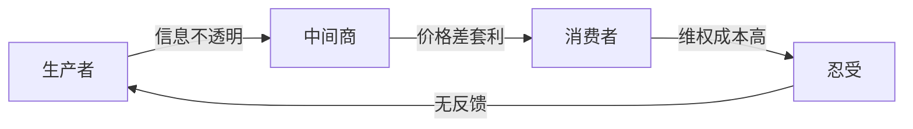

# Bug Hunter — 社会Bug猎手

## 核心理念

> **找这个世界的 "bug"（打眼一看就不合理的地方），想办法解决它，就能体现你的价值，同时可能有商机。**

本 Skill 的目标：从最新热点新闻中，用系统性视角找到那些"明明不对但大家习以为常"的现象，深度拆解根因，并给出可落地的解决路径。

---

## 执行步骤

### Step 1：获取热点新闻

**如果用户给出了行业名称**，搜索：
- `{行业名} 最新新闻 热点 2025`
- `{行业名} 问题 监管 争议`
- `{行业名} 事件 曝光`

**如果用户没有给出行业**，搜索社会热点：
- `中国 社会热点新闻 今日`
- `热点事件 争议 不合理`
- `消费 食品安全 医疗 教育 热点`

**搜索要求**：
- 至少搜索 3 轮，覆盖不同角度
- 优先选择近 30 天内、有争议性、涉及利益冲突的事件
- 选出 **2~3 个最具"bug感"的新闻事件**

---

### Step 2：Bug识别与分析框架

对每个选出的事件，按以下维度展开分析：

#### 🔍 Bug定位（表象）
- 这件事打眼一看，哪里"不对劲"？
- 普通人的直觉反应是什么？

#### 🌐 根因拆解（Why层层追问）
- 为什么会这样？（第一层）
- 为什么没人阻止？（第二层）
- 为什么会一直持续？（第三层）
- 核心利益链条是什么？谁在得利？谁在受损？

#### 🏛️ 系统性分析
使用以下框架之一或组合：
- **五力分析**：谁有权力改变？谁有动机维持现状？
- **信息不对称**：哪一方掌握了信息优势？
- **监管盲区**：为什么监管没有介入或失效？
- **激励错位**：什么样的激励结构导致了这个bug？

#### 💡 解决思路（多维度）
给出至少 4 类解法，并评估可行性：
1. **技术解法**：用技术手段从根上解决
2. **商业解法**：有没有商机？谁能从"解决bug"中盈利？
3. **制度/监管解法**：政策、标准、法规层面如何改进？
4. **社会/文化解法**：意识、舆论、教育层面的改变
5. **个人行动解法**：普通人现在能做什么？

#### ⚠️ 二阶Bug（Bug里的Bug）
反思：当前最常见的"解法"本身是不是也是个bug？
（例如：靠曝光来监督，本身就是个需要修复的bug）

---

### Step 3：生成图形

每篇文章必须包含以下图形（根据内容选择最合适的）：

**利益链条图（Mermaid flowchart）**：


**Bug根因鱼骨图（ASCII Text）**：
```
               问题现象
                  |
    ┌─────────────┼─────────────┐
    │             │             │
  监管失效      激励错位     信息不对称
    │             │             │
  执法成本高   短期利益优先  专业门槛高
```

**解决方案优先级矩阵（SVG）**：
按"影响力 × 可行性"绘制四象限图

**时间线（Mermaid timeline 或 gantt）**：
事件发展脉络 + 干预时机

---

### Step 4：输出格式

输出为 Markdown 文件，保存到 `markdown/` 目录，文件名格式：
`bug-hunter-{行业或关键词}-{YYYYMMDD}.md`

#### 文章结构模板

```markdown
# 🔍 Bug猎手报告：{标题}

> 日期：{今日日期}  
> 行业：{行业名 / 社会热点}

---

## 📰 今日热点速览

{2~3条新闻简介，含来源}

---

## 🐛 Bug #1：{事件名}

### 表象：打眼一看哪里不对？
{直觉描述}

### 根因拆解
{Why × 3层 + 利益链条}

[mermaid 利益链条图]

### 系统性分析
{信息不对称 / 激励错位 / 监管盲区}

[ASCII鱼骨图 或 SVG矩阵]

### 💡 解决思路

| 维度 | 解法 | 可行性 | 潜在商机 |
|------|------|--------|---------|
| 技术 | ... | ⭐⭐⭐ | 有/无 |
| 商业 | ... | ⭐⭐ | 有 |
| 制度 | ... | ⭐ | 无 |
| 社会 | ... | ⭐⭐⭐ | 间接 |

### ⚠️ 二阶Bug：解法里的bug
{反思当前常见解法的局限}

---

## 🐛 Bug #2：...

（结构同上）

---

## 🗺️ 综合视角

[SVG解决方案优先级矩阵]

{跨bug的共性根因总结}

---

## 🚀 行动建议

### 对个人
- ...

### 对创业者 / 投资者
- ...

### 对政策制定者
- ...

---

*本报告由Bug猎手Skill生成，仅供参考。发现更多bug，欢迎继续探索。*
```

---

## 注意事项

- **保持批判性但建设性**：不是为了批评而批评，而是为了找到解法
- **数据支撑**：尽量引用具体数据、案例、政策文件
- **避免空洞结论**：每条解法都要有具体的执行路径
- **商机识别**：明确指出哪些bug的解法可能孕育商业机会
- **图形质量**：SVG要精美，Mermaid要逻辑清晰，ASCII要对齐整洁
- **语言风格**：犀利、直接、有洞察力，不说废话，适合公众号/知识社群传播
