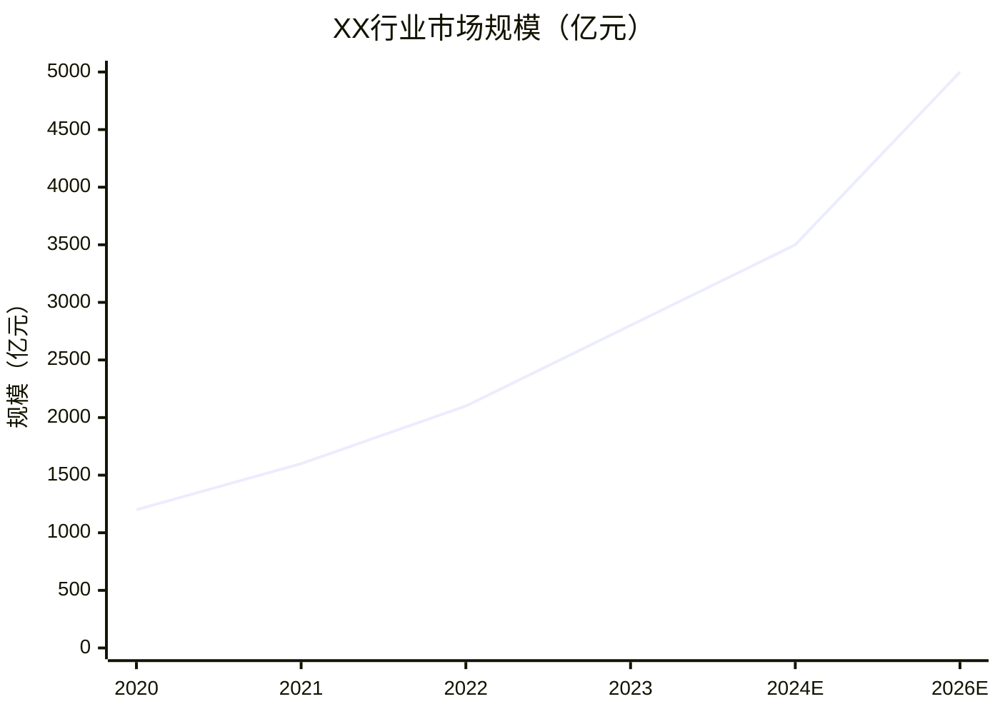

# Industry Deep Explainer

## 目标
将任意一个行业在一篇报告中讲透：**是什么、怎么赚钱、谁在玩、哪里有机会、如何进入**。
面向创业者、投资者、行业新人，语言通俗、逻辑严密、数据有据可查。

---

## 执行流程

### Step 1 — 搜集行业情报

用 web_search 至少搜索以下维度（每个维度 1-2 次搜索），获取最新数据：

```
1. "{行业名} 产业链 上下游 2024 OR 2025"
2. "{行业名} 市场规模 增速 报告"
3. "{行业名} 龙头企业 营收 利润率"
4. "{行业名} 商业模式 盈利方式"
5. "{行业名} 行业痛点 问题 争议"
6. "{行业名} 创业机会 新兴公司 融资"
7. "{行业名} 供应链 成本结构"
```

搜到关键数据后，用 web_fetch 抓取 1-2 篇高质量报告/文章补充细节。

**情报质量标准：**
- 优先使用官方统计、行业协会、上市公司年报、知名咨询报告（麦肯锡、艾瑞、弗若斯特沙利文等）
- 数据须注明来源与年份
- 若搜不到精确数据，用可信区间表达（"约 XX 亿"、"业内估计 XX%"）

---

### Step 2 — 构建报告框架

按以下固定结构输出，不得随意删减章节：

```
1. 行业速览（一句话定义 + 核心数字）
2. 产业链全景图（SVG 流程图）
3. 利润分布图谱（各节点毛利率对比图）
4. 供给-需求-连接分析
5. 人货场分析
6. 代表企业深度画像
7. 代表产品/服务分析
8. 产业链不合理之处（Bug 清单）
9. 机会推演与进入策略
10. 竞争对手分析
11. 合作伙伴地图
12. 结语：核心投资/创业逻辑
```

---

### Step 3 — 图表规范

**每篇报告必须包含以下图表（至少 4 张）：**

#### 3.1 产业链流程图（SVG 外挂）

保存为 `markdown/svg/{行业名}-chain.svg`，在 Markdown 中用相对路径引用：
```markdown

```

SVG 设计规范：
- 画布：width="900" height="500"（横向流程）
- 颜色方案：上游 #4A90D9（蓝）→ 中游 #7B68EE（紫）→ 下游 #52C41A（绿）→ 终端 #FA8C16（橙）
- 每个节点注明：节点名称 + 代表企业 + 毛利率
- 箭头标注资金流、物流或信息流方向

#### 3.2 利润分布柱状图（Mermaid）

```mermaid
xychart-beta
    title "XX行业各节点毛利率对比（%）"
    x-axis [上游原材料, 中游制造, 品牌商, 渠道, 零售终端]
    y-axis "毛利率 (%)" 0 --> 80
    bar [5, 15, 45, 25, 30]
```

#### 3.3 市场规模趋势图（Mermaid）



#### 3.4 竞争格局矩阵（ASCII）

```
高壁垒 │ 细分龙头A        │ 超级巨头B
       │   ●              │        ●
       ├──────────────────┼──────────────────
低壁垒 │ 红海小厂C ● ●    │ 平台型企业D ●
       │                  │
       └──────────────────┴──────────────────
              低集中度              高集中度
```

---

### Step 4 — 各章节写作指引

#### 1. 行业速览
- 一句话定义：用最简单的语言说清楚"这个行业是干什么的"
- 核心数字：市场规模、增速、参与者数量、用户规模
- 行业生命周期定位（导入期/成长期/成熟期/衰退期）
- 用 **Emoji + 数字** 形式呈现关键指标，便于快速扫读

#### 2. 产业链全景图
- 用 SVG 外挂图呈现（见 Step 3.1）
- 在图下方用表格补充每个节点的：角色描述、代表企业、市场规模、毛利率区间
- 标注资金流向（谁付钱给谁）

#### 3. 利润分布图谱
- 核心问题：**钱在哪个环节最好赚？**
- 用 Mermaid 柱状图对比各节点毛利率
- 分析利润厚薄的原因：壁垒、话语权、差异化程度
- 给出"利润迁移"历史案例（过去 10 年利润如何在各环节间转移）

#### 4. 供给-需求-连接分析
按三维度展开：

| 维度 | 分析要点 |
|------|----------|
| **供给端** | 生产者集中度、产能利用率、成本结构、供给弹性 |
| **需求端** | 用户画像、需求层次（刚需/弹性）、需求增长驱动力 |
| **连接层** | 渠道结构、信息不对称程度、交易摩擦与效率 |

指出供需两端的**结构性矛盾**（如信息不对称、价格失真、渠道暴利等）

#### 5. 人货场分析
零售/消费行业重点展开，B2B 行业可简化：

- **人（用户）**：核心用户画像 × 3（主力客群、次要客群、潜力客群）；每类用户的痛点、购买决策逻辑
- **货（产品）**：产品分层（基础款/主力款/高端款）；核心产品的价值主张与差异化
- **场（渠道）**：线上线下各渠道占比；渠道演变趋势；关键渠道的控制者

#### 6. 代表企业深度画像（精选 3-5 家）

每家企业用以下模板：

```
企业名：XX
定位：用一句话概括
核心数据：营收 XXX亿、毛利率 XX%、市占率 XX%（数据年份）
商业模式：[制造型/平台型/品牌型/服务型...]
核心竞争力：① ... ② ... ③ ...
弱点/隐患：...
近期动向：...
```

最后做一个企业对比表（维度：规模、盈利能力、增速、壁垒、估值/PE）

#### 7. 代表产品/服务分析（精选 2-3 个）

- 产品的市场地位与定价逻辑
- 产品成本结构（原料/生产/营销/渠道各占多少）
- 产品为什么成功/失败（历史复盘）
- 用户为什么选它而不选竞品

#### 8. 产业链不合理之处（Bug 清单）

这是报告最有价值的部分之一。用批判性视角列出至少 3-5 个"bug"：

格式：
```
Bug #1：[标题]
现象：...
根因：...
受害方：...（谁在为这个 bug 买单）
历史案例：...（类似情况在其他行业如何被打破）
```

常见 bug 类型：
- 信息不对称导致的暴利（如医疗检测、婚庆、殡葬）
- 渠道加价过高（如教材、眼镜）
- 标准缺失导致的劣币驱逐良币
- 技术/政策保护下的低效垄断
- 行业惯例造成的用户体验极差

#### 9. 机会推演与进入策略

这是报告的核心产出，必须有具体、可执行的建议：

**9.1 机会地图**
列出 3-5 个值得关注的机会方向，每个机会用以下框架说明：

```
机会名称：...
机会来源：（来自哪个 bug 或趋势）
市场规模估算：TAM XXX亿 → SAM XXX亿 → SOM XXX亿（附推算逻辑）
时间窗口：为什么是现在？（技术/政策/用户习惯的变化）
```

**9.2 进入策略**（针对最优先的 1-2 个机会展开）

```
做什么产品/服务：具体描述
卖给谁：精准用户画像（地域/规模/角色/痛点）
商业模式设计：收入来源 × 成本结构 × 利润机制
定价逻辑：参考锚点定价/价值定价/成本加成定价，给出具体价格区间
GTM（市场进入）策略：首批客户从哪里来？如何快速验证？
关键假设：这个模式成立的前提是什么？
```

**9.3 市场规模测算（TAM/SAM/SOM）**

必须展示推算过程，禁止直接给结论：
```
TAM（总体可寻址市场）= 目标人群数量 × 人均付费意愿
SAM（可服务市场）= TAM × 渠道覆盖率 × 品类渗透率
SOM（实际可获取市场）= SAM × 3年内可达市占率
```

#### 10. 竞争对手分析

- 直接竞争对手：做同类产品/服务的玩家
- 间接竞争对手：满足同一用户需求的替代方案
- 潜在竞争对手：上游/下游/跨界玩家

每个竞争对手分析：
- 优势：为什么用户选它
- 劣势：哪里做得不够好（这是你的机会）
- 应对策略：如何差异化竞争或错位生存

用竞争格局矩阵可视化（见 Step 3.4）

#### 11. 合作伙伴地图

分类列出：
- **互补型伙伴**：提供你不具备的能力（技术/渠道/资源）
- **分销型伙伴**：帮你触达用户
- **背书型伙伴**：提升你的可信度（机构/协会/媒体）

每类合作伙伴注明：合作模式（股权/收入分成/战略协议）、谈判筹码、风险

#### 12. 结语：核心投资/创业逻辑

用 3 句话总结：
1. 这个行业最大的机会是什么？
2. 赢的关键是什么（KSF）？
3. 现在进入，最需要避免的坑是什么？

---

### Step 5 — 文件输出规范

**目录结构：**
```
markdown/
├── {行业名}-deep-explainer.md    # 主报告
└── svg/
    └── {行业名}-chain.svg        # 产业链 SVG（外挂）
```

**文件命名：** 使用行业英文或拼音缩写，如 `coffee-deep-explainer.md`

**SVG 创建方式：** 先创建 `markdown/svg/` 目录，再创建 SVG 文件，最后在 Markdown 中引用。

**Markdown 头部模板：**
```markdown
# {行业名} 行业深度解析

> 📅 报告日期：{当前日期}  
> 🎯 适合读者：创业者 · 投资人 · 行业新人  
> ⏱️ 阅读时间：约 15 分钟

---
```

---

### Step 6 — 质量自检清单

输出前逐项确认：

- [ ] 产业链 SVG 已创建并在 Markdown 中正确引用
- [ ] 至少 4 张图表（SVG + Mermaid + ASCII 各有涉及）
- [ ] 每处数据均注明来源与年份
- [ ] 章节 8（Bug 清单）至少 3 个 bug，有历史案例
- [ ] 章节 9（机会推演）包含 TAM/SAM/SOM 推算过程
- [ ] 代表企业分析至少 3 家，有对比表
- [ ] 语言通俗：无堆砌形容词，每个观点有逻辑支撑
- [ ] 文件已保存到 `markdown/` 目录

---

## 写作风格要求

- **第一性原理优先**：每个结论从基本事实推导，不照搬行业共识
- **批判性视角**：不做行业吹鼓手，该指出问题就指出
- **数字说话**：每个重要观点配数字（哪怕是估算，也要写出推算逻辑）
- **通俗类比**：用读者熟悉的事物类比陌生概念（"这就像..."）
- **行动导向**：分析是为了决策，每个章节结尾给出"所以你应该..."的启示
- **无 AI 腔**：禁止出现"总体而言"、"值得注意的是"、"综上所述"等套话

---

## 常见行业类型的分析侧重

| 行业类型 | 重点章节 | 特别关注 |
|----------|----------|----------|
| 消费品 | 人货场 + 品牌分析 | 渠道变迁、用户心智 |
| 制造业 | 产业链利润 + 供给分析 | 成本结构、技术壁垒 |
| 互联网/平台 | 网络效应 + 商业模式 | 流量获取成本、变现率 |
| 医疗健康 | 监管环境 + 支付方分析 | 政策风险、医保逻辑 |
| B2B 服务 | 客户决策链 + 竞争格局 | 销售周期、续费率 |
| 新能源/硬科技 | 技术成熟度 + 政策补贴 | 技术路线风险 |
