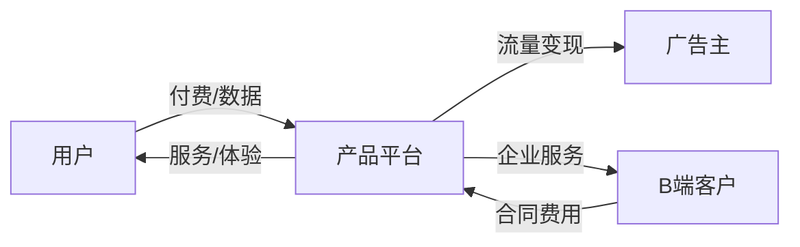
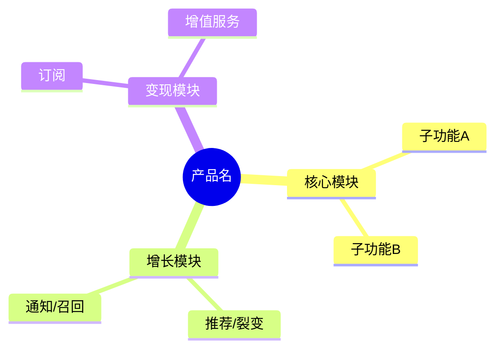
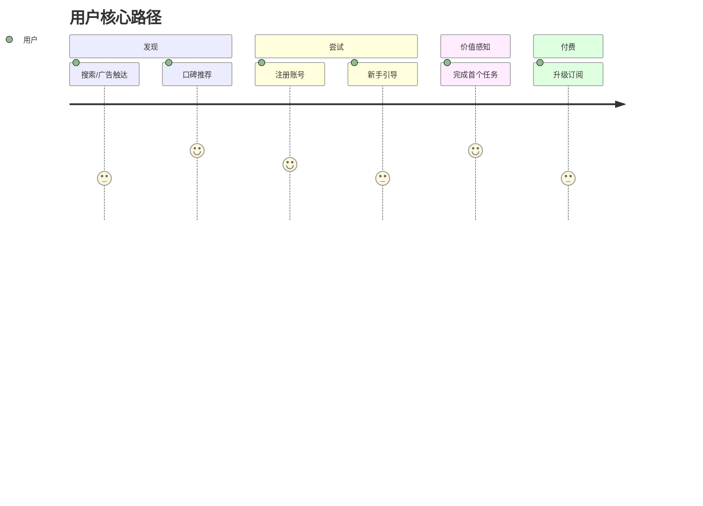
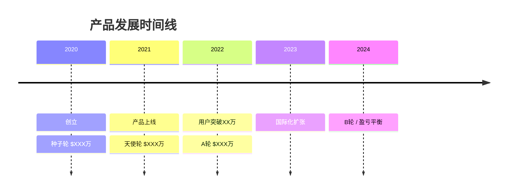

# 图表制作规范

本 Skill 使用三种图表格式：SVG（单独文件）、Mermaid（内嵌代码块）、ASCII Text（直接文本）。

---

## SVG 图表（单独文件）

SVG 图表保存到 `markdown/assets/` 目录，报告中以相对路径引用：
```markdown

```

### 必须用 SVG 的图表类型
1. **竞争力雷达图** (`radar.svg`)
2. **市场定位矩阵** (`market-matrix.svg`)
3. **品牌感知图** (`brand-perception.svg`，可选）
4. **商业模式可视化**（复杂时用 SVG，简单时用 Mermaid）

---

### SVG 模板 1：竞争力雷达图

保存为 `markdown/assets/radar.svg`

```svg
<svg viewBox="0 0 500 500" xmlns="http://www.w3.org/2000/svg" font-family="system-ui, sans-serif">
  <!-- 背景 -->
  <rect width="500" height="500" fill="#fafafa"/>
  
  <!-- 标题 -->
  <text x="250" y="30" text-anchor="middle" font-size="16" font-weight="bold" fill="#1a1a1a">[产品名] 竞争力雷达图</text>
  
  <!-- 雷达网格（6个维度，5个等级圆） -->
  <!-- 中心点 250,265 -->
  <!-- 
    维度顺序（从顶部顺时针）：
    产品功能、用户体验、市场占有、商业模式、技术壁垒、品牌影响
    
    每个维度角度（从正上方0度顺时针）：
    0°, 60°, 120°, 180°, 240°, 300°
    
    外圈半径：150px（满分10分）
    每格30px（2分）
  -->
  
  <!-- === 网格线（同心六边形）=== -->
  <!-- 此处用 polygon 画5个同心六边形，半径分别为 30,60,90,120,150 -->
  
  <!-- 半径30 (2分) -->
  <polygon points="250,235 275.98,250 275.98,280 250,295 224.02,280 224.02,250" 
           fill="none" stroke="#e0e0e0" stroke-width="1"/>
  <!-- 半径60 (4分) -->
  <polygon points="250,205 301.96,235 301.96,295 250,325 198.04,295 198.04,235" 
           fill="none" stroke="#e0e0e0" stroke-width="1"/>
  <!-- 半径90 (6分) -->
  <polygon points="250,175 327.94,220 327.94,310 250,355 172.06,310 172.06,220" 
           fill="none" stroke="#e0e0e0" stroke-width="1"/>
  <!-- 半径120 (8分) -->
  <polygon points="250,145 353.92,205 353.92,325 250,385 146.08,325 146.08,205" 
           fill="none" stroke="#e0e0e0" stroke-width="1"/>
  <!-- 半径150 (10分) -->
  <polygon points="250,115 379.90,190 379.90,340 250,415 120.10,340 120.10,190" 
           fill="none" stroke="#cccccc" stroke-width="1.5"/>
  
  <!-- 轴线 -->
  <line x1="250" y1="265" x2="250" y2="115" stroke="#cccccc" stroke-width="1"/>
  <line x1="250" y1="265" x2="379.90" y2="190" stroke="#cccccc" stroke-width="1"/>
  <line x1="250" y1="265" x2="379.90" y2="340" stroke="#cccccc" stroke-width="1"/>
  <line x1="250" y1="265" x2="250" y2="415" stroke="#cccccc" stroke-width="1"/>
  <line x1="250" y1="265" x2="120.10" y2="340" stroke="#cccccc" stroke-width="1"/>
  <line x1="250" y1="265" x2="120.10" y2="190" stroke="#cccccc" stroke-width="1"/>
  
  <!-- 
    === 数据层 ===
    根据实际评分替换坐标，公式：
    坐标 = 中心点 + 方向向量 × (得分/10) × 150
    
    示例：各维度得分 8, 7, 6, 8, 7, 6
    产品功能(上): 250, 265-120=145
    用户体验(右上): 250+103.9, 265-60 = 353.9, 205
    市场占有(右下): 250+77.9, 265+45 = 327.9, 310
    商业模式(下): 250, 265+120 = 250, 385
    技术壁垒(左下): 250-77.9, 265+45 = 172.1, 310
    品牌影响(左上): 250-103.9, 265-60 = 146.1, 205
  -->
  
  <!-- 本品数据面积 - 替换为实际计算坐标 -->
  <polygon id="product-area"
           points="250,145 353.9,205 327.9,310 250,385 172.1,310 146.1,205"
           fill="rgba(79, 130, 230, 0.25)" stroke="#4f82e6" stroke-width="2"/>
  
  <!-- 竞品数据面积（可选，用不同颜色） -->
  <!-- <polygon id="competitor-area" points="..." fill="rgba(255,100,100,0.15)" stroke="#ff6464" stroke-width="1.5" stroke-dasharray="5,3"/> -->
  
  <!-- 数据点 -->
  <circle cx="250" cy="145" r="4" fill="#4f82e6"/>
  <circle cx="353.9" cy="205" r="4" fill="#4f82e6"/>
  <circle cx="327.9" cy="310" r="4" fill="#4f82e6"/>
  <circle cx="250" cy="385" r="4" fill="#4f82e6"/>
  <circle cx="172.1" cy="310" r="4" fill="#4f82e6"/>
  <circle cx="146.1" cy="205" r="4" fill="#4f82e6"/>
  
  <!-- 维度标签 -->
  <text x="250" y="100" text-anchor="middle" font-size="12" fill="#333">产品功能</text>
  <text x="395" y="195" text-anchor="start" font-size="12" fill="#333">用户体验</text>
  <text x="395" y="345" text-anchor="start" font-size="12" fill="#333">市场占有</text>
  <text x="250" y="435" text-anchor="middle" font-size="12" fill="#333">商业模式</text>
  <text x="105" y="345" text-anchor="end" font-size="12" fill="#333">技术壁垒</text>
  <text x="105" y="195" text-anchor="end" font-size="12" fill="#333">品牌影响</text>
  
  <!-- 分数标注（外圈）-->
  <text x="250" y="112" text-anchor="middle" font-size="10" fill="#999">10</text>
  <text x="250" y="172" text-anchor="middle" font-size="10" fill="#999">8</text>
  <text x="250" y="232" text-anchor="middle" font-size="10" fill="#999">6</text>
  
  <!-- 图例 -->
  <rect x="160" y="455" width="14" height="14" fill="rgba(79,130,230,0.25)" stroke="#4f82e6" stroke-width="1.5"/>
  <text x="180" y="466" font-size="11" fill="#555">[产品名]</text>
  
  <!-- 注释 -->
  <text x="250" y="490" text-anchor="middle" font-size="10" fill="#aaa">评分基于公开数据及用户评价综合估算</text>
</svg>
```

**使用时的关键步骤：**
1. 确定 6 个维度的评分（1-10）
2. 用公式计算每个数据点的 SVG 坐标
3. 替换 `polygon` 的 `points` 坐标
4. 替换标签文字为产品实际维度名

---

### SVG 模板 2：市场定位矩阵（四象限）

保存为 `markdown/assets/market-matrix.svg`

```svg
<svg viewBox="0 0 520 480" xmlns="http://www.w3.org/2000/svg" font-family="system-ui, sans-serif">
  <rect width="520" height="480" fill="#fafafa"/>
  
  <!-- 标题 -->
  <text x="260" y="28" text-anchor="middle" font-size="15" font-weight="bold" fill="#1a1a1a">市场定位矩阵</text>
  
  <!-- 坐标区域：x: 60-460, y: 50-400, 中心: 260, 225 -->
  
  <!-- 象限背景色 -->
  <rect x="60" y="50" width="200" height="175" fill="#fff8f0" opacity="0.6"/>   <!-- 左上 -->
  <rect x="260" y="50" width="200" height="175" fill="#f0f8ff" opacity="0.6"/>  <!-- 右上 -->
  <rect x="60" y="225" width="200" height="175" fill="#fff0f0" opacity="0.6"/>  <!-- 左下 -->
  <rect x="260" y="225" width="200" height="175" fill="#f0fff0" opacity="0.6"/> <!-- 右下 -->
  
  <!-- 坐标轴 -->
  <line x1="60" y1="225" x2="465" y2="225" stroke="#666" stroke-width="1.5" marker-end="url(#arrowhead)"/>
  <line x1="260" y1="415" x2="260" y2="40" stroke="#666" stroke-width="1.5" marker-end="url(#arrowhead)"/>
  
  <!-- 箭头定义 -->
  <defs>
    <marker id="arrowhead" markerWidth="10" markerHeight="7" refX="10" refY="3.5" orient="auto">
      <polygon points="0 0, 10 3.5, 0 7" fill="#666"/>
    </marker>
  </defs>
  
  <!-- 轴标签 - 替换为实际维度名 -->
  <text x="470" y="229" font-size="12" fill="#555">[X轴维度] →</text>
  <text x="265" y="35" font-size="12" fill="#555">↑ [Y轴维度]</text>
  <text x="60" y="229" text-anchor="middle" font-size="11" fill="#999">[低]</text>
  <text x="455" y="229" text-anchor="middle" font-size="11" fill="#999">[高]</text>
  <text x="263" y="405" text-anchor="end" font-size="11" fill="#999">[低]</text>
  <text x="263" y="60" text-anchor="end" font-size="11" fill="#999">[高]</text>
  
  <!-- 象限标签 -->
  <text x="80" y="70" font-size="11" fill="#cc8800" opacity="0.7">高[Y]低[X]</text>
  <text x="270" y="70" font-size="11" fill="#0066cc" opacity="0.7">高[Y]高[X] ← 理想区</text>
  <text x="80" y="405" font-size="11" fill="#cc0000" opacity="0.7">低[Y]低[X]</text>
  <text x="270" y="405" font-size="11" fill="#008800" opacity="0.7">低[Y]高[X]</text>
  
  <!-- 
    产品/竞品气泡 
    气泡圆心坐标 = (60 + X得分/10*400, 400 - Y得分/10*350)
    气泡大小代表市场份额或规模，r=15-35
    
    示例位置（替换为实际评分）：
    本品 X=7,Y=8 → (60+280, 400-280) = (340, 120)
    竞品A X=6,Y=6 → (60+240, 400-210) = (300, 190)
    竞品B X=4,Y=7 → (60+160, 400-245) = (220, 155)
  -->
  
  <!-- 本品（主角，蓝色加粗） -->
  <circle cx="340" cy="120" r="28" fill="rgba(79,130,230,0.85)" stroke="#fff" stroke-width="2"/>
  <text x="340" y="115" text-anchor="middle" font-size="11" font-weight="bold" fill="white">[产品名]</text>
  <text x="340" y="128" text-anchor="middle" font-size="9" fill="white">●</text>
  
  <!-- 竞品A -->
  <circle cx="300" cy="190" r="22" fill="rgba(220,80,80,0.75)" stroke="#fff" stroke-width="1.5"/>
  <text x="300" y="194" text-anchor="middle" font-size="10" fill="white">[竞品A]</text>
  
  <!-- 竞品B -->
  <circle cx="185" cy="155" r="18" fill="rgba(100,180,100,0.75)" stroke="#fff" stroke-width="1.5"/>
  <text x="185" y="159" text-anchor="middle" font-size="10" fill="white">[竞品B]</text>
  
  <!-- 气泡大小说明 -->
  <text x="60" y="438" font-size="10" fill="#aaa">● 气泡大小代表市场规模/用户数量</text>
  <text x="260" y="460" text-anchor="middle" font-size="10" fill="#aaa">[数据来源及估算方法]</text>
</svg>
```

---

## Mermaid 图表（内嵌代码块）

### 常用场景

**商业模式流程：**


**产品功能架构：**


**用户旅程：**


**时间线（融资/里程碑）：**


---

## ASCII Text 图表（直接文本）

### 适用场景
- 简单的对比表格
- 增长漏斗
- 横向条形图（进度条式）
- SWOT 矩阵

### 增长漏斗模板
```
       ┌─────────────────────────────────┐
       │         访客  100%              │
       └───────────────┬─────────────────┘
                       ▼
         ┌─────────────────────────┐
         │       注册   ~XX%       │
         └──────────────┬──────────┘
                        ▼
           ┌─────────────────────┐
           │     激活   ~XX%     │
           └──────────┬──────────┘
                      ▼
             ┌─────────────────┐
             │   付费  ~XX%   │
             └────────┬────────┘
                      ▼
               ┌─────────────┐
               │ 续费  ~XX% │
               └─────────────┘
```

### 进度条评分模板
```
产品易用性  ████████░░  8.0/10
功能完整性  ████████░░  8.5/10  
性价比      ███████░░░  7.0/10
客户支持    ██████░░░░  6.0/10
文档质量    ███████░░░  7.5/10
社区活跃度  █████░░░░░  5.5/10
```

### SWOT 矩阵模板
```
┌─────────────────────────┬─────────────────────────┐
│  💪 优势 (Strengths)    │  ⚠️ 劣势 (Weaknesses)  │
│  • xxx                  │  • xxx                  │
│  • xxx                  │  • xxx                  │
│  • xxx                  │  • xxx                  │
├─────────────────────────┼─────────────────────────┤
│  🚀 机会 (Opps)         │  ⚡ 威胁 (Threats)      │
│  • xxx                  │  • xxx                  │
│  • xxx                  │  • xxx                  │
│  • xxx                  │  • xxx                  │
└─────────────────────────┴─────────────────────────┘
```

---

## 图表质量检查

- [ ] 每张图有标题和数据来源说明
- [ ] SVG 图表使用 viewBox，可缩放
- [ ] 颜色对比度足够（文字可读）
- [ ] 英文 vs 中文标签一致
- [ ] 估算数据标注「估算」，真实数据标注来源
- [ ] SVG 文件已保存到 `markdown/assets/` 并在报告中正确引用
