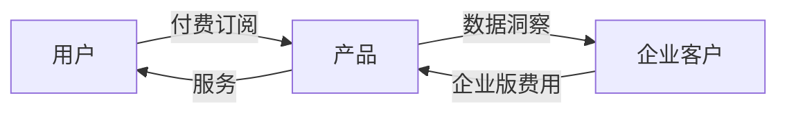

# 综合报告结构参考

综合报告文件名：`markdown/[产品名]-analysis-report.md`

---

## 报告完整结构

```markdown
# [产品名] 全景产品分析报告

> 分析时间：[YYYY年MM月]  
> 分析框架：7角色全景法  
> 报告版本：v1.0

---

## 执行摘要（Executive Summary）

**产品一句话定义：**
> [用最简洁的语言说清楚这个产品是什么、给谁用、解决什么问题]

**7角色核心结论速览：**

| 角色 | 核心结论 | 评分 |
|------|---------|------|
| 👤 用户 | | ⭐⭐⭐⭐ |
| 💰 投资人 | | ⭐⭐⭐ |
| 🛠 产品经理 | | ⭐⭐⭐⭐ |
| 📣 市场运营 | | ⭐⭐⭐ |
| 🎨 品牌运营 | | ⭐⭐⭐ |
| ⚔️ 友商 | | ⭐⭐⭐ |
| 🤝 合作伙伴 | | ⭐⭐⭐⭐ |

**综合判断：**
> [2-3 句话，综合所有视角给出最终判断]

---

## 第一章：产品全景

### 1.1 产品概览

[产品名称、所属品类、成立时间、主要市场、定价区间等基础信息表格]

### 1.2 产品竞争力雷达图


> 说明：[雷达图各维度的评分依据简介]

### 1.3 市场定位矩阵


> X轴：[维度说明]，Y轴：[维度说明]

---

## 第二章：用户视角 👤

[从 01_user.md 中提炼精华，约 500-700 字]

### 核心用户画像

[用简洁的描述或 ASCII 图展示典型用户]

### 真实用户声音

> "[正面评价引用]" — [来源平台，如 G2/App Store]

> "[负面评价引用]" — [来源平台]

### 用户体验评分

```
易上手  ████████░░  8/10
核心功能 █████████░  9/10  
性价比   ███████░░░  7/10
客户支持 ██████░░░░  6/10
稳定性   ████████░░  8/10
```

---

## 第三章：商业与投资视角 💰

[从 02_investor.md 中提炼精华，约 500-700 字]

### 市场规模

[TAM/SAM/SOM 图示，可用 ASCII 或 Mermaid]

### 商业模式图

[Mermaid flowchart 或引用 SVG]



### 关键财务指标

[表格形式展示已知或估算数据，未知项标注「待验证」]

---

## 第四章：产品力分析 🛠

[从 03_pm.md 中提炼精华，约 500-700 字]

### 产品功能架构

[Mermaid mindmap 或层级列表]

```mermaid
mindmap
  root([产品名])
    核心功能
      功能A
      功能B
    辅助功能
      功能C
      功能D
    生态功能
      功能E
```

### 用户旅程地图

[引用 03_pm.md 中的 Mermaid journey 图]

### 产品力对比（竞品矩阵）

| 功能 | 本品 | 竞品A | 竞品B |
|------|------|-------|-------|
| [核心功能1] | ✅ | ✅ | ❌ |
| [核心功能2] | ✅ | ❌ | ✅ |
| [差异化功能] | ✅ | ❌ | ❌ |

---

## 第五章：增长与品牌 📣🎨

[从 04_growth.md 和 05_brand.md 整合，约 600-800 字]

### 增长漏斗

```
                ┌─────────────────────┐
                │   访客 100%         │
                └──────────┬──────────┘
                           │
                ┌──────────▼──────────┐
                │   注册 ~XX%         │
                └──────────┬──────────┘
                           │
                ┌──────────▼──────────┐
                │   激活 ~XX%         │
                └──────────┬──────────┘
                           │
                ┌──────────▼──────────┐
                │   付费 ~XX%         │
                └─────────────────────┘
```

### 获客渠道分布

[引用图表或 ASCII 饼图]

### 品牌认知地图

[引用 05_brand.md 中的品牌分析]

---

## 第六章：竞争格局 ⚔️

[从 06_competitor.md 中提炼，约 400-500 字]

### 竞争态势全景


### 核心竞争对手分析

[表格对比主要竞品的优劣势]

### 竞争策略推演

[说明友商可能的反击动作及本品应对]

---

## 第七章：合作生态 🤝

[从 07_partner.md 中提炼，约 300-400 字]

### 合作伙伴价值图谱

[Mermaid 图或 ASCII 图展示生态合作关系]

### 最具潜力的合作方向

[列举 2-3 个最有价值的合作场景]

---

## 第八章：综合研判

### 8.1 SWOT 矩阵

```
        ┌──────────────────┬──────────────────┐
        │   优势 S         │   劣势 W         │
        │  • [优势1]       │  • [劣势1]       │
        │  • [优势2]       │  • [劣势2]       │
        │  • [优势3]       │  • [劣势3]       │
        ├──────────────────┼──────────────────┤
        │   机会 O         │   威胁 T         │
        │  • [机会1]       │  • [威胁1]       │
        │  • [机会2]       │  • [威胁2]       │
        │  • [机会3]       │  • [威胁3]       │
        └──────────────────┴──────────────────┘
```

### 8.2 综合评分卡

| 维度 | 权重 | 得分（1-10）| 加权得分 |
|------|------|------------|---------|
| 产品力 | 25% | | |
| 市场机会 | 20% | | |
| 商业模式 | 20% | | |
| 竞争壁垒 | 20% | | |
| 团队执行力 | 15% | | |
| **综合得分** | **100%** | | **X.X / 10** |

### 8.3 最终结论

> **核心判断：**
> [2-3 段有逻辑推演的综合结论，小白可读，结论明确不模糊]

---

## 第九章：结论边界与假设体系 ⚠️

> **这一章是本报告最重要的章节之一。** 没有绝对正确的分析，只有在特定条件下成立的结论。

### 9.1 结论适用边界

本报告结论在以下条件下成立：

- **时间范围：** [分析月份] 起的 12 个月内（超过此时间段需重新验证）
- **地理范围：** [主要市场]
- **竞争格局：** 主要竞争对手格局维持现状，无颠覆性新进入者
- **技术环境：** 底层技术平台（如 AI/云/移动端）无根本性范式转变
- **宏观环境：** 所在行业监管政策未发生重大调整

### 9.2 关键前提假设（KPA）

**KPA-1：[假设名称]**
> [具体假设内容]
- **观测指标：** [具体的可测量指标]
- **验证周期：** [多久可以看出苗头]
- **证伪信号：** [什么情况下说明这个假设不成立]

**KPA-2：[假设名称]**
> [具体假设内容]
- **观测指标：** [具体的可测量指标]
- **验证周期：**
- **证伪信号：**

**KPA-3：[假设名称]**
> [具体假设内容]
- **观测指标：**
- **验证周期：**
- **证伪信号：**

### 9.3 假设变动时的结论调整

| 假设变动情形 | 结论方向调整 | 调整幅度 |
|------------|------------|---------|
| KPA-1 不成立：[具体情形] | [修订结论] | 大/中/小 |
| KPA-2 不成立：[具体情形] | [修订结论] | 大/中/小 |
| KPA-3 不成立：[具体情形] | [修订结论] | 大/中/小 |

**最敏感的假设：** KPA-[X]，因为 [原因]。如果这个假设发生变化，整个分析框架需要从 [章节] 开始重新推演。

### 9.4 未来观察清单

在未来 3-6 个月内，持续观察以下指标来验证本报告的判断：

- [ ] [指标1]：目标值 [X]，截止日期 [Y]
- [ ] [指标2]：目标值 [X]，截止日期 [Y]
- [ ] [指标3]：目标值 [X]，截止日期 [Y]
- [ ] [关键事件]：如 [融资/上市/新功能/竞品动作]

---

## 附录

### 数据来源清单

| 数据类型 | 来源 | 访问日期 | 可信度 |
|---------|------|---------|-------|
| | | | |

### 分析局限性说明

[诚实说明本次分析受到哪些信息限制，哪些数据无法获取，对结论可靠性的影响]

---

*本报告由 Claude product-multi-role-analysis skill 生成 | [生成时间]*
```
