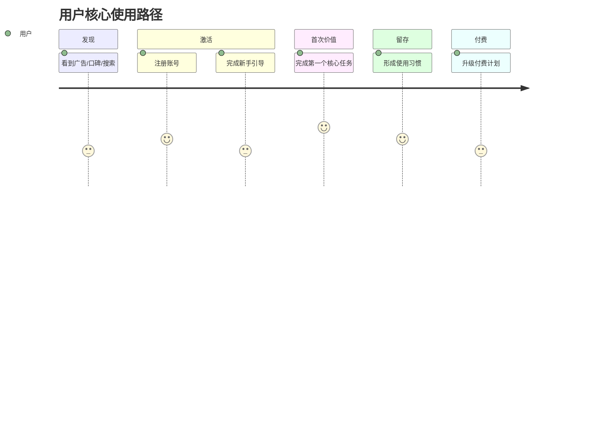

# 7 角色分析模板

每个角色文件的标准结构如下。根据产品特性灵活调整，但核心框架保持一致。

---

## 👤 Role 1 — 用户视角 (`01_user.md`)

```markdown
# 用户视角：[产品名] 分析

## 我是谁？
[描述典型用户画像：年龄/职业/使用场景/技术能力/预算敏感度]

## 我为什么会用这个产品？

### 核心痛点
- 在遇到这个产品之前，我是怎么解决这个问题的？（替代方案）
- 现有方案的最大缺陷是什么？
- 这个产品解决了哪条最关键的痛点？

### 「啊哈时刻」（Aha Moment）
> 第一次感受到产品价值的那一刻是什么？

### 使用频率与深度
- 日活/周活/月活场景
- 核心功能 vs 辅助功能的使用比例
- 粘性来源（数据积累/习惯/社交关系/工作流嵌入）

## 我爱它什么？
（列举 3-5 个真实的正面体验，引用真实用户评价或评分数据）

## 我恨它什么？
（列举 3-5 个真实的负面体验，必须基于真实反馈，不回避）

## 我愿意付多少钱？
- 当前定价的感知公平性（太贵/合理/超值）
- 价格敏感点在哪里？
- 什么情况下会停止付费？（流失触发因素）

## 我会推荐给朋友吗？
- NPS 感知分数（基于评论数据估算）
- 推荐场景与话术
- 不推荐的顾虑

## 用户视角核心结论
> **一句话：** [产品名] 对于 [目标用户群] 来说，[正面/负面/中性]，因为 [核心理由]。

## 该结论的前提假设
- 假设1：[用户群体特征假设]
- 假设2：[使用场景假设]
```

---

## 💰 Role 2 — 投资人视角 (`02_investor.md`)

```markdown
# 投资人视角：[产品名] 分析

## 我的投资逻辑框架
[说明采用的框架，如：SaaS 指标框架 / 消费互联网增长框架 / 硬件+软件闭环框架]

## 市场机会

### TAM / SAM / SOM
| 市场层级 | 规模 | 数据来源 |
|---------|------|---------|
| TAM（总可寻址市场）| $XXX 亿 | [来源] |
| SAM（可服务市场）| $XXX 亿 | [来源] |
| SOM（可获取市场）| $XXX 亿 | [推算逻辑] |

### 市场增长速度
- CAGR：XX%（来源：[机构名]，[年份]）
- 增长驱动力：[2-3 个核心驱动]
- 市场天花板：[何时可能见顶？为什么？]

## 商业模式解析

### 收入结构
[用简洁的文字或图示说明收入来源：订阅/交易抽成/广告/数据/硬件等]

### 关键财务指标（若有公开数据）
- ARR / MRR：
- 客均价值（ACV）：
- 获客成本（CAC）：
- 客户留存率（Retention）：
- LTV/CAC 比：
- 毛利率估算：

### 盈利路径
[何时可能盈利？靠什么规模效应？]

## 护城河评估

| 护城河类型 | 强度（1-5）| 说明 |
|-----------|-----------|------|
| 网络效应 | | |
| 数据壁垒 | | |
| 转换成本 | | |
| 品牌溢价 | | |
| 成本优势 | | |
| 监管许可 | | |

## 风险清单
1. **最大风险：** [描述]（概率：高/中/低）
2. **次要风险：** [描述]
3. **黑天鹅风险：** [描述]

## 估值参考
- 同类公司 EV/ARR 或 P/S 倍数范围：
- 基于公开信息的粗估值区间：
- 与上市对标公司的对比：

## 投资人视角核心结论
> **一句话：** 这是一个 [值得/不值得/有条件值得] 投资的标的，关键在于 [核心判断依据]。

## 该结论的前提假设
- 假设1：[市场规模假设]
- 假设2：[团队执行力假设]
- 假设3：[竞争格局假设]
```

---

## 🛠 Role 3 — 产品经理视角 (`03_pm.md`)

```markdown
# 产品经理视角：[产品名] 分析

## 产品定位
- 核心价值主张（CVP）：一句话说清楚
- 目标用户（精确到细分人群）：
- 差异化定位（相对竞品）：

## 产品架构分析

### 核心功能模块
[用层级列表或 Mermaid 图展示产品功能树]

### 产品设计哲学
- 是否遵循「单一职责」还是「一站式」？
- 复杂度控制：功能数量与易用性的取舍
- 界面交互：是否有明确的设计语言体系？

## 用户旅程（核心路径）



## 技术壁垒评估
- 核心技术难度（可被复制的难易程度）：
- 数据飞轮是否存在？
- API/生态/平台依赖情况：

## Roadmap 合理性判断
- 现有功能与用户核心需求的匹配度：
- 明显缺失的功能（竞品有但本品没有）：
- 功能过度堆砌的风险：
- 近期迭代节奏（频率/方向/质量）：

## Bug / UX 问题
（基于真实用户反馈总结）

## 产品经理视角核心结论
> **一句话：** 该产品的产品力 [强/中/弱]，核心优势在于 [X]，主要短板在于 [Y]，短期内 [能/难] 被竞品超越。

## 该结论的前提假设
- 假设1：[技术架构假设]
- 假设2：[用户需求稳定性假设]
```

---

## 📣 Role 4 — 市场运营视角 (`04_growth.md`)

```markdown
# 市场运营视角：[产品名] 分析

## 增长现状
- 用户规模（注册/MAU/DAU，数据来源）：
- 增长速度（MoM/YoY，或基于公开信息估算）：
- 主要市场地区分布：

## 获客渠道分析

| 渠道 | 估算占比 | 质量评估 | 可持续性 |
|------|---------|---------|---------|
| SEO/内容营销 | | | |
| 付费广告（SEM/社交）| | | |
| 口碑/病毒传播 | | | |
| 渠道合作/分销 | | | |
| 社区/KOL | | | |
| 产品内引流 | | | |

## 转化漏斗分析
（基于行业均值或公开数据估算，标注来源）

```
访客 → 注册 → 激活 → 付费 → 续费
100% → XX% → XX% → XX% → XX%
```

关键瓶颈在哪个环节？原因是什么？

## 留存与流失
- 关键留存节点（D1/D7/D30 留存率估算）：
- 主要流失原因（基于评论分析）：
- 召回策略有效性：

## 定价策略评估
- 现有定价层级（Freemium/Trial/订阅层级）：
- 定价是否合理？与竞品对比：
- 升级付费的核心触发因素：

## 增长机会与风险
**机会：**
1. [具体机会，附数据支撑]
2. ...

**风险：**
1. [具体风险]
2. ...

## 市场运营视角核心结论
> **一句话：** 该产品的增长 [健康/有隐患/已见天花板]，关键增长杠杆是 [X]，最大增长威胁是 [Y]。

## 该结论的前提假设
- 假设1：[获客成本假设]
- 假设2：[市场教育程度假设]
```

---

## 🎨 Role 5 — 品牌运营视角 (`05_brand.md`)

```markdown
# 品牌运营视角：[产品名] 分析

## 品牌基础评估

### 品牌识别系统
- 品牌名：记忆度/拼写难度/国际化适配
- Logo：视觉特征/专业度/适配场景
- 配色体系：情绪传递/行业匹配度
- 字体/排版风格：
- 品牌语（Slogan）：是否清晰传递价值？

### 品牌个性（Brand Personality）
用 5 个形容词描述品牌给人的感觉：

## 用户心智占位
- 在目标用户脑中，这个品牌代表什么？
- 第一联想词是什么？
- 在品类中的认知位置（第一/第二/追随者/颠覆者）：

## 内容与传播一致性
- 官网文案是否与品牌调性一致？
- 社交媒体内容风格：
- 客服/产品内文案：
- 是否存在品牌表达不一致的情况？

## 情感连接度
- 用户是否对品牌有情感依附？（从评论中判断）
- 是否存在品牌粉丝/社区？
- 品牌危机处理案例（若有）：

## 竞品品牌对比
| 维度 | 本品 | 竞品A | 竞品B |
|------|------|-------|-------|
| 品牌辨识度 | | | |
| 情感温度 | | | |
| 专业可信度 | | | |
| 差异化鲜明度 | | | |

## 品牌提升建议
（从品牌运营视角，提出 3 个有优先级的改进方向）

## 品牌运营视角核心结论
> **一句话：** 该品牌目前处于 [强势/普通/弱势] 状态，核心品牌资产是 [X]，最需要加强的是 [Y]。

## 该结论的前提假设
- 假设1：[品牌传播渠道假设]
- 假设2：[目标用户品牌敏感度假设]
```

---

## ⚔️ Role 6 — 友商视角 (`06_competitor.md`)

```markdown
# 友商视角：[竞品公司名] 眼中的 [产品名]

> 注意：本章节以友商（竞争对手）的第一人称视角来写，表达竞争对手会如何看待和应对这个产品。

## 我是谁？
[描述主要竞争对手的背景、规模、核心优势]

## 我如何看待这个对手？

### 威胁等级评估
- 短期威胁（6-12 个月）：[高/中/低]，原因：
- 长期威胁（2-3 年）：[高/中/低]，原因：

### 它威胁我的哪些方面？
- 正在蚕食的客户群：
- 正在蚕食的功能市场：
- 定价压力：
- 品牌认知上的竞争：

## 它的可攻击弱点

| 弱点 | 可攻击程度 | 我的应对方案 |
|------|-----------|------------|
| [弱点1] | 高/中/低 | [具体打法] |
| [弱点2] | | |
| [弱点3] | | |

## 我会怎么反击？
1. **功能跟进：** 哪些功能值得抄？多久可以复制？
2. **定价策略：** 是否需要调整定价来防御？
3. **渠道封堵：** 抢占对方的增长渠道
4. **生态捆绑：** 加深既有客户的粘性和迁移成本
5. **品牌声音：** 如何在用户心智中打压对方

## 友商无法轻易复制的东西
（客观承认对方的真实壁垒）

## 友商视角核心结论
> **一句话：** 作为友商，我认为 [产品名] 是 [值得认真对待/暂时无需担心/需要立即应对] 的威胁，核心原因是 [X]。

## 该结论的前提假设
- 假设1：[友商的技术能力假设]
- 假设2：[市场增长足够双方存活假设]
```

---

## 🤝 Role 7 — 合作伙伴视角 (`07_partner.md`)

```markdown
# 合作伙伴视角：[产品名] 分析

## 我是谁？
[描述潜在合作伙伴的类型：渠道商/技术集成商/内容提供方/硬件厂商/企业客户等]

## 我为什么考虑与它合作？

### 价值互补分析
- 它有我没有的：[具体资源/能力/用户群]
- 我有它没有的：[具体资源/能力/用户群]
- 合作产生的 1+1>2 效应：

### 合作场景
1. **场景A：** [具体合作形式] → 双方收益：
2. **场景B：** [具体合作形式] → 双方收益：
3. **场景C：** [具体合作形式] → 双方收益：

## 合作吸引力评分

| 维度 | 评分（1-5）| 说明 |
|------|-----------|------|
| 用户规模与质量 | | |
| 品牌信誉 | | |
| API/集成友好度 | | |
| 商务条款灵活性 | | |
| 团队执行力 | | |
| 长期稳定性 | | |

## 合作风险

| 风险类型 | 描述 | 缓解措施 |
|---------|------|---------|
| 被平台化/被吞并风险 | | |
| 数据/隐私风险 | | |
| 竞争变友为敌风险 | | |
| 依赖度过高风险 | | |

## 我的合作决策
- 推荐合作形式：
- 关键谈判条件：
- 观望信号：（什么情况下先等等再谈）
- 放弃信号：（什么情况下决定不合作）

## 合作伙伴视角核心结论
> **一句话：** 作为 [合作伙伴类型]，与 [产品名] 合作是 [值得推进/有条件推进/暂缓] 的，核心理由是 [X]。

## 该结论的前提假设
- 假设1：[市场互补性假设]
- 假设2：[双方商务条款假设]
```
