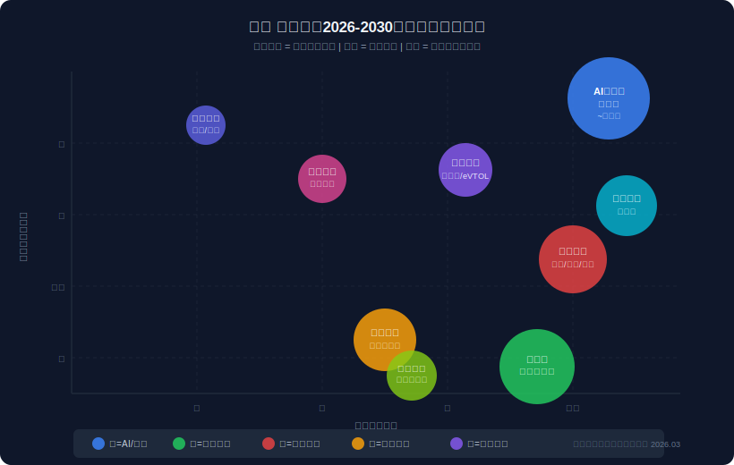
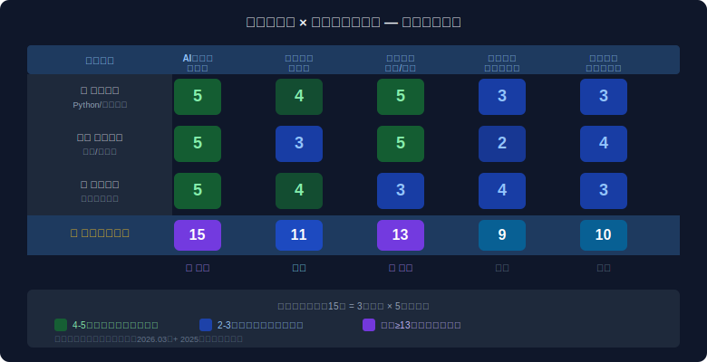
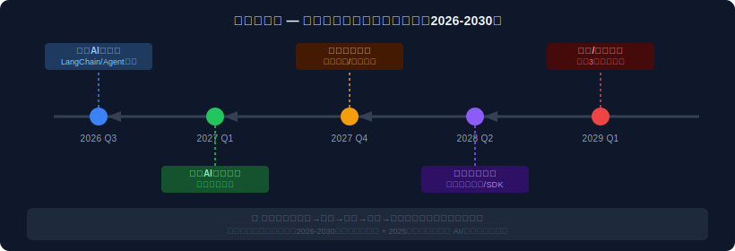

# 《顺势而为：软件工程师的十五五战略方向报告》

> 生成时间：2026年6月11日  
> 询问者画像：软件工程师，5年后端开发经验，擅长 Python / 系统架构，有创业意愿  
> 数据来源：十五五规划纲要（2026.03）、2025年政府工作报告、国家发改委等权威来源

---

## 一、国家战略趋势总览

2026年3月，《中华人民共和国国民经济和社会发展第十五个五年规划纲要（2026-2030年）》正式发布。这是一份比十四五更具"进攻性"的规划——它不再只谈"高质量发展"的方向，而是明确点名了七个**决定国运**的战略方向：

**十五五三条核心主线**（选自规划纲要官方表述）：
1. **新质生产力** — AI、机器人、量子、生物制造为核心引擎
2. **扩大内需与深化改革** — 消费升级、城镇化、统一大市场
3. **统筹发展与安全** — 科技自立自强、粮食安全、供应链安全

**数字化基础建设加速**：规划要求"数字经济核心产业增加值占比超过10.5%"（2025年已达10.5%，十五五继续加码），"全社会研发经费投入年均增长7%以上"。

> 📌 **关键信号**：十五五规划纲要中，"建设现代化产业体系""高水平科技自立自强""数字中国建设"被列为**三大首要战略部署**，这在历届五年规划中是首次同时出现，说明政策叠加强度前所未有。

---

## 二、核心风口识别（Top 5）



### 🔴 风口①：AI大模型应用层（爆发期）

| 维度 | 内容 |
|------|------|
| 政策支撑强度 | ★★★★★ |
| 市场规模 | 预计2030年中国AI市场超万亿（IDC预测） |
| 政策进入阶段 | 爆发期 |
| 时间窗口 | 2026-2028年是应用层窗口期，错过代价高 |

**政策依据**：2025年政府工作报告提出"建立未来产业投入增长机制，培育生物制造、**量子科技、具身智能、6G**等未来产业"；十五五规划纲要专门设"深入推进数字中国建设"独立章节。

📌 **历史参照**：2012年4G牌照发放 → 催生移动互联网十年红利。基础设施（算力/模型）与应用层之间总有3-5年滞后，**现在正是应用层爆发的起点**。

---

### 🔴 风口②：国产替代（工业软件/基础软件）（爆发期）

| 维度 | 内容 |
|------|------|
| 政策支撑强度 | ★★★★★ |
| 市场规模 | 工业软件国内市场规模约3000亿，外资占70%+ |
| 政策进入阶段 | 爆发期 |
| 时间窗口 | 2026-2029年，国资采购优先替换进口软件 |

**政策依据**：规划纲要明确"中国碗里必须装着中国粮，必须自力更生"逻辑延伸至软件领域；等保3.0、关键信息基础设施保护条例为国产软件提供强制替换需求。

📌 **历史参照**：2015年"中国制造2025"政策 → 国内装备制造业国产化率从30%升至65%（机床行业，2021年数据）。**软件领域国产化率更低，替代空间更大。**

---

### 🟡 风口③：具身智能 / 机器人（成长期）

| 维度 | 内容 |
|------|------|
| 政策支撑强度 | ★★★★☆ |
| 市场规模 | 中国机器人市场2030年预计超3000亿（灼识咨询） |
| 政策进入阶段 | 成长期（2年内转入爆发期） |
| 时间窗口 | 2026-2027年是软件栈/SDK的布局窗口 |

📌 **历史参照**：2020年特斯拉宣布Optimus计划 → 三年内具身智能赛道融资超百亿美元。**中国政策将在2026-2027年密集发布机器人专项政策。**

---

### 🔴 风口④：银发经济数字化服务（爆发期）

| 维度 | 内容 |
|------|------|
| 政策支撑强度 | ★★★★☆ |
| 市场规模 | 银发经济市场规模预计2030年超7万亿 |
| 政策进入阶段 | 爆发期（人口结构驱动，无法逆转） |
| 时间窗口 | 持续10年+ |

规划纲要20项指标中**民生指标超1/3**，覆盖养老、健康、托育。数字化适老服务、AI陪护、健康管理是高门槛技术+低竞争密度的交叉领域。

---

### 🟡 风口⑤：低空经济 / 无人机系统（成长期）

低空空域改革政策2024年正式开放，预计2026年商业化进程加速。软件工程师在飞控系统、任务调度、地图API集成等方向有明确切入口。

---

## 三、六维行动建议

### 3.1 💰 投资方向

**首选方向**：AI基础设施（算力/模型供应商ETF）+ 国产软件（港A两市相关标的）

**逻辑**：技术背景使你能识别真伪，不会被营销迷惑；政策持续加码意味着行业β收益确定性高。

**操作建议**：
- 关注A股"工业软件"、"具身智能"板块ETF（低风险入口）
- 中长期持有2-3个专注国产替代的细分龙头
- **避坑**：不要投早期泡沫期的AI概念股，选有实际政府采购订单的标的

---

### 3.2 🚀 创业方向

**强烈推荐**：**AI+垂直行业 SaaS**

切入逻辑：大模型降低了AI开发门槛，但行业know-how仍是护城河。软件工程师 + 垂直行业（如工业、医疗、法律、教育）= 竞争壁垒。

**具体方向**（按匹配度排序）：

1. **AI工业检测系统**（最强）：政策支持制造业升级，工厂数字化需求旺盛，技术壁垒足以抵御大厂竞争
2. **政务/国央企AI助手**：国产化需求 + 政府采购预算有保障，但销售周期长
3. **AI养老/康养管理平台**：银发经济政策红利 + 低竞争密度

**启动资金估算**：20-50万可完成MVP验证（云算力成本大幅下降）

---

### 3.3 📈 商业思路

**核心逻辑**：从"卖技术"转向"卖确定性"

政策导向下，政府和国企采购量最大，但他们买的不是"AI"，而是"合规、可控、可追溯的解决方案"。软件工程师的商业切入点：

- **外包转产品**：先做定制化，积累行业Know-how，再抽象为SaaS
- **集成商模式**：整合多个国产化组件，做系统集成，门槛低、回款快
- **技术顾问+股权**：加入初创公司做CTO，以股换钱

---

### 3.4 🛠️ 产品思路

**当前最值得做的10个产品方向**（结合政策 + 技术可行性）：

```
强推荐（政策+技术双确定）：
① 工业设备故障预测 SaaS（AI+传感器数据）
② 政府文档智能处理系统（大模型+OCR+国产化）
③ 养老院智能管理平台（IoT+LLM+银发政策）
④ 低代码工业自动化配置工具（国产替代+小B客户）

次推荐（需要等待时机）：
⑤ 机器人任务调度SDK（2027年窗口期到来）
⑥ 无人机航线规划SaaS（低空开放后）
```

---

### 3.5 👔 就业择业

**2026-2030 最值钱的岗位方向**（结合十五五人才需求）：

| 岗位方向 | 薪资趋势 | 政策背书 |
|---------|---------|--------|
| AI应用工程师（LLM+Agent） | ↑↑↑ 稀缺 | 数字中国战略 |
| 工业软件研发工程师 | ↑↑ 高薪缺口大 | 科技自立自强 |
| 机器人软件栈工程师 | ↑↑↑ 未来3年暴涨 | 未来产业政策 |
| 国企IT架构师 | ↑ 稳定 + 替换项目多 | 国产替代政策 |

**建议**：在现有工作中，主动争取AI/国产化相关项目，用公司资源积累未来创业所需的行业资源。

---

### 3.6 📖 学习规划

**未来两年最值得学的技能矩阵**：

```
第一优先级（立刻开始）：
├── LLM应用开发（LangChain / LlamaIndex / RAG）
├── Agent框架（AutoGen / CrewAI）
└── 向量数据库（Chroma / Weaviate / Milvus）

第二优先级（6个月内）：
├── 工业物联网基础（MQTT / OPC-UA）
├── 具身智能基础（ROS2 基础概念）
└── 政府采购流程（商务知识）

长期积累：
└── 某一垂直行业深度知识（选你最容易接触到的）
```

**不值得投入的方向**（政策退潮/竞争过度）：
- 纯前端开发（AI辅助编码将大幅降低门槛）
- 电商/短视频流量运营（政策监管+市场饱和）
- 单纯的CRUD后端（可被AI代替）

---

## 四、禀赋-趋势匹配矩阵



**结论**：作为软件工程师，你与"AI大模型应用层"（15分）和"国产替代软件"（13分）的匹配度最高，是**优先战略方向**。

---

## 五、行动路径时间轴



---

## 六、风险与注意事项

### ⚠️ 三大风险

**风险1：政策执行落差**  
五年规划是方向性文件，不等于资金已到位。国产替代政策下，有时采购周期会比预期慢2-3年。**对策**：选择"已有明确政府采购预算"的细分赛道，不要押注"概念风口"。

**风险2：技术窗口过窄**  
AI领域技术迭代极快。2024年的热门技术框架可能2026年已过时。**对策**：学习底层原理（Transformer架构、强化学习）而非只学工具，保持技术迁移能力。

**风险3：赛道过热 → 竞争白热化**  
AI应用层2025年已出现"百模大战"，部分细分赛道融资额超出实际市场规模。**对策**：聚焦"政策确定性高但创业者少"的交叉地带，如工业AI（而非消费AI）。

---

## 七、行动优先级清单

> 未来30天内，这些事最值得做：

```
本周内：
□ 注册并深度使用 3 个 AI 编程助手（Cursor / Claude / Copilot）
□ 跑通一个 LangChain Agent demo（感受技术栈）

本月内：
□ 选定一个垂直行业（从你最熟悉的身边场景选）
□ 找 3-5 个该行业的从业者深度访谈（找痛点）
□ 完成一个 AI+垂直场景 的 POC（不需要完美）

三个月内：
□ 找到 1 个愿意试用你的 POC 的小客户（哪怕免费）
□ 关注 1-2 个"国产替代"赛道的政策动向（设置 gov.cn 关键词提醒）
□ 评估：是否需要在现有工作之外开辟副业通道
```

---

## 八、数据来源

| 来源 | 文件/链接 | 日期 |
|------|---------|------|
| 国家发展改革委 | 十五五规划纲要草案摘要 | 2026.03.08 |
| 人民网 | 十五五规划纲要全文 | 2026.03.14 |
| 国家数据局 | 十五五纲要解读 | 2026.03.08 |
| 中央网信办 | 十五五规划纲要编制记 | 2026.04.01 |
| 国家发改委 | 未来产业布局文件 | 2025.12.04 |
| 国家统计局 | 战略性新兴产业分类目录（2023） | 2025.03 |

---

*本报告基于公开政策文件生成，不构成金融投资建议。政策解读存在主观判断，建议结合自身情况和专业顾问意见做决策。*
