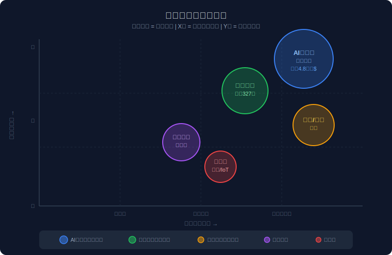
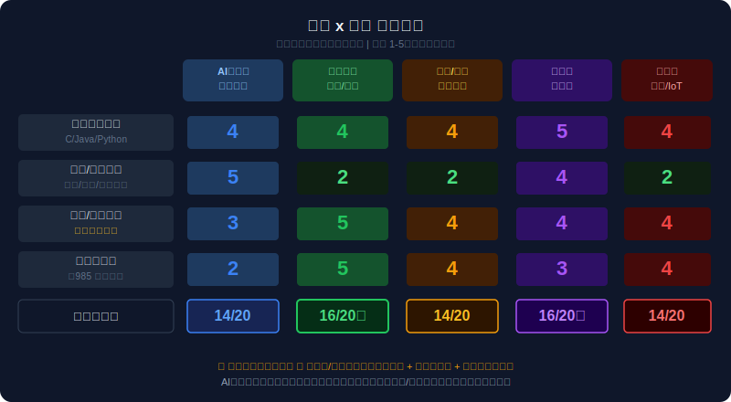
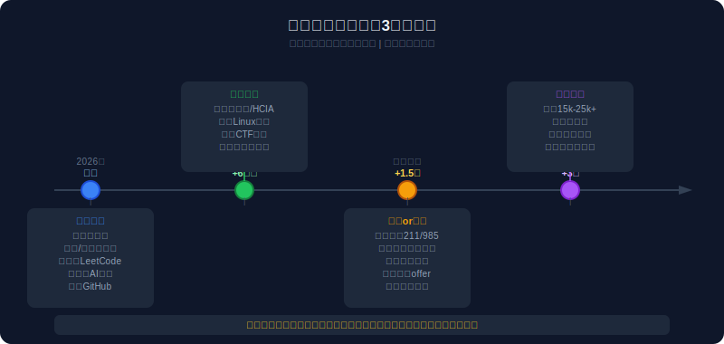

# 《顺势而为：西安邮电大学计算机本科生的战略方向报告》

> 生成时间：2026年6月11日  
> 询问者画像：西安邮电大学 · 计算机相关专业 · 本科生  
> 报告框架：十五五规划（2026-2030）× 个人禀赋 × 六维行动建议

---

## 一、国家战略趋势总览

2026年3月，《中华人民共和国国民经济和社会发展第十五个五年规划纲要》正式发布，这是你未来5年最重要的"外部环境说明书"。

**十五五的三条核心主线，直接影响IT从业者命运：**

| 主线 | 核心内容 | 对计算机专业的意义 |
|------|----------|-------------------|
| 🔴 新质生产力 | AI、芯片、算力、量子科技 | **你的专业是国家战略的主战场** |
| 🟡 数字中国 | 算力、算法、数据、"人工智能+" | **每个行业都在买IT服务** |
| 🟢 安全自主可控 | 信创/国产替代、网络安全 | **长期稳定红利，竞争相对低** |

> 据《十五五规划纲要》第四篇，"深入推进数字中国建设"作为单独专篇列出，"全方位推进数智技术赋能"被写入国家顶层设计。数字经济核心产业增加值占GDP比重已超10.5%，仍在持续扩大。

📌 **历史参照**：2012年4G牌照发放，催生了移动互联网十年红利，京东、美团、滴滴等在这一基础设施上成长。今天AI算力基础设施的铺开，类似当年的4G节点，你正处在起点。

---

## 二、核心风口识别（Top 5）



### 🔵 风口1：AI大模型应用开发

| 指标 | 数据 |
|------|------|
| 政策支持强度 | ★★★★★ |
| 市场规模 | 联合国预测2033年全球AI市场4.8万亿美元 |
| 国内现状 | 生成式AI用户达6.02亿，AI核心产业规模超万亿 |
| 人才缺口 | AI人才缺口500万，但高端算法岗对学历要求极高 |
| 进入阶段 | 爆发期（应用落地下半场） |

**邮电学生的机会点**：纯大模型算法（年薪50万+）是清北复交的战场，不适合直接硬刚。**但"AI应用开发工程师"——用大模型API做垂直行业应用——是普通本科生能打进去的位置**，需求量远大于算法岗，月薪1.5-3万是现实。

📌 历史参照：2015年移动互联网爆发，大量不会写底层算法的普通程序员，通过做APP/小程序赚到了钱。AI应用层的机会，是同样的逻辑。

---

### 🟢 风口2：网络安全（最推荐非名校路线）

| 指标 | 数据 |
|------|------|
| 政策支持强度 | ★★★★★ |
| 人才缺口 | 327万（《国家网络安全人才战略白皮书2025》） |
| 年增幅 | 国产操作系统安全适配需求年增300% |
| 薪资特点 | 越老越值钱，35岁以上资深专家占40%+ |
| 竞争烈度 | 远低于AI算法岗 |

这是**对西安邮电大学计算机生最友好的赛道**，原因有三：

1. **邮电背景天然匹配**：通信、网络知识是网络安全的基础，你们有先天禀赋
2. **非名校可进**：体制内（公安一所三所、各地网安总队）本科可进，央企国企网安岗位需求大
3. **抗AI淘汰**：渗透测试、漏洞挖掘、应急响应需要实战经验积累，不是大模型能直接替代的

📌 历史参照：2017年等保2.0政策落地，合规带来大量安全岗位需求，那一批做安全的人现在都是行业稀缺资源。2026年《网络数据安全管理条例》《关键信息基础设施安全保护条例》已落地，新一波合规需求来了。

---

### 🟡 风口3：信创/国产替代工程

| 指标 | 数据 |
|------|------|
| 政策支持强度 | ★★★★★ |
| 人才缺口 | 10大核心岗位累计缺口≥275万 |
| 替代进度 | 党政领域100%国产化已完成，行业信创加速推进中 |
| 证书含金量 | 信创中级证书=央企招标加分，某市公务员遴选加5分 |

**信创的本质是"把国外软硬件换成国产的"，需要大量能做适配、迁移、测试的工程师**，技术门槛不是最高的，但政策保障极强，适合稳健型同学。

---

### 🟣 风口4：云计算/大数据

| 指标 | 数据 |
|------|------|
| 政策支持强度 | ★★★★ |
| 规划支撑 | 十五五"强化算力算法数据高效供给"独立成章 |
| 就业稳定性 | 高 |
| 发展路径 | 运维→架构→解决方案→管理 |

这是计算机专业**最稳定的传统强势赛道**，阿里云、腾讯云、华为云每年大量招人，HCIA/AWS等证书含金量高。邮电学生的通信底子在这里同样加分。

---

### 🔴 风口5：嵌入式/车载/IoT

| 指标 | 数据 |
|------|------|
| 政策支持强度 | ★★★★ |
| 驱动力 | 汽车智能化、工业互联网5G+工厂超8000家 |
| 特点 | 稳定，但天花板相对明确 |

适合喜欢硬件、不排斥出差驻场的同学。

---

## 三、六维行动建议

### 3.1 就业择业（最重要，优先看这里）

**真相先讲**：2026年AI人才市场出现了极端分化——AI岗位数量暴增12倍，但80%的AI专业本科生找不到工作，根本原因是**质量和方向的错配**，而不是机会少。

**给你的路线图：**

**路线A（推荐★★）：网络安全方向**
- 目标岗位：安全运营工程师、渗透测试、安全服务工程师
- 起薪范围：本科 8000-15000元/月（体制内6000-10000元但稳定）
- 入场门票：CISP-PTE/HCIA-Security/CTF竞赛经历+实习
- 竞争强度：中低（比AI算法低很多）
- 35岁危机：几乎没有，越老越值钱

**路线B（推荐★★）：云计算+大数据方向**
- 目标岗位：云运维、数据工程师、后端开发+云
- 起薪范围：10000-18000元/月
- 入场门票：华为HCIA/AWS/阿里云ACA + 实习项目
- 适合：踏实努力、愿意系统学习的同学

**路线C（进阶叠加）：AI应用开发**
- 不要去卷大模型算法（除非你数学极强 + 愿意读研）
- 用API做垂直行业应用：医疗AI、工业AI、政务AI
- 结合路线A或B，成为"安全+AI"或"云+AI"的复合型人才

**路线D（稳健保底）：体制内/央国企**
- 西安本地有大量国企、军工单位、运营商需要IT人
- 网安岗+信创证书是进体制最快的路
- 西安公务员/事业编对西安本地院校毕业生有地缘优势

---

### 3.2 学习规划

**立刻开始（不需要等大三大四）：**

```
第0步（现在）：
  ✅ 把课程里的数据结构、计算机网络、操作系统学扎实——这是所有方向的地基
  ✅ 学会用AI工具（Cursor、Claude、Copilot）提升学习和编码效率
  ✅ 在GitHub建立自己的项目仓库，从第一天开始积累

第1步（6个月内）：
  选定一个方向（安全 or 云计算），开始专项学习
  网络安全：Kali Linux → OWASP Top10 → CTF入门 → 参加校内/网络CTF比赛
  云计算：Linux运维 → Docker/K8s → 华为HCIA备考 → 搭建个人云项目

第2步（1年内）：
  考取第一个含金量证书（软考中级 / HCIA / 安全证书）
  找到第一份相关实习（哪怕是小公司运维实习也值得）

第3步（2-3年）：
  考研 or 找工作的关键决策期（详见3.5）
```

**西安邮电大学的专属加分项**：
- 学校在通信/信息安全领域有积累，导师资源可利用
- 积极参与学校和西安本地的网安、大数据竞赛（蓝桥杯、"互联网+"等）
- 利用西安的地缘优势：西安是国家航天、军工、通信重镇，这些单位大量需要网安和嵌入式人才

---

### 3.3 投资方向

作为在校学生，投资的本质是**投资自己**，但也要懂得财务知识：

- **人力资本投资**：每年花2000-5000元在证书、课程、竞赛报名费上，回报率远高于任何股票
- **不建议现在炒股/加密货币**：认知和资金都不到位，先把技能值打高再说
- **关注国家科技产业基金**：毕业后若有余钱，可定投科技类ETF（半导体、网安、信创），跟着国家走

---

### 3.4 产品思路

这个方向适合有创业心气的同学，**本科阶段可以做探索性尝试**：

- 用AI API做一个垂直场景的小工具（比如：网安知识问答机器人、企业合规检测工具）
- 校内服务：帮老师/学院做数字化工具，积累项目经验和推荐信
- 参加各类创新创业大赛（"互联网+"、挑战杯），既练手又有政策补贴

---

### 3.5 考研方向建议

**要不要考研？看你的目标岗位：**

| 目标 | 考研建议 |
|------|----------|
| 大厂AI算法岗 | **必须考研，最好读985硕** |
| 网络安全（体制内/国企） | **不一定，本科够用，但考研加薪幅度明显** |
| 云计算/大数据工程师 | **可选，有工作经验也可以不考** |
| 西安本地央企/军工 | **硕士有加分，西安本地211/985优先** |

**如果考研，推荐目标院校（安全/计算机方向）：**
- 西安交通大学（西安本地，地缘优势+QS排名）
- 西北工业大学（军工背景强，适合网安/嵌入式）
- 西安电子科技大学（信息安全老牌强校，西安就近）
- 武汉大学（网络安全国家重点实验室）
- 华中科技大学、中南大学（性价比高）

**时间节点**：大二下学期开始规划 → 大三集中备考 → 大四初试+复试

---

### 3.6 创业方向

本科阶段不建议全力创业（资历和积累不够，失败率极高），但**可以做微创业实验**：

- 接外包：利用自己的技术能力接中小企业的IT外包（建站、运维、小程序），月入2000-5000补贴学费
- 技能变现：CTF高手可以做培训/直播，网安知识有受众
- **毕业后3-5年**是更合适的创业时机：那时你有技术积累、有人脉、有客户资源、有资金

---

## 四、禀赋-趋势匹配矩阵



**核心结论**：网络安全和云计算/大数据是西安邮电大学计算机生的首选赛道，综合匹配分均为16/20。AI大模型可作为技能叠加层，但不建议孤注一掷。

---

## 五、行动路径时间轴



---

## 六、风险与注意事项

**⚠️ 风险1：AI替代中低端岗位**

2026年AI确实正在替代简单重复的CRUD工程师、初级运维、基础测试。**应对策略**：向安全、架构、业务理解等AI难以替代的方向靠拢。

**⚠️ 风险2：市场分化极端**

AI缺口500万，但80%应届AI专业生找不到工作——这个矛盾说明**"普通地完成AI课程"没有价值，要有真实项目和实战经历**。应对：从大一开始做项目，不要只学课本。

**⚠️ 风险3：政策执行落差**

国家政策是方向，不是保险。信创推进慢于预期、网安合规执行力度不均，都会影响具体时间节点。**不要押注单一政策，选有多个需求驱动的方向**（比如网络安全既有政策需求又有市场需求）。

**⚠️ 风险4：院校标签的现实**

西安邮电大学是省属重点，计算机学科C+级别。在名企校招中会面临简历筛选劣势。**应对方案**：
- 考研升级学历标签
- 用竞赛奖项（ACM、CTF、蓝桥杯）打破筛选
- 精准投递：西安本地央企、通信行业、网安专业公司（非互联网大厂）
- 有项目实习经历的简历，比没有项目的985简历更有竞争力

---

## 七、行动优先级清单（可执行版）

以下是按紧迫性排列的具体行动：

### 🔴 本月内（立刻做）
- [ ] 花30分钟确认自己的主方向：网络安全 or 云计算（两者都感兴趣可以先学安全）
- [ ] 安装Kali Linux虚拟机 或 注册华为云免费账号，动手摸一次
- [ ] 在GitHub注册账号，把课程作业整理上传
- [ ] 把ChatGPT/Claude等AI工具作为学习辅助工具，每天使用

### 🟡 3个月内
- [ ] 完成一门系统性课程（推荐：网安-《Web安全攻防》；云计算-《Linux运维入门》）
- [ ] 参加一次CTF比赛（校内或网络赛）
- [ ] 找1-2位在相关方向工作的师兄师姐，请他们喝杯咖啡聊聊经验

### 🟢 6-12个月内
- [ ] 考取一张证书（软考网络工程师 / HCIA / 安全助理工程师，任选一）
- [ ] 完成一个有实际用途的项目（不是课程作业，是真实解决某个问题）
- [ ] 争取一次实习机会（哪怕是兼职或远程的）

### 🔵 1.5-3年
- [ ] 做出考研 or 就业的最终决定（建议大三上学期定好）
- [ ] 拿到第一份正式实习offer或研究生录取通知
- [ ] 月薪目标：毕业后首份工作 10000-18000元（西安本地）

---

## 八、附录：西安的地缘红利

很多同学低估了**在西安读书的优势**：

- 西安是国家重要的航天、军工、通信基地，有大量中国航天、兵器工业、中兴、华为西安研发中心等
- 西安是关中平原城市群的核心，"一带一路"重要节点，数字丝绸之路建设有大量IT需求
- 西安的IT薪资低于北上深，但生活成本也低，**性价比是全国最高的城市之一**
- 西安市对高校毕业生有多项补贴：入职乐业补贴（硕士6000-12000元，博士更高）、人才住房补贴等

**总结一句话**：邮电的牌照是通信，国家的战略是AI+安全+数字化，你们的交叉点在网络安全和云计算/大数据。选好方向，苦练两三年，跟着国家这台最强的发动机跑，比自己在黑暗里瞎撞强100倍。

---

## 九、数据来源

| 来源 | 内容 |
|------|------|
| 人民网/人民日报 2026.03.14 | 十五五规划纲要全文 |
| 国家数据局 2026.03.08 | 十五五规划纲要草案摘要 |
| 全国政协官网 2026.04.01 | 数智技术赋能专题解读 |
| 新华社 2026.03.23 | 十五五·109项重大工程就业图谱 |
| 毕马威 2026.03 | 十五五规划行业影响展望 |
| 国家网络安全人才战略白皮书(2025) | 网安人才缺口327万 |
| 36氪 2026.04.09 | AI人才市场分化深度报道 |
| 求知空间 2026.05 | 计算机5大赛道就业图谱 |
| 信创人才发展白皮书 2024 | 信创10大岗位缺口275万+ |
| 西安本地宝 2025 | 西安人才补贴政策 |
