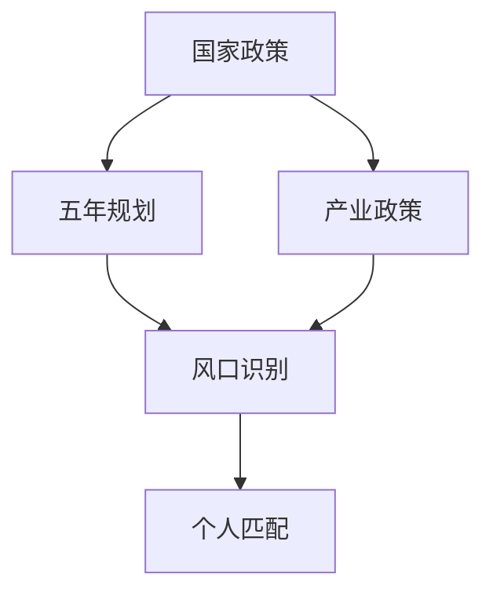

# State Trend Advisor — 顺势而为战略分析

## 核心理念

> "风来了，猪都能飞。" 本 skill 的核心是：**识别国家战略趋势，将个人禀赋映射到政策风口，帮助询问者在势头最强的方向上发力。**

---

## 执行流程总览

```
1. 解析询问者背景
2. 抓取国家政策与趋势数据（五年规划 + 近期重大政策）
3. 识别核心趋势与风口
4. 映射个人禀赋 → 趋势机会
5. 生成六维分析报告（投资/创业/商业/产品/就业/学习）
6. 输出 Markdown 报告到 markdown/ 目录
```

---

## Step 1：解析询问者背景

从用户输入中提取以下信息：

| 维度 | 内容 | 若未提供 |
|------|------|----------|
| 擅长领域 | 专业、工作经验、技术栈等 | 视为"普通人，无特定专长" |
| 特长 | 软技能、硬技能、资源等 | 视为"通用技能" |
| 爱好 | 兴趣爱好、关注领域 | 视为"广泛兴趣" |
| 目标导向 | 六维中用户最关心的方向 | 全维度输出 |
| 地域 | 用户所在地区 | 默认全国视角 |

**若用户未提供背景信息，以"普通中国公民，无特定专业背景"作为基准画像，给出通用建议。**

---

## Step 2：抓取政策与趋势数据

使用 web_search 工具并行搜索以下数据源，**每类至少搜索 2 次以交叉验证**：

### 2.1 核心政策文件
```
搜索词（依次执行）：
- "十四五规划 全文 重点方向 site:gov.cn"
- "十五五规划 2026 国家重点方向"
- "2025年 国务院 重大政策 发布"
- "2025年 中央经济工作会议 部署"
- "国家战略性新兴产业 最新政策 2025"
```

### 2.2 产业政策与补贴
```
- "新质生产力 重点方向 2025"
- "国家扶持产业 补贴政策 2025"
- "战略性新兴产业 七大方向 最新"
- "未来产业 政策支持 2025 2026"
```

### 2.3 投资与就业信号
```
- "国家重点投资领域 2025 基建"
- "紧缺人才 国家需求 2025"
- "高薪就业 政策支持行业 2025"
```

### 2.4 验证与补充
对搜索结果中出现的重要政策文件，使用 `web_fetch` 获取原文关键章节，确保数据准确。

**数据校验原则：**
- 优先使用 gov.cn、新华社、人民日报等权威来源
- 标注数据来源和发布时间
- 对相互矛盾的信息，优先采信最新、最权威来源

---

## Step 3：识别核心趋势与风口

基于抓取数据，提炼**3-5 个最强政策风口**，按照以下框架分析每个风口：

```
风口名称：[名称]
政策支撑强度：★★★★★（1-5星）
市场规模预测：[数字 + 来源]
政策进入阶段：[萌芽期/成长期/爆发期/成熟期]
典型历史参照：[类比案例，如"类似2012年移动互联网"]
主要受益群体：[技术人员/普通创业者/资本/就业者]
```

---

## Step 4：映射个人禀赋 → 趋势机会

构建**禀赋-趋势匹配矩阵**：

- 纵轴：询问者的核心禀赋（3-5项）
- 横轴：识别出的政策风口（3-5个）
- 评分：1-5分，综合考虑"切入难度"、"竞争烈度"、"个人匹配度"

优先推荐**匹配分 ≥ 3 且风口强度 ≥ 3星**的组合。

---

## Step 5：生成六维分析报告

### 报告结构（ALWAYS 使用此结构）

```
# 《顺势而为：[询问者画像] 的战略方向报告》
生成时间：[日期]

## 一、国家战略趋势总览
## 二、核心风口识别（Top 3-5）
## 三、六维行动建议
   ### 3.1 投资方向
   ### 3.2 创业方向
   ### 3.3 商业思路
   ### 3.4 产品思路
   ### 3.5 就业择业
   ### 3.6 学习规划
## 四、禀赋-趋势匹配矩阵
## 五、风险与注意事项
## 六、行动优先级清单
## 七、数据来源
```

---

## Step 6：图表要求与规范

### SVG 图表（外挂式，必须保存为独立 .svg 文件）

每份报告**至少包含以下 3 类图表**，全部以外挂方式引用：

**图表 1：政策风口热力图**（SVG）
- 文件名：`trend_heatmap.svg`
- 内容：各风口的"政策强度 × 市场空间 × 时间窗口"气泡图
- 在 Markdown 中引用：``

**图表 2：禀赋-趋势匹配矩阵**（SVG 或 Mermaid）
- 文件名：`match_matrix.svg`（若用 Mermaid 则内嵌）
- 内容：个人禀赋与政策趋势的交叉评分热力表

**图表 3：行动路径时间轴**（SVG 或 ASCII）
- 文件名：`action_timeline.svg`（若用 ASCII 则内嵌）
- 内容：从"现在"到"3年后"的关键行动节点

### SVG 设计规范
```
- 画布：viewBox="0 0 800 500"
- 背景：#0f172a（深色） 或 #f8fafc（浅色）
- 主色系：蓝色 #3b82f6、金色 #f59e0b、红色 #ef4444、绿色 #22c55e
- 字体：font-family="Arial, 'PingFang SC', sans-serif"
- 标题字号：18px，正文：13px，注释：11px
- 所有 SVG 文件保存在 markdown/ 目录下，与 .md 文件同级
```

### Mermaid 图（内嵌于 Markdown）
用于流程图、关系图、时间轴（当 SVG 过于复杂时使用）：



---

## Step 7：报告写作规范

### 语言风格
- **面向决策者**：每个建议都要有"做什么"+ "为什么"+ "怎么开始"
- **通俗易懂**：避免官方文件体，用商业语言转化政策语言
- **有温度**：理解询问者的处境，给出有人情味的建议
- **不模糊**：避免"可以考虑"等废话，给出明确方向

### 数据引用格式
```
> 据[来源]，[时间]，[具体数据/政策内容]。
> 来源：[URL 或文件名]
```

### 历史案例引用（增加说服力）
每个风口建议需配 1 个历史参照案例：
- **格式**：`📌 历史参照：[时间] [事件] → [结果]，说明[类比逻辑]`
- **示例**：`📌 历史参照：2012年 4G牌照发放 → 催生移动互联网十年红利，说明基础设施政策往往提前3-5年布局`

---

## Step 8：文件输出

```bash
# 确保输出目录存在
mkdir -p markdown/

# 输出文件列表
markdown/
├── state_trend_report_[日期].md      # 主报告
├── trend_heatmap.svg                  # 政策风口热力图
├── match_matrix.svg                   # 禀赋匹配矩阵（可选，也可内嵌）
└── action_timeline.svg                # 行动时间轴（可选，也可内嵌）
```

**命名规范：**
- 日期格式：`YYYYMMDD`，如 `state_trend_report_20250611.md`
- 若询问者有明确身份，可加后缀：`state_trend_report_20250611_developer.md`

---

## 常见禀赋-趋势映射速查

> 参见 `references/persona_mapping.md` 获取常见职业/背景到趋势的快速映射参考。

---

## 质量自检清单

完成报告后，逐一确认：

- [ ] 政策数据来自权威来源（gov.cn / 新华社等），且有明确时间标注
- [ ] 每个风口都有至少一个历史案例支撑
- [ ] 六维建议（投资/创业/商业/产品/就业/学习）全部覆盖
- [ ] 至少 3 张图表（热力图 + 矩阵 + 时间轴）
- [ ] SVG 文件为外挂式，在 Markdown 中正确引用
- [ ] 报告有明确的"行动优先级清单"（可执行，非口号）
- [ ] 风险章节提醒了政策执行落差、时间窗口等注意事项
- [ ] 文件已保存到 `markdown/` 目录
