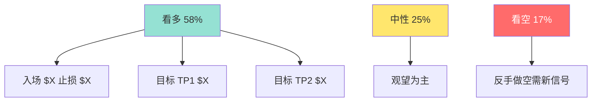

# 输出模板完整版

> 这是 SKILL.md 步骤 6 的展开。直接复制下面的 markdown 骨架,逐节填充。
> 注意:每个 {} 都需要实际填入内容,不能留空。

---

```markdown
# {TICKER} {公司名}({板块})次日走势预测

> **预测日期**:{YYYY-MM-DD} | **目标交易日**:{YYYY-MM-DD}({星期X})
> **预测生成时间**:{YYYY-MM-DD HH:MM} ET
>
> ⚠️ **免责声明**
> 本预测基于公开信息与概率推断,非投资建议。次日方向本身是低信噪比问题,任何 ≥70% 的方向概率都应视为过度自信。本报告所有"专业术语"在文末"六、术语通俗解释"中均有小白友好的解释。

## 一、核心结论(速读)

| 维度 | 结论 |
|---|---|
| **方向** | {看多 / 看空 / 中性震荡} |
| **置信度** | {高 / 中 / 中低 / 低} |
| **次日方向概率** | **{XX}%**(区间 {XX%} - {XX%}) |
| **预期价格区间** | **${X} - ${X}**(次日内最可能运行区间) |
| **预期波动幅度** | **±{X}%**(基于近 5 日 ATR) |
| **关键支撑位** | ${X}(跌破放弃看多) |
| **关键压力位** | ${X}(突破确认看多延续) |
| **建议操作** | {入场触发 / 观望 / 减仓} |

### 速读判断链(3 行版本)

> 1. {五维中哪几维支持这个方向}
> 2. {最关键的一条证据(数据 + 来源)}
> 3. {最大反方风险是什么}

---

## 二、五维分析(详细推导)

### 2.1 基本面催化(权重 30%,打分 {−2 ~ +2})

**关键证据:**
- 证据 1:{具体数据 + 时间 + 来源}[1]
- 证据 2:{____}
- 证据 3:{____}(可选)

**分析逻辑:**
{用 2-3 句话说明,为什么这些证据支持这个打分。注意避免"看到利多就给 +2",要说清楚"这个利多是否已被 price-in,以及是否会影响未来 12 个月 EPS"}

**打分理由汇总:**{强利多 / 弱利多 / 中性 / 弱利空 / 强利空}→ 打分 {X}

---

### 2.2 技术面结构(权重 25%,打分 {−2 ~ +2})

**关键证据:**
- 大周期(月/周):{200 日均线方向 + 趋势}
- 中周期(日线):{近 20 日形态 + 关键位}
- 小周期(60min):{盘前交易区间}
- 量能:{5 日均量 vs 60 日均量}

**分析逻辑:**
{说明当前价格在关键位的相对位置,以及"突破/跌破"是否带量、是否回踩}

**打分理由汇总:**{____}→ 打分 {X}

---

### 2.3 资金面(权重 20%,打分 {−2 ~ +2})

**关键证据:**
- 内部人交易(Form 4):{增 / 减持,金额}
- 期权异动:{大单方向、OI 变化、Put/Call 比率、IV Rank}
- 13F 持仓变化:{____}
- 暗池与大宗:{____}

**分析逻辑:**
{说明"大钱在流入还是流出",以及信号强度}

**打分理由汇总:**{____}→ 打分 {X}

---

### 2.4 情绪面(权重 15%,打分 {−2 ~ +2})

**关键证据:**
- 卖方分析师态度:{Up/Down 评级数 + 目标价调整}
- 散户情绪:{Reddit/WSB/Stocktwits 关注度 + AAII + CNN 指数}
- 一致预期:{____}

**分析逻辑:**
{区分"一致预期利好"和"反向风险",散户情绪常作反向}

**打分理由汇总:**{____}→ 打分 {X}

---

### 2.5 宏观面(权重 10%,打分 {−2 ~ +2})

**关键证据:**
- 隔夜期货:{ES 涨/跌 X%,NQ 涨/跌 X%}
- VIX:{当前值 + 涨跌幅}
- 10Y 美债收益率:{当前值 + 涨跌幅}
- 美元指数 DXY:{当前值 + 涨跌幅}
- 次日宏观日历:{CPI/FOMC/非农/无大事件}

**分析逻辑:**
{说明大盘环境是否配合个股方向,以及系统性风险大小}

**打分理由汇总:**{____}→ 打分 {X}

---

## 三、五维加权得分

| 维度 | 打分 | 权重 | 加权得分 |
|---|:-:|:-:|:-:|
| 基本面 | {X} | 30% | {X×0.30} |
| 技术面 | {X} | 25% | {X×0.25} |
| 资金面 | {X} | 20% | {X×0.20} |
| 情绪面 | {X} | 15% | {X×0.15} |
| 宏观面 | {X} | 10% | {X×0.10} |
| **合计** | | | **{总分}** |

**总分解读:**{> +1.0 强看多 / +0.3 ~ +1.0 弱看多 / …}

### 概率计算

```
基础概率:  55%(中性起点)
调整项:   {+X% ~ −X%}(五维总分 + 一致性 + 是否有大事件)
最终概率:  {XX}%(区间 {XX%} - {XX%})
```

**置信度** = {高 / 中 / 中低 / 低},基于 {五维一致性 + 信息完整度 + 是否有大事件}

---

## 四、价格区间与可视化

### 4.1 价格刻度尺(ascii 必选)

```
${止损}   ${入场}    ${TP1}    ${TP2}    ${压力}
   |         |         |         |         |
   ●─────────●─────────●─────────●─────────●
   |         |         |         |         |
  风险 6%   起步位    平 50%   再平 30%   跟踪止盈
                          ↑ 赔率 1:1
                              ↑ 赔率 2:1
```

### 4.2 五维雷达图(mermaid 必选)


### 4.3 概率分布示意(mermaid 可选)



### 4.4 关键位分析

| 价位类型 | 价格 | 含义 | 操作 |
|---|:-:|---|---|
| 强支撑 | ${X} | {前低 / 200 日均线 / 盘整下沿} | 跌破放弃做多 |
| 弱支撑 | ${X} | {VWAP / 5 日均线} | 跌破减仓 |
| 当前价 | ${X} | 收盘参考价 | — |
| 弱压力 | ${X} | {前高 / 整数关口} | 突破加仓 |
| 强压力 | ${X} | {盘整上沿 / 年内高点} | 突破看新一轮 |

---

## 五、交易计划

> **仅在置信度 ≥ "中" 时给出完整计划,否则给"观望/小注"建议。**

### 5.1 入场策略

**首选方案(主入场):**
- 触发价: ${X}
- 触发条件: {回踩不破 / 突破回踩 / 缺口回补 / VWAP 站稳}
- 入场后立即设: {止损单 + 目标 TP1 单}

**备选方案:**
- 触发价: ${X}(更激进 / 更保守)
- 适用情形: {____}

### 5.2 止损策略

- **止损价**: ${X}
- **止损理由**: {跌破 ____ 支撑 / 形态破坏 / 关键事件反向}
- **最大可承受亏损**: 账户净值的 {X}%(确保此笔交易最大亏 = 账户 1%)

**仓位计算:**
```
单笔仓位(股数) = (账户净值 × 风险预算%) ÷ (入场价 − 止损价)
             = ($100,000 × 1%) ÷ (${入场} − ${止损})
             = {X} 股
             = 总仓位 ${X}(账户净值的 {X}%)
```

### 5.3 止盈策略(分批)

| 阶段 | 触发价 | 平仓比例 | 累计盈利 | 备注 |
|---|:-:|:-:|:-:|---|
| **TP1** | ${X} | 50% | 锁定本金风险 | 赔率 ≥ 1:1 |
| **TP2** | ${X} | 30% | 累计 {X}% 盈利 | 赔率 ≥ 2:1 |
| **跟踪** | — | 20% | 用 1×ATR 跟踪 | 让利润奔跑 |

### 5.4 时间止损

- **最大持仓时间**: {X} 个交易日
- **到期处理**: 未达目标则强制评估,选择(继续持有 / 减仓 / 清仓)

### 5.5 不做条件(强制约束)

- [ ] 开盘 30 分钟内股价在 VWAP 之下,放弃
- [ ] 次日有大事件(CPI/FOMC/非农)时,仓位减半
- [ ] 跳空高开 > 3% 时,不追入
- [ ] 信息严重缺失时,放弃

### 5.6 监控清单

盘中每 30 分钟确认:
- [ ] 股价是否在 VWAP 之上
- [ ] 是否触及止损/目标位
- [ ] 期权 OI 是否有突变
- [ ] 是否有新公告(8-K)

---

## 六、风险与陷阱

列出本次预测的 3-5 个最大风险点,用通俗语言 + 术语解释。

1. **{风险点 1}**:{描述}。{如果发生,会怎样影响预测}
2. **{风险点 2}**:{____}
3. **{风险点 3}**:{____}

**最坏情形推演:**
{如果所有利多全部失效,股价最差可能跌到哪里;如果所有利空兑现,股价最好能涨到哪里}

---

## 七、术语通俗解释

> 默认读者是投资小白,以下术语按本文出现顺序列出。

1. **{术语 1}**:{通俗解释,1-2 句话}
2. **{术语 2}**:{____}
3. **{术语 3}**:{____}
4. **{术语 4}**:{____}
5. **{术语 5}**:{____}
6. **{术语 6}**:{____}
7. **{术语 7}**:{____}
8. **{术语 8}**:{____}

(从 `references/terminology.md` 按出现顺序选 5-10 个最关键的术语,文末术语表未覆盖的术语按"自定义解释"风格补充)

---

## 八、数据来源

1. {数据来源 1}:{链接或机构名 + 抓取时间}
2. {数据来源 2}:{____}
3. {数据来源 3}:{____}
4. {数据来源 4}:{____}
5. {数据来源 5}:{____}
6. {数据来源 6}:{____}

---

## 九、自检与免责声明

- [x] 五维打分有具体证据 + 来源
- [x] 概率 ≤ 65%
- [x] 交易计划完整(入场/止损/目标/仓位/时间止损)
- [x] 至少 1 个 mermaid 或 ascii 图
- [x] 至少 5 个专业术语有通俗解释
- [x] 数据来源编号列出

**本报告仅为研究演示,非投资建议。任何交易决策的责任由投资者本人承担。**
```

---

## 使用说明

1. **先复制整个 markdown 骨架**
2. **逐节填充**:每节都引用 SKILL.md 步骤 2-5 的产物
3. **每节用 2-3 句话或表格回答** — 避免长篇大论没重点
4. **每个图都要服务于"判断"**:不只是装饰,要承载信息
5. **数字必须带单位/时点/来源**
6. **写完后过一遍"自检清单"**(第九节)
