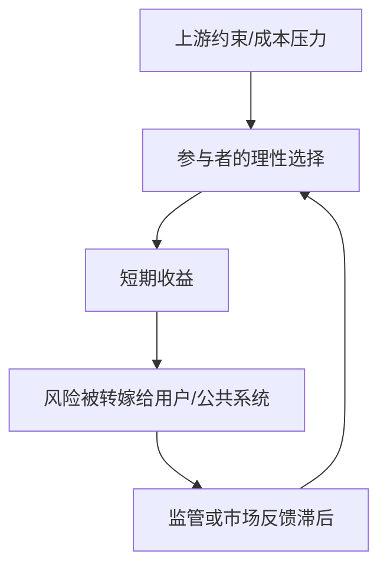

# World Bug Opportunity Finder

## Overview

Use this skill to turn current hot news into a rigorous "找世界 bug" report. The goal is not to moralize after the fact, but to identify why an obviously unreasonable phenomenon can keep happening, who is constrained by which incentives, what can stop it earlier, and whether there is a legitimate business opportunity in solving it.

Default to Chinese output unless the user explicitly asks for another language.

## Inputs And Defaults

- If the user provides an industry, sector, product category, or scenario, search hot news for that scope.
- If the user provides no scope, default to recent hot social news, especially民生消费、食品安全、教育医疗、住房养老、交通出行、平台治理、公共服务、就业劳动、未成年人保护、环境安全.
- Use the most recent 7 days for broad social hotspots and the most recent 30 days for industry hotspots unless the user gives another window.
- If the user gives a specific event, use it as the anchor event and still search adjacent evidence to understand whether it is isolated or structural.

## Workflow

1. Define the search scope.
   - State the scope and date window in working notes or the final response.
   - If the user's industry name is broad, keep it broad unless a narrower sub-sector is necessary to find concrete news; state any narrowing as an assumption.
   - Do not ask for clarification unless the missing detail would materially change the search.

2. Search current evidence.
   - Browse current web/news sources. Current news is required; if browsing or network access is unavailable, say the report cannot be responsibly produced from current hotspots.
   - For industry scope, search the industry name plus terms such as 热点, 投诉, 监管, 处罚, 曝光, 事故, 乱象, 价格, 质量, 安全, 召回, 供应链, 平台, 维权, policy, regulation, recall, fraud, safety, complaint, enforcement.
   - For social scope, search terms such as 社会热点, 民生热点, 消费曝光, 食品安全, 监管通报, 315, 舆情, 执法, 处罚, 维权.
   - Prefer primary and high-signal sources: regulator notices, official investigations, court/police announcements, government data, company announcements, exchange filings, industry associations, reputable mainstream media, credible consumer-protection platforms, and first-party product/service documents.
   - Avoid basing accusations on short videos, anonymous screenshots, reposts, or single-source rumors. Use them only as leads unless corroborated.

3. Select the strongest "bug".
   - Treat a bug as a structural unreasonable mechanism, not merely a bad person or one bad company.
   - Look for one or more of these patterns: incentive misalignment, information asymmetry, externalized cost, regulation lag, enforcement blind spot, measurement gaming, supply-chain opacity, captive users, high switching cost, weak accountability, false safety signal, trusted intermediary failure, or market design failure.
   - Rank candidates by evidence strength, public relevance, timeliness, root-cause clarity, preventability, solution feasibility, and whether a normal participant has a rational reason to keep the bad behavior going.
   - If no candidate has enough evidence, report that the evidence is too weak instead of forcing a sensational conclusion.

4. Analyze the mechanism.
   - Separate facts, inferences, assumptions, and unknowns.
   - Use a five-whys style chain, but stop when the cause is actionable rather than philosophical.
   - Map stakeholders: consumers/users, suppliers, merchants, platforms, regulators, inspectors, local governments, media, insurers, certification bodies, and potential solution providers.
   - Explain why each actor's current incentive can produce the unreasonable outcome.
   - Identify the earliest practical intervention point before public exposure or harm occurs.

5. Design solutions.
   - Give layered fixes:
     - 0-7 days: immediate containment, disclosure, sampling, consumer guidance, reporting channels, platform takedowns, refunds/recalls, or targeted enforcement.
     - 30-90 days: process changes, third-party testing, traceability, deposits, insurance, procurement rules, rating systems, auditing, data sharing, whistleblower protection, or platform governance.
     - 6-24 months: legal standards, licensing, certification, infrastructure, market mechanism redesign, industry self-discipline, or technology adoption.
   - For business opportunities, include the buyer, payment reason, MVP, first validation metric, distribution channel, regulatory dependency, and risks.
   - Prioritize public-good and legality. Do not propose doxxing, harassment, vigilante enforcement, fake reviews, illegal surveillance, evading regulation, or exploiting victims.

6. Write and save the Markdown report.
   - Create or reuse `markdown/` under the current project.
   - Save as `markdown/<YYYYMMDD>-<scope-slug>-world-bug-opportunity.md`.
   - Include text plus functional visuals: at least one Mermaid diagram, one inline SVG diagram, and one compact ASCII text map or table when useful.
   - Keep visuals explanatory, mobile-readable, and text-light; do not add decorative graphics.
   - Include a `参考来源` section with source names, publication dates, and links.
   - In the final response, provide the saved absolute path, selected bug, and brief evidence summary.

## Report Structure

Use this structure unless the user requests another shape:

````markdown
# <行业/社会热点>: 我看到的一个世界 bug

> 一句话判断: <不合理现象不是偶然，而是某个机制让坏结果变得划算或更容易发生。>

## 这几天发生了什么

<用事实交代热点，不写长篇新闻复述。>

## 打眼一看哪里不合理

<定义 bug: 谁受损，谁获益，为什么正常机制没有及时阻止。>

```text
消费者/用户 -> 看到的表象 -> 真实风险
商家/平台   -> 当前收益   -> 转嫁成本
监管/市场   -> 应该阻止   -> 实际漏点
```

## 这个 bug 为什么会存在



<解释利益链、信息链、监管链、证据链。>

## 根因拆解

<区分事实、推断、假设、未知。>

<svg role="img" aria-label="bug root cause map" viewBox="0 0 800 360" xmlns="http://www.w3.org/2000/svg">
  <!-- Use simple labeled boxes/arrows relevant to the actual case. -->
</svg>

## 怎么更快解决

| 层级 | 动作 | 责任方 | 验证指标 |
| --- | --- | --- | --- |
| 0-7天 | <应急措施> | <谁做> | <怎么知道有效> |
| 30-90天 | <机制修复> | <谁做> | <怎么知道有效> |
| 6-24个月 | <制度/基础设施> | <谁做> | <怎么知道有效> |

## 这里有没有商机

<提出1-3个合法、可验证、能从源头降低问题发生率的机会。每个机会写清买单方、MVP、渠道、风险。>

## 还要盯什么

<列出后续验证信号和反证信号。>

## 参考来源

- [来源标题](https://...), 发布日期/访问日期
````

## Quality Bar

- Use current sources for all news and changeable facts.
- Cite every specific event, number, accusation, official action, or company-specific claim.
- Do not fabricate quotes, data, company names, regulatory actions, or consumer cases.
- Avoid turning the report into outrage content. The value is the mechanism and intervention design.
- Avoid naming private individuals unless they are public officials, executives, or named in authoritative public sources and the name is necessary.
- When a claim is not fully verified, label it as "待验证" or "基于现有报道的推断".
- Do not present investment advice. Business opportunities are product/service hypotheses, not buy/sell recommendations.
