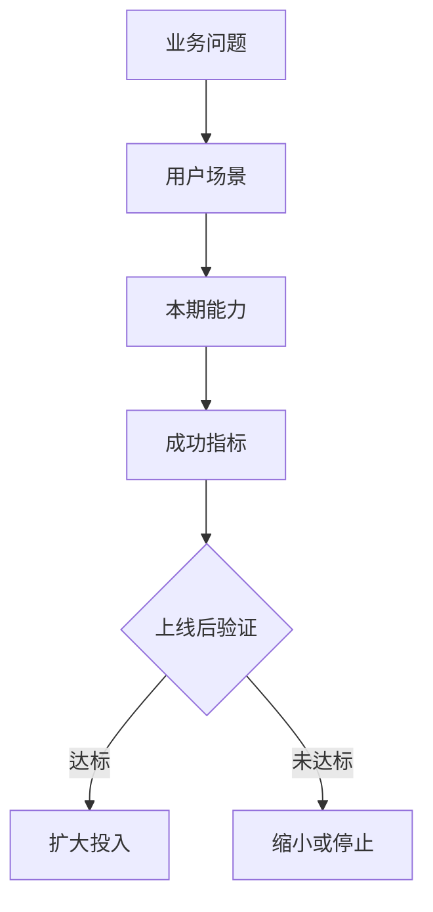

# <产品/项目名称> BRD

> 文件目的: 帮助团队判断这件事是否值得投入、怎样投入、做到什么程度算成功、什么时候应该缩小或停止。

## 1. 一句话决策

建议投入/暂缓/先验证 `<项目名称>`，因为 `<业务问题>` 正在造成 `<损失或机会>`；本期目标是在 `<时间窗口>` 内通过 `<核心能力>` 把 `<核心指标>` 从 `<当前值>` 改善到 `<目标值>`。

## 2. 执行摘要

- **业务问题**:
- **目标用户/客户**:
- **建议方案**:
- **本期范围**:
- **核心成功指标**:
- **主要风险**:
- **决策请求**:

## 3. 背景与业务问题

### 3.1 当前现状

写清楚现在发生了什么。区分事实、观察、假设。

### 3.2 不做的代价

说明如果不做，会继续损失什么: 收入、成本、效率、风险、客户体验、战略窗口。

### 3.3 为什么现在做

说明时机: 客户压力、业务节点、竞争窗口、成本变化、合规要求、技术成熟度。

## 4. 目标用户与需求证据

| 用户/角色 | 场景 | 当前做法 | 痛点成本 | 证据等级 |
|---|---|---|---|---|
|  |  |  |  | 访谈/数据/工单/销售反馈/假设 |

### 4.1 用户任务

用一句话描述用户真正要完成的任务，而不是用户口头要求的功能。

### 4.2 当前替代方案

用户今天如何解决？替代方案为什么不够好？替代成本是什么？

## 5. 目标与成功指标

| 指标 | 当前值 | 目标值 | 时间窗口 | 数据源 | 负责人 |
|---|---:|---:|---|---|---|
| 主指标 |  |  |  |  |  |
| 护栏指标 1 |  |  |  |  |  |
| 护栏指标 2 |  |  |  |  |  |

## 6. 方案与备选项

| 方案 | 描述 | 优点 | 缺点 | 建议 |
|---|---|---|---|---|
| 不做 |  |  |  |  |
| 人工/流程优化 |  |  |  |  |
| 最小版本 |  |  |  |  |
| 完整版本 |  |  |  |  |

## 7. 图示

用 Mermaid、ASCII 或引用独立 SVG 表达关键逻辑。例如:

## 8. 范围边界

### 8.1 本期做

| 能力 | 业务目的 | 验收方式 |
|---|---|---|
|  |  |  |

### 8.2 本期不做

| 不做项 | 原因 | 后续条件 |
|---|---|---|
|  |  |  |

### 8.3 后续可能做

| 后续项 | 触发条件 |
|---|---|
|  |  |

## 9. BRD 级需求

| 编号 | 需求描述 | 业务理由 | 验收口径 | 优先级 |
|---|---|---|---|---|
| BRD-001 | 当 `<用户>` 在 `<场景>` 中需要 `<任务>` 时，系统应支持 `<能力>`，以便 `<业务结果>`。 |  |  | Must |

写法要求: 尽量使用 "场景 + 主体 + 动作 + 结果 + 验收方式"。避免只写 "支持灵活配置"、"提升体验"。

## 10. 依赖与约束

| 类型 | 依赖/约束 | 影响 | 负责人 | 截止时间 |
|---|---|---|---|---|
| 系统 |  |  |  |  |
| 数据 |  |  |  |  |
| 法务/合规 |  |  |  |  |
| 运营/销售 |  |  |  |  |

## 11. 风险与缓解

| 风险 | 触发信号 | 影响 | 缓解动作 |
|---|---|---|---|
| 需求不真实 |  |  |  |
| 指标不可测 |  |  |  |
| 范围膨胀 |  |  |  |
| 依赖延期 |  |  |  |

## 12. 里程碑与责任人

| 里程碑 | 目标 | 时间 | 负责人 | 产物 |
|---|---|---|---|---|
| BRD 评审 |  |  |  |  |
| PRD/方案评审 |  |  |  |  |
| MVP 上线 |  |  |  |  |
| 30 天复盘 |  |  |  |  |
| 90 天复盘 |  |  |  |  |

## 13. 上线后验证

- **30 天看行为**:
- **90 天看业务结果**:
- **达标后动作**:
- **未达标后动作**:
- **停止/缩小条件**:

## 14. 开放问题

| 问题 | 为什么重要 | 解决人 | 截止时间 |
|---|---|---|---|
|  |  |  |  |

## 15. 附录

- 数据来源:
- 用户访谈:
- 竞品/市场资料:
- 术语说明:

