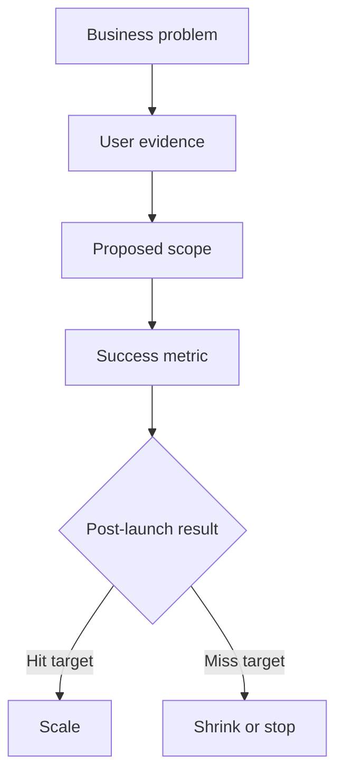
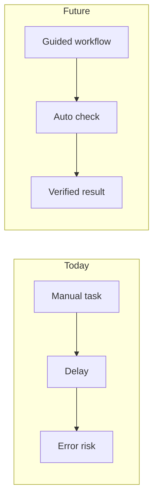
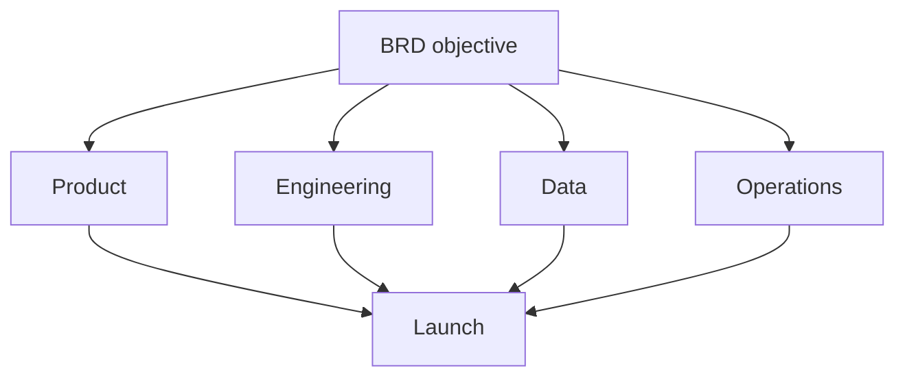

# BRD Writing Guide

## Core Framing

A BRD is a business decision document before it is a requirements document. Its job is to answer:

- Why should the organization invest?
- Whose problem is real?
- What should be done now, not later?
- What is explicitly out of scope?
- How will success or failure be verified?

Use this chain:

```text
business problem -> user scenario -> current workaround -> proposed capability -> metric -> scope -> validation loop
```

## Section Guidance

### Executive summary

Keep it decision-oriented. Include the recommendation, business reason, target user, expected result, and requested decision.

Bad:

```text
This project improves user experience and strengthens competitiveness.
```

Better:

```text
Recommend building a minimum reconciliation workflow for finance admins because monthly manual reconciliation now takes 2-4 hours per account and blocks renewal proof. The MVP should reduce reconciliation time to under 45 minutes for pilot customers within 90 days.
```

### Business problem

Describe the cost of inaction:

- Revenue loss
- Cost leakage
- Manual workload
- Customer churn risk
- Compliance/security risk
- Strategic option loss

If no data exists, write "baseline unknown; measure before build" instead of inventing a number.

### User evidence

Do not treat user requests as requirements. Translate:

```text
user says X -> user is trying to do Y -> current workaround is Z -> pain cost is C -> product behavior should change to B
```

Evidence levels from strongest to weakest:

1. Production behavior data
2. Paid pilot / signed customer commitment
3. Repeated support tickets or work orders
4. Structured interviews with target users
5. Sales or stakeholder anecdotes
6. Internal hypothesis

Label weak evidence openly.

### Metrics

Use one primary metric and two to three guardrail metrics.

Good metrics include:

- Adoption: activation rate, repeat usage, task completion
- Business: conversion, retention, renewal, ARPU, cost reduction
- Efficiency: time saved, error rate, manual touches reduced
- Risk: incident count, audit exceptions, SLA breach rate

Each metric needs current value, target value, time window, data source, and owner. If the current value is unknown, make baseline measurement a pre-build milestone.

### Scope

Always write three lists:

- In scope
- Out of scope
- Later / phase 2

Out-of-scope items protect the project. Include them even when politically uncomfortable.

### Requirements wording

Use this pattern:

```text
When <user/role> is in <scenario>, the system/process should support <capability>, so that <business or user result>. It is accepted when <observable standard>.
```

Avoid untestable words unless paired with a threshold:

- flexible
- intelligent
- seamless
- fast
- friendly
- robust
- optimized

### Alternatives

Always include alternatives, even briefly:

- Do nothing
- Process/manual workaround
- Smaller MVP
- Full build

This shows the recommendation was chosen against cheaper paths.

## Diagram Patterns

Prefer Mermaid for most BRDs.

### Business decision loop



### Current vs future workflow



### Dependency map



### ASCII scope boundary

```text
This phase
  |-- must: core workflow, baseline metrics, pilot users
  |-- not: advanced admin, multi-language, external marketplace
  `-- later: automation, integrations, pricing packaging
```

## When to Use SVG

Use SVG when the BRD needs a polished concept map, lifecycle diagram, or two-lane comparison that Mermaid cannot lay out clearly.

Rules:

- Save SVG as a separate file in `markdown/`.
- Use `viewBox`, not fixed pixel-only sizing.
- Keep text readable and avoid dense diagrams.
- Reference from Markdown with a relative filename.
- Do not embed large inline SVG inside the Markdown.

Minimal SVG skeleton:

```xml
<?xml version="1.0" encoding="UTF-8"?>
<svg xmlns="http://www.w3.org/2000/svg" viewBox="0 0 960 540" font-family="PingFang SC, Microsoft YaHei, Arial, sans-serif">
  <rect width="960" height="540" fill="#ffffff"/>
  <text x="480" y="48" text-anchor="middle" font-size="24" fill="#111827">BRD Decision Map</text>
</svg>
```

## Quality Checklist

Before finalizing, verify:

- The Markdown file is saved under the current project's `markdown/` directory.
- The BRD states a decision request, not just a product idea.
- Business problem, target user, current workaround, and proposed capability are connected.
- At least one diagram exists and explains a decision, flow, or boundary.
- Scope includes in-scope, out-of-scope, and later items.
- Each core requirement has a business reason and acceptance signal.
- Success metrics include current value or baseline plan, target value, time window, data source, and owner.
- Risks include trigger signals and mitigation actions.
- Post-launch validation includes 30-day behavior and 90-day business result checks.
- Unknowns are marked as assumptions or open questions.

