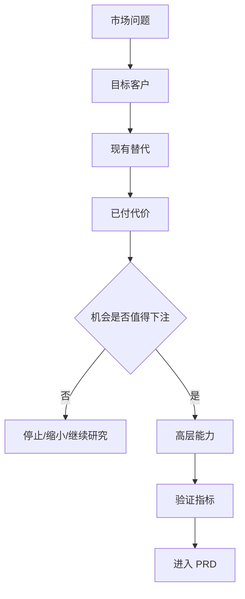

# <产品/机会名称> MRD

> 日期: <YYYY-MM-DD>  
> 作者: <可选>  
> 状态: Draft / Review / Approved  
> 范围: <新产品 / 重大功能 / 新市场 / 商业化 / 探索>

## 一句话建议

<建议是否推进。为哪类客户, 在什么场景, 解决什么问题, 凭什么赢, 下一步验证什么。>

## 1. Idea 与当前判断

- **产品想法**: <plain-language idea>
- **目标客户**: <first beachhead>
- **核心场景**: <who does what, when blocked>
- **当前判断**: <pursue / research more / narrow scope / pause>
- **关键假设**:
  - <assumption 1>
  - <assumption 2>

## 2. 市场问题

<写清用户在具体场景中的阻力。避免泛泛说提升效率、优化体验。>

## 3. 目标客户与细分市场

### 先服务谁

<narrow customer segment>

### 暂不服务谁

<excluded segments>

### 购买者、使用者、影响者

| 角色 | 谁 | 关心什么 | 决策影响 |
|---|---|---|---|
| 购买者 | <role> | <concern> | <high/medium/low> |
| 使用者 | <role> | <concern> | <high/medium/low> |
| 影响者 | <role> | <concern> | <high/medium/low> |

## 4. 现有替代方案与已付代价

| 替代方案 | 用户为什么用它 | 已付代价 | 我们的机会 |
|---|---|---|---|
| <alternative> | <reason> | <time/money/risk/etc.> | <wedge> |

## 5. 市场机会

- **紧迫性**: <why now>
- **频率**: <how often problem occurs>
- **价值密度**: <budget/cost/risk>
- **市场规模**: <validated data or "pending verification">
- **进入时机**: <why current timing matters>

## 6. 竞争格局与差异化

<比较真实替代方案, 说明为什么现有方案不够好, 以及我们先赢哪个切口。>

## 7. 高层能力

| 能力 | 对应场景/问题 | MVP 必须 | 后续增强 |
|---|---|---:|---:|
| <capability> | <scenario> | Yes/No | Yes/No |

## 8. 指标策略

| 目标 | 信号 | 指标 | 观察窗口 |
|---|---|---|---|
| <goal> | <observable signal> | <metric> | <30/60/90 days> |

## 9. 不做什么

- <excluded feature/use case/customer/channel>

## 10. 风险、证伪条件与验证计划

### 关键风险

- <risk>

### 证伪条件

- 如果 <time window> 内 <observable event/threshold> 没发生, 就 <stop/narrow/rethink>。

### 30/60/90 天验证

| 时间 | 要验证什么 | 方法 | 通过标准 |
|---|---|---|---|
| 30 天 | <assumption> | <interviews/prototype/data/sales test> | <threshold> |
| 60 天 | <assumption> | <method> | <threshold> |
| 90 天 | <assumption> | <method> | <threshold> |

## 参考来源

- <source if used>
