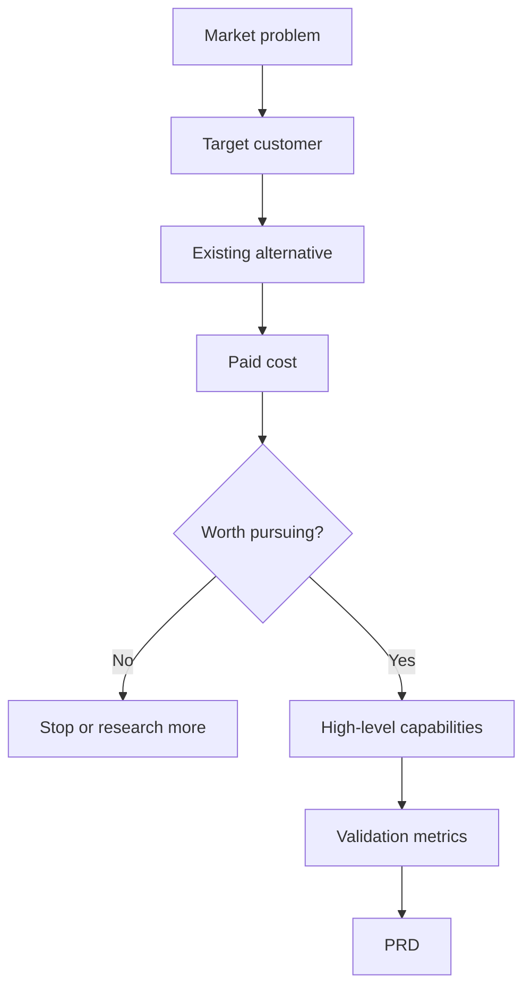
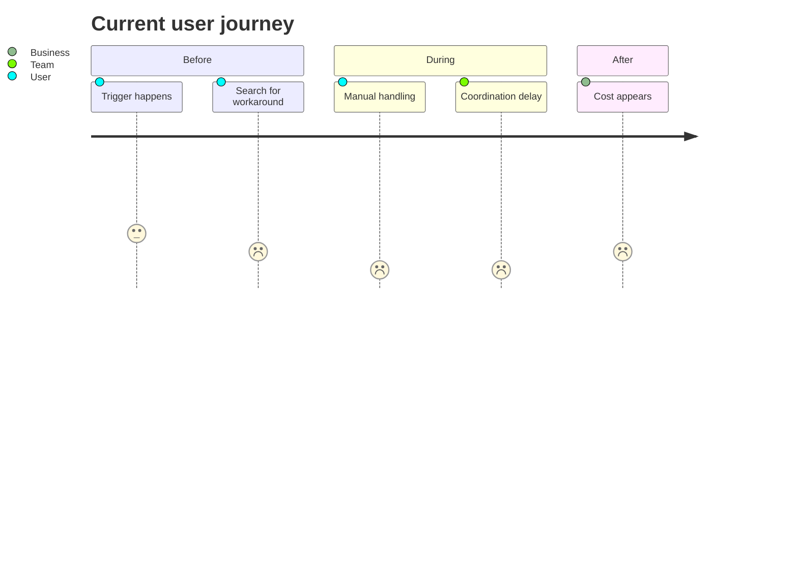
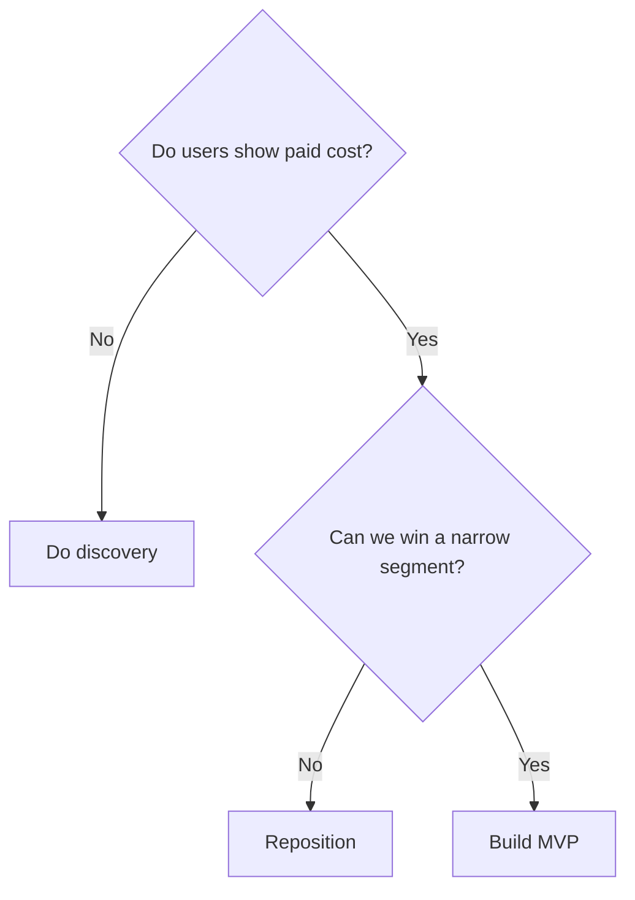

# MRD Playbook

## Core Thesis

MRD answers "why this market opportunity is worth doing now." PRD answers "how the product will be built." Do not let MRD become a feature checklist.

## Minimum MRD Structure

1. **One-sentence recommendation**
   - State whether to pursue the idea, for whom, in what scenario, with what differentiated approach, and what must be validated next.

2. **Idea and scope**
   - Product name or working title.
   - Product idea in plain language.
   - Current MRD scope: new product, major feature, new segment, monetization, or early exploration.

3. **Target customer and first beachhead**
   - Define the first customer segment narrowly.
   - Separate "serve now" from "serve later."
   - Avoid broad labels like "SMEs", "young people", or "enterprise users" unless narrowed by scenario and trigger.

4. **Scenario problem**
   - Write the concrete scene: who is trying to do what, when they get blocked, and why it matters.
   - Replace vague claims like "improve efficiency" with observable friction.

5. **Existing alternatives and paid cost**
   - List how users solve it today: spreadsheets, manual work, agencies, internal systems, competing products, waiting, or not solving.
   - Identify cost already paid: money, time, risk, coordination, lost revenue, compliance exposure, or emotional burden.

6. **Market opportunity**
   - Explain urgency, frequency, pain intensity, budget owner, buying trigger, and timing.
   - If no reliable data is available, mark market sizing as pending validation.
   - Do not use large industry numbers unless they directly support the selected beachhead.

7. **Competitive landscape and differentiation**
   - Compare against actual alternatives, not just similar software.
   - Explain why current alternatives fail in the selected scenario.
   - State the wedge: why this product can win first with this segment.

8. **High-level capabilities**
   - Describe product capabilities, not implementation details.
   - Each capability must trace back to a scenario problem or differentiation claim.
   - Mark MVP vs later capabilities.

9. **Metrics strategy**
   - Business signals: activation, conversion, paid intent, trial-to-paid, ACV, sales cycle, CAC, retention, expansion, churn, support cost.
   - User signals: adoption, engagement, retention, task success, completion time, error rate, satisfaction, recommendation.
   - Use Goals -> Signals -> Metrics: define the product goal, observable user/business signals, then measurable metrics.

10. **Risks, assumptions, and falsification**
    - List assumptions separately from facts.
    - Define what would stop the project, narrow scope, or send it back to research.
    - Include a 30/60/90 day validation plan where useful.

11. **Not doing now**
    - State excluded customer segments, use cases, channels, integrations, and features.
    - This section is a scope control tool, not a formality.

## Diagram Patterns

Use one or more:

### Opportunity Flow



### User Journey



### Decision Tree



### ASCII Scope Fence

```text
Now
  ├─ Segment A / Scenario 1
  ├─ Core workflow
  └─ Manual integration acceptable

Later
  ├─ Segment B
  ├─ Advanced automation
  └─ Full ecosystem integration
```

## Quality Bar

Good MRD:
- Makes a clear recommendation.
- Reads like a decision memo, not a textbook.
- Uses evidence and explicit assumptions.
- Explains the user behavior behind the need.
- States what must be true for the idea to work.
- Gives metrics and falsification conditions.

Weak MRD:
- Starts with generic industry background.
- Equates user statements with real demand.
- Treats competitors only as similar products.
- Lists features without tracing them to market logic.
- Uses adjectives that cannot be measured.
- Avoids saying what would make the team stop.

## Suggested Validation Thresholds

Use these as defaults only when the user provides no better context:
- 10 target-customer interviews; at least 6 independently mention the same scenario and paid cost.
- At least 3 target customers can identify budget source, buying trigger, or current spend.
- PRD traceability target: 80% of PRD requirements map back to MRD scenarios, assumptions, or capabilities.
- First prototype core-task success target: 70% or above.
- Re-evaluate at 30, 60, and 90 days.

## Source Suggestions

Use current web verification when the MRD relies on market facts:
- Industry reports, regulator publications, company annual reports, official product/pricing pages.
- Product management references: Aha! MRD templates, ProductPlan MRD glossary, Atlassian PRD guide.
- Requirements references: IIBA requirement classification, IEEE/ISO/IEC 29148, PMI requirements management.
- Metrics references: Google HEART framework.
