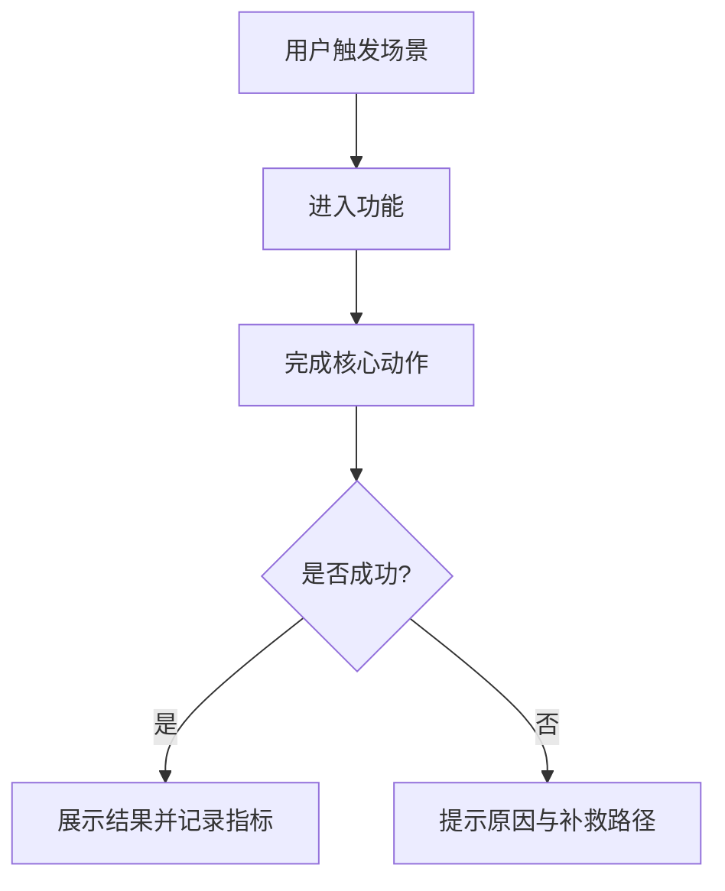
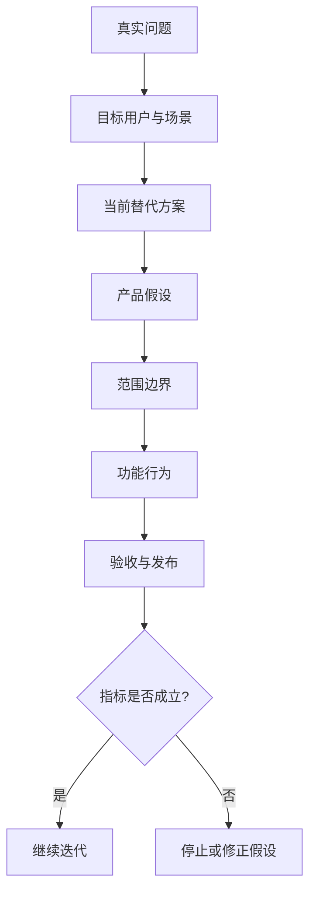
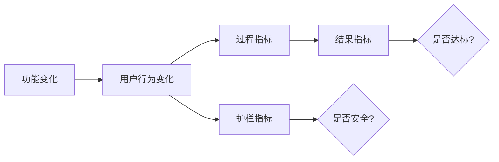
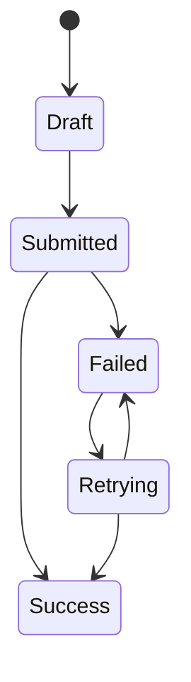

# PRD Template Reference

Use this template as a drafting guide. Adapt section depth to the risk and ambiguity of the idea.

## Recommended File Shape

~~~markdown
# <产品/功能名> PRD

> 状态: Draft
> 作者: Codex
> 日期: <YYYY-MM-DD>
> 版本: v0.1

## 1. 一句话产品赌注

为 <目标用户>，在 <触发场景> 下，解决 <真实问题>，通过 <核心方案>，用 <核心指标> 判断是否成功。

## 2. 背景与问题

### 2.1 背景

只写影响决策的事实，不写泛泛行业背景。

### 2.2 真实问题

- 用户现在想完成什么任务?
- 当前流程卡在哪里?
- 如果不解决，会造成什么损失?

### 2.3 当前替代方案

| 替代方案 | 用户为什么用它 | 主要问题 | 新方案必须赢在哪里 |
|---|---|---|---|
|  |  |  |  |

## 3. 目标用户与场景

| 用户/角色 | 场景 | 动机 | 痛点 | 成功状态 |
|---|---|---|---|---|
|  |  |  |  |  |

## 4. 证据与假设

### 4.1 已有证据

- 用户反馈/访谈:
- 工单/客服/销售记录:
- 行为数据:
- 竞品/市场/合同/政策:

### 4.2 关键假设

| 假设 | 为什么重要 | 如何验证 | 证伪信号 |
|---|---|---|---|
|  |  |  |  |

## 5. 目标与不目标

### 5.1 目标

- 

### 5.2 不目标

- 

## 6. 范围与版本切片

| 范围 | 本版本 | 后续版本 | 不做 |
|---|---|---|---|
| 用户群 |  |  |  |
| 平台 |  |  |  |
| 功能 |  |  |  |
| 数据 |  |  |  |

## 7. 用户流程图

## 8. 功能需求

### 8.1 <功能模块名>

**用户故事**: 作为 <角色>，我希望 <能力>，以便 <价值>。

**主路径**:
1. 
2. 
3. 

**异常与边界**:

| 场景 | 系统行为 | 提示/反馈 | 验收方式 |
|---|---|---|---|
| 空数据 |  |  |  |
| 重复数据 |  |  |  |
| 权限不足 |  |  |  |
| 超时/失败 |  |  |  |

**验收标准**:

- Given <前置条件>, when <用户动作>, then <系统结果>.
- Given <异常条件>, when <用户动作>, then <系统反馈或兜底>.

## 9. 数据、权限、埋点与可观测性

### 9.1 数据规则

| 数据对象 | 字段/状态 | 创建/更新规则 | 保留/删除规则 |
|---|---|---|---|
|  |  |  |  |

### 9.2 权限规则

| 角色 | 可见 | 可操作 | 不可操作 |
|---|---|---|---|
|  |  |  |  |

### 9.3 埋点与日志

| 事件 | 触发时机 | 属性 | 用途 |
|---|---|---|---|
|  |  |  |  |

## 10. 指标

| 类型 | 指标 | 口径 | 目标/阈值 | 观察窗口 |
|---|---|---|---|---|
| 结果指标 |  |  |  |  |
| 过程指标 |  |  |  |  |
| 护栏指标 |  |  |  |  |

## 11. 发布计划

| 阶段 | 范围 | 条件 | 负责人/协作方 | 时间 |
|---|---|---|---|---|
| 内测 |  |  |  |  |
| 灰度 |  |  |  |  |
| 全量 |  |  |  |  |

### 11.1 回滚条件

- 

### 11.2 停止或换假设条件

- 

## 12. 风险与开放问题

| 问题/风险 | 影响 | 当前判断 | 下一步 |
|---|---|---|---|
|  |  |  |  |
~~~

## Diagram Patterns

Use Mermaid unless SVG is specifically better.

### Product Bet Chain

### Metric Chain

### State Transition

## PRD Writing Rules

- Start from the problem, not from a requested feature.
- Include current alternatives; users always have a workaround.
- Define goals and non-goals before feature details.
- Write behavior and constraints, not implementation internals.
- Cover normal path, edge cases, permission cases, data boundaries, and failure recovery.
- Include result metrics, process metrics, and guardrail metrics.
- Add launch, rollback, and stop conditions.
- Mark assumptions explicitly when evidence is missing.
- Do not claim specific market facts, competitor behavior, legal constraints, or live pricing without verification.
